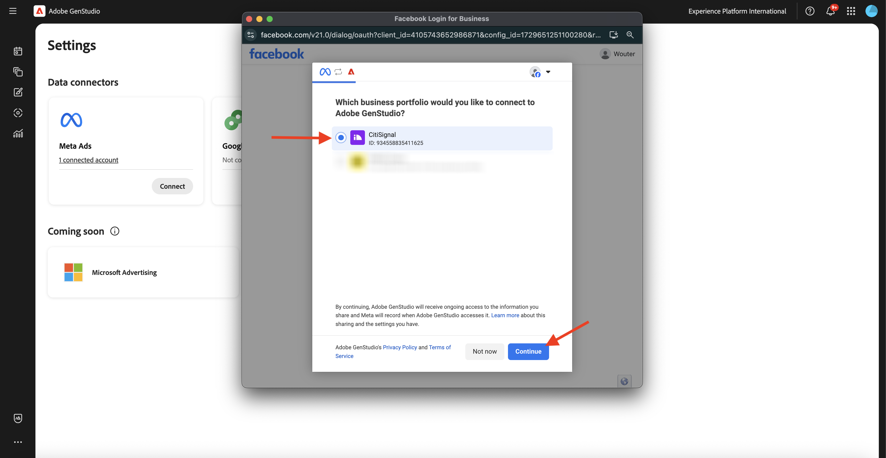
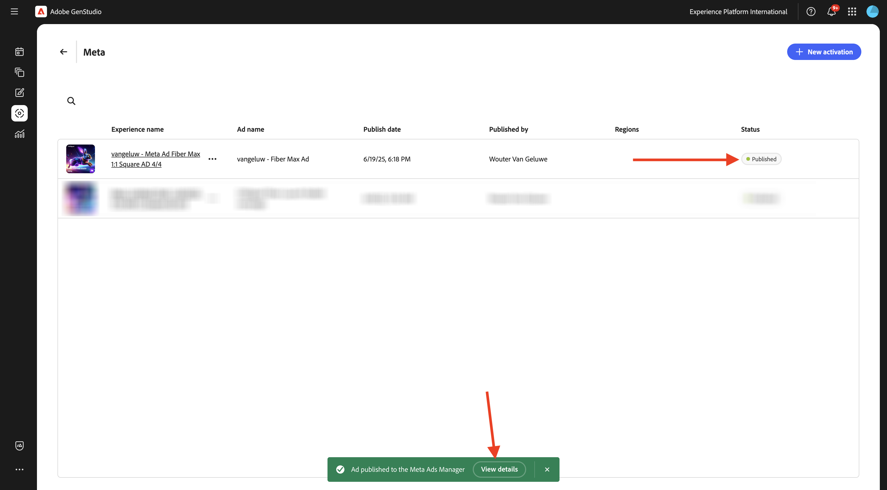

# 1.3.3 Metaへの Campaign のアクティベーション

>[!IMPORTANT]
>
>この演習を行うには、AEM Assets Content Hubを有効にした状態で、動作するAEM Assets CS オーサー環境にアクセスできる必要があります。
>
>考慮すべき 2 つのオプションがあります。
>
>- GenStudio for CSC テクニカルイネーブルメントワークショップに参加している場合、インストラクターがAEM Assets CS オーサー環境を作成します。 名前と進め方をチェックしてください。
>
>- One Adobeのチュートリアルパスをすべて使用している場合は、[Adobe Experience Manager Cloud ServiceとEdge Delivery Services](./../../../modules/asset-mgmt/module2.1/aemcs.md){target="_blank"} の演習にアクセスしてください。 指示に従うと、そのような環境にアクセスできます。

>[!IMPORTANT]
>
>この演習のすべての手順を実行するには、既存のAdobe Workfront環境にアクセスする必要があり、その環境でプロジェクトと承認ワークフローを作成する必要があります。 [Adobe Workfrontによるワークフロー管理 &#x200B;](./../../../modules/workflow-planning/module1.2/workfront.md){target="_blank"} の演習に従うと、必要な設定を使用できるようになります。

>[!IMPORTANT]
>
>以前、AEM Assets CS プログラムをオーサー環境とAEM Assets環境で設定したことがある場合は、AEM CS サンドボックスが休止状態になっている可能性があります。 このようなサンドボックスの休止解除には 10～15 分かかるので、後で待つ必要がないように、今すぐ休止解除プロセスを開始することをお勧めします。

## 1.3.3.1 キャンペーンを作成

**GenStudio for Performance Marketing** で、左側のメニューの **キャンペーン** に移動します。 「**+ キャンペーンを追加**」をクリックします。


すると、空のキャンペーン概要が表示されます。


フィールド名には、`--aepUserLdap-- - CitiSignal Fiber Launch Campaign` を使用します。

「**説明**」フィールドに以下のテキストを使用します。

```
The CitiSignal Fiber Launch campaign introduces CitiSignal’s flagship fiber internet service—CitiSignal Fiber Max—to key residential markets. This campaign is designed to build awareness, drive sign-ups, and establish CitiSignal as the go-to provider for ultra-fast, reliable, and future-ready internet. The campaign will highlight the product’s benefits for remote professionals, online gamers, and smart home families, using persona-driven messaging across digital and physical channels.
```

フィールド **目的** に対して、以下のテキストを使用します。

```
Generate brand awareness in target regions
Drive early sign-ups and pre-orders for CitiSignal Fiber Max
Position CitiSignal as a premium, customer-first fiber internet provider
Educate consumers on the benefits of fiber over cable or DSL
```

「**キーメッセージング**」フィールドには、次のテキストを使用します。

```
Supporting Points:
Symmetrical speeds up to 2 Gbps
Whole-home Wi-Fi 6E coverage
99.99% uptime guarantee
24/7 concierge support
No data caps or throttling
 Channels:
Digital Advertising: Google Display, YouTube pre-roll, Meta (Facebook/Instagram), TikTok (for gamers)
Email Marketing: Persona-segmented drip campaigns
Social Media: Organic and paid posts with testimonials, speed demos, and influencer partnerships
Out-of-Home (OOH): Billboards, transit ads in suburban commuter corridors
Local Events: Pop-up booths at tech expos, family festivals, and gaming tournaments
Direct Mail: Personalized flyers with QR codes for early sign-up discounts
 
Target Regions:
Primary Launch Markets:
Denver Metro Area, CO
Austin, TX
Raleigh-Durham, NC
Salt Lake City, UT
Demographic Focus:
Suburban neighborhoods with high remote work density
Areas with high smart home adoption
Zip codes with underserved or dissatisfied cable customers
```

すると、次のようになります。


下にスクロールして、その他のフィールドを表示：


「**開始日** フィールドには、今日の日付を設定します。

「**終了**」フィールドには、1 か月後の日付を設定します。

フィールド **ステータス** で、**アクティブ** に設定します。

「**チャネル**」フィールドでは、「**Meta**」、「**メール**」、「**ペイドメディア**」、「**ディスプレイ**」に設定します。

フィールド **地域** で、選択する地域を選択します。

フィールド **参照** > **製品** の場合：製品 `--aepUserLdap-- - CitiSignal Fiber Max` を選択します。

**参照**/**ペルソナ**:`--aepUserLdap-- - Remote Professionals`、`--aepUserLdap-- - Online Gamers`、`--aepUserLdap-- - Smart Home Families` のペルソナを選択します

次の情報が表示されます。


これで、キャンペーンの準備が整いました。 **矢印** をクリックして戻ります。


その後、リストにキャンペーンが表示されます。 カレンダービューアイコンをクリックして、ビューをキャンペーンカレンダーに変更します。


次に、どのキャンペーンがその時点でアクティブであるかをより視覚的に把握できるキャンペーンカレンダーが表示されます。


## Metaへの 1.3.3.2 接続の設定

>[!IMPORTANT]
>
>Metaへの接続を設定するには、Meta ユーザーアカウントを使用でき、そのユーザーアカウントをMeta Business アカウントに追加する必要があります。

Metaへの接続を設定するには、3 つのドット **...** をクリックし、「**設定**」を選択します。


**2** Meta広告 &rbrace; を表示するには、「**接続」をクリックします。**


Meta アカウントを使用してログインします。 「**続行**」をクリックします。


お使いのアカウントがMeta Business アカウントにリンクされている場合、Metaで設定された事業ポートフォリオを選択することができます。



接続が正常に確立されたら、「**X connected account （s）**」という行をクリックします。


GenStudio for Performance Marketingに接続されているMeta ビジネスアカウントの詳細が表示されます。


## 1.3.3.3 新しいアセットを作成

[https://firefly.adobe.com/](https://firefly.adobe.com/){target="_blank"} に移動します。 プロンプト `a neon rabbit running very fast through space` を入力し、「**生成**」をクリックします。


その後、複数の画像が生成されます。 最も気に入った画像を選択し、画像上の **共有** アイコンをクリックして、「**Adobe Expressで開く**」を選択します。


生成した画像がAdobe Expressで編集できるようになります。 次に、画像に CitiSignal ロゴを追加する必要があります。 それには、**Brands** に移動します。


GenStudio for Performance Marketingで作成した CitiSignal ブランドテンプレートがAdobe Expressに表示されます。 `--aepUserLdap-- - CitiSignal` という名前のブランド テンプレートをクリックして選択します。


**ロゴ** に移動し、**白** Citignal ロゴをクリックして画像にドロップします。


CitiSignal ロゴは、画像の中央からそれほど遠くない位置に配置します。


次に、「**共有**」をクリックします。


「**AEM Assets**」を選択します。


**フォルダーを選択** をクリックします。 アセットの名前を `--aepUserLdap-- - neon rabbit` に変更します。


AEM Assets CS リポジトリ（`--aepUserLdap-- - CitiSignal` という名前）を選択し、フォルダー `--aepUserLdap-- - CitiSignal Fiber Campaign` を選択します。 「**選択**」をクリックします。


この画像が表示されます。 **1 個のアセットをアップロード** をクリックします。 これで、画像がAEM Assets CS にアップロードされます。


[https://experience.adobe.com/](https://experience.adobe.com/){target="_blank"} に移動します。 **Experience Manager Assets** を開きます。


AEM Assets CS 環境を選択します。`--aepUserLdap-- - CitiSignal dev` という名前を付ける必要があります。


**Assetsに移動し** フォルダー `--aepUserLdap-- - CitiSignal Fiber Campaign` をダブルクリックします。


これに似た情報が表示されます。 画像 `--aepUserLdap-- - neon rabbit` をダブルクリックします。


その後、画像 `--aepUserLdap-- - neon rabbit` が表示されます。 **ステータス** を **承認済み** に変更し、「**保存** をクリックします

>[!IMPORTANT]
>
>画像のステータスが **承認済み** に設定されていない場合、画像はGenStudio for Performance Marketingに表示されません。 GenStudio for Performance Marketingでは、承認済みのアセットにのみアクセスできます。


GenStudio for Performance Marketingに戻ります。 左側のメニューで、**Assetsに移動し** AEM Assets CS リポジトリを選択します。これは `--aepUserLdap-- - CitiSignal` という名前にする必要があります。 作成して承認した画像がGenStudio for Performance Marketing内で使用できるようになります。


## Meta広告を作成および承認で 1.3.3.4 ない

左側のメニューで、**作成** に移動します。 「**Meta**」を選択します。


以前に読み込んだ **Meta ad** テンプレートを選びます。名前は `--aepUserLdap---citisignal-meta-ad` です。 **使用** をクリックします。


この画像が表示されます。 広告の名前を `--aepUserLdap-- - Meta Ad Fiber Max` に変更します。

**パラメーター** で、次のオプションを選択します。

- **ブランド**: `--aepUserLdap-- - CitiSignal`
- **言語**: `English (US)`
- **ペルソナ**: `--aepUserLdap-- - Smart Home Families`
- **製品**: `--aepUserLdap-- - CitiSignal Fiber Max`

**コンテンツから選択** をクリックします。


アセット `--aepUserLdap-- - neon rabbit.png` を選択します。 **使用** をクリックします。


プロンプト `focus on lightning fast internet for big families` を入力し、「**生成**」をクリックします。


次のようなメッセージが表示されます。 これで、広告をレビューおよび承認する準備が整いました。 それには、「**承認をリクエスト**」をクリックします。これにより、Adobe Workfrontに接続します。


Adobe Workfront プロジェクトを選択します。`--aepUserLdap-- - CitiSignal Fiber Launch` という名前を付ける必要があります。 **ユーザーを招待** の下に自分のメールアドレスを入力し、自分の役割が **承認者** に設定されていることを確認します。


または、Adobe Workfrontで既存の承認ワークフローを使用することもできます。 それには、「**テンプレートを使用** をクリックし、テンプレート `--aepuserLdap-- - Approval Workflow` を選択します。 「**送信**」をクリックします。


「**Workfrontでコメントを表示**」をクリックすると、Adobe Workfront Proof UI に送信されるようになります。


Adobe Workfront Proof UI で、「**決定する**」をクリックします。


「**承認済み**」を選択し、「**決定する**」をクリックします。


「**公開**」をクリックします。


Campaign `--aepUserLdap-- - CitiSignal Fiber Launch Campaign` を選択し、「**公開** をクリックします。


**コンテンツで開く** をクリックします。


4 つのMeta広告を **コンテンツ**/**エクスペリエンス** で利用できるようになりました。


## Metaに広告を 1.3.3.5 公開

広告の 1 つを選択し、「**有効化**」をクリックします。


リストから **0&rbrace;Call to action&rbrace; を選択し、URL の例を入力します。**「**次へ**」をクリックします。


「Meta」アカウント、リンクされた Facebook ページ、Meta キャンペーンおよびMeta広告セットを選択します。

追加に名前を付け、`--aepUserLdap-- Fiber Max Ad` を使用します。

「**次へ**」をクリックします。


「**公開**」をクリックします。


「**OK**」をクリックします。


広告のステータスが「**公開中** に設定されました。これには数分かかることがあります。


数分後、広告のステータスが **公開済み** に変わります。 つまり、広告がGenStudio for Performance MarketingからMetaに送信されました。 広告が既にMetaで公開されているわけではありません。 様々なMeta プラットフォームでユーザーに表示できるように、Meta ビジネスアカウントで広告を取得して公開する手順はいくつかあります。

**詳細を表示** をクリックします。



**開く** をクリックすると、Meta Business アカウントに移動します。

>[!IMPORTANT]
>
>環境に接続されているMeta Business アカウントにアクセスできない場合は、この広告をMetaで視覚化できません。


作成したばかりの広告がMetaで表示される概要は次のとおりです。


これで、この演習が完了しました。

## 次の手順

[&#x200B; 概要とメリット &#x200B;](./summary.md){target="_blank"} に移動します。

[GenStudio for Performance Marketing](./genstudio.md){target="_blank"} に戻る

[&#x200B; すべてのモジュール &#x200B;](./../../../overview.md){target="_blank"} に戻る
