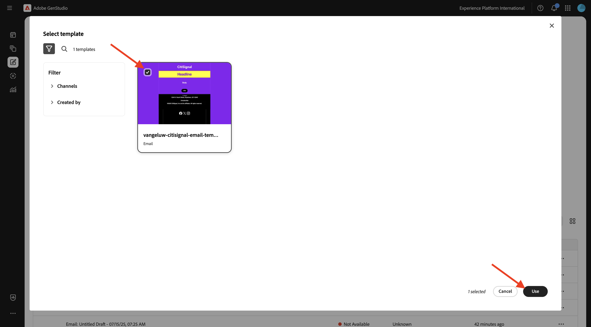
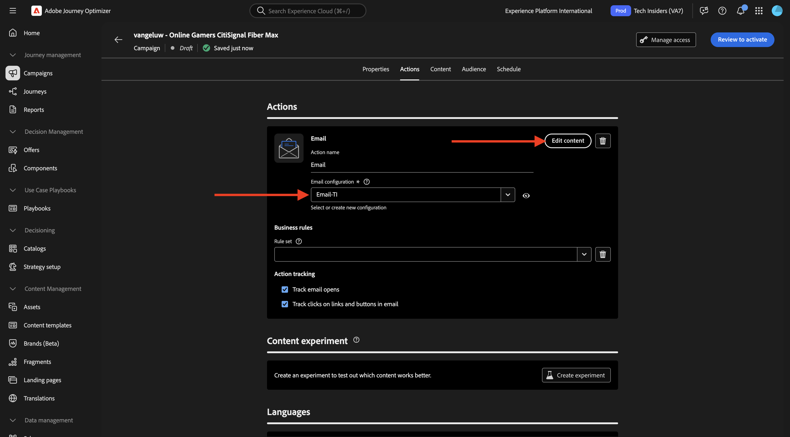
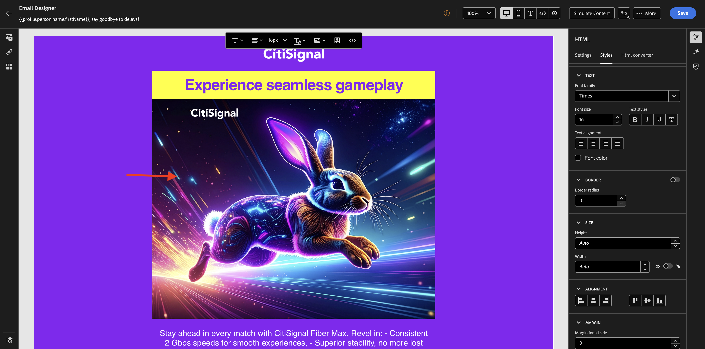

# 1.3.4 AJO用のメールエクスペリエンスの作成

>[!IMPORTANT]
>
>この演習を行うには、GenStudio for Performance Marketing（現在はベータ版）との統合用にプロビジョニングされたAdobe Journey Optimizer環境にアクセスできる必要があります。

>[!IMPORTANT]
>
>この演習のすべての手順を実行するには、既存のAdobe Workfront環境にアクセスする必要があり、その環境でプロジェクトと承認ワークフローを作成する必要があります。 [Adobe Workfrontによるワークフロー管理 ](./../../../modules/asset-mgmt/module2.2/workfront.md){target="_blank"} の演習に従うと、必要な設定を使用できるようになります。

## 1.3.4.1 メール作成および承認エクスペリエンス

左側のメニューで、**作成** に移動します。 **メール** を選択します。


以前に読み込んだ **メール** テンプレート（`--aepUserLdap---citisignal-email-template` という名前）を選択します。 **使用** をクリックします。



この画像が表示されます。 広告の名前を `--aepUserLdap-- - Email Online Gamers Fiber Max` に変更します。


**パラメーター** で、次のオプションを選択します。

- **ブランド**: `--aepUserLdap-- - CitiSignal`
- **言語**: `English (US)`
- **ペルソナ**: `--aepUserLdap-- - Smart Home Families`
- **製品**: `--aepUserLdap-- - CitiSignal Fiber Max`

**コンテンツから選択** をクリックします。


アセット `--aepUserLdap-- - neon rabbit.png` を選択します。 **使用** をクリックします。


プロンプト `convince online gamers to start playing online multiplayer games using CitiSignal internet` を入力し、「**生成**」をクリックします。


次に、4 つのメールバリエーションが生成された、次のようになります。 デフォルト表示では **モバイル** 表示が表示され、**コンピューター** アイコンをクリックするとデスクトップビューに切り替えることができます。


メールごとに、準拠スコアが自動的に計算されます。 スコアをクリックすると詳細が表示されます。


**問題を表示して修正** をクリックします。


その後、複雑さのスコアを最適化するために何ができるかについて、より詳細を確認できます。


次に、「**承認をリクエスト**」をクリックすると、Adobe Workfrontに接続します。


Adobe Workfront プロジェクトを選択します。`--aepUserLdap-- - CitiSignal Fiber Launch` という名前を付ける必要があります。 **ユーザーを招待** の下に自分のメールアドレスを入力し、自分の役割が **承認者** に設定されていることを確認します。


または、Adobe Workfrontで既存の承認ワークフローを使用することもできます。 それには、「**テンプレートを使用** をクリックし、テンプレート `--aepuserLdap-- - Approval Workflow` を選択します。 「**送信**」をクリックします。


「**Workfrontでコメントを表示**」をクリックすると、Adobe Workfront Proof UI に送信されるようになります。


Adobe Workfront Proof UI で、「**決定する**」をクリックします。


「**承認済み**」を選択し、「**決定する**」をクリックします。


「**公開**」をクリックします。


Campaign `--aepUserLdap-- - CitiSignal Fiber Launch Campaign` を選択し、「**公開** をクリックします。


**コンテンツで開く** をクリックします。


4 つのメールエクスペリエンスを **コンテンツ**/**エクスペリエンス** で使用できるようになりました。


## AJO1.3.4.2 キャンペーンを作成するには

[Adobe Experience Cloud](https://experience.adobe.com) に移動して、Adobe Journey Optimizerにログインします。 **Journey Optimizer** をクリックします。


Journey Optimizerの **ホーム** ビューにリダイレクトされます。 最初に、正しいサンドボックスを使用していることを確認します。 使用するサンドボックスは `--aepSandboxName--` です。 その後、サンドボックス **ージの** ホーム `--aepSandboxName--` ビューに移動します。


次に、キャンペーンを作成します。 前の演習のイベントベースのジャーニーは、受信エクスペリエンスイベントやオーディエンスの入口または出口に依存して 1 人の特定顧客のジャーニーをトリガーにするのとは異なり、キャンペーンは、ニュースレター、1 回限りのプロモーション、一般的な情報などの一意のコンテンツで 1 回、またはインスタンスの誕生日キャンペーンやリマインダーなどの定期的に送信される同様のコンテンツで、オーディエンス全体をターゲットにします。

メニューで、「**キャンペーン**」に移動し、「**キャンペーンを作成**」をクリックします。


**スケジュール型 – マーケティング** を選択し、「**作成**」をクリックします。


キャンペーンの作成画面で、以下を設定します。

- **名前**:`--aepUserLdap--  - Online Gamers CitiSignal Fiber Max`。
- **説明**：オンラインゲーマー向けファイバーキャンペーン

**アクション** をクリックします。


「**+アクションを追加**」をクリックし、「**メール**」を選択します。


次に、既存の **メール設定** を選択し、「**コンテンツを編集**」をクリックします。



その後、これが表示されます。 **件名** には、次を使用します。

```
{{profile.person.name.firstName}}, say goodbye to delays!
```

次に、「**コンテンツを編集**」をクリックします。


**HTMLを読み込み** をクリックします。


次に、**Adobe GenStudio for Performance Marketing** のボタンをクリックします。


GenStudio for Performance Marketingで公開されたすべてのメールエクスペリエンスを示すポップアップウィンドウが表示されます。 使用可能なメールエクスペリエンスの 1 つを選択し、「**使用**」をクリックします。


独自のAEM Assets CS リポジトリを選択して（`--aepUserLdap-- - CitiSignal dev` という名前にする必要があります）、「**インポート**」をクリックします。


この画像が表示されます。 不足している画像ボタンを選択し、「**アセットを選択**」をクリックします。


**GenStudio.zip.....から、次のようなフォルダーに移動します画像** を `--aepUserLdap-- - neon rabbit.png` して選択します。 クリック **選択**


この画像が表示されます。



フッターまでスクロールダウンし、「**登録解除**」という単語を選択し、「**リンク**」アイコンをクリックします。


**タイプ** を **外部オプトアウト/購読解除** に設定し、URL を `https://techinsiders.org/unsubscribe.html` に設定します（購読解除リンクに空白の URL を指定することはできません）。

「**保存**」をクリックしてから、画面の左上隅にある **矢印** をクリックして、キャンペーン設定に戻ります。


**オーディエンス** に移動します。


**オーディエンスを選択** をクリックします。


オンラインゲーマーの購読リストのオーディエンスを選択します。このオーディエンスには、`--aepUserLdap--_SL_Interest_Online_Gaming` という名前を付ける必要があります。 「**保存**」をクリックします。


**アクティブ化するレビュー** をクリックします。


Campaign の設定に問題がない場合は、「**アクティブ化**」をクリックできます。


その後、キャンペーンがアクティブ化されます（数分かかります）。


数分後にキャンペーンはライブになり、選択した購読リストにメールが送信されます。


これで、この演習が完了しました。

## 次の手順

[ 概要とメリット ](./summary.md){target="_blank"} に移動します。

[GenStudio for Performance Marketing](./genstudio.md){target="_blank"} に戻る

[ すべてのモジュール ](./../../../overview.md){target="_blank"} に戻る
