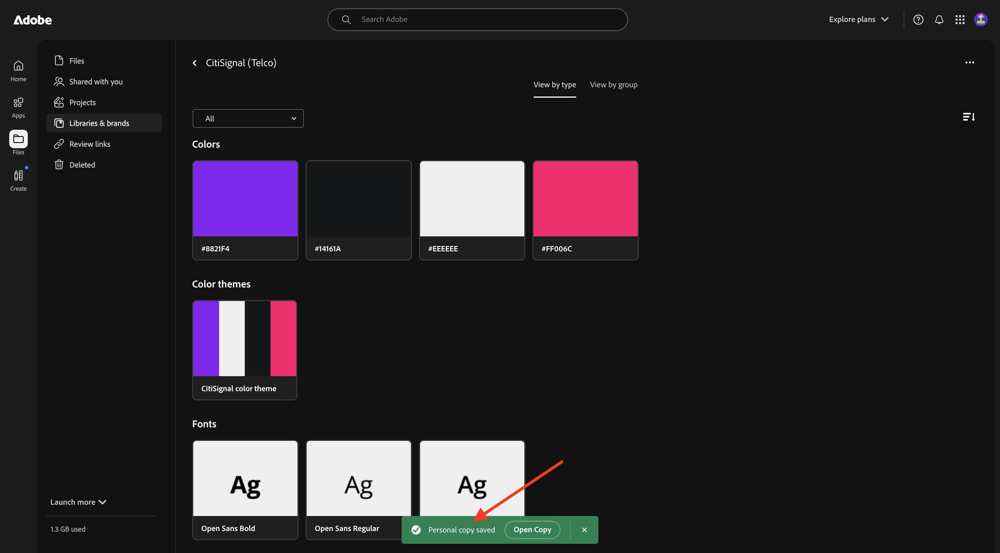
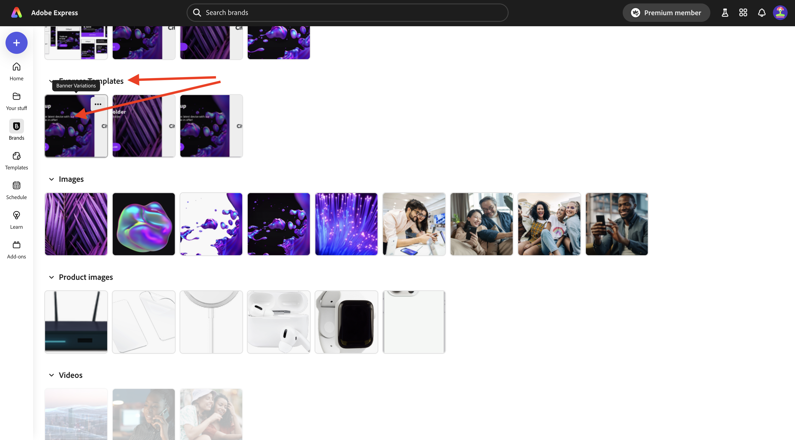
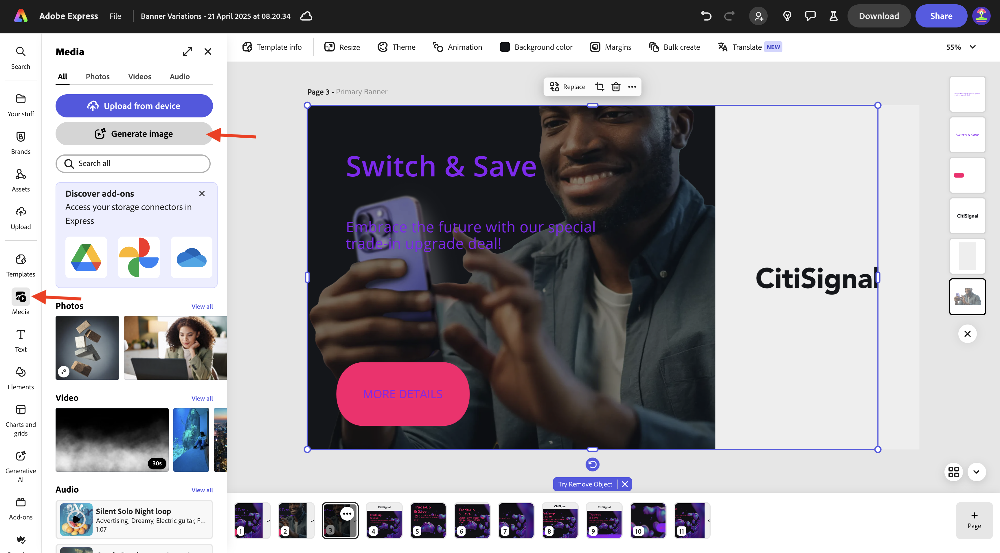
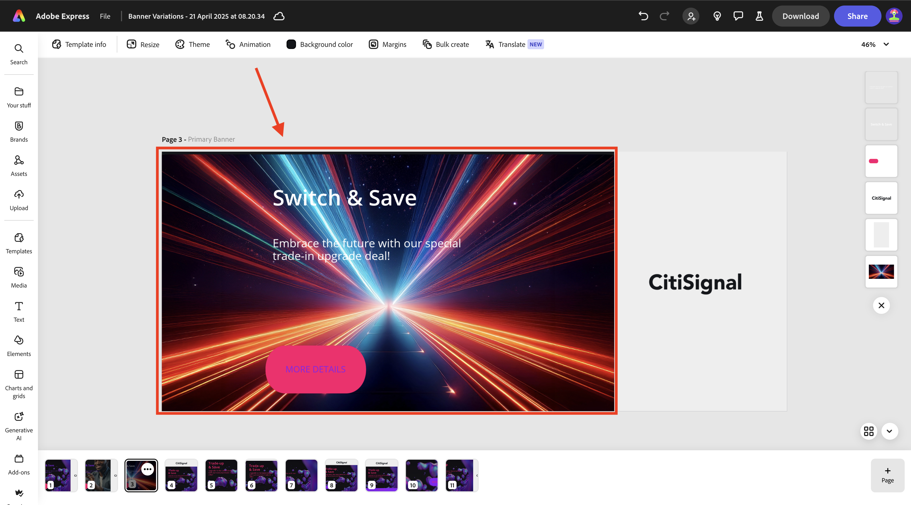

# 1.4.1 Adobe Expressの概要

## 1.4.1.1 Adobe Expressへのログイン

新しい匿名ブラウザーウィンドウを開き、[https://www.adobe.com/home](https://www.adobe.com/home){target="_blank"} に移動します。 **会社または学校アカウント** を使用してログインし、アカウント **`--aepImsOrgName--`** を選択します。

Adobe Expressは、組織のライセンスの一部として使用できます。 Adobe Expressへのアクセス権を持っていることを確認するには、適切な組織にログインしていることを確認する必要があります。 これを行うには、「**プロファイル**」アイコンをクリックし、アクティブなアカウントを確認します。 使用するアカウントの名前は `--aepImsOrgName--` です。

**プロファイルを切り替え** をクリックして、アカウントを変更します。

メニューから適切なアカウント（この場合は **Experience Platform インターナショナル**）を選択します（ただし、組織が異なる場合があります）。

適切なアカウントがアクティブになったら、**アプリ** に移動し、**Adobe Express** カードの **開始** をクリックします。

**Adobe Express** にログインしました。

## 1.4.1.2 ブランドテンプレートから開始する

Adobe Expressで、**Brands** に移動します。 現在、ブランドテンプレートライブラリは空の可能性があります。 CitiSignal は以前にブランドテンプレートを定義しましたが、その既存のテンプレートを再利用する必要があります。

その場合は、[https://www.adobe.com/files/link/1c2f92cf-17bc-4d11-6031-dbd251e6cb57](https://www.adobe.com/files/link/1c2f92cf-17bc-4d11-6031-dbd251e6cb57) にアクセスしてください。

この画像が表示されます。 「3 つのドット **...**」をクリックします。

**コピーを作成** を選択します。

約 1 分後に、ブランドテンプレートの個人用コピーを作成したことを確認するメッセージが表示されます。

Adobe Expressに戻り、**Brands** に移動して、ページを更新します。 **CitiSignal （Telco）** ブランドテンプレートが表示されます。 **CitiSignal （Telco）** ブランド テンプレートをクリックして開きます。

ロゴ、フォント、色、テンプレートなどのアセットのライブラリが表示されます。

**Express テンプレート** に移動し、クリックしてテンプレート **バナーバリエーション** を開きます。

「**新しいファイルを開始**」をクリックします。

この画像が表示されます。

「Trade-up &amp; Save **というテキストボックスをクリック** ます。 次に、「**書き換え**」を選択してスタイルを選択し、「**生成**」をクリックします。

バリエーションを選択し、「**置換**」をクリックします。

更新されたテキストが表示されます。

次に、テキスト **詳細** をクリックします。

**エフェクト** を選択します。

**図形** に移動し、**すべて表示** をクリックします。

**finetune** ボタンをクリックします。 **図形のサイズ** を変更し、色ボタンをクリックします。

**CitiSignal カラーテーマ** から別の色を選択して、色を変更します。

変更されたボタンが表示されます。

次に、**ブランド** に移動し、**ブランドを適用** をクリックします。 その後、画像の外観が変更されたことを確認します。

**歯車** アイコンをクリックすると、**ブランドを適用** 設定を詳細に説明することもできます。

次に、作業中の画像の 3 ドット **...** をクリックし、「**複製**」をクリックします。

次に、新しい同一の画像が表示されます。 画面の右側にある背景レイヤーをクリックします。

>[!IMPORTANT]
>
>この演習を完了するには、動作しているAEM Assets CS オーサー環境にアクセスできる必要があります。 演習 [Adobe Experience Manager Cloud ServiceおよびEdge Delivery Servicesに従うと ](./../../../modules/asset-mgmt/module2.1/aemcs.md){target="_blank"} このような環境にアクセスできます。

左側のメニューで **0}Assets} に移動し、`--aepUserLdap-- - CitiSignal dev` という名前が必要なAEM Assets CS リポジトリを選択します。**&#x200B;次に、フォルダー **citisignal** に移動します。

画像 **homepage-hero-1.png** を選択します。 すると、背景レイヤーが変更されます。

表示されているテキストボックスを選択し、「**書き換え**」をクリックします。 **フレーズを変更** を選択してから、特定のスタイルを選択します。 **生成** をクリックします。

バリアントを選択して、「**置換**」をクリックします。

この画像が表示されます。 次に、ページ下部のページにある 3 ドット **...** をクリックし、「**複製**」をクリックします。

新しく作成された画像で、**media** に移動し、「**画像を生成**」をクリックします。

**横（4:3）** を選択します。

プロンプト `laser beams running through space` を入力し、「**生成**」をクリックします。

Adobe Fireflyで生成された画像が表示されます。 画像が生成されたレイヤーは一番上になります。

新しく生成された画像を下に移動し、前の背景レイヤーの上に配置します。

古い背景レイヤーをクリックして「**削除**」を選択し、削除します。

キャンバス全体を覆うように画像を調整します。

テキストボックス **切り替えて保存** を選択して、フォントカラーを **白** に変更します。

フォントカラーを **白** に変更します。

他のテキストボックスを選択して、フォントカラーを **白** に変更します。

フォントカラーを **白** に変更します。

次に、「**サイズ変更**」をクリックして、**2600** x **1080** というカスタム解像度を入力します。 **画像を展開** のチェックボックスがオンになっていることを確認します。 **サイズ変更** をクリックします。

この画像が表示されます。

数分後、画像の新しいバリエーションがいくつか表示されます。 1 つを選択し、「**保持**」をクリックします。

この画像が表示されます。

使用可能なスペースいっぱいに画像が表示されるように、画像を移動および調整します。

次に、「**翻訳** をクリックします。

**フランス語**、**オランダ語**、**スペイン語** などの言語を選択します。 作業している特定のページのみが選択されていることを確認します（この場合は **Page 3**）。 **翻訳** をクリックします。

その後、翻訳が生成されます。

すると、新しいページが多数作成されていることがわかります。 **閉じる** アイコンをクリックします。

翻訳を検証し、必要に応じて変更します。この例では、翻訳が最適でない場合があります。

必要に応じてテキストを更新します。

これで、アセットの準備が整いました。

## 次の手順

[Adobe Expressのアニメーションとビデオ ](./ex2.md){target="_blank"} に移動します

[Adobe ExpressとAdobe Experience Cloud](./express.md){target="_blank"} に戻る

[ すべてのモジュール ](./../../../overview.md){target="_blank"} に戻る
