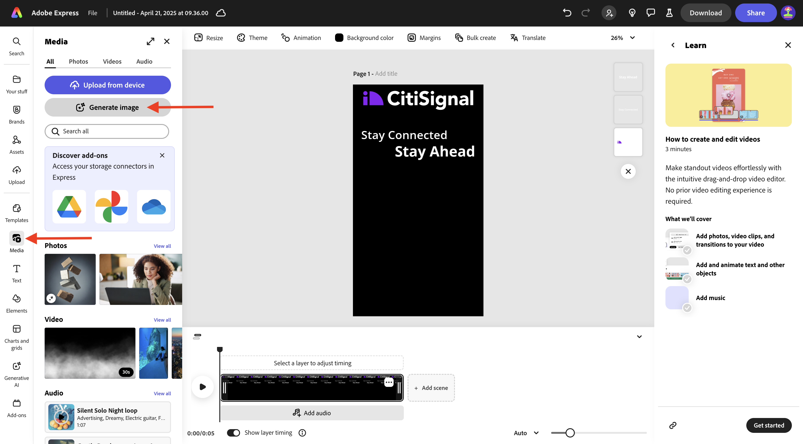
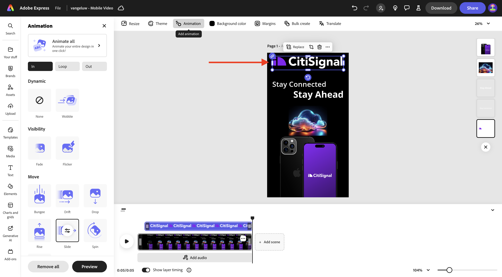

# 1.4.2 Adobe Expressのアニメーションとビデオ

この演習を開始する前に、[https://one-adobe-tech-insiders.s3.us-west-2.amazonaws.com/one-adobe/Adobe_Express.zipから必要なアセットをダウンロードし ](https://one-adobe-tech-insiders.s3.us-west-2.amazonaws.com/one-adobe/Adobe_Express.zip){target="_blank"} デスクトップに解凍します。

## 1.4.2.1 ビデオを作成する

[https://new.express.adobe.com/](https://new.express.adobe.com/){target="_blank"} に移動します。 **+** アイコンをクリックして、新しい **画像** を作成します。

**ビデオ** に移動し、「**モバイルビデオ**」を選択します。

この画像が表示されます。

**背景色** を選択してから、**黒** を選択します。

次に、**CitiSignal** ロゴを追加する必要があります。 **ブランド** に移動し、白い CitiSignal ロゴを選択します。 3 つのドット **...** をクリックし、「**配置**」を選択します。

CitiSignal ロゴを画像の上部の中央に配置します。

**テキスト** に移動し、「**テキストを追加** を選択します。

テキスト `Stay Connected` を入力し、次の図に示すように、テキストボックスを同じような場所に配置します。

**テキスト** に移動し、「**テキストを追加** を選択します。 テキスト `Stay Ahead` を入力します。

次の図に示すように、テキストボックスを同様の場所に配置します。

「接続したままにする **というテキストを含む最初のテキストボックスを選択** ます。 **Brands**、**Fonts** に移動します。 1 番目のフォントの 3 つのドット **...** をクリックし、「**適用**」をクリックします。

2 つ目のテキストボックスに「Stay Ahead **というテキストを選択** ます。 **Brands**、**Fonts** に移動します。 3 番目のフォントの 3 つのドット **...** をクリックし、「**適用**」をクリックします。

この画像が表示されます。 **メディア** に移動し、「**画像を生成**」を選択します。

プロンプト `futuristic looking transparent cloud on a black background` を入力し、「**生成**」をクリックします。

「**横（4:3）**」を選択します。

この画像が表示されます。 バリエーションの 1 つを選択します。

生成された画像を中央に配置します。 **メディア** に移動し、「**デバイスからアップロード**」をクリックします。

デスクトップに移動し、以前にダウンロードしたアセットを含む **0}Adobe_Express} フォルダーに移動します。**&#x200B;ファイル **CitiSignalPhoneLogo.png** を選択し、「**開く**」をクリックします。

この画像が表示されます。

画像を下にドラッグして、下の画像に似るようにします。

プロジェクトの名前を `--aepUserLdap-- - Mobile Video` に変更します。

**アニメーション** に移動し、**グライド** アニメーションをクリックします。

**play** アイコンをクリックして、アニメーションをテストします。

テキストボックス **「Stay Ahead**」を選択します。

テキストボックスのタイムラインスライダーを「先に進む **ように調整して** 途中から開始するようにします。

**CitiSignal** ロゴを選択します。

**スライド** アクションの詳細設定を開き、デュレーションを 2.5 秒に変更します。

次に、「**ダウンロード**」をクリックします。 **ファイル形式****MP4** を選択し、**ビデオの解像度** を **1080p** に設定します。 **ダウンロード** をクリックします。

その後、ビデオファイルが生成され、コンピューターにダウンロードされます。 これで、最初のビデオの準備が整いました。

## 1.4.2.2 ビデオに追加

**タイムライン** ビューを閉じます。

3 つのドット **...** をクリックし、「**複製**」を選択します。

新しいページが生成されます。 **タイムラインを編集** をクリックして、新しいページの使用を開始します。

[**+ シーンを追加**] をクリックします。

新しいシーンが追加されているのが確認できます。

デスクトップに移動し、以前にダウンロードしたアセットを含む **0}Adobe_Express} フォルダーに移動します。**&#x200B;ファイル **`AdobeStock_648887461_trimmed.mp4`** を選択し、「**開く** をクリックします。

ビデオ ファイルが新しいシーンに追加されます。

2 つのシーンの間の中央をクリックし、**トランジションを追加** を選択します。

**Dip to black** をクリックします。

**Duration** を 2 秒に変更します。 **play** ボタンをクリックして、トランジションをテストします。

**テキスト** に移動し、「**テキストを追加** をクリックします。

テキスト `with lightning fast speed from CitiSignal` を入力します。 **中央揃え** をクリックして、テキストを中央揃えにします。

フォントサイズを **60** に変更します。

## 1.4.2.3 Adobe Expressでのアドオンの使用

**アドオン** に移動して、アドオン **ソーシャルプレビュアー** を検索します。

「**+追加**」をクリックしてアドオンを追加します。

アドオン **ソーシャルプレビューア** を選択し、「**Instagram の投稿** プレビュー」オプションをクリックします。 最も一般的なソーシャルメディアプラットフォームで、投稿がどのように表示されるかを簡単にプレビューできるようになりました。

## 1.4.2.4 Adobe Expressで新しいテンプレートを作成

次に、「**共有**」ボタンをクリックし、「**テンプレートを作成**」を選択します。

`--aepUserLdap-- - Mobile Video` という名前を使用して、ブランド **CitiSignal （Telco）** を選択し、「**テンプレートを保存**」をクリックします。

これで、ビデオテンプレートがブランドテンプレートに保存されました。

## 1.4.2.5 AEM Assets CS へのビデオの保存

もう一度 **共有** をクリックし、「**クラウドに保存**」を選択します。 「**AEM Assets**」を選択します。

**現在のページ** を選択します。 `--aepUserLdap-- - Mobile Video` という名前を使用して、「**フォルダーを選択**」をクリックします。

フォルダー **`--aepUserLdap-- - Frame.io PNG`** を選択し、「**選択** をクリックします。

**1 個のアセットをアップロード** をクリックします。

[https://experience.adobe.com/} に移動し ](https://experience.adobe.com/){target="_blank"}**Experience Manager Assets** をクリックします。

AEM Assets CS 環境を選択します。`--aepUserLdap-- - Citi Signal dev` という名前を付ける必要があります。

**Assets** で、フォルダー **`--aepUserLdap-- - Frame.io PNG`** に移動します。 アセット **`--aepUserLdap-- - Mobile Video`** をダブルクリックして開きます。

Adobe Expressで作成されたビデオをAdobe Experience Manager Assetsで使用できるようになりました。

## 次の手順

[Adobe ExpressでAssetsを一括作成 ](./ex3.md){target="_blank"} に移動します。

[Adobe ExpressとAdobe Experience Cloud](./express.md){target="_blank"} に戻る

[ すべてのモジュール ](./../../../overview.md){target="_blank"} に戻る
