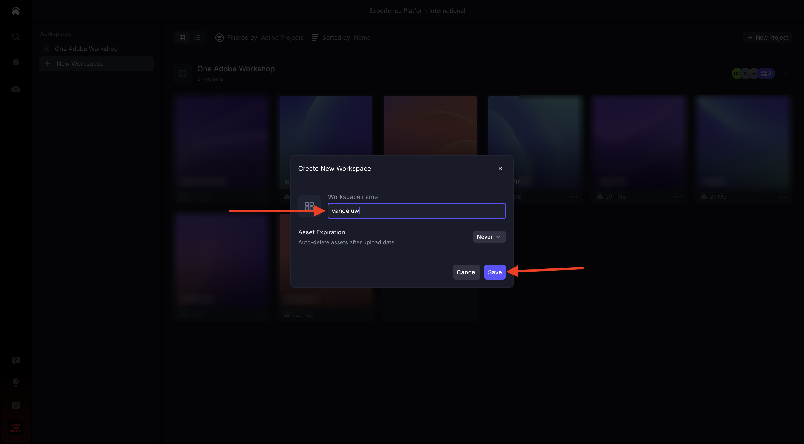
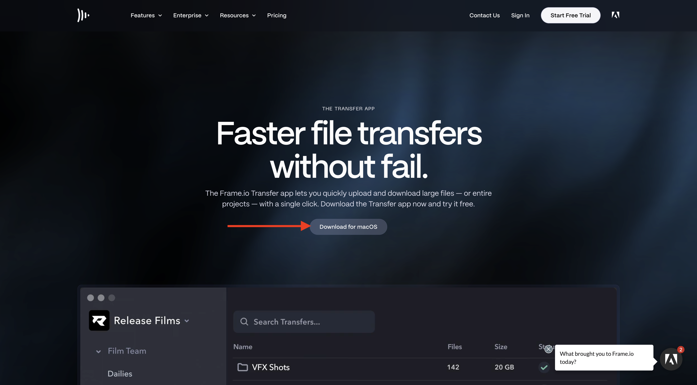
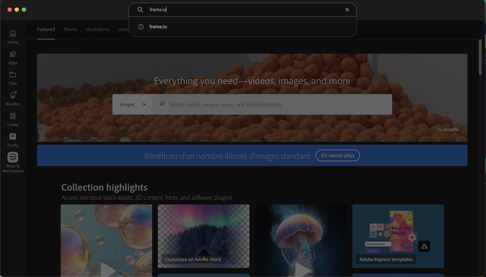

# 1.5.1 Frame.io の概要

>[!NOTE]
>
> 次のスクリーンショットは、使用されている特定の環境を示しています。 このチュートリアルを進めていくと、環境に異なる名前が付いている可能性が非常に高くなります。 このチュートリアルに登録したときに、使用する環境の詳細が提供されました。これらの手順に従ってください。

[https://next.frame.io/](https://next.frame.io/) に移動します。 環境 `--aepImsOrgName--` にログインしていることを確認します。

右環境にログインしていない場合は、左下隅のロゴをクリックし、をクリックして、使用する必要がある環境を選択します。

## ワークスペ 1.5.1.1 スとプロジェクトの作成

「**+ New Workspace**」をクリックします。

ワークスペース名には、`--aepUserLdap--` を使用します。 「**保存**」をクリックします。

これで、ワークスペースが作成されました。 次に、新しいプロジェクトを作成してください。 **+新規プロジェクト** をクリックします。

「**空白**」を選択し、`CitiSignal` という名前を使用します。 **新規プロジェクトを作成** をクリックします。

これで、プロジェクトが作成されました。 次に、プロジェクトにアセットをアップロードする必要があります。 **アップロード** をクリックします。

次のファイルをダウンロードします：[https://tech-insiders.s3.us-west-2.amazonaws.com/Frame.io_Assets.zip](https://tech-insiders.s3.us-west-2.amazonaws.com/Frame.io_Assets.zip) デスクトップにダウンロードし、デスクトップに展開します。

すべてのファイルを選択し、「**開く** をクリックします。

>[!NOTE]
>
>スクリーンショットからわかるように、現時点ではフォルダー **Sound Effects** は選択されていません。 これは、手動アップロードがフォルダーのアップロードをサポートしていないためです。 数分で Frame.io 転送アプリがインストールされ、そのフォルダーとそのファイルのアップロードに使用されます。

数分後、ファイルが Frame.io で使用できるようになります。

ファイルを手動でアップロードしましたが、Frame.io との間でファイルをアップロードおよびダウンロードする、より優れた迅速な方法があります。 Frame.io 転送アプリを使うのが一番です。

## 1.5.1.2 Frame.io 転送アプリのダウンロードと設定

[https://frame.io/transfer](https://frame.io/transfer) に移動し、お使いのコンピューターのバージョンをダウンロードします。

アプリケーションをインストールしてから開きます。

アプリケーションが開いたら、ログインする必要があります。 「**ログイン**」をクリックします。

Adobe アカウントのメールアドレスを入力し、「**やってみましょう**」をクリックします。

認証が成功したら、**Frame.io 転送アプリを開く** をクリックします。

この画像が表示されます。 正しい環境を選択するには、をクリックしてドロップダウンリストを開きます。

このチュートリアルで使用する必要がある環境（`--aepImsOrgName--`）を選択します。

これにより、以前に作成したワークスペースとプロジェクトが、手動でアップロードしたファイルと共に表示されます。

**アップロード** をクリックします。

以前に使用したフォルダーに移動します。これには、以前にダウンロードした解凍されたファイルが含まれています。 フォルダー **サウンドエフェクト** を選択し、**アップロード** をクリックします。

その後、ファイルがアップロードされます。

アップロードすると、Frame.io で新しいフォルダーが使用できるようになります。

## 1.5.1.3 Adobe Premiere Pro Betaのセットアップ

「はじめに」モジュールの一部として、Adobe Premiere Pro Betaが既にインストールされています。 Frame.io をAdobe Premiere Pro Betaと組み合わせて使用するには、この統合用に開発されたプラグインを使用できます。

Creative Cloud アプリを開き、`frame.io` を検索します。

検索結果を下にスクロールして、プラグイン **Frame.io V4 Comments** を見つけます。 クリックします。

この画像が表示されます。 **インストール** をクリックします。

Adobe Premiere Pro Betaが開いている場合は、まず **閉じる** 必要があります。

「**OK**」をクリックします。プラグインをインストールしています。

プラグインをインストールしたら、コンピューターでAdobe Premiere Pro Betaを開きます。

## 次の手順

[-](./ex1.md){target="_blank"} に移動

[Frame.io によるワークフローの効率化 ](./frameio.md){target="_blank"} に戻る

[ すべてのモジュール ](./../../../overview.md){target="_blank"} に戻る
