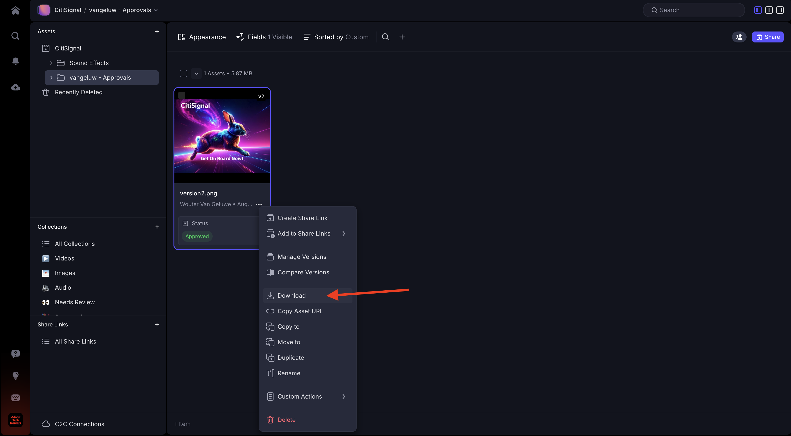

# 1.5.2 Frame.io での承認

>[!NOTE]
>
> 次のスクリーンショットは、使用されている特定の環境を示しています。 このチュートリアルを進めていくと、環境に異なる名前が付いている可能性が非常に高くなります。 このチュートリアルに登録したときに、使用する環境の詳細が提供されました。これらの手順に従ってください。

Frame.io で承認ワークフローを実行するには、アセットが必要です。 この演習では、まず、Adobe FireflyとAdobe Expressを使用して自分でアセットを作成します。 アセットを取得したら、Frame.io にアップロードし、最終的に承認します。

## Adobe Firefly Services1.5.2.1Adobe Expressを使用したアセットの作成

[https://firefly.adobe.com/](https://firefly.adobe.com/){target="_blank"} に移動します。 プロンプト `a neon rabbit running very fast through space` を入力し、「**生成**」をクリックします。

その後、複数の画像が生成されます。 最も気に入った画像を選択し、画像上の **共有** アイコンをクリックして、「**Adobe Expressで開く**」を選択します。

生成した画像がAdobe Expressで編集できるようになります。 次に、画像に CitiSignal ロゴを追加する必要があります。 それには、**Brands** に移動します。

CitiSignal ブランドテンプレートが表示されます。 GenStudio for Performance Marketingで作成されたものがAdobe Expressに表示されます。 名前に `CitiSignal` が含まれるブランドテンプレートをクリックして選択します。

**ロゴ** に移動し、**白** Citignal ロゴをクリックして画像にドロップします。

CitiSignal ロゴは、画像の中央からそれほど遠くない位置に配置します。

**テキスト** に移動します。

「**テキストを追加**」をクリックします。

テキスト `Timetravel now!` を入力し、フォントカラーとフォントサイズを変更し、テキストを **太字** に設定して、これに類似した画像が表示されるようにします。

次に、「**共有**」をクリックします。

「**...」をクリックします。すべて表示**.

下にスクロールして、「**ダウンロード**」を選択します。

**ダウンロード** をクリックします。

その後、ローカルマシンにアセットを作成します。

## 1.5.2.2 Frame.io でのアセットの承認

[https://next.frame.io/](https://next.frame.io/) に移動します。 環境 `--aepImsOrgName--` にログインしていることを確認します。

右環境にログインしていない場合は、左下隅のロゴをクリックし、をクリックして、使用する必要がある環境を選択します。

`--aepUserLdap--` という名前にする必要があるワークスペースに移動し、フォルダー **CitiSignal** を開きます。 **+** アイコンをクリックし、「**新規フォルダー**」を選択します。

フォルダーに「`--aepUserLdap-- - Approvals`」という名前を付けます。 フォルダーをダブルクリックして開きます。

前の演習で作成したファイルをこのフォルダーにアップロードします。 **アップロード** をクリックします。

ファイルを選択し、「**開く** をクリックします。

これで完了です。 ファイルをダブルクリックして開きます。

アイコンを有効にして、アンカーされたコメントを残します。

コメント（`Change CTA to "Get on board now!"` など）を入力します。 **送信** アイコンをクリックして、コメントを共有します。

これで完了です。 **フィールド** に移動します。

**ステータス** フィールドで、ステータスを **レビューが必要** に変更します。

これで完了です。 矢印をクリックしてフォルダーに戻ります。

3 つのドット **...** をクリックし、「**名前を変更**」を選択します。

ファイル名を `version1.png` に変更します。

## 1.5.2.3 Adobe Expressでデザインを変更する

[https://new.express.adobe.com/your-stuff/files](https://new.express.adobe.com/your-stuff/files) に移動し、前に作成した画像を再度開きます。

CTAのテキストを `Get On Board Now!` に変更します。

**共有** をクリックし、「**ダウンロード**」を選択します。

**ダウンロード** をクリックします。

ローカルマシンに新しい画像がダウンロードされます。 ファイル名を `version2.png` に変更します。

## 1.5.2.4 Frame.io で version2 を承認する

Frame.io のフォルダーで「**+**」アイコンをクリックし、「**アセットをアップロード**」を選択します。

ファイル **version2.png** を選択し、「**開く**」をクリックします。

次に、ファイル **version2.png** をファイル **version1.png** の上にドラッグします。 このアクションは、Frame.io でのバージョンのスタックを有効にします。

この画像が表示されます。

画像の 3 ドット **...** をクリックし、「**バージョンを比較**」を選択します。

ファイルの両方のバージョンを表示するこの比較ビューが表示されます。 **フィールド** に移動します。

フィールド **ステータス** を **承認済み** に変更します。

これで完了です。 矢印アイコンをクリックして、フォルダービューに戻ります。

3 つのドット **...** をクリックし、このファイルを別のアプリケーションで使用する場合は「**ダウンロード**」を選択します。

## 次の手順

[1.5.3 Frame.io とPremiere Pro](./ex3.md){target="_blank"}

[Frame.io によるワークフローの効率化 ](./frameio.md){target="_blank"} に戻る

[ すべてのモジュール ](./../../../overview.md){target="_blank"} に戻る
