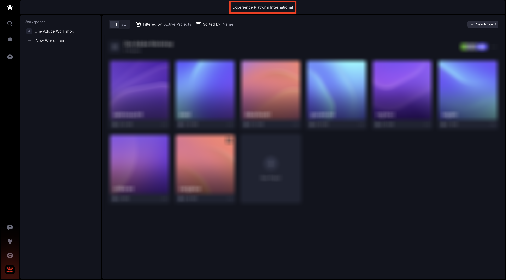

# 1.5.3 Frame.io とPremiere Pro

>[!NOTE]
>
> 次のスクリーンショットは、使用されている特定の環境を示しています。 このチュートリアルを進めていくと、環境に異なる名前が付いている可能性が非常に高くなります。 このチュートリアルに登録したときに、使用する環境の詳細が提供されました。これらの手順に従ってください。

[https://next.frame.io/](https://next.frame.io/) に移動します。 環境 `--aepImsOrgName--` にログインしていることを確認します。

右環境にログインしていない場合は、左下隅のロゴをクリックし、をクリックして、使用する必要がある環境を選択します。

## 1.5.3.1 Adobe Premiere Pro Betaのセットアップ

「はじめに」モジュールの一部として、Adobe Premiere Pro Betaが既にインストールされています。 Frame.io をAdobe Premiere Pro Betaと組み合わせて使用するには、この統合用に開発されたプラグインを使用できます。

Creative Cloud アプリを開き、`frame.io` を検索します。

検索結果を下にスクロールして、プラグイン **Frame.io V4 Comments** を見つけます。 クリックします。

この画像が表示されます。 **インストール** をクリックします。

Adobe Premiere Pro Betaが開いている場合は、まず **閉じる** 必要があります。

「**OK**」をクリックします。プラグインをインストールしています。

プラグインをインストールしたら、コンピューターでAdobe Premiere Pro Betaを開きます。

## 次の手順

[ 概要とメリット ](./summary.md){target="_blank"} に移動します。

[Frame.io によるワークフローの効率化 ](./frameio.md){target="_blank"} に戻る

[ すべてのモジュール ](./../../../overview.md){target="_blank"} に戻る
