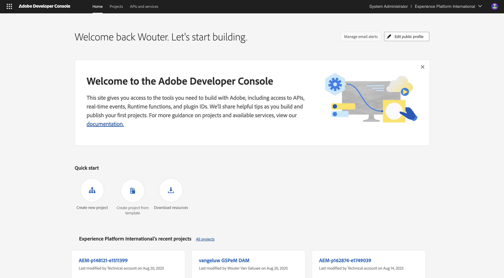
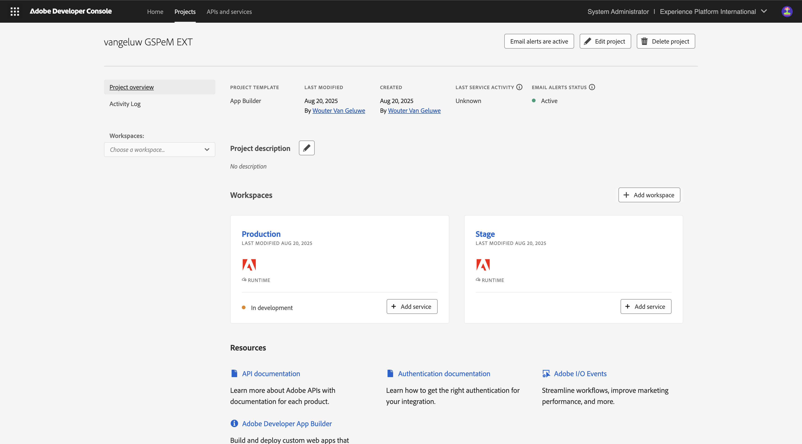

# 1.6.1 Adobe IO とApp Builder

## Adobe I/O プロジェクトの 1.6.1.1 作成

[https://developer.adobe.com/console/home](https://developer.adobe.com/console/home){target="_blank"} に移動します。

画面の右上隅で正しいインスタンスを選択してください。 インスタンスは `--aepImsOrgName--` です。

>[!NOTE]
>
> 次のスクリーンショットは、特定の組織が選択されていることを示しています。 このチュートリアルを進めていくと、組織の名前が異なる可能性が非常に高くなります。 このチュートリアルに登録したときに、使用する環境の詳細が提供されました。これらの手順に従ってください。

次に、「**テンプレートからプロジェクトを作成**」を選択します。

「**App Builder**」を選択します。

`--aepUserLdap-- GSPeM EXT` という名前を入力します。 「**保存**」をクリックします。

次のようなメッセージが表示されます。

## 開発環境 1.6.1.2 設定するには

拡張可能なアプリを作成、送信、およびデプロイするには、コンピューター上のローカル開発環境に次のアプリケーションおよびパッケージがインストールされている必要があります。

- Node.js （バージョン 20.x 以降）
- npm （Node.js とともにパッケージ化）
- Adobe Developer コマンドラインインターフェイス（CLI）

これらのアプリケーションやパッケージがまだコンピューターにインストールされていない場合は、次の手順に従います。

### Node.js および npm

[https://nodejs.org/en/download](https://nodejs.org/en/download) に移動します。 Node.js と npm をインストールするために実行する必要がある多数のターミナルコマンドが表示されます。 ここに示すコマンドは、MacBook に適用できます。

まず、新しいターミナルウィンドウを開きます。 スクリーンショットの 2 行目で示されているコマンドを貼り付けて実行します。

`curl -o- https://raw.githubusercontent.com/nvm-sh/nvm/v0.40.3/install.sh | bash`

次に、スクリーンショットの 5 行目でコマンドを実行します。

`\. "$HOME/.nvm/nvm.sh"`

両方のコマンドを正常に実行したら、次のコマンドを実行します。

`node -v`

返されるバージョン番号が表示されます。

次に、次のコマンドを実行します。

`npm -v`

返されるバージョン番号が表示されます。

最後の 2 つのコマンドが正常にバージョン番号を返した場合、これらの 2 つの機能の設定は成功しています。

### Adobe Developer コマンドラインインターフェイス（CLI）

Adobe Developer コマンドラインインターフェイス（CLI）をインストールするには、ターミナルウィンドウで次のコマンドを実行します。

`npm install -g @adobe/aio-cli`

このコマンドの実行には数分かかることがあります。最終的な結果は次のようになります。

これで、Adobe Developer コマンドラインインターフェイス（CLI）も正常にインストールされました。

これで、App Builder プロジェクトを実行できる基本的な要素を設定しました。

## 次の手順

[AWS S3 バケットの作成 &#x200B;](./ex2.md){target="_blank"} に移動します。

[GenStudio for Performance Marketing – 拡張機能 &#x200B;](./genstudioext.md){target="_blank"} に戻る

[&#x200B; すべてのモジュール &#x200B;](./../../../overview.md){target="_blank"} に戻る
