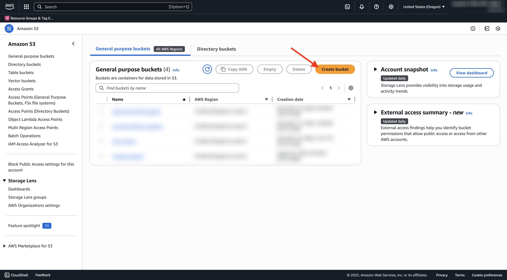
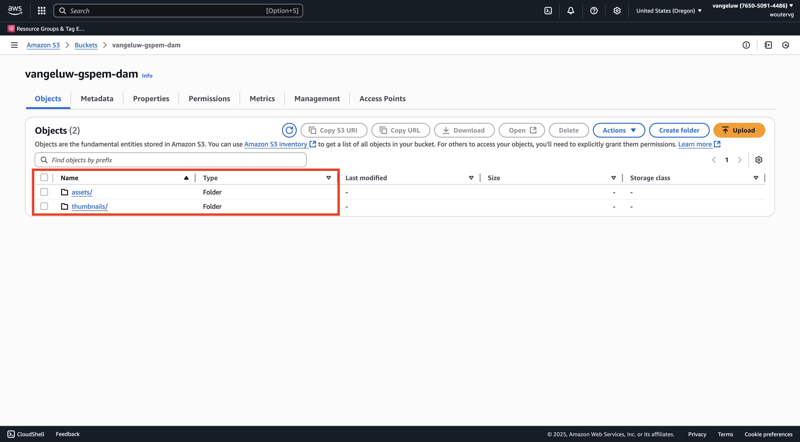

# 1.6.2 AWS S3 バケットの作成

## 1.6.2.1 S3 バケットの作成

[https://console.aws.amazon.com](https://console.aws.amazon.com) に移動し、サインインします。

>[!NOTE]
>
>AWS アカウントをまだお持ちでない場合は、個人のメールアドレスを使用して新しいAWS アカウントを作成してください。

ログインすると、**AWS Management Console** にリダイレクトされます。

検索バーで、「**s3**」を検索します。 最初の検索結果「**S3 - Scalable Storage in the Cloud**」をクリックします。

**Amazon S3** ホームページが表示されます。 **バケットを作成** をクリックします。

**バケットを作成** 画面で、`--aepUserLdap---gspem-dam` という名前を使用します。

他のすべてのデフォルト設定はそのままにしておきます。 下にスクロールして、**バケットを作成** をクリックします。

その後、バケットが作成され、Amazon S3 のホームページにリダイレクトされます。

## S3 バケットにアクセスするための権限の設定

次の手順では、S3 バケットへのアクセスを設定します。

その場合は、[https://console.aws.amazon.com/iam/home](https://console.aws.amazon.com/iam/home) にアクセスしてください。

AWS リソースへのアクセスは、Amazon Identity and Access Management （IAM）によって制御されます。

このページが表示されます。

左側のメニューで、「**ユーザー**」をクリックします。 その後、**ユーザー** 画面が表示されます。 **ユーザーを作成** をクリックします。

次に、ユーザーを設定します。

- ユーザー名：使用 `s3_--aepUserLdap--_gspem_dam`

「**次へ**」をクリックします。

その後、この権限画面が表示されます。 「**ポリシーを直接添付**」をクリックします。

検索語句 **s3** を入力すると、関連するすべての S3 ポリシーが表示されます。 ポリシー **AmazonS3FullAccess** を選択します。 下にスクロールして、「**次へ**」をクリックします。

設定を確認します。 **ユーザーを作成** をクリックします。

その後、これが表示されます。 **ユーザーを表示** をクリックします。

**セキュリティ資格情報** をクリックしてから、**アクセスキーを作成** をクリックします。

**AWS以外で実行中のアプリケーション** を選択します。 下にスクロールして、「**次へ**」をクリックします。

**アクセスキーを作成** をクリックします

その後、これが表示されます。 「**表示**」をクリックして、秘密アクセスキーを表示します。

**秘密アクセスキー** を表示しています。

>[!IMPORTANT]
>
>コンピューターのテキストファイルに資格情報を保存します。
>
> - アクセスキー ID : ...
> - 秘密アクセスキー：...
>
> 「完了 **をクリックすると** 資格情報が再び表示されなくなります。

「**完了**」をクリックします。

これで、AWS S3 バケットが正常に作成され、このバケットにアクセスする権限を持つユーザーが作成されました。

## 1.6.2.2 Assetsを S3 バケットにアップロード

検索バーで、「**s3**」を検索します。 最初の検索結果「**S3 - Scalable Storage in the Cloud**」をクリックします。

クリックして、新しく作成した S3 バケットを開きます。これは `--aepUserLdap---gspem-dam` という名前にする必要があります。

**アップロード** をクリックします。

この画像が表示されます。

CitiSignal 画像ファイルは [&#x200B; こちら &#x200B;](./images/package.zip){target="_blank"} からダウンロードできます。

ファイルをデスクトップに書き出します。

**フォルダーを追加** をクリックします。

ダウンロードフォルダー **package** からフォルダー **assets** を選択します。 **アップロード** をクリックします。

この画像が表示されます。 もう一度 **フォルダーを追加** をクリックします。

ダウンロードフォルダー **package** から、フォルダー **サムネール** を選択します。 **アップロード** をクリックします。

この画像が表示されます。 **アップロード** をクリックします。

アップロードが完了しました。 「**閉じる**」をクリックします。

これで、S3 バケットにこのフォルダー構造が作成されました。

## 次の手順

[&#x200B; 外部 DAM アプリの作成 &#x200B;](./ex3.md){target="_blank"} に移動します。

[GenStudio for Performance Marketing – 拡張機能 &#x200B;](./genstudioext.md){target="_blank"} に戻る

[&#x200B; すべてのモジュール &#x200B;](./../../../overview.md){target="_blank"} に戻る
