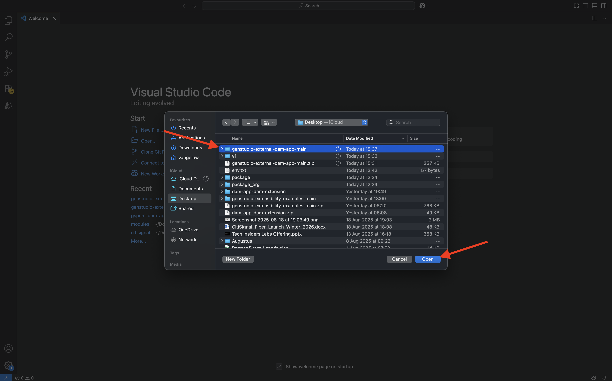
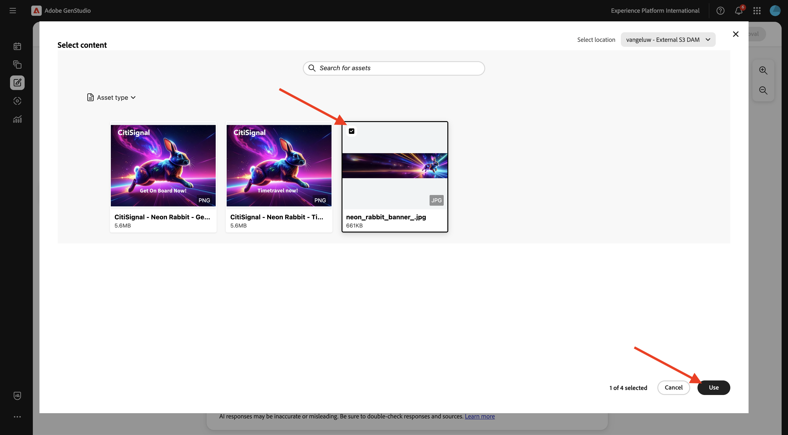

# 1.6.3 外部 DAM アプリケーションの作成とデプロイ

## 1.6.3.1 サンプルアプリファイルのダウンロード

[https://github.com/woutervangeluwe/genstudio-external-dam-app](https://github.com/woutervangeluwe/genstudio-external-dam-app) に移動します。 「**コード**」をクリックし、「**ZIP をダウンロード**」を選択します。


zip ファイルをデスクトップに解凍します。


## 1.6.3.2 Adobe Developer コマンドラインインターフェイスの設定

**genstudio-external-dam-app-main** フォルダーを右クリックし、「**フォルダーに新しいターミナル**」を選択します。


この画像が表示されます。 コマンド `aio login` を入力します。 このコマンドは、ブラウザにリダイレクトし、ログインすることを期待します。


ログインに成功すると、ブラウザーにこれが表示されます。


その後、ブラウザーはターミナルウィンドウにリダイレクトします。 **ログインに成功しました** というメッセージと、ブラウザーから返される長いトークンが表示されます。


次の手順では、外部 DAM アプリに使用するインスタンスとAdobe IO プロジェクトを設定します。

これを行うには、以前に設定したAdobe IO プロジェクトからファイルをダウンロードする必要があります。

[https://developer.adobe.com/console/home](https://developer.adobe.com/console/home){target="_blank"} に移動し、以前に作成した `--aepUserLdap-- GSPeM EXT` という名前のプロジェクトを開きます。 **実稼動** ワークスペースを開きます。


**すべてダウンロード** をクリックします。 これにより、JSON ファイルがダウンロードされます。


**ダウンロード** ディレクトリから外部 DAM アプリのルートディレクトリに JSON ファイルをコピーします。


ターミナルウィンドウに戻ります。 コマンド `aio app use XXX-YYY-Production.json` を入力します。

>[!NOTE]
>
>上記のコマンドでファイルの名前をファイル名と一致するように変更する必要があります。

コマンドが実行されると、外部 DAM アプリが、以前に作成したApp Builderを使用してAdobe I/O プロジェクトに接続されるようになります。


## GenStudio拡張機能SDKのインストール 1.6.3.3

次に、**GenStudio拡張機能SDK** をインストールする必要があります。 SDKについて詳しくは、[https://github.com/adobe/genstudio-extensibility-sdk](https://github.com/adobe/genstudio-extensibility-sdk) を参照してください。

SDKをインストールするには、ターミナルウィンドウで次のコマンドを実行します。

`npm install @adobe/genstudio-extensibility-sdk`


数分後、SDKがインストールされます。


## 1.6.3.4 Visual Studio Code で外部 DAM アプリを確認する

Visual Studio Code を開きます。 **開く…** をクリックしてフォルダーを開きます。


前にダウンロードしたアプリを含んだフォルダー **genstudio-external-dam-app-main** を選択します。 「**開く**」をクリックします。



**.env** ファイルをクリックして開きます。


**.env** ファイルは、前の手順で実行したコマンド `aio app use` ードによって作成され、App Builderを使用してAdobe I/O プロジェクトに接続するために必要な情報が含まれています。


外部 DAM アプリが、以前作成したAWS S3 バケットに接続できるように、次の詳細を **.env** ファイルに追加する必要があります。

```
AWS_ACCESS_KEY_ID=
AWS_SECRET_ACCESS_KEY=
AWS_REGION=
AWS_BUCKET_NAME=
```

フィールド **`AWS_ACCESS_KEY_ID`** と **`AWS_SECRET_ACCESS_KEY`** は、前の演習で IAM ユーザーを作成した後で使用できます。 あなたはそれらを書き留めるように頼まれました、あなたは今、値をコピーすることができます。


このフィールド **`AWS_REGION`** は、AWS S3 ホームビューの、バケット名の横から取得できます。 この例では、領域は **us-west-2** です。


フィールド **`AWS_BUCKET_NAME`** は `--aepUserLdap---gspem-dam` にする必要があります。

この情報を使用すると、これらの各変数の値を更新できます。

```
AWS_ACCESS_KEY_ID=XXX
AWS_SECRET_ACCESS_KEY=YYY
AWS_REGION=us-west-2
AWS_BUCKET_NAME=--aepUserLdap---gspem-dam
```

このテキストをファイル `.env.dev` と `.env.prod` の両方に貼り付ける必要があります。 忘れずに変更を保存してください。


次に、ターミナルウィンドウに戻ります。 次のコマンドを実行します。

`export $(grep -v '^#' .env | xargs)`


最後に、外部 DAM アプリと他の統合機能を区別できるように、GenStudio for Performance Marketing内に表示されるラベルを変更する必要があります。 これを行うには、エクスプローラーで **src/genstudiopem/web-src/src** にドリルダウンして、ファイル **Constants.ts** を開きます。

行 14 をに変更する必要があります。

`export const extensionLabel: string = "--aepUserLdap-- - External S3 DAM";`

忘れずに変更を保存してください。


## 1.6.3.5 外部 DAM アプリの実行

ターミナルウィンドウで、`aio app run` コマンドを実行します。 その後 1～2 分後にこれを表示します。


これで、アプリが実行中であることを確認しました。 次の手順では、デプロイします。

まず、**Ctrl+C** を押して、アプリの実行を停止します。 次に、コマンド `aio app deploy` を入力します。 このコマンドは、コードをAdobe IO にデプロイします。

その結果、デプロイされたアプリケーションにアクセスするための同様の URL が届きます。

`https://133309-201burgundyguan.adobeio-static.net/index.html`


テストの目的で、上記の URL に `?ext=` をプレフィックスとして追加することで、その URL をクエリ文字列パラメーターとして使用できるようになりました。 その結果、次のクエリ文字列パラメーターが得られます。

`?ext=https://133309-201burgundyguan.adobeio-static.net/index.html`

[https://experience.adobe.com/genstudio/create](https://experience.adobe.com/genstudio/create) に移動します。


次に、クエリ文字列パラメーターを **#** の直前に追加します。 新しい URL は次のようになります。

`https://experience.adobe.com/?ext=https://133309-201burgundyguan.adobeio-static.net/index.html#/@experienceplatform/genstudio/create`

ページは通常どおり読み込まれます。 **バナー** をクリックして、新しいバナーの作成を開始します。


テンプレートを選択し、「**使用**」をクリックします。


**コンテンツから選択** をクリックします。


これで、ドロップダウンリストから `--aepUserLdap-- - External S3 DAM` という名前の外部 DAM を選択できるようになります。


この画像が表示されます。 画像 **neon_rabbit_banner.jpg** を選択し、「**使用**」をクリックします。



これで、S3 バケットで実行されている外部 DAM から画像を選択しました。 画像を選択した状態で、メタ広告の作成と承認の演習に記載されてい [1.3.3.4 通常のワークフローに従うことができ ](./../module1.3/ex3.md#create--approve-meta-ad) す。


ローカルマシンのコードに変更を加える場合は、アプリを再デプロイする必要があります。 再デプロイする場合は、次のターミナルコマンドを使用します。

`aio app deploy --force-build --force-deploy`


これで、アプリを公開する準備が整いました。

## 次の手順

[ アプリを非公開で公開する ](./ex4.md){target="_blank"} に移動します。

[GenStudio for Performance Marketing – 拡張機能 ](./genstudioext.md){target="_blank"} に戻る

[ すべてのモジュール ](./../../../overview.md){target="_blank"} に戻る
