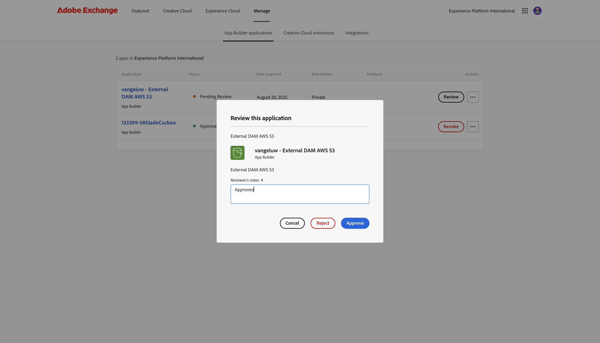

# 1.6.4 コードをデプロイし、アプリを非公開で公開する

アプリを非公開で公開すると、クエリ文字列パラメーターを使用せずにGenStudio for Performance Marketingでアプリを利用できます。

## 1.6.4.1 アプリの公開

[https://developer.adobe.com/console/projects](https://developer.adobe.com/console/projects){target="_blank"} に移動します。

>[!NOTE]
>
> 次のスクリーンショットは、特定の組織が選択されていることを示しています。 このチュートリアルを進めていくと、組織の名前が異なる可能性が非常に高くなります。 このチュートリアルに登録したときに、使用する環境の詳細が提供されました。これらの手順に従ってください。

App BuilderでAdobe IO プロジェクトを開きます。`--aepUserLdap-- GSPeM EXT` という名前にする必要があります。

**実稼動** に移動します。

**非公開で公開** をクリックします。

その後、いくつかのフィールドに入力する必要があります。

以下のようにフィールドに入力します。

- **アプリのタイトル**: `--aepUserLdap-- - External DAM AWS S3`。
- **アプリの説明**: `External DAM AWS S3`
- **連絡先メール**：メールアドレスを入力します
- **アプリアイコン**：次の画像をダウンロードして使用します：[S3 画像 ](./images/s3.jpeg)
- **レビュアーへのメモ**：外部 DAM AWS S3

「**送信**」をクリックします。

「**送信**」をクリックします。

## 1.6.4.2 アプリを承認する

>[!IMPORTANT]
>
>この手順は、Adobe Admin Consoleのシステム管理者のみが実行できます。 システム管理者でない場合は、これを実行できません。 代わりに、システム管理者に連絡して、アプリの承認をリクエストしてください。

開発者が公開用の新しいアプリを送信すると、組織のシステム管理者に通知され、レビューおよび承認を求められます。

システム管理者の場合は、この電子メールが届きます。その後、[My Exchange **] をクリックしてプロセスを開始** きます。

**Adobe Exchange** にはApp Builderのアプリが表示され、送信されたばかりのアプリは現在確認待ちとなっています。 アプリ **ージの** レビュー `--aepUserLdap-- - External DAM AWS S3` ボタンをクリックします。

コメントを追加して、「承認 **をクリックし** す。

これで、アプリが承認され、GenStudio for Performance Marketingで自動的に機能するようになります。クエリ文字列パラメーターを指定する必要はありません。

## 次の手順

[ 概要とメリット ](./summary.md){target="_blank"} に移動します。

[GenStudio for Performance Marketing – 拡張機能 ](./genstudioext.md){target="_blank"} に戻る

[ すべてのモジュール ](./../../../overview.md){target="_blank"} に戻る
