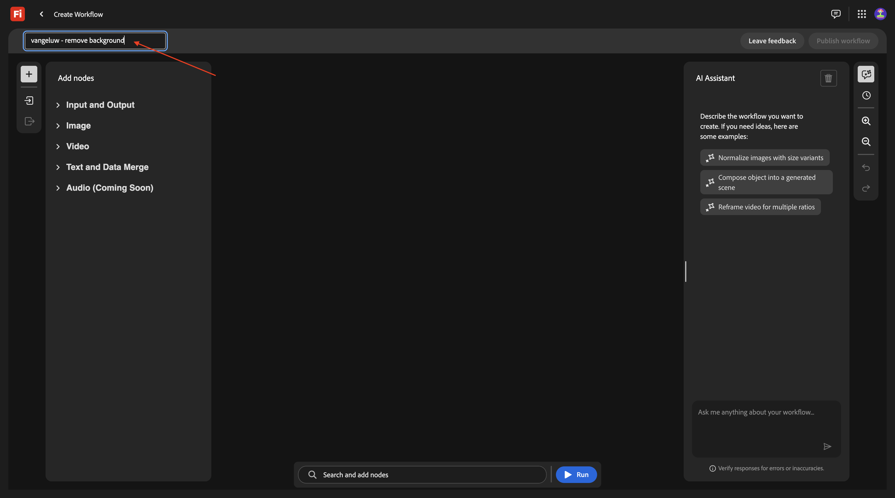
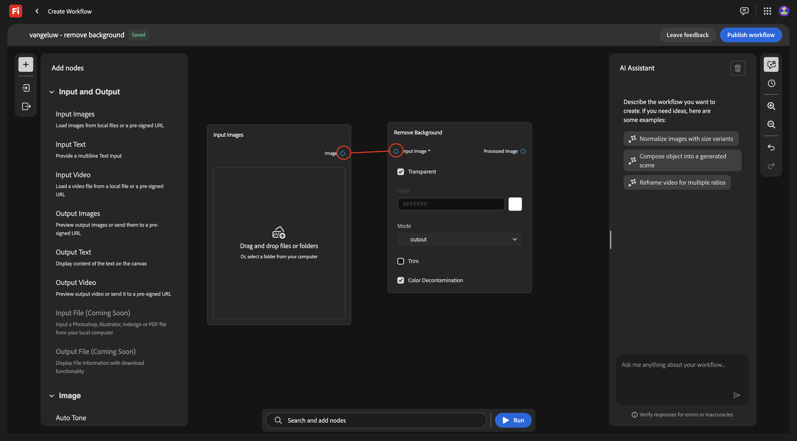
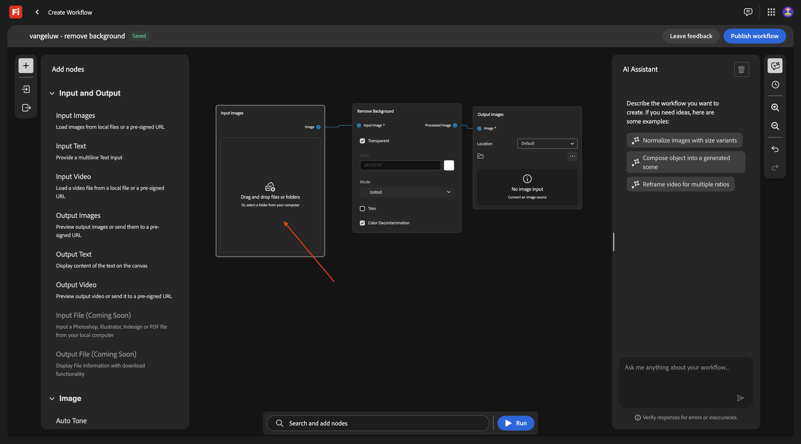
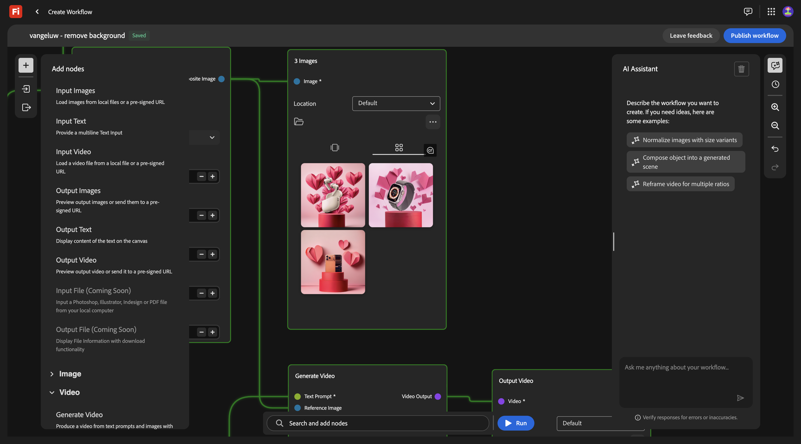

# 1.7.1 Fireflyのカスタムワークフローの概要

[!BADGE Beta]

+++Betaの詳細
Firefly カスタムワークフローBetaを使用することにより、お客様は、Betaが「現状のまま」でいかなる保証もなく提供されていることを承諾します。 Adobeは、Betaを維持、修正、更新、変更、修正、またはその他の方法でサポートする義務を負いません。 このようなBetaおよび付属の資料の正しい機能やパフォーマンスに対して、注意を払い、いかなる形でも依存しないことをお勧めします。 BetaはAdobeの機密情報と見なされます。  お客様がアドビに提供するあらゆる「フィードバック」（ベータ版の使用中に発生した問題や欠陥、提案、改善、レコメンデーションを含むがこれに限定されないベータ版に関する情報）は、このようなフィードバックに含まれる、およびフィードバックに対するすべての権利、所有権、利益を含め、アドビに帰属します。

+++

[https://firefly.adobe.com](https://firefly.adobe.com) に移動します。 右上隅のプロファイルアイコンをクリックし、正しいインスタンスを選択したことを確認します。正しいインスタンスを選択した場合は、`--aepImsOrgName--` にしてください。

**実稼動** に移動します。

この画像が表示されます。 **ワークフローを作成（ベータ版）** をクリックします。

## 1.7.1.1 背景の削除

Fireflyのカスタムワークフローを理解するために、特定の画像の背景の削除に重点を置いた基本的なユースケースを実装します。

ワークフローの名前を `vangeluw - remove background` に変更します。

**画像** を開きます。

**背景を削除** を選択して、このノードをキャンバスにドラッグ&amp;ドロップします。

次に、入力画像ノードと出力画像ノードを **バックグラウンドの削除** に接続する必要があります。

上にスクロールして、**入力と出力** に移動します。 **Input Images** ノードをクリックして、キャンバスにドラッグします。

これで完了です。 **入力画像** ノードの **画像** の横の青い点にマウスポインターを置き、**背景を削除** ノードの **入力画像** の横の青い点に線を描画して、**背景を削除** ノードに **入力画像** ノードを接続します。

これで完了です。 次に、**出力画像** ノードをクリックして、キャンバスにドラッグします。

これで完了です。 **背景を削除** ノードの **出力画像** の横の青い点にマウスポインターを置き、**出力画像** ノードの **画像** の横の青い点に線を引くことで、**背景を削除** ノードを **出力画像** ノードに接続します。

これで完了です。

これで、基本ワークフローをテストする準備が整いました。 画像 [phone.png](./assets/phone.png) をデスクトップにダウンロードします。

ワークフローに戻ります。 **入力画像** ノードの **ドラッグ&amp;ドロップ** 領域をクリックします。

ファイル **phone.png** を選択します。 「**開く**」をクリックします。

この画像が表示されます。 **実行** をクリックします。

1～2 分の後、この結果が表示されます。

## 1.7.1.2 背景を削除+切り抜き

これで、キャンバスに **Crop** ノードを追加する必要があります。 メニューで、**画像** に移動し、下にスクロールして **切り抜き** を見つけます。 キャンバスにドラッグします。

**切り抜き** ノードを **背景を削除** ノードと **出力画像** ノードの間に配置します。

次に、**バックグラウンドの削除** ノードと **出力画像** ノードの間の接続を削除する必要があります。 これを行うには、両方のノード間の線をダブルクリックします。

これで完了です。 **背景の削除** ノードを **切り抜き** ノードに接続し、次に **切り抜き** ノードを **出力画像** ノードに接続します。

「**自動切り抜き**」のチェックボックスをオンにすると、「**実行** をクリックしてワークフローをテストできます。

1～2 分後、これが表示され、異なる解像度の画像が表示されます。

## 1.7.1.3 背景を削除+切り抜き+合成画像

メニューの **画像** の下で、**合成画像（2D）** ノードを選択してキャンバスにドラッグします。

**合成画像（2D）** ノードで、「切り抜き画像 **&#x200B;**&#x200B;の横にある青い点と **入力画像** の横にある青い点を接続して、「**切り抜き** ノードに 2 つ目の接続を追加します。

メニューの **入力と出力** の下で、**入力テキスト** ノードを選択してキャンバスにドラッグします。

**入力テキスト** ノードの **テキスト** の横にある緑のドットを、**合成画像（2D）** ノードの **プロンプト** の横にある緑のドットに接続します。

これで完了です。 **テキストを入力** ノードに以下のプロンプトを入力します。

`magazine quality photo of a phone on a red pedestal with a pink background surrounded by origami style pink paper hearts`

メニューの **入力と出力** の下で、**出力画像** ノードを選択してキャンバスにドラッグします。

**合成画像（2D）** ノードの **合成画像** の横の青い点を、**出力画像** ノードの **入力画像** の横の青い点に接続します。

**実行** をクリックします。

数分後、次のように、指定されたプロンプトに基づくコンポジションの元の画像が特定の解像度で表示されます。

## 1.7.1.4 背景の削除+切り抜き+合成画像+ ビデオの生成

メニューで、**ビデオ** に移動します。 **ビデオを生成** ノードを選択して、キャンバスにドラッグします。

**合成画像（2D）** ノードの **合成画像** の横の青い点を、**ビデオを生成** ノードの **入力画像** の横の青い点に接続します。

メニューで、**入力と出力** に移動します。 **入力テキスト** ノードを選択して、キャンバスにドラッグします。

**入力テキスト** ノードの「テキスト **の横にある緑のドットを** ビデオを生成 **ノードの** プロンプト **&#x200B;**&#x200B;の横にある緑のドットに接続します。

`background hearts fluttering` テキストを入力 **ノードにプロンプト** を入力します。

メニューで、**入力と出力** に移動します。 **ビデオを出力** ノードを選択して、キャンバスにドラッグします。

**ビデオを生成** ノードの **ビデオ出力** の横にある紫色の点を、**出力ビデオ** ノードの **ビデオ** の横にある紫色の点に接続します。

**実行** をクリックします。

いくつかのビデオの後に、表示されるはずです。このビデオには、指定された画像とプロンプトの組み合わせに基づくビデオが表示されています。

## 1.7.1.5 Scale

これで、1 枚の画像に対してこれを行いました。 次に、このワークフローを、複数の画像に対して使用します。

次の画像をデスクトップにダウンロードします。

- [watch.jpg](./assets/watch.jpg)
- [airpods.jpg](./assets/airpods.jpg)

ワークフローで、最初のノード **入力画像** に戻ります。 現在選択されている画像を削除します。

**ドラッグ&amp;ドロップ** 領域をクリックします。

ダウンロードした 3 つの画像を選択します。 「**開く**」をクリックします。

この画像が表示されます。 **実行** をクリックします。

数分後、同様の出力が表示され、3 つの画像が生成され、3 つのビデオが表示されます。

## AEM Assets CS の 1.7.1.5 Store

この演習では、カスタムワークフローの一部として作成されたアセットをAEM Assets CS に保存します。

まず、AEM Assets CS 環境に新しいフォルダーを作成する必要があります。

その場合は、[https://experience.adobe.com](https://experience.adobe.com) にアクセスしてください。 クリックして **Experience Manager Assets** を開きます。

AEM Assets CS 環境を選択します。`--aepUserLdap-- - CitiSignal AEM + ACCS` という名前を付ける必要があります。

**Assets** に移動し、「**フォルダーを作成**」をクリックします。

`--aepUserLdap-- - Firefly Custom Workflows` という名前を入力します。 「**作成**」をクリックします。

カスタムワークフローに戻り、**出力画像** ノードに移動します。 **デフォルト** をクリックしてから、**AEM Assets** を選択してください。

このポップアップが表示されます。 AEM Assets CS リポジトリを選択し、作成したばかりのフォルダー（`--aepUserLdap-- - Firefly Custom Workflows`）を選択します。 「**選択**」をクリックします。

**出力ビデオ** ノードに移動します。 **デフォルト** をクリックしてから、**AEM Assets** を選択してください。

このポップアップが表示されます。 AEM Assets CS リポジトリを選択し、作成したばかりのフォルダー（`--aepUserLdap-- - Firefly Custom Workflows`）を選択します。 「**選択**」をクリックします。

これで完了です。 **実行** をクリックします。

数分後、作成されたアセットがAEM Assets CS のフォルダーで使用できるようになります。

## 次の手順

[&#x200B; ワークフロービルダー &#x200B;](./workflowbuilder.md){target="_blank"} に戻る

[&#x200B; すべてのモジュール &#x200B;](./../../../overview.md){target="_blank"} に戻る
