# 1.7.1 Firefly Creative Production for Enterpriseの概要

[https://firefly.adobe.com](https://firefly.adobe.com)に移動します。 右上隅のプロファイルアイコンをクリックし、正しいインスタンス（`--aepImsOrgName--`）を選択していることを確認します。

**本番**&#x200B;に移動します。

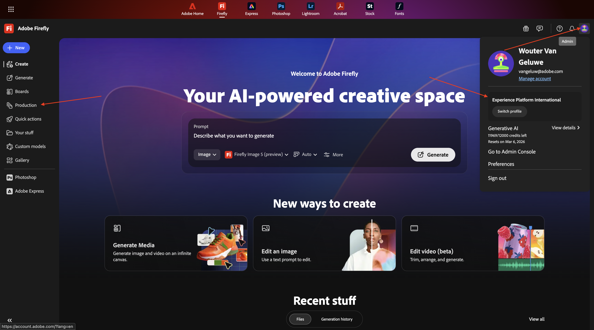

そうすると、これが表示されます。 「**ワークフローを作成（ベータ版）**」をクリックします。

## 1.7.1.1背景を削除

Firefly Creative Production for Enterpriseについて理解するために、ここでは特定の画像の背景を削除することに焦点を当てた基本的なユースケースを実装します。

ワークフローの名前を`vangeluw - remove background`に変更します。

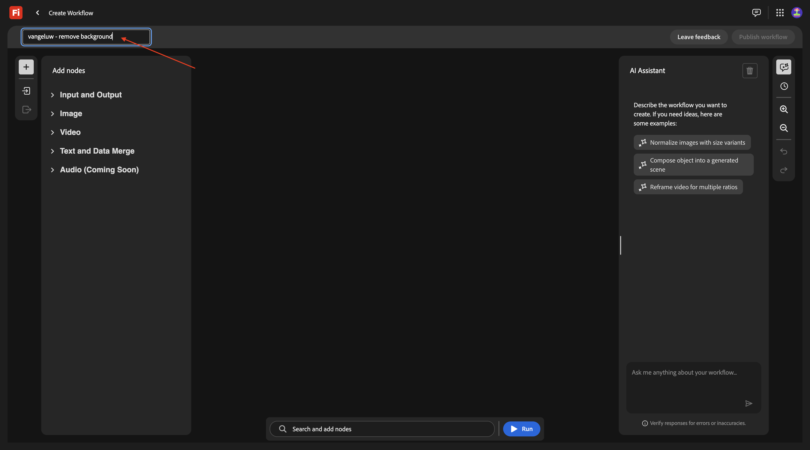

**画像**&#x200B;を開く

「**背景を削除**」を選択し、このノードをキャンバスにドラッグ&amp;ドロップします。

次に、入力画像ノードと出力画像ノードを&#x200B;**背景を削除**&#x200B;に接続する必要があります。

上にスクロールして、**入力と出力**&#x200B;に移動します。 **画像を入力** ノードをクリックし、キャンバスにドラッグします。

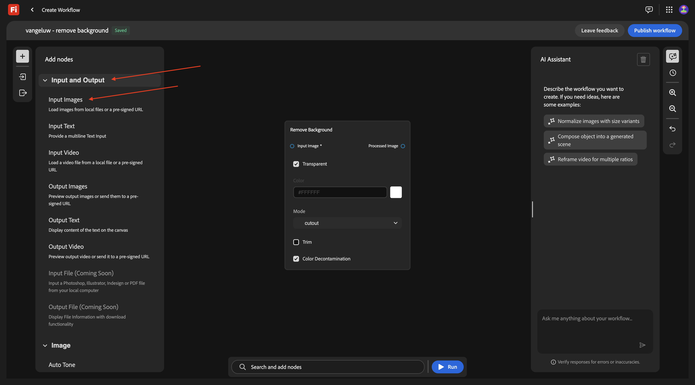

では、これを使ってください。 **入力画像** ノードを&#x200B;**背景を削除** ノードに接続するには、**入力画像** ノードの&#x200B;**画像**&#x200B;の横にある青い点にカーソルを合わせ、**背景を削除** ノードの&#x200B;**入力画像**&#x200B;の横にある青い点に線を引きます。

では、これを使ってください。 次に、**出力画像** ノードをクリックし、キャンバスにドラッグします。

では、これを使ってください。 **背景を削除** ノードを&#x200B;**出力画像** ノードに接続するには、**背景を削除** ノードの&#x200B;**出力画像**&#x200B;の横にある青い点にカーソルを合わせ、**出力画像** ノードの&#x200B;**画像**&#x200B;の横にある青い点に線を引きます。

では、これを使ってください。

これで、基本的なワークフローをテストする準備ができました。 画像[phone.png](./assets/phone.png)をデスクトップにダウンロードします。

ワークフローに戻ります。 **入力画像** ノードの&#x200B;**ドラッグ&amp;ドロップ**&#x200B;領域をクリックします。

ファイル **phone.png**&#x200B;を選択します。 「**開く**」をクリックします。

そうすると、これが表示されます。 「**実行**」をクリックします。

1～2分後、この結果が表示されます。

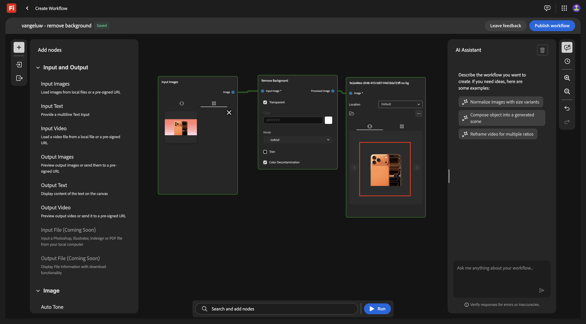

## 1.7.1.2背景を削除+切り抜き

これで、**切り抜き** ノードをキャンバスに追加する必要があります。 メニューで、**画像**&#x200B;に移動し、下にスクロールして&#x200B;**切り抜き**&#x200B;を見つけます。 カンバスにドラッグします。

**切り抜き** ノードを&#x200B;**背景を削除** ノードと&#x200B;**出力画像** ノードの間に配置します。

次に、**背景を削除** ノードと&#x200B;**出力画像** ノードの間の接続を削除する必要があります。 これは、両方のノード間の行をダブルクリックすることで可能です。

では、これを使ってください。 **背景を削除** ノードを&#x200B;**切り抜き** ノードに接続してから、**切り抜き** ノードを&#x200B;**出力画像** ノードに接続します。

「**自動切り抜き**」にチェックボックスをオンにすると、**実行**&#x200B;をクリックしてワークフローをテストできます。

1～2分後、これを見るはずです。これは今とは異なる解像度の画像を示しています。

## 1.7.1.3背景を削除+切り抜き+合成画像

メニューの&#x200B;**画像**&#x200B;で、**複合画像（2D）** ノードを選択し、キャンバスにドラッグします。

**複合画像（2D）** ノードの&#x200B;**入力画像**&#x200B;の横にある&#x200B;**切り抜き画像**&#x200B;の横にある青い点と青い点を接続して、**切り抜き** ノードに2番目の接続を追加します。

メニューの&#x200B;**入力と出力**&#x200B;で、**入力テキスト** ノードを選択し、キャンバスにドラッグします。

**テキスト入力** ノードの&#x200B;**テキスト**&#x200B;の横にある緑のドットを、**複合画像（2D）** ノードの&#x200B;**プロンプト**&#x200B;の横にある緑のドットに接続します。

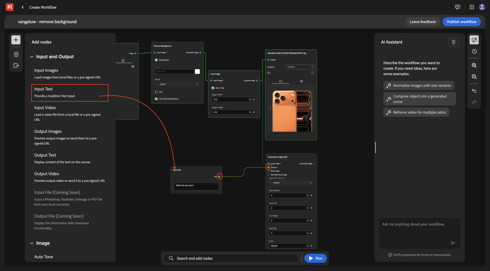

では、これを使ってください。 **入力テキスト** ノードに以下のプロンプトを入力します。

`magazine quality photo of a phone on a red pedestal with a pink background surrounded by origami style pink paper hearts`

メニューの&#x200B;**入力と出力**&#x200B;で、**出力画像** ノードを選択し、キャンバスにドラッグします。

**合成画像（2D）** ノードの&#x200B;**合成画像**&#x200B;の横にある青い点を、**出力画像** ノードの&#x200B;**入力画像**&#x200B;の横にある青い点に接続します。

「**実行**」をクリックします。

数分後、このような表示が表示され、指定したプロンプトに基づいてコンポジション内に元の画像が特定の解像度で表示されます。

## 1.7.1.4背景を削除+切り抜き+合成画像+ビデオを生成

メニューで、**ビデオ**&#x200B;に移動します。 「**ビデオを生成**」ノードを選択し、キャンバスにドラッグします。

**合成画像（2D）** ノードの&#x200B;**合成画像**&#x200B;の横にある青い点を、**ビデオ生成** ノードの&#x200B;**入力画像**&#x200B;の横にある青い点に接続します。

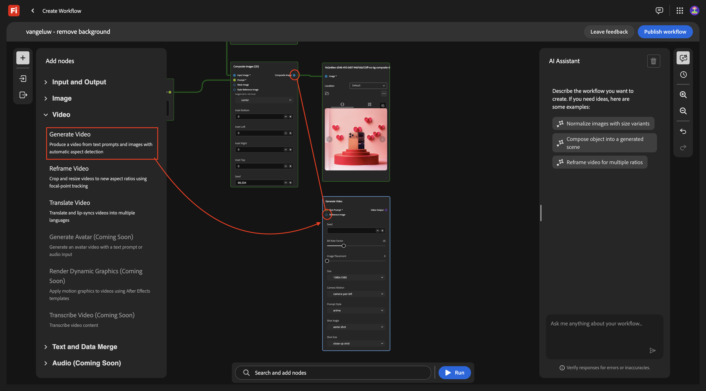

メニューで、**入力と出力**&#x200B;に移動します。 **入力テキスト** ノードを選択し、キャンバスにドラッグします。

**テキスト** ノードの&#x200B;**テキスト**&#x200B;の横にある緑のドットを、**ビデオ生成** ノードの&#x200B;**プロンプト**&#x200B;の横にある緑のドットに接続します。

`background hearts fluttering`入力テキスト **ノードにプロンプト**&#x200B;を入力します。

メニューで、**入力と出力**&#x200B;に移動します。 **Output Video** ノードを選択し、キャンバスにドラッグします。

**ビデオ生成** ノードの&#x200B;**ビデオ出力**&#x200B;の横にある紫色のドットを、**出力ビデオ** ノードの&#x200B;**ビデオ**&#x200B;の横にある紫色のドットに接続します。

「**実行**」をクリックします。

数本のビデオの後、提供された画像とプロンプトの組み合わせに基づいてビデオを表示するビデオが表示されます。

## 1.7.1.5拡大・縮小

これで、1枚の画像に対してこれを実行しました。 このワークフローを複数の画像に使用してみましょう。

これらの画像をデスクトップにダウンロードします。

- [watch.jpg](./assets/watch.jpg)
- [airpods.jpg](./assets/airpods.jpg)

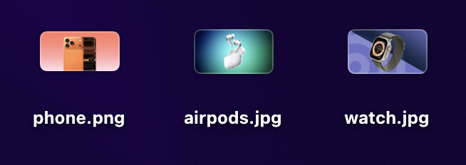

ワークフローで、最初のノード **入力画像**&#x200B;に戻ります。 現在選択されている画像を削除します。

**ドラッグ&amp;ドロップ**&#x200B;領域をクリックします。

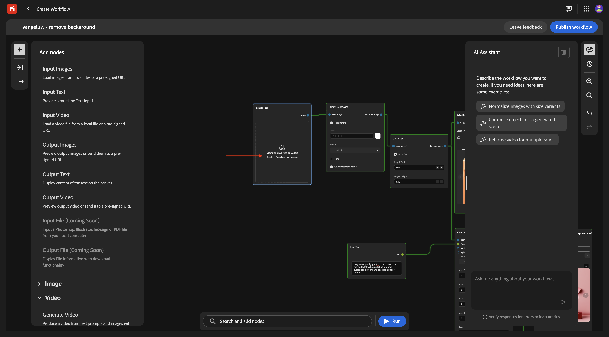

ダウンロードした3つの画像を選択します。 「**開く**」をクリックします。

そうすると、これが表示されます。 「**実行**」をクリックします。

数分後、3枚の画像と3本のビデオが生成され、同様の出力が表示されます。

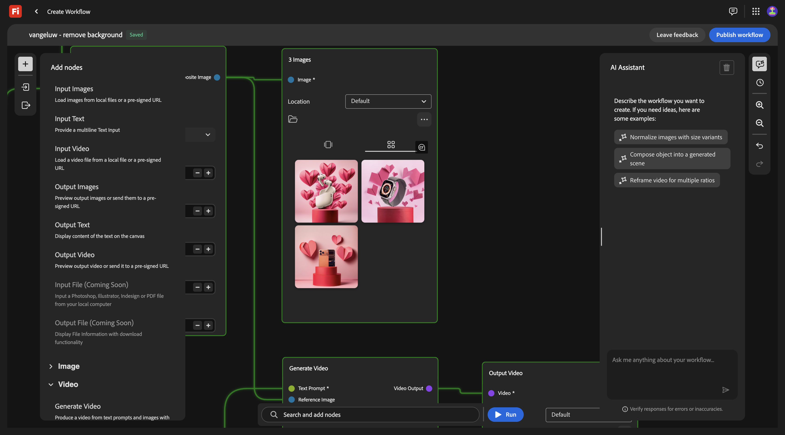

## AEM Assets CSの1.7.1.5 ストア

この演習では、AEM Assets CSのカスタムワークフローの一部として作成されたアセットを保存します。

まず、AEM Assets CS環境に新しいフォルダーを作成する必要があります。

これを行うには、[https://experience.adobe.com](https://experience.adobe.com)に移動します。 クリックして&#x200B;**Experience Manager Assets**&#x200B;を開きます。

`--aepUserLdap-- - CitiSignal AEM + ACCS`という名前のAEM Assets CS環境を選択します。

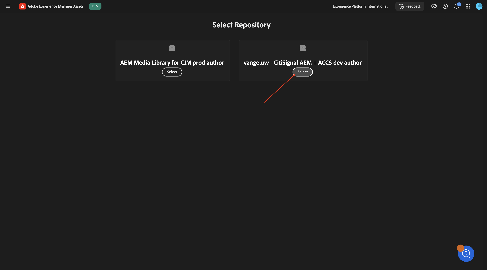

**Assets**&#x200B;に移動し、**フォルダーを作成**&#x200B;をクリックします。

名前を入力：`--aepUserLdap-- - Firefly Creative Production for Enterprise`。 「**作成**」をクリックします。

カスタムワークフローに戻り、**出力画像** ノードに移動します。 **Default**&#x200B;をクリックし、**AEM Assets**&#x200B;を選択します。

そうすると、このポップアップが表示されます。 AEM Assets CS リポジトリを選択し、作成したばかりのフォルダー（`--aepUserLdap-- - Firefly Creative Production for Enterprise`）を選択します。 「**選択**」をクリックします。

**Output Video** ノードに移動します。 **Default**&#x200B;をクリックし、**AEM Assets**&#x200B;を選択します。

そうすると、このポップアップが表示されます。 AEM Assets CS リポジトリを選択し、作成したばかりのフォルダー（`--aepUserLdap-- - Firefly Creative Production for Enterprise`）を選択します。 「**選択**」をクリックします。

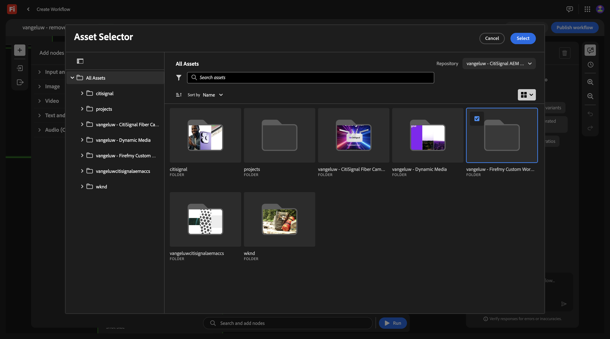

では、これを使ってください。 「**実行**」をクリックします。

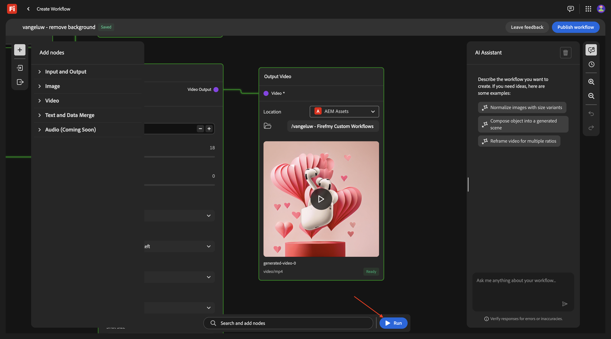

数分後、作成されたアセットがAEM Assets CSのフォルダーで使用可能になります。

ワークフローに戻ります。 「**公開**」をクリックします。

そうすると、これが表示されます。

これでワークフローが公開され、次の演習の一部としてプログラムで実行できるようになりました。

## 次の手順

[1.7.2 プログラムによるカスタムワークフローの実行](./ex2.md){target="_blank"}に移動

[Firefly Creative Production for Enterprise](./workflowbuilder.md){target="_blank"}に戻る

[すべてのモジュール ](./../../../overview.md){target="_blank"}に戻る
