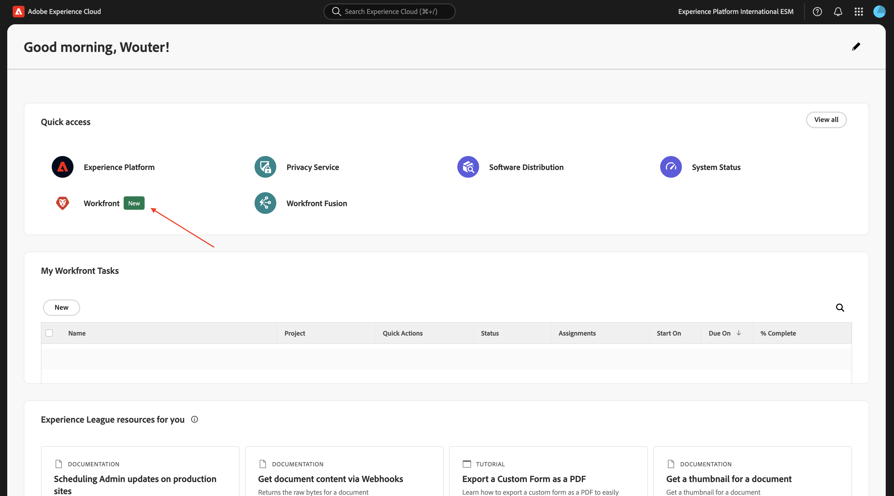
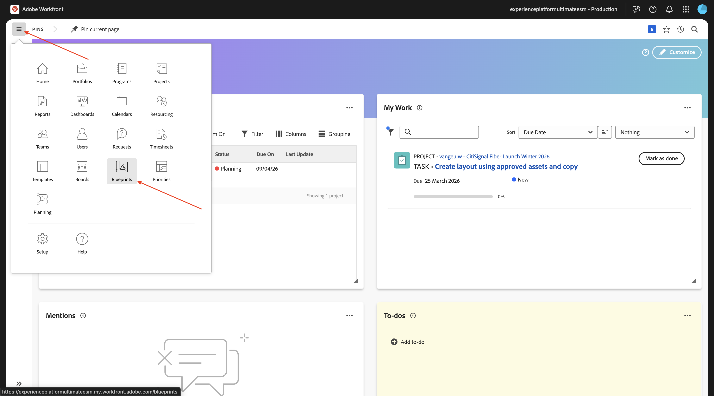
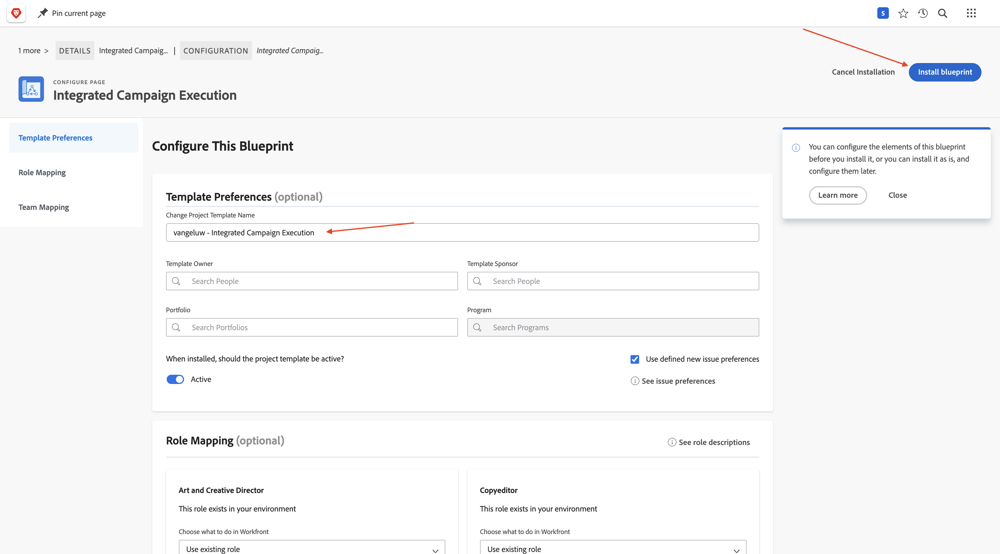
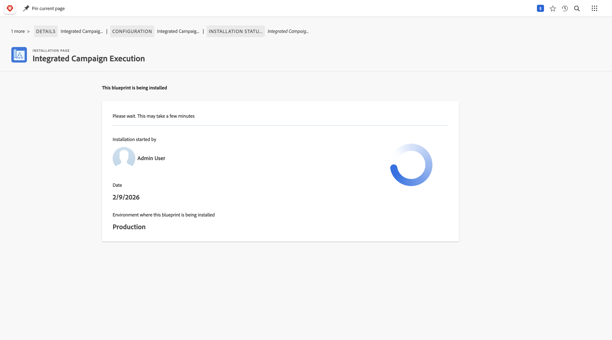
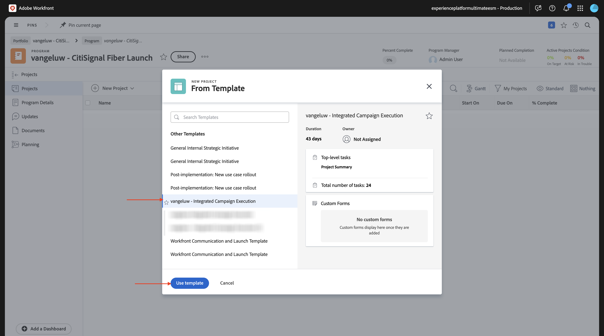
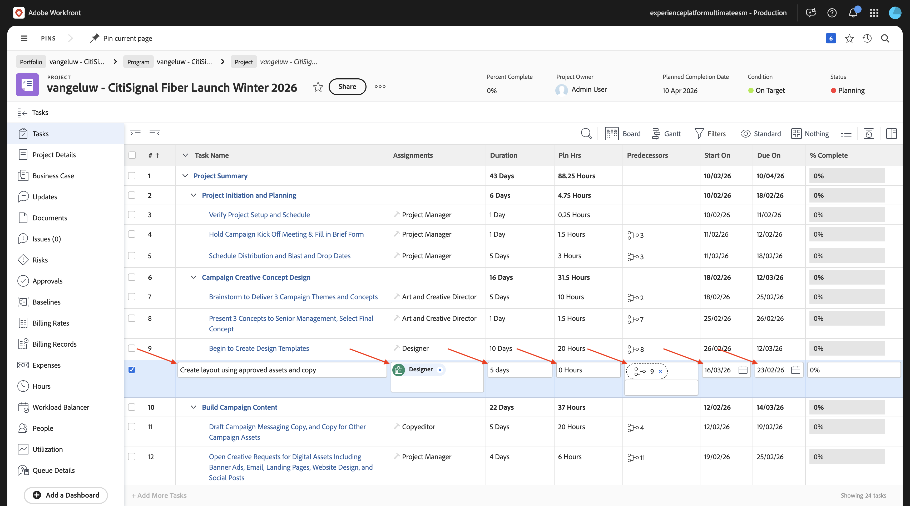
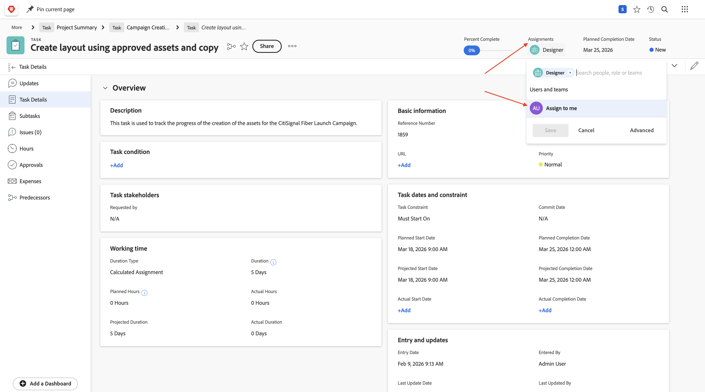
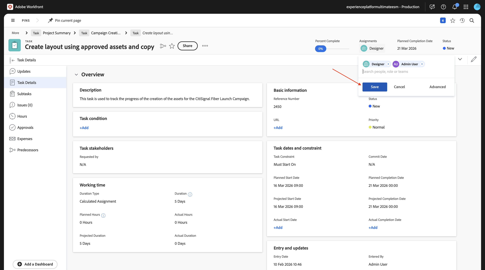
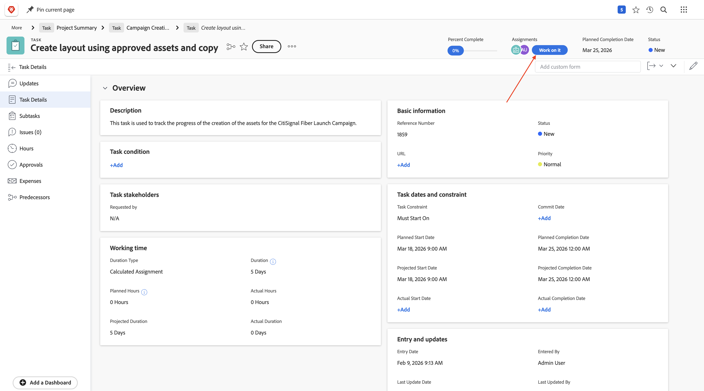

# 1.8.1 Workfront、Frame.io、および ESM の概要

## 1.8.1.1 Workfront Workflow の用語

Workfrontの主なオブジェクトと概念を次に示します。

| 名前 | 最終更新日 |
| ---------------------- | ------------ | 
| ポートフォリオ | 統一された特徴を持つプロジェクトのコレクション。 これらのプロジェクトは通常、同じリソース、予算、時間枠で競合します。 |
| プログラム | ポートフォリオ内のサブセット。明確に定義されたメリットを達成するために、類似のプロジェクトをグループ化できます。 |
| プロジェクト | 特定の期間内に完了する必要があり、特定の予算とリソース数を使用する必要がある大量の作業。 管理しやすくするために、プロジェクトを一連のタスクに分割します。 すべてのタスクを完了すると、プロジェクトは完了します。 |
| プロジェクト テンプレート | プロジェクトテンプレートを使用して、組織内のプロジェクトに関連する繰り返し可能なプロセス、情報、および設定のほとんどを取り込むことができます。 テンプレートを作成したら、既存のプロジェクトに添付したり、新しいプロジェクトを作成するために使用したりできます。 |
| タスク | 最終目標の達成（プロジェクトを完了）に向けた手順として実行する必要があるアクティビティです。 タスクは独立して存在することはできません。 これらは常にプロジェクトの一部です。 |
| 割り当て | イシューまたはタスクに割り当てられているユーザー、担当業務、チーム。 プロジェクト、ポートフォリオまたはプログラムには割り当てを含めることはできません。 |
| ドキュメント/バージョン | Workfront内のオブジェクトに添付されているファイル。 同じドキュメントが同じオブジェクトにアップロードされるたびに、バージョン番号が割り当てられます。 ユーザーは、以前のバージョンのドキュメントに対する複数のオプションを表示および変更できます。 |
| 承認 | タスク、ドキュメント、タイムシートなどの特定の作業項目に対して、その作業項目をスーパーバイザーまたは他のユーザーがサインオフする必要がある場合があります。 このサインオフのプロセスを承認と呼びます。 |

[https://experience.adobe.com/](https://experience.adobe.com/){target="_blank"} に移動します。 クリックして **Workfront** を開きます。

その後、これが表示されます。

## 1.8.1.2 Workfront ブループリントを有効にする

次の手順では、テンプレートを使用して新しいプロジェクトを作成します。 Adobe Workfrontには、アクティブ化するだけの使用可能なブループリントが多数用意されています。

CitiSignal のユースケースでは、ブループリント **統合されたキャンペーン実行** を使用する必要があります。

そのブループリントをインストールするには、メニューを開いて **ブループリント** を選択します。

フィルター **マーケティング** を選択し、下にスクロールしてブループリント **統合キャンペーン実行** を見つけます。 **インストール** をクリックします。

「**続行**」をクリックします。

**プロジェクトテンプレート名** を `--aepUserLdap-- - Integrated Campaign Execution` に変更します。

**ブループリントをインストール** をクリックします。

この画像が表示されます。 インストールには数分かかることがあります。

数分後、ブループリントがインストールされます。

## 新 1.8.1.3 いプロジェクトを作成するには

**メニュー** を開き、**Porftolios** に移動します。

「**+ New Portfolio**」をクリックします。

ポートフォリオ名 `--aepUserLdap-- - CitiSignal` を入力します。

**プログラム** に移動し、「**+新規プログラム**」をクリックします。 **新規プログラム** を選択します。

プログラム名を「`--aepUserLdap-- CitiSignal Fiber Launch`」と入力します。

プログラムで、「**プロジェクト**」に移動します。 「**+新規プロジェクト**」をクリックし、「**テンプレートから新規プロジェクト**」を選択します。

テンプレート `--aepUserLdap-- - Integrated Campaign Execution` を選択し、「**テンプレートを使用**」をクリックします。

この画像が表示されます。 名前を `--aepUserLdap-- - CitiSignal Fiber Launch Winter 2026` に変更し、「**プロジェクトを作成** をクリックします。

これで、プロジェクトが作成されました。 **プロジェクト詳細** に移動します。

**プロジェクト詳細** に移動します。 **説明** の下の現在のテキストをクリックして選択します。

説明を `The CitiSignal Fiber Launch project is used to plan the upcoming launch of CitiSignal Fiber.` に設定

「**変更を保存**」をクリックします。

これで、プロジェクトを使用する準備が整いました。

選択し、として設定したテンプレートに基づいて、プロジェクトのタスクと依存関係が作成されます。 プロジェクトの所有者。 プロジェクトのステータスが「**計画中** に設定されました。 リストで別の値を選択して、プロジェクトのステータスを変更できます。

## Frame.io の 1.8.1.4 プロジェクトビュー

[https://next.frame.io/](https://next.frame.io/){target="_blank"} に移動します。 ログインし、使用するインスタンス（この例では **Experience Platform International ESM**）を選択します。 先ほど作成したプロジェクトのフォルダーが Frame.io に既に存在することがわかります。 フォルダーの名前は、前に入力したプロジェクト名に従って付けられます。

これは、Workfrontや Frame.io などのAdobe エンタープライズ製品をまたいだアセットの中央リポジトリとして機能する、クラウドベースのストレージソリューションである Enterprise Storage Management の機能です。

Adobe エンタープライズストレージの主なメリットには、次のものがあります。

- クリエイティブおよび作業管理アセット向けの統合ストレージレイヤー
- 安全なアクセス制御を実現するために、Adobe Identity Management System （IMS）を使用して権限を一元化します
- Workfrontと Frame.io にわたるエンドツーエンドのアセットの可視化
- 企業のニーズに応える拡張性の高いストレージとクォータ管理

## 新規タスクを作成 1.8.1.5 るには

Workfrontに戻りなさい。 **タスク** に移動し、タスク **デザインテンプレートの作成を開始** にカーソルを合わせて、3 つのドット **...** をクリックします。

オプション **下にタスクを挿入** を選択します。

タスクの名前 `Create layout using approved assets and copy` を入力します。

フィールド **Assignments** をロール **Designer** に設定します。
フィールド **期間** を **5 日** に設定します。
フィールドの先行タスクを **9** に設定します。
**開始日** および **期限** フィールドに日付を入力します（このタスクの開始日は、前のタスクの終了日より後にスケジュールする必要があります）。

画面内の別の場所をクリックして、新しいタスクを保存します。

この画像が表示されます。 タスクをクリックして開きます。

**タスクの詳細** に移動し、フィールド **説明** を `This task is used to track the progress of the creation of the assets for the CitiSignal Fiber Launch Campaign.` に設定します。

「**変更を保存**」をクリックします。

この画像が表示されます。 「**割り当て**」フィールドをクリックし、「**自分に割り当て**」を選択します。

「**保存**」をクリックします。

**作業** をクリックします。

この画像が表示されます。

このタスクの一環として、新しいアセットを作成する必要があります。 次の手順では、最初にWorkfrontで参照画像を指定して、デザイナーが期待通りの結果を得られるようにします。 次に、Designerのロールに切り替え、Adobe Expressを使用して自分でアセットを作成します。

## 1.8.1.6 参照画像をアップロード

参照画像 [ こちら ](./assets/reference_images.zip) をデスクトップにダウンロードして解凍します。

Workfrontで **プロジェクト** レベルに移動します。

**ドキュメント** に移動し、「**+新規追加」をクリックし** 「**ドキュメント**」を選択します。

参照画像を含む、ダウンロードしたフォルダーに移動します。 すべての画像を選択し、「**開く** をクリックします。

数分後、すべての画像がアップロードされ、プロジェクトに添付されます。

参照画像を配置すると、デザイナーはこのキャンペーンの新しいアセットを作成できるようになります。

## 次の手順

次の手順：[ 新しいアセットを作成、レビュー、承認する ](./ex2.md){target="_blank"}

[Workfront、Frame.io、Enterprise Storage Management によるレビューと承認の統合 ](./esm.md){target="_blank"} に戻る

[ すべてのモジュール ](./../../../overview.md){target="_blank"} に戻る
