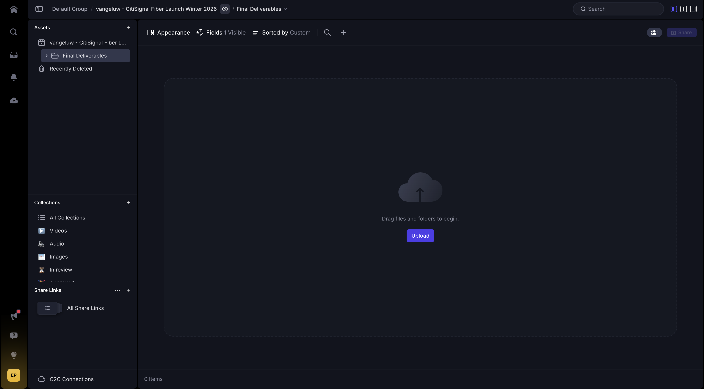
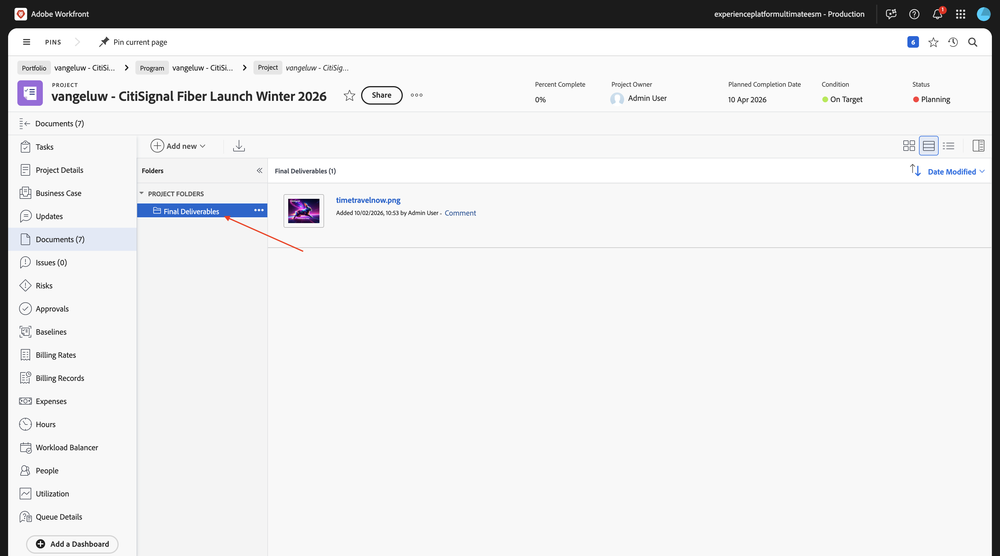
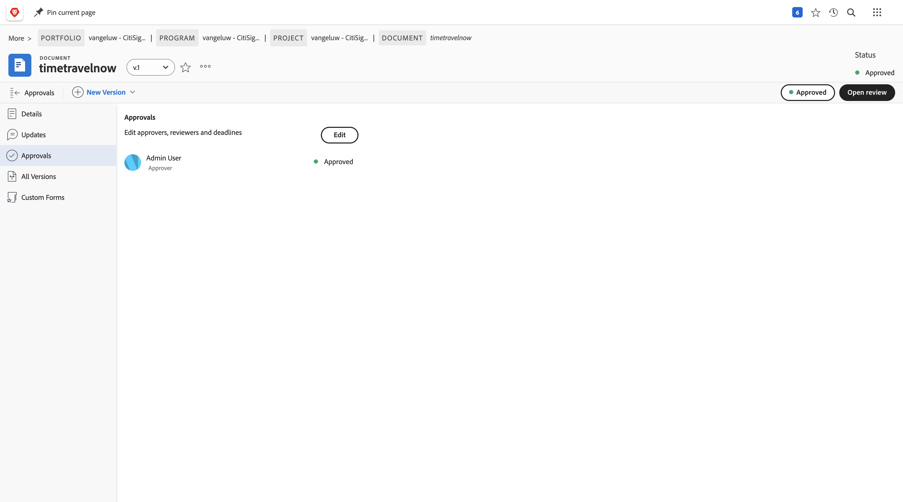

# 1.8.2 新しいアセットの作成、レビューおよび承認

## 1.8.2.1 Frame.io での参照画像の検証

[https://next.frame.io/](https://next.frame.io/){target="_blank"} に移動します。 クリックして、プロジェクトのフォルダーを開きます。

Workfrontで提供されたすべての参照画像が表示されます。 Designer は、安全な環境の下でWorkfrontにアップロードされたすべてのファイルに自動的にアクセスできるようになりました。

「**+**」をクリックし、「**新規フォルダー**」を選択します。

名前 `Final Deliverables` を入力して、**enter** キーを押します。 このフォルダーは、designerL で作成される最終ドキュメントをアップロードするために使用されます

## Adobe Firefly Services1.8.2.2Adobe Expressを使用した新規アセットの作成

>[!NOTE]
>
>新しいアセットを自分で作成したくない場合は、完成したバージョンをダウンロードできます [ こちら ](./images/timetravelnow.png)。

[https://firefly.adobe.com/](https://firefly.adobe.com/){target="_blank"} に移動します。 プロンプト `a neon rabbit running very fast through space` を入力し、「**生成**」をクリックします。

その後、複数の画像が生成されます。 最も気に入った画像を選択し、画像上の **共有** アイコンをクリックして、「**Adobe Expressで開く**」を選択します。

生成した画像がAdobe Expressで編集できるようになります。 次に、画像に CitiSignal ロゴを追加する必要があります。 それには、**Brands** に移動します。

CitiSignal ブランドテンプレートが表示されます。 GenStudio for Performance Marketingで作成されたものがAdobe Expressに表示されます。 名前に `CitiSignal` が含まれるブランドテンプレートをクリックして選択します。

**ロゴ** に移動し、**白** Citignal ロゴをクリックして画像にドロップします。

CitiSignal ロゴは、画像の中央からそれほど遠くない位置に配置します。

**テキスト** に移動します。

「**テキストを追加**」をクリックします。

テキスト `Timetravel now!` を入力し、フォントカラーとフォントサイズを変更し、テキストを **太字** に設定して、これに類似した画像が表示されるようにします。

次に、「**共有**」をクリックします。

「**...」をクリックします。すべて表示**.

下にスクロールして、「**ダウンロード**」を選択します。

**ダウンロード** をクリックします。

その後、ローカルマシンにアセットを作成します。

ファイルの名前を `timetravelnow.png` に変更します。

## 1.8.2.3 Frame.io でのアセットのレビュー

[https://next.frame.io/](https://next.frame.io/){target="_blank"} に戻り、プロジェクトのフォルダーを開きます。

**アップロード** をクリックします。

ファイル **timetravelnow.png** を選択し、「**開く**」をクリックします。

この画像が表示されます。

ステータスを **レビューが必要** に変更し、画像をダブルクリックして開きます。

環境でいずれかのレビュー担当者にタグを付け、`ready for your feedback on this one` のようなメッセージを追加します。

その後、レビュー担当者はコメントして、変更を加えたり、見た目がいいかどうかを確認したりできます。

## 1.8.2.4 Workfrontのアセットを参照してください

デザインチームは、作成中のアセットに対して反復作業を行いながら、Workfrontのプロジェクトマネージャーが作業中のアセットを追跡できます。 Workfrontに戻ります。 ページを更新します。

Frame.io で作成したフォルダーがWorkfrontに表示されます。 クリックして開きます。

この画像が表示されます。 ファイル **timetravelnow.png** の上にマウスポインターを置き、「**ドキュメントの詳細**」をクリックします。

プロジェクトマネージャーは、その画像の現在のバージョンを確認して、何が起こっているのか、これが積極的に取り組んでいるのかを知ることができるようになりました。

## 1.8.2.5 アセットを承認

Workfrontで、「承認 **に移動し** 「追加 **をクリックし** す。

承認者として自分自身を追加し、[**要求の送信**] をクリックします。

この画像が表示されます。 **レビューを開く** をクリックすると、Frame.io に移動します。

Frame.io では、すべてのコメントを表示し、アセットを確認できます。 クリックして、「**決定** フィールドを開きます。

**承認済み** を選択します。

Workfrontに戻り、ページを更新すると、ここのステータスも変更されていることがわかります。 アセットが承認され、配信や次のアクティベーションに使用できます。

## 次の手順

[Workfront、Frame.io、Enterprise Storage Management によるレビューと承認の統合 ](./esm.md){target="_blank"} に戻る

[ すべてのモジュール ](./../../../overview.md){target="_blank"} に戻る
