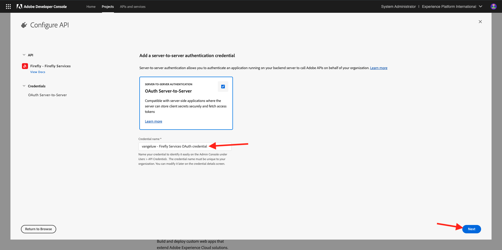
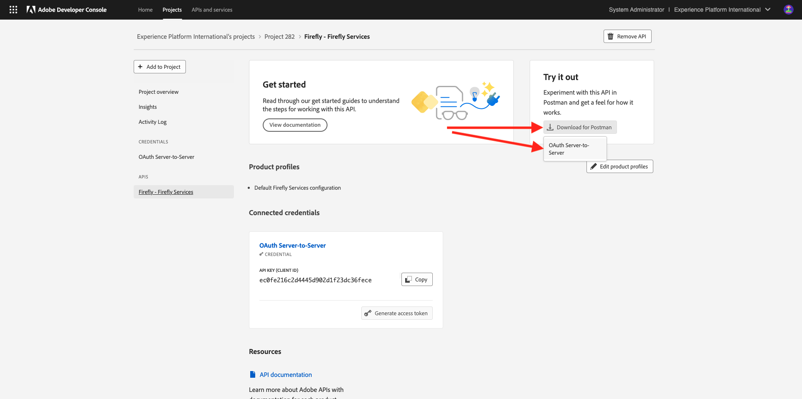

# 1.1.1 Fireflyサービスの概要

PostmanとAdobe I/Oを使用して、Adobe Fireflyサービス API をクエリする方法を説明します。

## 1.1.1.1Adobe I/Oプロジェクトの設定

この演習では、Adobe I/Oを使用して、Fireflyサービス API に対してクエリを実行します。 Adobe I/Oを設定するには、次の手順に従います。

1. [https://developer.adobe.com/console/home](https://developer.adobe.com/console/home){target="_blank"} に移動します。

{zoomable="yes"}

1. 画面の右上隅で正しいインスタンスを選択してください。 インスタンスは `--aepImsOrgName--` です。 次に、「**新規プロジェクトを作成**」を選択します。

{zoomable="yes"}

1. 「**+ プロジェクトに追加**」、「**API**」の順に選択します。

{zoomable="yes"}

画面は次のようになります。

{zoomable="yes"}

1. 「**Creative Cloud**」、「**Firefly - Fireflyサービス**」の順に選択して、「**次へ**」を選択します。

{zoomable="yes"}

1. 秘密鍵証明書の名前を指定し `--aepUserLdap-- - Firefly Services OAuth credential`**「次へ」** を選択します。

{zoomable="yes"}

1. デフォルトプロファイル **デフォルトのFireflyサービス設定** を選択してから、「**設定済み API を保存** を選択します。

{zoomable="yes"}

これで、Adobe I/Oの統合の準備が整いました。

{zoomable="yes"}

## 1.1.1.2 Postman環境のダウンロード

1. **Postman用にダウンロード** を選択してから、**OAuth サーバー間** を選択して、Postman環境をダウンロードします。

{zoomable="yes"}

1. プロジェクト名を選択します。

{zoomable="yes"}

1. **プロジェクトを編集** を選択します。

{zoomable="yes"}

1. 統合のわかりやすい名前 `--aepUserLdap-- Firefly` を入力し、「**保存**」を選択します。

{zoomable="yes"}

これで、Adobe I/O統合の設定が完了しました。

{zoomable="yes"}

## 1.1.1.3 Adobe I/OへのPostman認証

>[!IMPORTANT]
>
>Adobe社員の方は、こちらの説明に従って [PostBuster](./../../../postbuster.md) を使用してください。

1. [Postman Downloads](https://www.postman.com/downloads/){target="_blank"} で、OS に関連するバージョンのPostmanをダウンロードしてインストールします。

{zoomable="yes"}

1. アプリケーションを起動します。

Postmanには、環境とコレクションという 2 つのコンセプトがあります。

- 環境ファイルには、多かれ少なかれ一貫性のあるすべての環境変数が含まれています。 環境には、クライアント ID などのセキュリティ認証情報と共に、Adobe環境の IMSOrg などが表示されます。 以前、Adobe I/Oのセットアップ中に環境ファイルをダウンロードしましたが、名前は **`oauth_server_to_server.postman_environment.json`** です。

- コレクションには、使用可能な多数の API リクエストが含まれています。 2 つのコレクションを使用します
   - Adobe I/Oへの認証のための 1 つのコレクション
   - このモジュールの演習の 1 つのコレクション

1. [postman-ff.zip](./../../../assets/postman/postman-ff.zip) をローカルデスクトップにダウンロードします。

{zoomable="yes"}

**postman.zip** ファイルには次のファイルがあります。

    - &#39;Adobe IO - OAuth.postman_collection.json&#39;
    - &#39;FF - Fireflyサービステクニカルインサイダー.postman_collection.json&#39;

1. **postman-ff.zip** を解凍し、次の 2 つのファイルをデスクトップ上のフォルダーに保存します。
- Adobe IO - OAuth.postman_collection.json
- FF - Fireflyサービステクニカルインサイダー.postman_collection.json
- oauth_server_to_server.postman_environment.json

{zoomable="yes"}

1. Postmanで、「**読み込み**」を選択します。

{zoomable="yes"}

1. **ファイル** を選択します。

{zoomable="yes"}

1. フォルダーから 3 つのファイルを選択し、「**開く**」および「**読み込み** を選択します。

{zoomable="yes"}

{zoomable="yes"}

API を使用してFireflyサービスとの対話を開始するためにPostmanで必要なものがすべて揃っているわけではありません。

## 1.1.1.4 アクセストークンをリクエストする

次に、正しく認証されていることを確認するには、アクセストークンをリクエストする必要があります。

1. 右上隅の「環境」ドロップダウンリストを確認して、リクエストを実行する前に適切な環境が選択されていることを確認します。 選択した環境の名前は、`--aepUserLdap-- Firefly Services OAuth Credential` のようになります。

{zoomable="yes"}

選択した環境の名前は、`--aepUserLdap-- Firefly Services OAuth Credential` のようになります。

{zoomable="yes"}

これで、Postman環境とコレクションが設定され、機能するようになったので、PostmanからAdobe I/Oを行うことができます。

1. **Adobe I/O - OAuth** コレクションで、**POST- アクセストークンの取得** という名前のリクエストを選択して、「**送信**」を選択します。

**クエリパラメーター** の下で、`API_KEY` と `CLIENT_SECRET` の 2 つの変数が参照されていることに注意してください。 これらの変数は、選択した環境 `--aepUserLdap-- Firefly Services OAuth Credential` から取得されます。

{zoomable="yes"}

成功した場合、ベアラートークン、アクセストークンおよび有効期限を含む応答がPostmanの **本文** セクションに表示されます。

{zoomable="yes"}

次の情報を含む同様の応答が表示されます。

| キー | 値 |
|:-------------:| :---------------:| 
| token_type | **ベアラー** |
| access_token | **eyJhbGciOiJSU...** |
| expires_in | **86399** |

Adobe I/O **bearer-token** には、特定の値（非常に長い access_token）と有効期限があり、24 時間有効になりました。 つまり、24 時間後にPostmanを使用してAdobe I/Oへの認証を行う場合は、このリクエストを再度実行して新しいトークンを生成する必要があります。

## 1.1.1.5 Fireflyサービス API、テキスト 2 画像

これで、最初のリクエストをFireflyサービス API に送信する準備が整いました。

1. **FF - Fireflyサービスのテクニカル インサイダー** コレクションから **POST- Firefly - T2I V3** という名前のリクエストを選択します。

{zoomable="yes"}

1. 応答から画像 URL をコピーし、web ブラウザーで開いて画像を表示します。

{zoomable="yes"}

`horses in a field` を描いた美しい画像が表示されます。

{zoomable="yes"}

次の演習に進む前に、API リクエストをいろいろと試してください。

## 次の手順

[Microsoft Azure と事前署名済み URL を使用したFireflyプロセスの最適化 ](./ex2.md){target="_blank"} に移動します

[Adobe Fireflyサービスの概要 ](./firefly-services.md){target="_blank"} に戻る

[ すべてのモジュール ](./../../../overview.md){target="_blank"} に戻る
