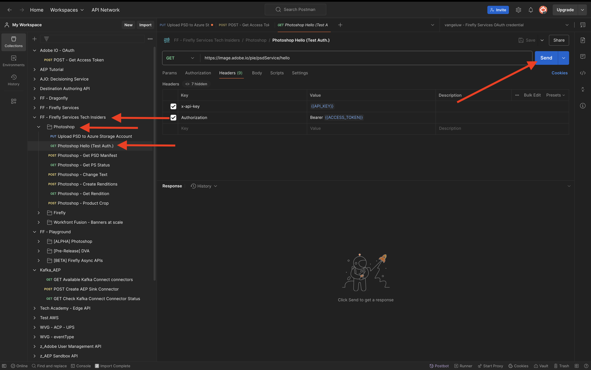
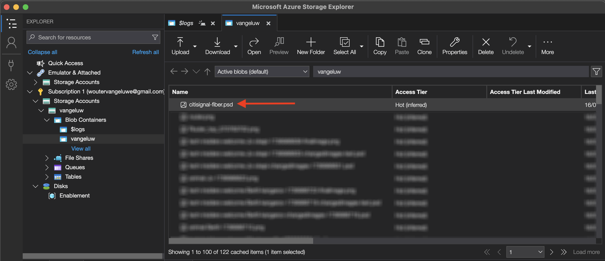
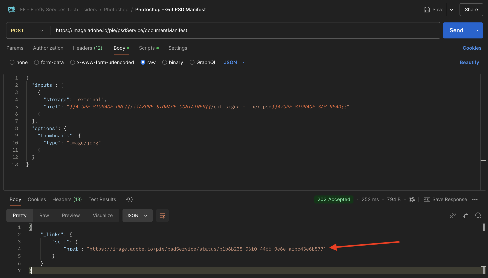
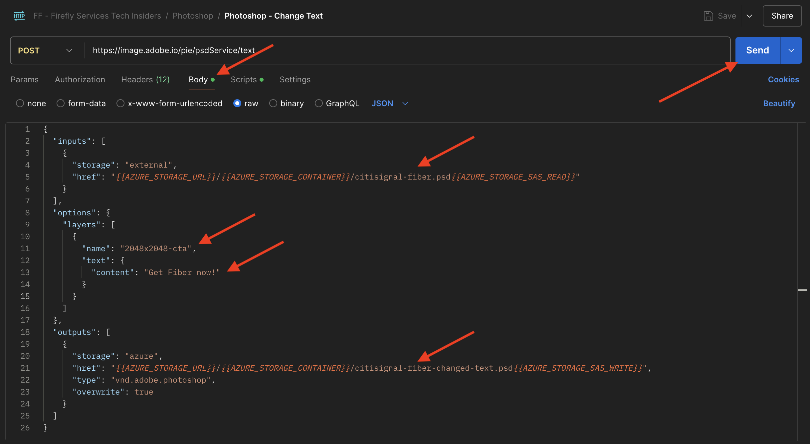

# 1.1.3 Photoshop API の操作

## 1.1.3.1 Adobe I/O統合の更新

[https://developer.adobe.com/console/home](https://developer.adobe.com/console/home) に移動します。


**プロジェクト** に移動し、をクリックして、前の演習で作成したプロジェクト（`--aepUserLdap-- Firefly`）を開きます。


「**+ プロジェクトに追加」をクリックし** 「**API**」をクリックします。


「**Creative Cloud**」を選択し、「**Photoshop - Fireflyサービス**」をクリックします。 「**次へ**」をクリックします。


「**次へ**」をクリックします。


次に、この統合で使用できる権限を定義する製品プロファイルを選択する必要があります。

プロファイル **デフォルトのFireflyサービス設定** および **デフォルトのCreative Cloud自動化サービス設定** を選択します。

**設定済み API を保存** をクリックします。


これで、Adobe I/Oプロジェクトが、Photoshop API とFireflyサービス API を使用するように更新されました。


## 1.1.3.2PSDファイルをプログラムで操作する

ファイルをダウンロード デスクトップに [citisignal-fiber.psd](./../../../assets/ff/citisignal-fiber.psd) に移動します。

Photoshopでファイル **citisignal-fiber.psd** を開きます。 これで完了です。


**レイヤー** パネルでは、ファイルのデザイナーが各レイヤーに一意の名前を付けていることがわかります。 レイヤー情報は、PhotoshopでPSDファイルを開くことで表示できますが、プログラムで開くこともできます。

最初の API リクエストをPhotoshop API に送信しましょう。

Postmanに行きなさい。 API リクエストをPhotoshopに送信する前に、Adobe I/Oへの認証が必要です。以前に **POST - アクセストークンの取得** という名前で使用したリクエストを開きます。

**Params** に移動し、パラメーター **Scope** が正しく設定されていることを確認します。 **範囲** の **値** は次のようになります。

`openid,session,AdobeID,read_organizations,additional_info.projectedProductContext, ff_apis, firefly_api`

次に、「**送信**」をクリックします。


その後、Photoshop API とやり取りするための有効なアクセストークンが得られます。


### 1.1.3.2.1 Photoshop API - Hello World

次に、Photoshop API のみなさん、すべての権限とアクセス権が正しく設定されているかどうかをテストしましょう。 コレクション **Photoshop** で、**Photoshop Hello （テスト認証）という名前のリクエストを開きます。**。「**送信**」をクリックします。



すると、「Photoshop API へようこそ **という応答が返** されます。


次に、PSDファイル **citisignal-fiber.psd** をプログラムで操作するには、それをストレージアカウントにアップロードする必要があります。 Azure ストレージエクスプローラーを使用してコンテナに手動でドラッグ&amp;ドロップすることもできますが、今回は API を通じて行う必要があります。

### 1.1.3.2.2 Azure へのPSDのアップロード

Postmanで、リクエスト **Azure ストレージアカウントへのPSDのアップロード** を開きます。 前の演習では、Postmanでこれらの環境変数を設定しました。ここでは、これを使用します。

- `AZURE_STORAGE_URL`
- `AZURE_STORAGE_CONTAINER`
- `AZURE_STORAGE_SAS_READ`
- `AZURE_STORAGE_SAS_WRITE`

リクエスト **Azure ストレージアカウントへのPSDのアップロード** に示すように、URL はこれらの変数を使用するように設定されています。


**Body** に、ファイル **citisignal-fiber.psd** を追加して選択する必要があります。


これで完了です。 「**送信**」をクリックします。


その後、この空の応答を Azure から返す必要があります。つまり、ファイルは Azure ストレージアカウントのコンテナに保存されます。


Azure ストレージエクスプローラーを使用して確認すると、フォルダーを更新した後にファイルが表示されます。



### 1.1.3.2.3 Photoshop API - マニフェストの取得

次に、PSDファイルのマニフェストファイルを取得する必要があります。 Postmanで、リクエスト **Photoshop -PSDマニフェストの取得** を開きます。 **本文** に移動します。

本文は次のようになります。

```json
{
  "inputs": [
    {
      "storage": "external",
      "href": "{{AZURE_STORAGE_URL}}/{{AZURE_STORAGE_CONTAINER}}/citisignal-fiber.psd{{AZURE_STORAGE_SAS_READ}}"
    }
  ],
  "options": {
    "thumbnails": {
      "type": "image/jpeg"
    }
  }
}
```

「**送信**」をクリックします。

応答に、リンクが表示されます。 Photoshopの操作は完了までに時間がかかる場合があるので、Photoshopでは、ほとんどの受信リクエストに対する応答としてステータスファイルを提供します。 リクエストに何が起こっているかを理解するには、ステータスファイルを読む必要があります。



ステータスファイルを読み取るには、リクエスト **Photoshop - PS ステータスの取得** を開きます。 次に、このリクエストが URL として変数を使用していることがわかります。この変数は、送信した前のリクエスト（**Photoshop -PSDマニフェストの取得** によって設定された変数です。 変数は、各リクエストの **スクリプト** で設定されます。

「**送信**」をクリックします。


この画像が表示されます。 現在、ステータスは **保留中** に設定されています。これは、プロセスがまだ完了していないことを意味します。


ステータスが「**成功**」に変わるまで、「**Photoshop - PS ステータスの取得**」リクエストで「送信」をもう 2、3 回クリックできます。 これには数分かかることがあります。

レスポンスが使用可能な場合、PSDファイルのすべてのレイヤーの情報を含む JSON ファイルが生成されます。 レイヤー名やレイヤー ID などが表示されるので、便利な情報です。


例えば、`2048x2048-cta` というテキストを検索します。 この画像が表示されます。


### 1.1.3.2.4 Photoshop API - テキストの変更

次に、API を使用してコールトゥアクションのテキストを変更する必要があります。 Postmanで、リクエスト **Photoshop - Change Text を開き****Body** に移動します。

この画像が表示されます。 次のことがわかります。

- まず、入力ファイルを指定します。`citisignal-fiber.psd`
- 次に、変更するレイヤーを指定し、テキストを変更します。
- 3 番目に、出力ファイルを指定します。`citisignal-fiber-changed-text.psd`

```json
{
  "inputs": [
    {
      "storage": "external",
      "href": "{{AZURE_STORAGE_URL}}/{{AZURE_STORAGE_CONTAINER}}/citisignal-fiber.psd{{AZURE_STORAGE_SAS_READ}}"
    }
  ],
  "options": {
    "layers": [
      {
        "name": "2048x2048-cta",
        "text": {
          "content": "Get Fiber now!"
        }
      }
    ]
  },
  "outputs": [
    {
      "storage": "azure",
      "href": "{{AZURE_STORAGE_URL}}/{{AZURE_STORAGE_CONTAINER}}/citisignal-fiber-changed-text.psd{{AZURE_STORAGE_SAS_WRITE}}",
      "type": "vnd.adobe.photoshop",
      "overwrite": true
    }
  ]
}
```

元の入力ファイルを上書きしないので、出力ファイルの名前は異なります。

「**送信**」をクリックします。



前と同じように、応答には、進行状況を追跡するステータスファイルを指すリンクが含まれています。


ステータスファイルを読み取るには、リクエスト **Photoshop - PS ステータスの取得** を再度開き、「**送信**」をクリックします。 ステータスが **成功** に設定されていない場合は、数秒待ってから、もう一度 **送信** をクリックします。

ステータスが **succeeded** に設定されると、これが表示されます。 パス `outputs[0]._links.renditions[0].href` には、Photoshopによって作成され、変更されたテキストを含む出力ファイルの URL が表示されます。

出力ファイルをダウンロードする URL をクリックします。


その後、ファイル **citisignal-fiber-changed-text.psd** がコンピューターにダウンロードされ、その後、開くことができます。 コールトゥアクションのプレースホルダーが、「Get Fiber now **というテキストに置き換えられたことがわかります**。


最後に、Azure ストレージエクスプローラーを使用して、コンテナ内にそのファイルも表示されます。


これで、この演習が完了しました。

次の手順：[1.1.4 Fireflyのカスタムモデル ](./ex4.md)

[モジュール 1.1 に戻る](./firefly-services.md)

[すべてのモジュールに戻る](./../../../overview.md)
