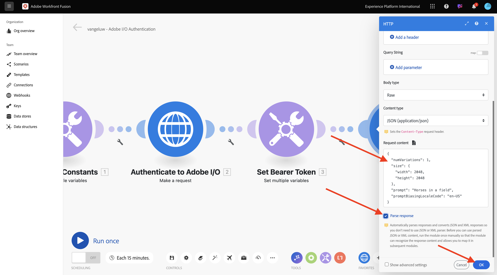
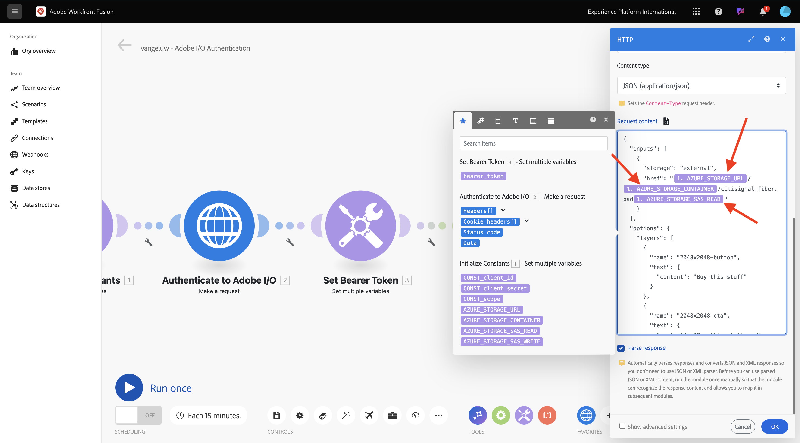
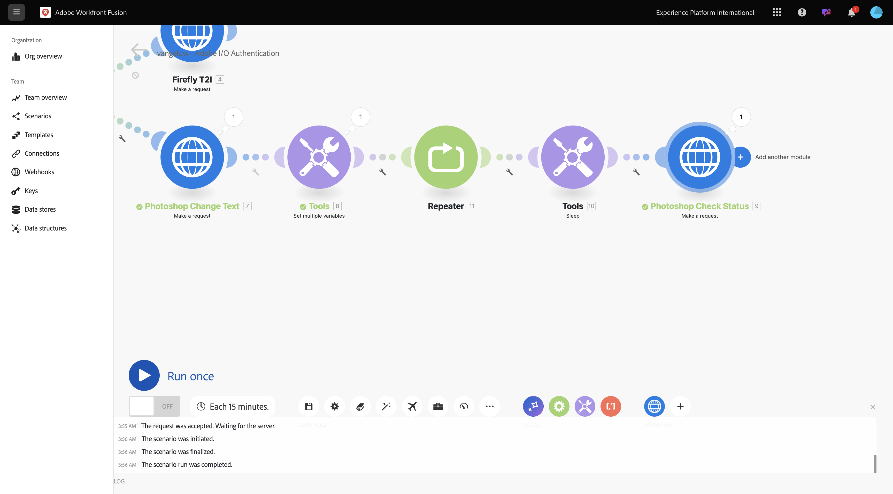
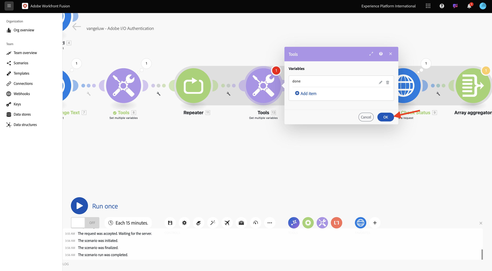
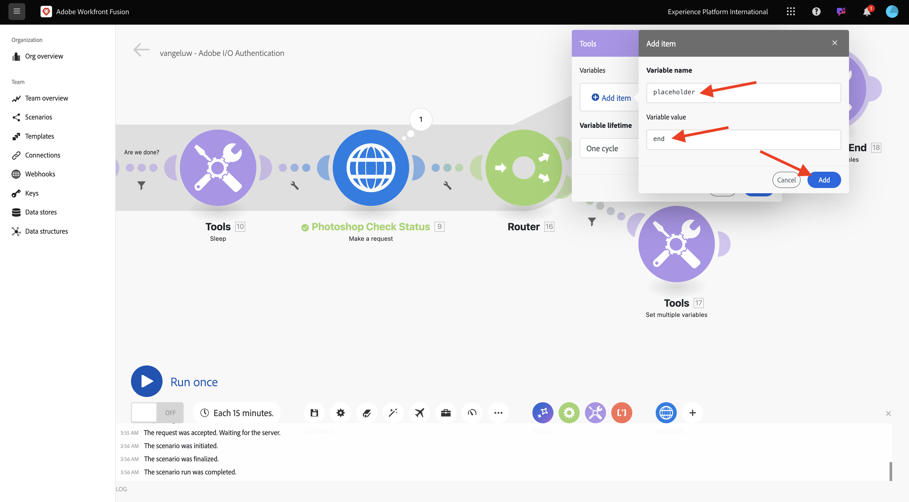

# 1.2.2 Workfront Fusion 内でのAdobeAPI の使用

## 1.2.2.1 Fireflyテキストを使用してWorkfront Fusion で API を画像に変換する

2 つ目の **複数の変数を設定** ノードにマウスポインターを置き、「**+**」をクリックして別のモジュールを追加します。


**http** を検索し、**HTTP** を選択します。


「**リクエストを行う**」を選択します。


次の変数を選択します。

- **URL**: `https://firefly-api.adobe.io/v3/images/generate`
- **メソッド**: `POST`

**ヘッダーを追加** をクリックします。


次のヘッダーを入力する必要があります。

| キー | 値 |
|:-------------:| :---------------:| 
| `x-api-key` | `CONST_client_id` 用に保存した変数 |
| `Authorization` | `Bearer ` + `bearer_token` 用に保存した変数 |
| `Content-Type` | `application/json` |
| `Accept` | `*/*` |

`x-api-key` の詳細を入力します。 「**追加**」をクリックします。


**ヘッダーを追加** をクリックします。


`Authorization` の詳細を入力します。 「**追加**」をクリックします。


**ヘッダーを追加** をクリックします。 `Content-Type` の詳細を入力します。 「**追加**」をクリックします。


**ヘッダーを追加** をクリックします。 `Accept` の詳細を入力します。 「**追加**」をクリックします。


**Body type** を **Raw** に設定します。 「**コンテンツタイプ**」には、「**JSON （application/json）**」を選択します。


このペイロードを「**コンテンツをリクエスト** フィールドに貼り付けます。

```json
{
  "numVariations": 1,
  "size": {
    "width": 2048,
    "height": 2048
  },
  "prompt": "Horses in a field",
  "promptBiasingLocaleCode": "en-US"
}
```

**応答を解析** のチェックボックスをオンにします。 「**OK**」をクリックします。



**1 回実行** をクリックします。


シナリオが実行されると、次の画面が表示されます。


**をクリックする4 番目** ノードの HTTP 上にアイコンがあり、応答を確認できます。 応答に画像ファイルが表示されます。


画像 URL をコピーし、ブラウザーウィンドウで開きます。 次のようなメッセージが表示されます。


**HTTP** オブジェクトを右クリックし、名前を **FireflyT2I** に変更します。


「**保存**」をクリックして変更を保存します。


## 1.2.2.2 Workfront Fusion でのPhotoshop API の使用

**ベアラートークンを設定** ノードと **4}FireflyT2I} の間にある** レンチ **アイコンをクリックします。****ルーターを追加** を選択します。


**FireflyT2I** オブジェクトを右クリックし、「**クローン**」を選択します。


複製されたオブジェクトを **Router** オブジェクトの近くにドラッグ&amp;ドロップすると、**Router** に自動接続されます。 これで完了です。


これで、**Firefly T2I** HTTP リクエストに基づいて、同一のコピーが作成されます。 **Firefly T2I** HTTP リクエストの一部の設定は、時間を節約する **Photoshop API** とのやり取りに必要なものと似ています。 ここで変更する必要があるのは、リクエスト URL やペイロードなど、同じではない変数のみです。

**URL** を `https://image.adobe.io/pie/psdService/text` に変更します。


**コンテンツをリクエスト** を以下のペイロードに置き換えます。

```json
{
  "inputs": [
    {
      "storage": "external",
      "href": "{{AZURE_STORAGE_URL}}/{{AZURE_STORAGE_CONTAINER}}/sevoi-psd.psd{{AZURE_STORAGE_SAS_READ}}"
    }
  ],
  "options": {
    "layers": [
      {
        "name": "2048x2048-button",
        "text": {
          "content": "Click here"
        }
      },
      {
        "name": "2048x2048-cta",
        "text": {
          "content": "Buy this stuff"
        }
      }
    ]
  },
  "outputs": [
    {
      "storage": "azure",
      "href": "{{AZURE_STORAGE_URL}}/{{AZURE_STORAGE_CONTAINER}}/sevoi-psd-changed-text.psd{{AZURE_STORAGE_SAS_WRITE}}",
      "type": "vnd.adobe.photoshop",
      "overwrite": true
    }
  ]
}
```


この **リクエストコンテンツ** が正しく機能するには、いくつかの変数が欠落しています。

- `AZURE_STORAGE_URL`
- `AZURE_STORAGE_CONTAINER`
- `AZURE_STORAGE_SAS_READ`
- `AZURE_STORAGE_SAS_WRITE`

最初のノードに戻り、「**定数の初期化**」をクリックし、これらの変数ごとに **項目を追加** を選択します。


| キー | 値の例 |
|:-------------:| :---------------:| 
| `AZURE_STORAGE_URL` | `https://vangeluw.blob.core.windows.net` |
| `AZURE_STORAGE_CONTAINER` | `vangeluw` |
| `AZURE_STORAGE_SAS_READ` | `?sv=2023-01-03&st=2025-01-13T07%3A36%3A35Z&se=2026-01-14T07%3A36%3A00Z&sr=c&sp=rl&sig=4r%2FcSJLlt%2BSt9HdFdN0VzWURxRK6UqhB8TEvbWkmAag%3D` |
| `AZURE_STORAGE_SAS_WRITE` | `?sv=2023-01-03&st=2025-01-13T17%3A21%3A09Z&se=2025-01-14T17%3A21%3A09Z&sr=c&sp=racwl&sig=FD4m0YyyqUj%2B5T8YyTFJDi55RiTDC9xKtLTgW0CShps%3D` |

変数を見つけるには、Postmanに戻って **環境変数** を開きます。


これらの値をWorkfront Fusion にコピーし、これら 4 つの変数のそれぞれに新しい項目を追加します。

これで完了です。 「**OK**」をクリックします。


次に、複製された HTTP リクエストに戻って、**リクエストコンテンツ** を更新します。 **リクエストコンテンツ** のこれらの黒い変数に気づくでしょう。これは、Postmanからコピーした変数です。 次に、これらをWorkfront Fusion で定義したばかりの変数に変更する必要があります。 各変数を 1 つずつ置き換えます。黒いテキストを削除して、正しい変数に置き換えます。


**inputs** セクションには 3 つの変更があります。



**output** セクションには 3 つの変更もあります。 「**OK**」をクリックします。


クローン作成されたノードを右クリックし、「**名前を変更**」を選択します。 名前を **Photoshop テキストを変更** に変更します。


これで完了です。


**1 回実行** をクリックします。


**2}Photoshop Change Text** ノードの「**検索 } アイコンをクリックして、応答を確認します。**&#x200B;ステータスファイルへのリンクを含む、次のような応答が得られます。


Photoshop API のインタラクションを続ける前に、**エンドポイント T2I** へのルートを無効にして、その API Fireflyに不要な API 呼び出しを送信しないようにします。 **レンチ** アイコンをクリックし、「**ルートを無効にする**」を選択します。


これで完了です。


次に、別の **複数の変数を設定** ノードを追加します。


**Photoshop Change Text** ノードの後ろに配置します。


**複数の変数を設定** ノードをクリックし、「**項目を追加**」を選択します。 前のリクエストの応答から変数値を選択します。

| 変数名 | 変数値 |
|:-------------:| :---------------:| 
| `psdStatusUrl` | `data > _links > self > href` |

「**追加**」をクリックします。


「**OK**」をクリックします。


**Photoshop Change Text** ノードを右クリックし、「**クローン**」を選択します。


作成した **複数の変数を設定** ノードの後に、複製した HTTP リクエストをドラッグします。


HTTP リクエストのクローンを右クリックして、「**名前を変更**」を選択し、名前を「**Photoshopステータスを確認**」に変更します。


クリックして HTTP リクエストを開きます。 前の手順で作成した変数を参照するように URL を変更し、**メソッド** を **GET** に設定します。


空のオプションを選択して **本文** を削除します。


「**OK**」をクリックします。


**1 回実行** をクリックします。


すると、フィールド **status** を含んだ応答が取得され、ステータスが **running** に設定されます。 Photoshopがプロセスを完了するまで数秒かかります。


これで、応答を完了するためにもう少し時間が必要がわかったので、すぐには実行されないように、この HTTP リクエストの前にタイマーを追加することをお勧めします。

**ツール** ノードをクリックし、「**スリープ**」を選択します。


**Set multiple variables** と **Photoshopチェックステータス** の間に **Sleep** ノードを配置します。 「**遅延**」を **5** 秒に設定します。 「**OK**」をクリックします。


これで完了です。 以下の設定の課題は、5 秒間の待機で十分な場合があるものの、十分ではない可能性があることです。 実際には、ステータスが **成功** になるまで、5 秒ごとにステータスを確認する do...while ループのような、よりインテリジェントなソリューションを使用することをお勧めします。 次の手順で、このような戦術を実装します。


**複数の変数を設定** と **スリープ** の間にある **レンチ** アイコンをクリックします。 「**モジュールを追加**」を選択します。


`flow` を検索し、「**フロー制御**」を選択します。


**リピーター** を選択します。


「**繰り返し**」を **20** に設定します。 「**OK**」をクリックします。


次に、**Photoshopのステータスの確認** で **+** をクリックして、別のモジュールを追加します。



**フロー** を検索し、「**フロー制御**」を選択します。


「**配列アグリゲータ**」を選択します。


**Source モジュール** を **リピーター** に設定します。 **OK** をクリックします。


すると、次のようになります。


**レンチ** アイコンをクリックし、「**モジュールを追加**」を選択します。


**ツール** を検索して **ツール** を選択します。


**複数の変数を取得** を選択します。


「**+項目を追加**」をクリックして、「**変数名**」を `done` に設定します。


「**OK**」をクリックします。



前に設定した **複数の変数を設定** ノードをクリックします。 変数 **done** を初期化するには、ここで `false` に設定する必要があります。 「**+項目を追加**」をクリックします。


**変数名** には、`done` を使用します。 ステータスを設定するには、ブール値が必要です。 ブール値を見つけるには、「**歯車**」アイコンをクリックし、「`false`」を選択します。 「**追加**」をクリックします。


「**OK**」をクリックします。


次に、設定した **複数の変数を取得** ノードの後にある **レンチ** アイコンをクリックします。


**フィルターを設定** を選択します。 ここで、変数 **done** の値を確認する必要があります。 この値を **false** に設定した場合は、ループの次の部分を実行する必要があります。 値が **true** に設定されている場合は、プロセスが既に正常に完了しているので、ループの次の部分を続行する必要はありません。


ラベルには、「完了しました **を使用します。**。既存の変数 **done** を使用して **条件** を設定し、演算子を **Equal to** に設定し、値をブール変数 `false` にする必要があります。 「**OK**」をクリックします。


次に、ノード **Photoshopのステータスの確認** と **配列アグリゲータ** の間にスペースを作ります。 次に、「**レンチ**」アイコンをクリックし、「**ルーターを追加**」を選択します。 これは、Photoshop ファイルのステータスを確認した後は 2 つのパスが存在する必要があるためです。 ステータスが `succeeded` の場合は、**done** の変数を `true` に設定する必要があります。 ステータスが `succeeded` に等しくない場合、ループは続行されます。 ルータはこれを確認して設定することを可能にします。


ルーターを追加したら、**レンチ** アイコンをクリックし、「**フィルターを設定**」を選択します。


ラベルには、**完了** を使用します。 **2}Photoshopチェックステータス** ノードからの応答を使用して **条件を設定します。応答フィールド** data.outputs[].status **を選択し、演算子は** 次と等しい **に、値は `succeeded` にする必要があります。**「**OK**」をクリックします。


次に、疑問符の付いた空のノードをクリックし、**tools** を検索します。 次に、「**ツール**」を選択します。


「**複数の変数を設定**」を選択します。


ルーターのこのブランチを使用すると、Photoshop ファイルの作成ステータスが正常に完了したことになります。 つまり、do...while ループでPhotoshopのステータスを引き続き確認する必要がなくなったので、変数 `done` を `true` に設定する必要があります。

**変数名** には、`done` を使用します。 **変数値** には、ブール値 `true` を使用する必要があります。 **歯車** アイコンをクリックし、「`true`」を選択します。 「**追加**」をクリックします。


「**OK**」をクリックします。


次に、作成した **複数の変数を設定** ノードを右クリックし、「**クローン**」を選択します。


クローンノードをドラッグして、**配列アグリゲータ** に接続します。 次に、ノードを右クリックして「**名前を変更**」を選択し、名前を `Placeholder End` に変更します。


既存の変数を削除し、「**+項目を追加**」をクリックします。 **変数名** には `placeholder` を使用し、**変数値** には `end` を使用します。 **追加** をクリックしてから、**OK** をクリックします。



「**保存**」をクリックして、シナリオを保存します。 次に、「**1 回実行** をクリックします。


その後、シナリオが実行され、正常に終了します。 設定した do...while ループが正常に動作していることがわかります。 以下の実行では、**ツール/複数の変数を取得** ノードのバブルに基づいて **リピーター** が 20 回実行されたことがわかります。 そのノードの後、ステータスをチェックするフィルターを設定し、ステータスが **成功** でない場合にのみ、次のノードが実行されました。 この実行では、ステータスが最初の実行で既に **成功** しているので、フィルター後の部分は 1 回だけ実行されました。


新しいPhotoshop ファイルの作成ステータスを確認するには、**Photoshop ステータスの確認** HTTP リクエストのバブルをクリックし、「**ステータス** フィールドにドリルダウンします。


これで、いくつかの手順を自動化する繰り返し可能なシナリオの基本バージョンを設定しました。 次の演習では、複雑さを増やして、これを繰り返し説明します。

次の手順：[1.2.3 Workfront Fusion を使用したプロセスの自動化 ](./ex3.md)

[モジュール 1.2 に戻る](./automation.md)

[すべてのモジュールに戻る](./../../../overview.md)
