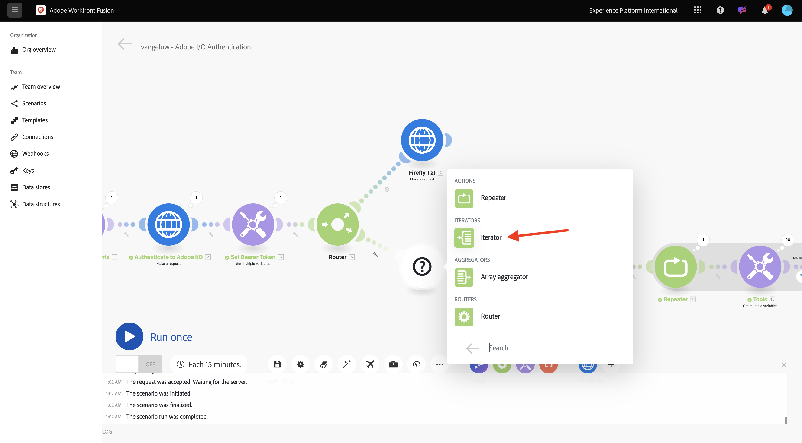
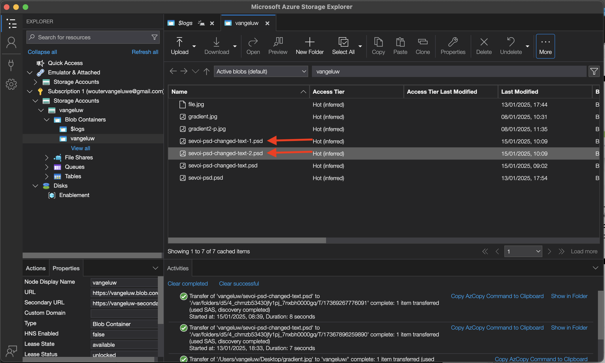
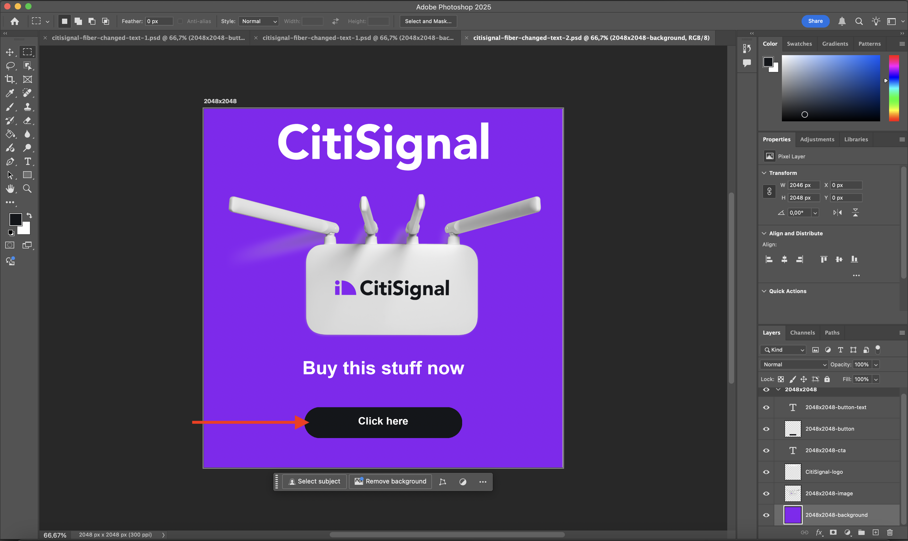
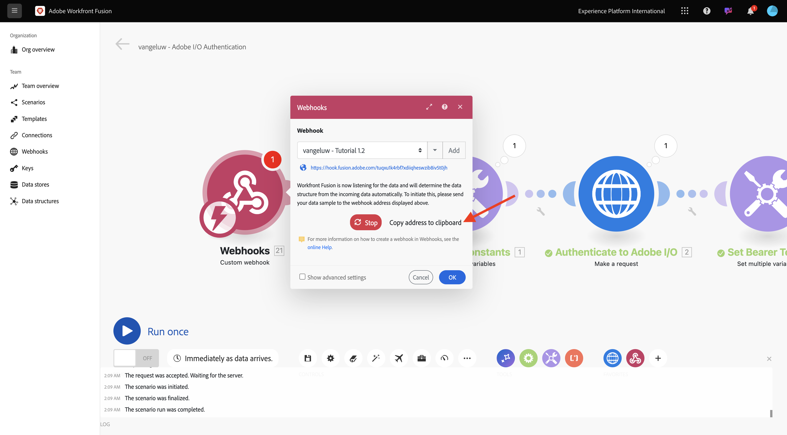

# Workfront Fusion によるプロセスの自動化

Workfront Fusion で自動処理を処理する方法を説明します。

## 複数の値の反復

シナリオは次のようになります。


これまでに、Photoshop ファイルのテキストを静的な値で変更しました。 コンテンツ作成ワークフローを拡張および自動化するには、値のリストを繰り返し処理し、それらの値をPhotoshop ファイルに動的に挿入する必要があります。 次の手順では、既存のシナリオの値を繰り返し処理するウィジェットを追加します。

1. **Router** ノードと **Photoshop Change Text** ノードの間にある **レンチ** アイコンを選択し、「**モジュールを追加**」を選択します。

   

1. `flow` を検索し、「**フロー制御**」を選択します。

   

1. **イテレータ** を選択します。

   

   画面は次のようになります。

   

   CSV ファイルなどの入力ファイルは読み取ることができますが、現時点では、テキスト文字列を定義してテキストファイルを分割することで、基本的なバージョンの CSV ファイルを使用する必要があります。

1. **split** 関数を見つけるには、「**T**」アイコンを選択します。このアイコンには、テキスト値を操作するために使用できるすべての関数が表示されます。 **split** 関数を選択すると、これが表示されます。

   

1. split 関数では、セミコロンの前に値の配列を指定し、セミコロンの後に区切り記号を指定する必要があります。 このテストでは、**今すぐ購入** と **ここをクリック** の 2 つのフィールドを持つ単純な配列を使用する必要があり、使用する区切り記号は **,** です。

1. 現在空の **split** 関数 `{{split("Buy now, Click here "; ",")}}` を置き換えて、**配列** フィールドにこれを入力します。 **OK** を選択します。

   


1. 入力および出力フィールドに静的な値ではなく一部の変数を追加するには、{0 **Photoshop変更テキスト } を選択します。**

   

   **コンテンツをリクエスト** 内に、というテキストがあります **ここをクリック**。 このテキストは、配列から取得した値で置き換える必要があります。

   

1. テキスト **ここをクリック** を削除し、「**Iterator**」ノードから変数 **Value** を選択して置き換えます。 これにより、Photoshop ドキュメントのボタン上のテキストが動的に更新されます。

   

   また、Azure ストレージアカウントにファイルを書き込むために使用するファイル名を更新する必要もあります。 ファイル名が静的な場合、新しいイテレーションでは単に以前のファイルが上書きされるので、カスタマイズされたファイルは失われます。 現在の静的ファイル名は **citignal-fiber-changed-text.psd** ですが、これを更新する必要があります。

1. カーソルを `text` という単語の後ろに置きます。

   

1. 最初にハイフン `-` を追加し、次に値 **バンドルの順序** を選択します。 Workfrontこれにより、最初のイテレーションではファイル名に `-1` が追加され、2 番目のイテレーションではファイル `-2` に追加されます。 **OK** を選択します。

   

1. シナリオを保存し、「**1 回実行**」を選択します。

   

   シナリオが実行されたら、Azure ストレージエクスプローラーに戻り、フォルダーを更新します。 新しく作成された 2 つのファイルが表示されます。

   

1. ファイルをダウンロードして開きます。 ボタンにさまざまなテキストを入力する必要があります。 これはファイル `citisignal-fiber-changed-text-1.psd` です。

   

   これはファイル `citisignal-fiber-changed-text-2.psd` です。

   

## Webhook を使用してシナリオをアクティブ化

これまでのところ、シナリオを手動で実行してテストしてきました。 次に、Webhook を使用してシナリオを更新し、外部環境からアクティブ化できるようにします。

1. **+** を選択し、**Webhook** を検索してから **Webhook** を選択します。

   

1. **Custom Webhook** を選択します。

1. **Custom Webhook** ノードをドラッグして接続し、キャンバスの最初のノード（**Initialize Constants** と呼ばれる）に接続します。

   

1. **Custom Webhook** ノードを選択します。 次に、「**追加**」を選択します。

   

1. **Webhook 名** を `--aepUserLdap-- - Tutorial 1.2` に設定します。

   

1. **リクエストヘッダーを取得** のチェックボックスをオンにします。 「**保存**」を選択します。

   

1. これで、Webhook URL が使用できるようになります。 URL をコピーします。

   

1. Postmanを開き、コレクションに新しいフォルダーを追加します **FF - Fireflyサービステクニカルインサイダー**。

   

1. フォルダーに `--aepUserLdap-- - Workfront Fusion` という名前を付けます。

   

1. 先ほど作成したフォルダーで、3 つのドット **...** を選択し、「**リクエストを追加**」を選択します。

   

1. **POSTタイプ** を **メソッド** に設定し、Webhook の URL をアドレスバーに貼り付けます。

   

   変数要素を外部ソースからWorkfront Fusion シナリオに提供できるように、カスタム本文を送信する必要があります。

1. **本文** に移動し、「**生**」を選択します。

   

1. 以下のテキストをリクエストの本文に貼り付けます。 **送信** を選択します。

   ```json
   {
       "psdTemplate": "placeholder",
       "xlsFile": "placeholder"
   }
   ```

   

1. Workfront Fusion に戻ると、カスタム Webhook に「**正常に決定されました**」というメッセージが表示されます。

   

1. 「**保存**」を選択してから、「**1 回実行**」を選択します。 シナリオは現在アクティブですが、Postmanで「**送信**」を再度選択するまで実行されません。

   

1. Postmanで **送信** を再度選択します。

   

   シナリオが再び実行され、前と同じように 2 つのファイルが作成されます。

   

1. Postman リクエストの名前を `POST - Send Request to Workfront Fusion Webhook` に変更します。

   

   ここで、変数 **psdTemplate** の使用を開始する必要があります。 **Photoshop Change Text** ノードの入力ファイルの場所をハードコーディングする代わりに、Postman リクエストから受け取った変数を使用します。

1. **Photoshop Change Text** ノードを開き、**コンテンツをリクエスト** に移動します。 **inputs** の下のハードコードされたファイル名 **citisignal-fiber.psd** を選択して削除します。

   

1. 変数 **psdTemplate** を選択します。 「**OK**」を選択し、シナリオを保存します。

   

1. 「**オン**」を選択して、シナリオをオンにします。 シナリオがノンストップで実行されます。

   

1. Postmanに戻り、ファイル名 `citisignal-fiber.psd` を変数 **psdTemplate** の値として入力し、「**送信**」を再度選択してシナリオを再実行します。

   

   外部システムから提供される変数としてPSDテンプレートを指定することで、再利用可能なシナリオを構築できるようになりました。

   これで、この演習を完了しました。

## 次の手順

[Fireflyサービス自動化の概要とメリット ](./summary.md){target="_blank"} を参照してください。

[Adobe Fireflyサービスの自動化 ](./automation.md){target="_blank"} に戻る

[ すべてのモジュール ](./../../../overview.md){target="_blank"} に戻る
