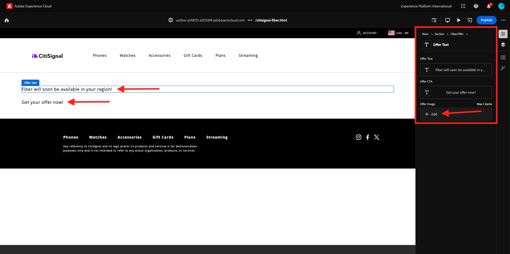

# 2.1.5 高度なカスタムブロック

前の演習では、**オファーテキスト**、**オファーCTA**、**オファー画像** などのフィールドを表示する **ファイバーオファー** という基本的なカスタムブロックを Web サイトに設定しました。

次の手順：[ 概要とメリット ](./summary.md){target="_blank"}

[ モジュール 2.1 に戻る ](./aemcs.md){target="_blank"}

[ すべてのモジュールに戻る ](./../../../overview.md){target="_blank"}
