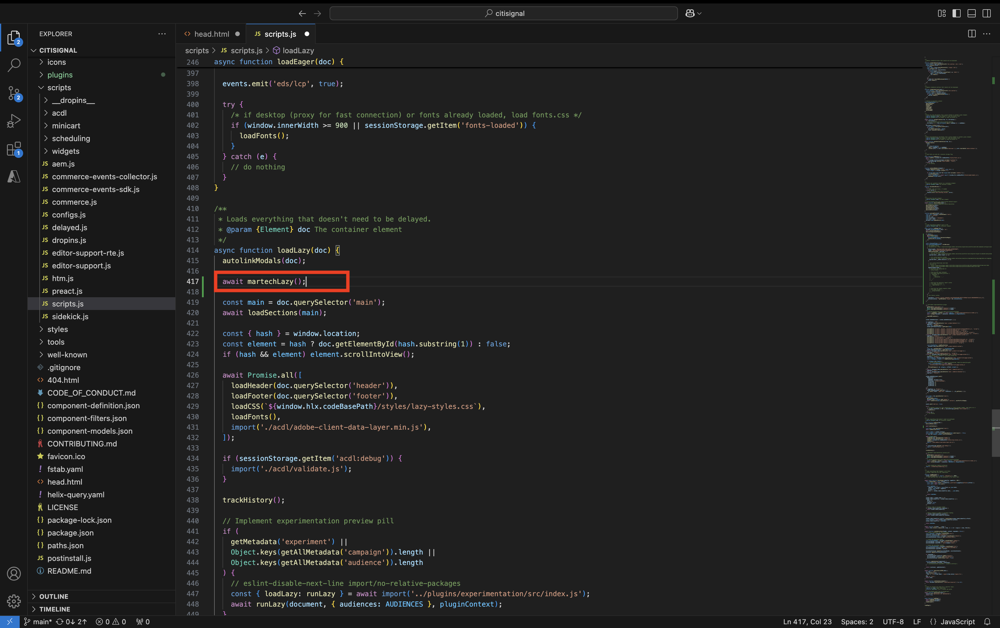

# 2.1.6 AEM Edge Delivery Services MarTech プラグイン

AEM MarTech プラグインを使用すると、AEM プロジェクトの完全な MarTech スタックをすばやく設定できます。

>[!NOTE]
>
>このプラグインは、現在、共同イノベーションプロジェクトを通じてAEM エンジニアリングと協力しているお客様が利用できます。 詳細については、[https://github.com/adobe-rnd/aem-martech](https://github.com/adobe-rnd/aem-martech) を参照してください。

**citignal** GitHub リポジトリに使用しているフォルダーに移動します。 フォルダ名を右クリックし、[**フォルダに新しいターミナル**] を選択します。


その後、これが表示されます。 次のコマンドを貼り付けて、**enter** キーを押します。

```
git subtree add --squash --prefix plugins/martech https://github.com/adobe/aem-experimentation.git main
```

この画像が表示されます。


**citignal** GitHub リポジトリに使用しているフォルダーに移動し、フォルダー **plugins** を開きます。 **martech** という名前のフォルダーが表示されます。


Visual Studio Code で、ファイル **head.html** を開きます。 以下のコードをコピーして、ファイル **head.html** に貼り付けます。

```javascript
<link rel="preload" as="script" crossorigin="anonymous" href="/plugins/martech/src/index.js"/>
<link rel="preload" as="script" crossorigin="anonymous" href="/plugins/martech/src/alloy.min.js"/>
<link rel="preconnect" href="https://edge.adobedc.net"/>
<!-- change to adobedc.demdex.net if you enable third party cookies -->
```

変更を保存します。


Visual Studio Code で、**scripts** フォルダーに移動し、**scripts.js** ファイルを開きます。 以下のコードをコピーして、既存のインポートスクリプトの下の **scripts.js** ファイルに貼り付けます。

```javascript
import {
  initMartech,
  updateUserConsent,
  martechEager,
  martechLazy,
  martechDelayed,
} from '../plugins/martech/src/index.js';
```

変更を保存します。


```javascript
const isConsentGiven = true;
  const martechLoadedPromise = initMartech(
    // The WebSDK config
    // Documentation: https://experienceleague.adobe.com/en/docs/experience-platform/web-sdk/commands/configure/overview#configure-js
    {
      datastreamId: "045c5ee9-468f-47d5-ae9b-a29788f5948f",
      orgId: "907075E95BF479EC0A495C73@AdobeOrg",
      onBeforeEventSend: (payload) => {
        // set custom Target params 
        // see doc at https://experienceleague.adobe.com/en/docs/platform-learn/migrate-target-to-websdk/send-parameters#parameter-mapping-summary
        payload.data.__adobe.target ||= {};

        // set custom Analytics params
        // see doc at https://experienceleague.adobe.com/en/docs/analytics/implementation/aep-edge/data-var-mapping
        payload.data.__adobe.analytics ||= {};
      },

      // set custom datastream overrides
      // see doc at:
      // - https://experienceleague.adobe.com/en/docs/experience-platform/web-sdk/commands/datastream-overrides
      // - https://experienceleague.adobe.com/en/docs/experience-platform/datastreams/overrides
      edgeConfigOverrides: {
        // Override the datastream id
        // datastreamId: '...'

        // Override AEP event datasets
        // com_adobe_experience_platform: {
        //   datasets: {
        //     event: {
        //       datasetId: '...'
        //     }
        //   }
        // },

        // Override the Analytics report suites
        // com_adobe_analytics: {
        //   reportSuites: ['...']
        // },

        // Override the Target property token
        // com_adobe_target: {
        //   propertyToken: '...'
        // }
      },
    },
    // The library config
    {
      launchUrls: ["https://assets.adobedtm.com/b754ed1bed61/b9f7c7c484de/launch-28b548849fb9.min.js"],
      personalization: !!getMetadata('target') && isConsentGiven,
    },
  );
```


```javascript
if (main) {
    decorateMain(main);
    await Promise.all([
      martechLoadedPromise.then(martechEager),
      waitForLCP(LCP_BLOCKS),
    ]);
  }
```


```javascript
await martechLazy();
```



```javascript
window.setTimeout(() => {
    martechDelayed();
    return import('./delayed.js');
  }, 3000);
```


XXX を GitHub ユーザーアカウント（この例では `woutervangeluwe`）に置き換えた後、`main--citisignal--XXX.aem.page/us/en` や `main--citisignal--XXX.aem.live/us/en` に移動して、web サイトの変更を表示できるようになりました。

この例では、完全な URL は次のようになります。
`https://main--citisignal--woutervangeluwe.aem.page/us/en` や `https://main--citisignal--woutervangeluwe.aem.live/us/en`。

次の手順：[ 概要とメリット ](./summary.md){target="_blank"}

[ モジュール 2.1 に戻る ](./aemcs.md){target="_blank"}

[ すべてのモジュールに戻る ](./../../../overview.md){target="_blank"}
