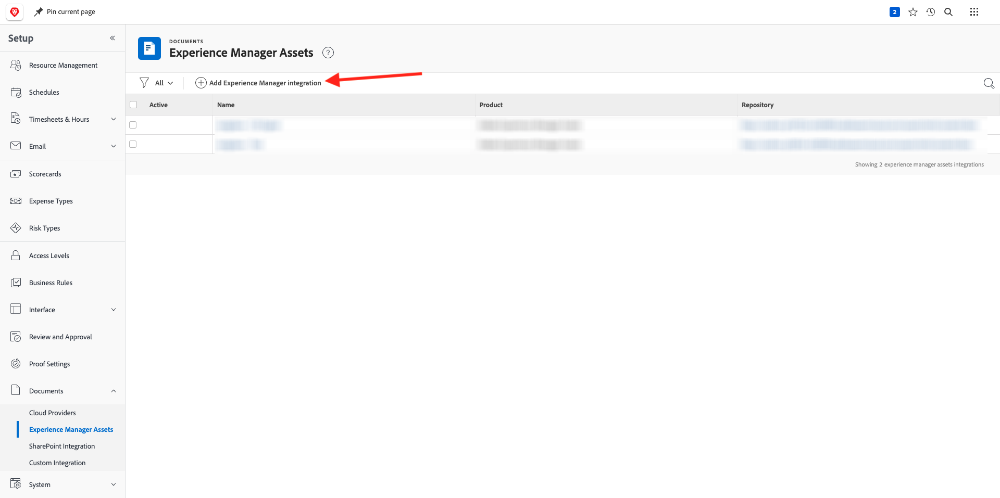

# 2.2.1 Workfrontの概要

[https://experienceplatform.my.workfront.com/](https://experienceplatform.my.workfront.com/){target="_blank"} に移動して、Adobe Workfrontにログインします。

次に、これを確認します。

## 2.2.1.1 AEM Assets統合の設定

9 つのドット **ハンバーガー** アイコンをクリックし、「**設定**」を選択します。

左側のメニューで、下にスクロールして **ドキュメント** を表示し、**Experience Manager Assets** をクリックします。

「**+Experience Manager統合を追加**」をクリックします。

統合の名前には、`--aepUserLdap-- - Citi Signal AEM` を使用します。

**0}Experience Managerリポジトリー } ドロップダウンを開き、AEM CS インスタンス（`--aepUserLdap-- - Citi Signal`）を選択します。**

**メタデータ** で、次のマッピングを設定します。

| Workfront フィールド | Experience Manager Assets フィールド |
| --------------- | ------------------------------ | 
| **ドキュメント** > **名前** | **wm:documentName** |
| **プロジェクト** > **説明** | **wm:projectDescription** |
| **タスク** > **名前** | **wm:taskName** |
| **タスク** > **説明** | **wm:taskDescription** |

**オブジェクトメタデータを同期** のスイッチを有効にします。

「**保存**」をクリックします。

これで、WorkfrontからAEM Assets CS への統合が設定されました。

## 2.2.1.2 AEM Assetsとのメタデータ統合の設定

次に、AEM AssetsのアセットのメタデータフィールドがAEMと共有されるように、Workfrontを設定する必要があります。

その場合は、[https://experience.adobe.com/](https://experience.adobe.com/) にアクセスしてください。 **Experience Manager Assets** をクリックします。

「」をクリックしてAEM Assets環境を選択します。これは、`--aepUserLdap-- - Citi Signal dev` という名前にする必要があります。

この画像が表示されます。 左側のメニューで、**Assetsに移動し** 「**フォルダーを作成**」をクリックします。

フォルダーに `--aepUserLdap-- - Workfront Assets` という名前を付け、「作成 **をクリック** ます。

次に、左側のメニューで **メタデータForms** に移動し、「作成 **をクリックし** す。

`--aepUserLdap-- - Metadata Form` という名前を使用して、「作成 **をクリックし** す。

フォームに 3 つの新しい **1 行のテキスト** フィールドを追加し、最初のフィールドを選択します。 次に、「メタデータプロパティ **フィールドの横にある** スキーマ **アイコンをクリック** ます。

検索フィールドに「`wm:project`」と入力し、「**プロジェクト説明**」フィールドを選択します。 「**選択**」をクリックします。

フィールドのラベルを **プロジェクトの説明** に変更します。

次に、「2 番目の **1 行のテキスト**」フィールドを選択し、「**メタデータプロパティ** フィールドの横にある **スキーマ** アイコンを再度クリックします。

その後、このポップアップが再び表示されます。 検索フィールドに「`wm:project`」と入力し、「**プロジェクト ID**」フィールドを選択します。 「**選択**」をクリックします。

フィールドのラベルを **プロジェクト ID** に変更します。

3 番目の **1 行のテキスト** フィールドを選択し、もう一度 **メタデータプロパティ** フィールドの横にある **スキーマ** アイコンをクリックします。

その後、このポップアップが再び表示されます。 検索フィールドに「`wm:project`」と入力し、「**プロジェクト名**」フィールドを選択します。 「**選択**」をクリックします。

フィールドのラベルを **プロジェクト名** に変更します。 「**保存**」をクリックします。

フォームの **タブ名** を `--aepUserLdap-- - Workfront Metadata` に変更します。 **保存** および **閉じる** をクリックします。

これで **メタデータフォーム** が設定されました。

次に、メタデータフォームを作成済みのフォルダーに割り当てる必要があります。 メタデータフォームのチェックボックスをオンにして、「**フォルダーに割り当て**」をクリックします。

`--aepUserLdap-- - Workfront Assets` という名前のフォルダーを選択します。 **割り当て** をクリックします。

メタデータフォームがフォルダーに正常に割り当てられました。

## 2.2.1.2 AEM Sites統合の設定

>[!NOTE]
>
>このプラグインは現在 **アーリーアクセス** モードであり、まだ一般公開されていません。
>
>このプラグインは、を使用しているWorkfront インスタンスに既にインストールされている場合があります。 既にインストールされている場合は、以下の手順を確認できますが、設定を変更する必要はありません。

[https://experience.adobe.com/#/@experienceplatform/aem/extension-manager/universal-editor](https://experience.adobe.com/#/@experienceplatform/aem/extension-manager/universal-editor){target="_blank"} に移動します。

このプラグインの **toggle** が **有効** に設定されていることを確認します。 次に、「**歯車** アイコンをクリックします。

**拡張機能設定** ポップアップが表示されます。 このプラグインを使用するために、以下のフィールドを設定します。

| キー | 値 |
| --------------- | ------------------------------ | 
| **`IMS_ENV`** | **PROD** |
| **`WORKFRONT_INSTANCE_URL`** | **https://experienceplatform.my.workfront.com** |
| **`SHOW_CUSTOM_FORMS`** | **&#39;{&quot;previewUrl&quot;: true, &quot;publishUrl&quot;: true}&#39;** |

「**保存**」をクリックします。

Workfront UI に戻り、9 つのドット **ハンバーガー** アイコンをクリックします。 **設定** を選択します。

左側のメニューで **カスタムForms** に移動し、「**フォーム**」を選択します。 「**+新規カスタムフォーム**」をクリックします。

**タスク** を選択し、「**続行**」をクリックします。

空のカスタムフォームが表示されます。 フォーム名 `Content Fragment & Integration ID` を入力します。

新しい **1 行のテキスト** フィールドをキャンバスにドラッグ&amp;ドロップします。

新しいフィールドを次のように設定します。

- **ラベル**:**コンテンツフラグメント**
- **名前**: **`aem_workfront_integration_content_fragment`**

キャンバスに新しい **1 行のテキスト** フィールドを追加し、次のように新しいフィールドを設定します。

- **ラベル**: **統合 ID**
- **名前**: **`aem_workfront_integration_id`**

「**適用**」をクリックします。

次に、2 番目のカスタムフォームを設定する必要があります。 「**+新規カスタムフォーム**」をクリックします。

**タスク** を選択し、「**続行**」をクリックします。

空のカスタムフォームが表示されます。 フォーム名 `Preview & Publish URL` を入力します。

新しい **1 行のテキスト** フィールドをキャンバスにドラッグ&amp;ドロップします。

新しいフィールドを次のように設定します。

- **ラベル**: **プレビュー URL**
- **名前**: **`aem_workfront_integration_preview_url`**

キャンバスに新しい **1 行のテキスト** フィールドを追加し、次のように新しいフィールドを設定します。

- **ラベル**: **Publishの URL**
- **名前**: **`aem_workfront_integration_publish_url`**

「**適用**」をクリックします。

その後、2 つのカスタムフォームを使用できるようになります。

次の手順：Workfrontで [2.2.2 を校正する ](./ex2.md){target="_blank"}

[ モジュール 2.2 に戻る ](./workfront.md){target="_blank"}

[ すべてのモジュールに戻る ](./../../../overview.md){target="_blank"}
