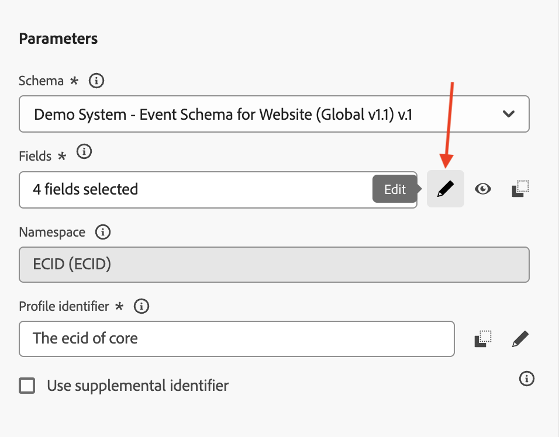

# 3.1.1 イベントの作成

[Adobe Experience Cloud](https://experience.adobe.com) に移動して、Adobe Journey Optimizerにログインします。 **Journey Optimizer** をクリックします。

Journey Optimizerの **ホーム** ビューにリダイレクトされます。 最初に、正しいサンドボックスを使用していることを確認します。 使用するサンドボックスは `--aepSandboxName--` です。

左側のメニューで、下にスクロールして、**設定** をクリックします。 次に、「イベント **の下にある** 管理 **ボタンをクリック** ます。

次に、使用可能なすべてのイベントの概要が表示されます。 「**イベントを作成**」をクリックして、独自のイベントの作成を開始します。

新しい空のイベントウィンドウがポップアップ表示されます。

まず、イベントに `--aepUserLdap--AccountCreationEvent` のような名前を付けます。
説明を `Account Creation Event` に設定し、**タイプ** が **単一** に設定されていることを確認します。**イベント ID タイプ** の選択では、「**システム生成**」を選択します。

次に、スキーマを選択します。 スキーマ `Demo System - Event Schema for Website (Global v1.1) v.1` を使用してください。

スキーマを選択すると、「**ペイロード**」セクションで多数のフィールドが選択されます。 **ペイロード** セクションにマウスポインターを置くと、3 つのアイコンのポップアップが表示されます。 **編集** アイコンをクリックします。

**フィールド** ウィンドウポップアップが表示され、メールをパーソナライズする必要のあるフィールドの一部を選択する必要があります。  既にAdobe Experience Platformにあるデータを使用して、後で他のプロファイル属性を選択します。

オブジェクト `--aepTenantId--.demoEnvironment` で、必ず **brandLogo** フィールドと **brandName** フィールドを選択してください。

オブジェクト `--aepTenantId--.identification.core` で、「**メール**」フィールドを必ず選択してください。 **OK** をクリックして、変更を保存します。

この画像が表示されます。 **名前空間** を **ECID （ECID）** に設定します。 「**保存**」をクリックします。

これで、イベントが設定され、保存されました。

イベントを再度クリックすると、**イベントを編集** 画面が再度開きます。 「**ペイロード**」フィールドに再度ポインタを合わせると、3 つのアイコンが再び表示されます。 **ペイロードを表示** アイコンをクリックします。

これで、期待されるペイロードの例が表示されます。

イベントには一意のオーケストレーション eventID があり、`_experience.campaign.orchestration.eventID` が表示されるまでペイロードを下にスクロールすると見つかります。

イベント ID は、次に作成するジャーニーをトリガーにするためにAdobe Experience Platformに送信する必要があるものです。 この eventID は次の演習の 1 つで必要になるので、覚えておいてください。
`"eventID": "5ae9b8d3f68eb555502b0c07d03ef71780600c4bd0373a4065c692ae0bfbd34d"`

「**OK**」をクリックします。

**キャンセル** をクリックします。

これで、この演習が完了しました。

## 次の手順

[3.1.2 メッセージで使用するフラグメントの作成に移動します ](./ex2.md){target="_blank"}

[Adobe Journey Optimizer: オーケストレーション ](./journey-orchestration-create-account.md){target="_blank"} に戻る

[ すべてのモジュール ](./../../../../overview.md){target="_blank"} に戻る
