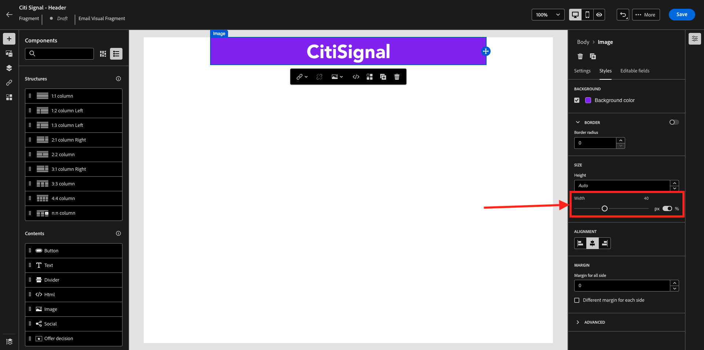

# 3.1.2 メッセージで使用するフラグメントを作成する

この演習では、2 つのフラグメント、1 つは再利用可能なヘッダー、1 つは再利用可能なフッターを設定します。

[Adobe Experience Cloud](https://experience.adobe.com) に移動して、Adobe Journey Optimizerにログインします。 **Journey Optimizer** をクリックします。


Journey Optimizerの **ホーム** ビューにリダイレクトされます。 最初に、正しいサンドボックスを使用していることを確認します。 使用するサンドボックスは `--aepSandboxName--` です。


## ヘッダーフラグメントを作成 3.1.2.1 るには

左側のメニューで、「**フラグメント**」をクリックします。 フラグメントは、Journey Optimizer内の再利用可能なコンポーネントで、重複を回避し、メールメッセージのヘッダーやフッターの変更など、すべてのメッセージに影響を与える将来の変更を容易にします。

**フラグメントを作成** をクリックします。


`--aepUserLdap-- - CitiSignal - Header` という名前を入力し、**タイプ：ビジュアルフラグメント** を選択します。 「**作成**」をクリックします。


その後、これが表示されます。 左側のメニューには、メールの構造（行と列）を定義するために使用できる構造コンポーネントがあります。

メニューからキャンバスに **1:1 列** をドラッグ&amp;ドロップします。 これがロゴ画像のプレースホルダーになります。


次に、コンテンツコンポーネントを使用して、これらのブロック内にコンテンツを追加できます。 **画像** コンポーネントを最初の行の最初のセルにドラッグ&amp;ドロップします。 **参照** をクリックします。


ポップアップが開き、AEM Assets Media Library が表示されます。 フォルダー **citi-signal-images** に移動し、画像 **CitiSignal-Logo-White.png** をクリックして選択し、**選択** をクリックします。

>[!NOTE]
>
>AEM Assets ライブラリに CitiSignal 画像が表示されない場合は、[ こちら ](./../../../../assets/ajo/CitiSignal-images.zip) で見つけることができます。 デスクトップにダウンロードし、フォルダー **citi-signal-images** を作成し、そのフォルダー内のすべての画像をアップロードします。


その後、これが表示されます。 画像は白で、まだ表示されていません。 画像を正しく表示するための背景色を定義する必要があります。 **スタイル** をクリックし、「**背景色** ボックスをクリックします。


ポップアップで、**16 進数** カラーコードを **#8821F4** に変更し、「**100%**」フィールドをクリックしてフォーカスを変更します。 次に、画像に適用された新しい色を確認します。


今のイメージも少し大きいです。 **幅** スイッチャーを **40%** にスライドして幅を変更します。



これで、ヘッダーフラグメントの準備が整いました。 「**保存**」をクリックし、矢印をクリックして前の画面に戻ります。


フラグメントを使用するには、公開する必要があります。 「**公開**」をクリックします。


数分後、フラグメントのステータスが **ライブ** に変更されたことがわかります。
次に、メールメッセージのフッター用に新しいフラグメントを作成する必要があります。 **フラグメントを作成** をクリックします。


## フッターフラグメントを作成 3.1.2.2 るには

**フラグメントを作成** をクリックします。


`--aepUserLdap-- - CitiSignal - Footer` という名前を入力し、**タイプ：ビジュアルフラグメント** を選択します。 「**作成**」をクリックします。


その後、これが表示されます。 左側のメニューには、メールの構造（行と列）を定義するために使用できる構造コンポーネントがあります。

メニューからキャンバスに **1:1 列** をドラッグ&amp;ドロップします。 これがフッターコンテンツのプレースホルダーになります。


次に、コンテンツコンポーネントを使用して、これらのブロック内にコンテンツを追加できます。 **HTML** コンポーネントを最初の行の最初のセルにドラッグ&amp;ドロップします。 コンポーネントをクリックして選択し、「**&lt;/>**」アイコンをクリックしてHTML ソースコードを編集します。


その後、これが表示されます。


以下のHTML コードフラグメントをコピーして、Journey Optimizerの **HTMLを編集** ウィンドウに貼り付けます。

```html
<!--[if mso]><table cellpadding="0" cellspacing="0" border="0" width="100%"><tr><td style="text-align: center;" ><![endif]-->
<table style="width: auto; display: inline-block;">
  <tbody>
    <tr class="component-social-container">
      <td style="padding: 5px">
        <a style="text-decoration: none;" href="https://www.facebook.com" data-component-social-icon-id="facebook">
        
        </a>
      </td>
      <td style="padding: 5px">
        <a style="text-decoration: none;" href="https://x.com" data-component-social-icon-id="twitter">
        
        </a>
      </td>
      <td style="padding: 5px">
        <a style="text-decoration: none;" href="https://www.instagram.com" data-component-social-icon-id="instagram">
         
        </a>
      </td>
    </tr>
  </tbody>
</table>
<!--[if mso]></td></tr></table><![endif]-->
```

これで完了です。 7、12、17 行目で、AEM Assets ライブラリのアセットを使用して画像ファイルを挿入する必要があります。


カーソルが 7 行目にあることを確認し、左側のメニューで **Assets** をクリックします。 **アセットセレクターを開く** をクリックして、画像を選択します。


フォルダー **citi-signal-images** を開き、クリックして画像 **Icon_Facebook.png** を選択します。 「**選択**」をクリックします。


カーソルが 12 行目にあることを確認し、**アセットセレクターを開く** をクリックして画像を選択します。


フォルダー **citi-signal-images** を開き、クリックして画像 **Icon_X.png** を選択します。 「**選択**」をクリックします。


カーソルが 17 行目にあることを確認し、**アセットセレクターを開く** をクリックして画像を選択します。


フォルダー **citi-signal-images** を開き、クリックして画像 **Icon_Instagram.png** を選択します。 「**選択**」をクリックします。


その後、これが表示されます。 「**保存**」をクリックします。


その後、エディターに戻ります。 背景と画像ファイルがすべて白になっているため、アイコンはまだ表示されません。 背景色を変更するには、「**スタイル**」に移動し、「**背景色**」チェックボックスをクリックします。


**16 進数** のカラーコードを **#000000** に変更します。


中央揃えに変更します。


フッターに他の部分を追加しましょう。 **画像** コンポーネントを、作成したHTML コンポーネントの上にドラッグ&amp;ドロップします。 **参照** をクリックします。


をクリックして画像ファイル **`CitiSignal_Footer_Logo.png`** を選択し、**選択** をクリックします。


「**スタイル**」に移動し、「**背景色**」チェックボックスをクリックして、もう一度黒に変更します。 **16 進数** のカラーコードを **#000000** に変更します。


幅を **20%** に変更し、線形が中央揃えに設定されていることを確認します。


次に、**テキスト** コンポーネントを、作成したHTML コンポーネントの下にドラッグ&amp;ドロップします。 **参照** をクリックします。


プレースホルダーテキストを置き換えて、以下のテキストをコピー&amp;ペーストします。

```
1234 N. South Street, Anywhere, US 12345

Unsubscribe

©2024 CitiSignal, Inc and its affiliates. All rights reserved.
```

中央揃えにする **テキストの配置** を設定します。


**フォントカラー** を白、**#FFFFFF** に変更します。


**背景色** を黒、**#000000** に変更します。


フッターでテキスト **登録解除** を選択し、メニューバーの **リンク** アイコンをクリックします。 **タイプ** を **外部オプトアウト/購読解除** に設定し、URL を **https://aepdemo.net/unsubscribe.html** に設定します（購読解除リンクの空白の URL を持つことはできません）。


これで完了です。 これで、フッターの準備が整いました。 「**保存**」をクリックし、矢印をクリックして前のページに戻ります。


「**公開**」をクリックしてフッターを公開し、メールで使用できるようにします。


数分後、フッターのステータスが **ライブ** に変更されます。


## 次の手順

[3.1.3 ジャーニーとメールメッセージの作成 ](./ex3.md){target="_blank"} に移動します。

[Adobe Journey Optimizer: オーケストレーション ](./journey-orchestration-create-account.md){target="_blank"} に戻る

[ すべてのモジュール ](./../../../../overview.md){target="_blank"} に戻る
