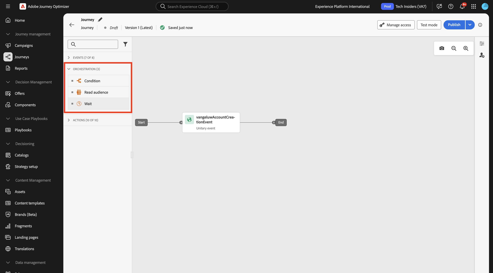
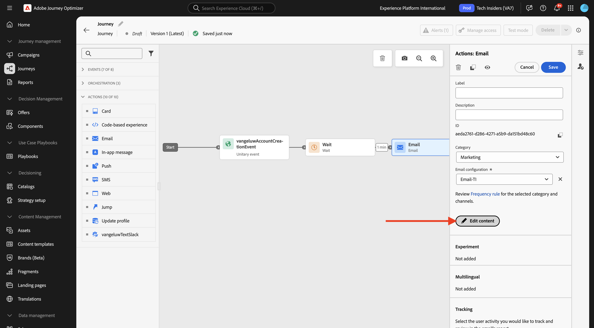
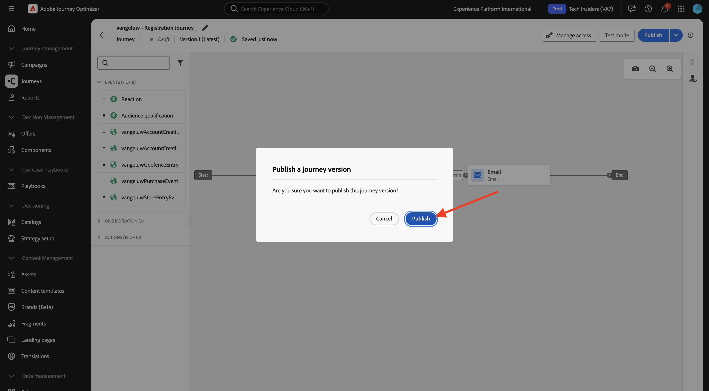

# 3.1.3 ジャーニーとメールメッセージの作成

この演習では、ジャーニーと、デモ web サイトでアカウントが作成されたときにトリガーする必要があるメッセージを設定します。

[Adobe Experience Cloud](https://experience.adobe.com) に移動して、Adobe Journey Optimizerにログインします。 **Journey Optimizer** をクリックします。


Journey Optimizerの **ホーム** ビューにリダイレクトされます。 最初に、正しいサンドボックスを使用していることを確認します。 使用するサンドボックスは `--aepSandboxName--` です。


## ジャーニー3.1.3.1 作成するには

左のメニューで、「**ジャーニー**」をクリックします。次に、「**ジャーニーを作成**」をクリックして、新規のジャーニーを作成します。


すると、空のジャーニー画面が表示されます。


前の演習では、新しい **イベント** を作成しました。 この `--aepUserLdap--AccountCreationEvent` のように名前を付けました。 イベント作成の結果：


次に、このジャーニーをこのイベントの開始として受け取る必要があります。 これを行うには、画面の左側に移動して、イベントのリストでイベントを検索します。


イベントを選択し、ジャーニーキャンバスにドラッグ&amp;ドロップします。 ジャーニーは次のようになります。


ジャーニーの 2 番目のステップとして、短い **待機** ステップを追加する必要があります。 画面の左側の **オーケストレーション** セクションに移動して、これを見つけます。 プロファイル属性を使用し、リアルタイム顧客プロファイルに入力されていることを確認する必要があります。



ジャーニーは次のようになります。 画面の右側には、待機時間を設定する必要があります。 1 分に設定します。 これにより、イベントの発生後にプロファイル属性が使用可能になるまで、十分な時間が与えられます。 「**保存**」をクリックして変更を保存します。


ジャーニーの 3 番目の手順として、**メール** アクションを追加する必要があります。 画面の左側に移動して **アクション** し、**メール** アクションを選択して、ジャーニーの 2 番目のノードにドラッグ&amp;ドロップします。 これが表示されます。


**カテゴリ** を **マーケティング** に設定し、メールの送信を可能にするメール設定を選択します。 この場合、選択するメール設定は **Email-TI** です。


## メッセ 3.1.3.2 ジを作成するには

メッセージを作成するには、「**コンテンツを編集**」をクリックします。



これが表示されます。


**パーソナライゼーションダイアログを開く** アイコンをクリックします。


テキスト `Hi ` を書き込みます。 次に、**に保存されている「名** フィールドのパーソナライゼーショントークンを取り込む必要が `profile.person.name.firstName` ります。 左側のメニューで、「**Person/Full Name/First Name**」フィールドを探し、「**+**」アイコンをクリックします。 テキストフィールドにパーソナライゼーショントークンが表示されます。


次に、「**, thank you for signing up!**。「**保存**」をクリックします。


これで、メールの本文の設定を開始できます。 **メール本文を編集** をクリックします。


実際のメッセージ自体のコンテンツを作成する前に、メッセージの内容について考えることをお勧めします。 メッセージ内のコンテンツには、メッセージ自体に固有のものもありますが、その他の部分は、顧客に送信するすべてのメールで同じである可能性が高い標準コンポーネントです。

前の演習では、これらの標準コンポーネントをJourney Optimizerでフラグメントとして既に作成しました。ここで、このメッセージと、今後作成する他のすべてのメッセージで参照できます。

次の画面では、メールのコンテンツを指定するための 3 つの異なる方法を選択するように求められます。

- **ゼロからデザイン**：空のキャンバスから開始し、WYSIWYG エディターを使用して、構造およびコンテンツコンポーネントをドラッグ&amp;ドロップして、メールのコンテンツを視覚的に構築します。
- **独自にコーディング**:HTMLを使用してコーディングし、独自のメールテンプレートを作成します
- **HTMLの読み込み**：編集できる既存のHTML テンプレートを読み込みます。

**ゼロからデザイン** をクリックします。


左側のメニューには、メールの構造（行と列）を定義するために使用できる構造コンポーネントがあります。


また、左側のメニューには **フラグメント** があり、以前に作成したフラグメントが表示されます。


ヘッダーとフッターをキャンバスに追加する前に、メールに 2 つの構造を追加する必要があります。 左側のメニューで「**+**」アイコンをクリックし、2 **1:1 列** コンポーネントをキャンバスにドラッグします。


左側のメニューで、**フラグメント** に戻ります。 ヘッダーフラグメントを最初のコンポーネントに、フッターフラグメントを 2 番目のコンポーネントにドラッグ&amp;ドロップします。 その後、これが表示されます。


左側のメニューで「**+**」アイコンをクリックし、さらに 2 つの **1:1 列** コンポーネントをキャンバスのヘッダーとフッターの間にドラッグ&amp;ドロップします。


**画像** コンポーネントを最初の **1:1 列** コンポーネントにドラッグ&amp;ドロップします。 **参照** をクリックします。


**citi-signal-images** フォルダー内。 画像 **`welcome_email_image.png`** を選択し、「**選択** をクリックします。


すると、次のようになります。


次に、**コンテンツ** に移動し、**テキスト** コンポーネントを 4 行目の構造コンポーネントにドラッグ&amp;ドロップします。


デフォルトのテキストを選択します **ここにテキストを入力してください。他のテキストエディターの場合と同様に** きます。 代わりに **家族へようこそ** と書いてください。 ツールバーで、「**パーソナライゼーションを追加** アイコンをクリックします。


次に、**に保存されている** 名 `profile.person.name.firstName` パーソナライゼーショントークンを取り込む必要があります。 メニューで、**ユーザー** 要素を見つけ、**姓名** 要素にドリルダウンし、**+** アイコンをクリックして、名フィールドを式エディターに追加します。

「**保存**」をクリックします。


これで、パーソナライゼーションフィールドがテキストにどのように追加されたかがわかります。


同じテキストフィールドで **Enter** キーを 2 回押して 2 行を追加し、次のテキストをコピーして貼り付けます。

```
Welcome aboard! We're thrilled to have you join the CitiSignal family. 
As a valued member of our community, you're now poised to experience top-notch telecommunications services that cater to your every need.

At CitiSignal, we understand that staying connected is more than just a convenience - it's a necessity. Whether you're browsing the web, streaming your favourite content, or keeping in touch with loved ones, we're here to ensure you have the best tools and resources at your fingertips.
```


**テキストの配置** を中央に配置し、メッセージのルックアンドフィールを独自のニーズに合わせて自由に調整できます。 完了したら、「**保存**」をクリックします。


最後に、メールの準備が整ったことを確認するチェックとして、プレビューし、「**コンテンツをシミュレート**」ボタンをクリックします。


メールメッセージをシミュレートする前に、テストプロファイルを追加する必要があります。 **テストプロファイルを管理** をクリックします。


**ID 名前空間を入力** フィールドの横にあるアイコンをクリックして **メール** 名前空間を選択します。

ID 名前空間のリストで、「**メール**」名前空間を選択します。 「**ID 値**」フィールドに、前の演習で使用し、Adobe Experience Platformに既に保存されている以前のプロファイルのメールアドレスを入力します。 **プロファイルを追加** をクリックします。 前の画面に戻ります。


次に、この顧客プロファイル用にシミュレートされたメールメッセージが表示されます。 件名と本文のパーソナライゼーションを検証し、必要に応じて配達確認メールを送信できるようになりました。

**閉じる** をクリックして、プレビューを閉じます。


「**保存**」をクリックしてメッセージを保存し、左上隅の件名テキストの横にある **矢印** をクリックしてメッセージダッシュボードに戻ります。


**矢印** をクリックして、ジャーニーに戻ります。


## 3.1.3.3 ジャーニーの公開

「**保存**」をクリックします。


ジャーニーに名前を付ける必要があります。 画面の右上にある **プロパティ** アイコンをクリックすると、これを行うことができます。


ジャーニーの名前をここに入力できます。 `--aepUserLdap-- - Registration Journey` を使用してください。 「**保存**」をクリックします。


これで、「**公開** をクリックしてジャーニーを公開できます。


もう一度 **公開** をクリックします。



数分後、ジャーニーのステータスが **ライブ** に変わり、ジャーニーのパフォーマンスに関するリアルタイムダッシュボードが表示されます。


これで、この演習が完了しました。

## 次の手順

[3.1.4 「データ収集プロパティの更新」に移動し、ジャーニーをテストします ](./ex4.md){target="_blank"}

[Adobe Journey Optimizer: オーケストレーション ](./journey-orchestration-create-account.md){target="_blank"} に戻る

[ すべてのモジュール ](./../../../../overview.md){target="_blank"} に戻る
