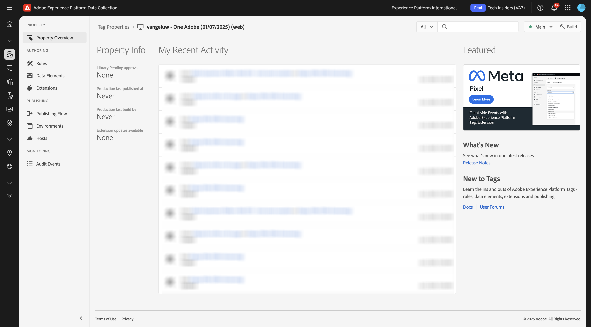

# 3.1.3 データ収集プロパティを更新し、ジャーニーをテストする

## デ 3.1.3.1 タ収集プロパティを更新するには

[Adobe Experience Platform Data Collection に移動し ](https://experience.adobe.com/data-collection/home) 「**Tags**」を選択します。

**はじめに** で、デモシステムは次に、Web サイト用とモバイルアプリ用を含む、いくつかのタグプロパティを作成しました。 `--aepUserLdap-- - One Adobe` 検索 **[!UICONTROL ボックスで]** を検索して見つけます。 クリックして **Web** プロパティを開きます。

その後、これが表示されます。

左側のメニューで、**ルール** に移動し、ルール **アカウントを作成** を検索します。 ルール **アカウントを作成** をクリックして開きます。

このルールの詳細が表示されます。 クリックして、アクション **「登録イベント」エクスペリエンスイベントを送信** を開きます。

次に、このアクションがトリガーされると、特定のデータ要素を使用して XDM データ構造が定義されます。 そのデータ要素を更新し、**演習 3.1.1** で設定したイベントの [ イベント ID](./ex1.md) を定義する必要があります。

ここで、データ要素 **XDM – 登録イベント** を更新する必要があります。 これを行うには、**データ要素** に移動します。 **XDM – 登録** を検索し、クリックしてデータ要素を開きます。

次の画面が表示されます。

フィールド `_experience.campaign.orchestration.eventID` に移動します。 現在の値を削除し、eventID をそこに貼り付けます。

イベント ID はAdobe Journey Optimizerの **設定/イベント** にあり、イベント ID はイベントのサンプルペイロードに次のように表示されます。`"eventID": "d40815dbcd6ffd813035b4b590b181be21f5305328e16c5b75e4f32fd9e98557"`

eventID を貼り付けると、画面は次のようになります。 次に、「**保存**」または **ライブラリに保存** をクリックします。

最後に、変更を公開する必要があります。 左側のメニューで **公開フロー** に移動し、クリックして **メイン** ライブラリを開きます。

「**変更されたリソースをすべて追加**」をクリックし、「**開発用に保存およびビルド**」をクリックします。

その後、ライブラリが更新され、1 ～ 2 分後に、設定をテストできます。

## 3.1.3.2 ジャーニーのテスト

[https://dsn.adobe.com](https://dsn.adobe.com) に移動します。 Adobe IDでログインすると、このが表示されます。 Web サイトプロジェクトで「。..**」** いう 3 つのドットをクリックし、「**実行**」をクリックして開きます。

その後、デモ Web サイトが開きます。 URL を選択してクリップボードにコピーします。

新しい匿名ブラウザーウィンドウを開きます。

前の手順でコピーしたデモ Web サイトの URL を貼り付けます。 その後、Adobe IDを使用してログインするように求められます。

アカウントタイプを選択し、ログインプロセスを完了します。

次に、匿名ブラウザーウィンドウに web サイトが読み込まれます。 演習ごとに、新しい匿名ブラウザーウィンドウを使用して、デモ Web サイトの URL を読み込む必要があります。

画面の左上隅にあるAdobe ロゴアイコンをクリックして、プロファイルビューアを開きます。

現在は不明なこの顧客の主要識別子として **0&rbrace;Experience Cloud ID&rbrace; を持つプロファイルビューアパネルとリアルタイム顧客プロファイルをご覧ください。**「**ログイン**」をクリックします。

**アカウントを作成** をクリックします。

詳細を入力して **登録** をクリックすると、前のページにリダイレクトされます。

プロファイルビューアパネルを開き、リアルタイム顧客プロファイルに移動します。 プロファイルビューアパネルには、新しく追加されたメール識別子や電話識別子など、すべての個人データが表示されます。

アカウントを作成してから 1 分が経過すると、Adobe Journey Optimizerからアカウント作成メールが届きます。

また、Journey Optimizerのジャーニーのダッシュボードで、ジャーニーのエントリとジャーニーの進行状況も確認できます。

## 次の手順

[ 概要とメリット ](./summary.md){target="_blank"} に移動します。

[Adobe Journey Optimizer: オーケストレーション ](./journey-orchestration-create-account.md){target="_blank"} に戻る

[ すべてのモジュール ](./../../../../overview.md){target="_blank"} に戻る
