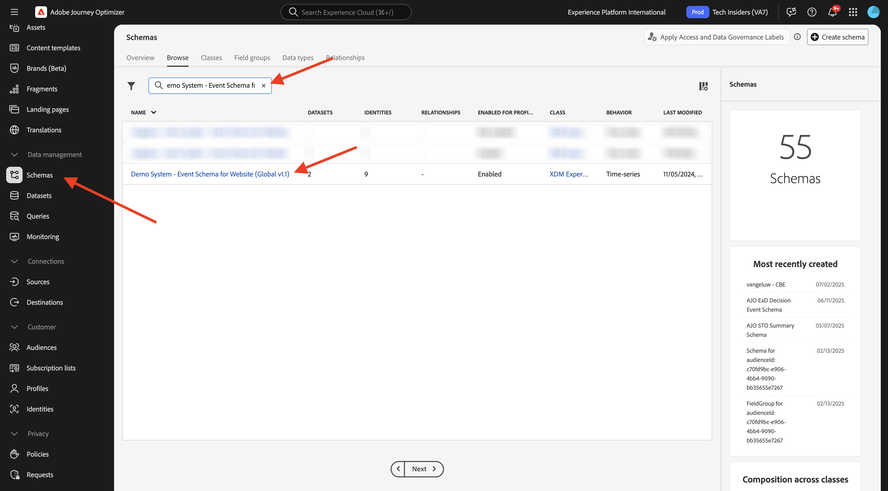
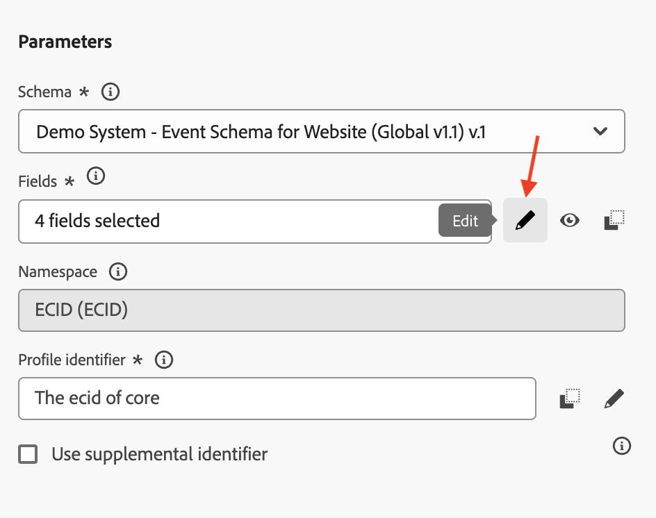

# 3.2.1 イベントの定義

[Adobe Experience Cloud](https://experience.adobe.com) に移動して、Adobe Journey Optimizerにログインします。 **Journey Optimizer** をクリックします。

Journey Optimizerの **ホーム** ビューにリダイレクトされます。 最初に、正しいサンドボックスを使用していることを確認します。 使用するサンドボックスは `--aepSandboxName--` です。 その後、サンドボックス **ージの** ホーム `--aepSandboxName--` ビューに移動します。

左側のメニューで、下にスクロールして、**設定** をクリックします。 次に、「イベント **の下にある** 管理 **ボタンをクリック** ます。

次に、使用可能なすべてのイベントの概要が表示されます。 「**イベントを作成**」をクリックして、独自のイベントの作成を開始します。

新しい空のイベントウィンドウがポップアップ表示されます。
イベントの名前として、`--aepUserLdap--GeofenceEntry` を使用します。

説明を `Geofence Entry Event` に設定します。

**タイプ** が **単一** に設定されていることを確認し、「**イベント ID タイプ**」選択で「**システム生成**」を選択します

次に、スキーマを選択する必要があります。

すべてのスキーマが表示されているわけではないことに注意してください。 Adobe Experience Platformでは、さらに多くのスキーマを使用できます。
このリストに表示するには、スキーマに非常に特定のフィールドグループがリンクされている必要があります。 ここに表示するために必要なフィールドグループは `Orchestration eventID` です。

これらのスキーマがAdobe Experience Platformでどのように定義されているかを簡単に見てみましょう。

左側のメニューで、**スキーマ** に移動し、新しいブラウザータブで開きます。 **スキーマ** で、**参照** に移動して、使用可能なスキーマのリストを表示します。
スキーマ `Demo System - Event Schema for Website (Global v1.1)` を開きます。

スキーマを開くと、フィールドグループ `Orchestration eventID` がスキーマの一部であることがわかります。
このフィールドグループには、`_experience.campaign.orchestration.eventID` と `originJourneyID` の 2 つのフィールドしかありません。

このフィールドグループとこの特定の eventID フィールドがスキーマに含まれると、そのスキーマはAdobe Journey Optimizerで使用できるようになります。

Adobe Journey Optimizerのイベント設定に戻ります。

このユースケースでは、ジオフェンスイベントをリッスンして顧客が特定の場所にいるかどうかを把握します。そのため、ここでスキーマ `Demo System - Event Schema for Website (Global v1.1)` をイベントのスキーマとして選択します。

その後、Adobe Journey Optimizerによって、一部の必須フィールドが自動的に選択されますが、Adobe Journey Optimizerで使用できるようになったフィールドは編集できます。

**鉛筆** アイコンをクリックして、フィールドを編集します。

フィールドを選択できるスキーマ階層を含むポップアップウィンドウが表示されます。

ECID やオーケストレーション eventID などのフィールドは必須であり、事前に選択されています。

ただし、マーケターは、ジャーニーにコンテキストを提供するすべてのデータポイントに柔軟にアクセスできる必要があります。 次のフィールドも最小限に抑えて選択してください（場所コンテキストノード内）。

- 市区町村

完了したら、「**OK**」をクリックします。

Adobe Journey Optimizerには、顧客を識別するための ID も必要です。 Adobe Journey OptimizerはAdobe Experience Platformにリンクされているので、ジャーニーのプライマリ ID がスキーマの ID として自動的に取得されます。
また、プライマリID はAdobe Experience Platformの完全な ID グラフを自動的に考慮し、使用可能なすべての ID、デバイス、チャネルにわたるすべての行動を同じプロファイルにリンクして、Adobe Journey Optimizerがコンテキストに応じて、関連性と一貫性を持つようにします。 「**保存**」をクリックします。

その後、イベントは、使用可能なイベントのリストに含まれます。

最後に、カスタムイベントの `Orchestration eventID` を復元する必要があります。

イベントのリストでイベントをクリックして、もう一度開きます。
イベントで、「フィールド **の横にある** ペイロードを表示 **アイコンをクリック** ます。

**ペイロードを表示** アイコンをクリックすると、このイベントのサンプル XDM ペイロードが開きます。 行 **が表示されるまで** ペイロード `eventID` を下にスクロールします。

最後に、設定をテストするために必要になるので、`eventID` を書き留めてください。

この例では、`eventID` は `209a2eecb641e20a517909e186a559ced155384a26429a557eb259e5a470bca7` です。

作成しているジャーニーをトリガーにするイベントを定義しました。 ジャーニーがトリガーされると、市区町村などのジオフェンスフィールドや、選択したその他のフィールド（国、緯度、経度など）がジャーニーで利用できるようになります。

ユースケースの説明で説明しているように、天気に応じたコンテキストプロモーションを提供する必要があります。 天気情報を取得するには、その場所の天気情報を提供する外部データソースを定義する必要があります。 **OpenWeather API** サービスを使用して、その情報を提供します。

## 次の手順

[3.2.2 外部データソースの定義を参照してください &#x200B;](./ex2.md){target="_blank"}

[Adobe Journey Optimizer：外部データソースとカスタムアクション &#x200B;](journey-orchestration-external-weather-api-sms.md){target="_blank"} に戻る

[&#x200B; すべてのモジュール &#x200B;](./../../../../overview.md){target="_blank"} に戻る