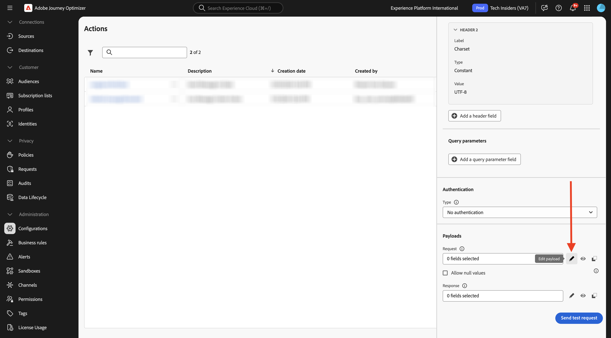

# 3.2.3 カスタムアクションの定義

この演習では、Slack チャンネルにメッセージを送信するカスタムアクションを作成します。

[Adobe Experience Cloud](https://experience.adobe.com) に移動して、Adobe Journey Optimizerにログインします。 **Journey Optimizer** をクリックします。


Journey Optimizerの **ホーム** ビューにリダイレクトされます。 最初に、正しいサンドボックスを使用していることを確認します。 使用するサンドボックスは `--aepSandboxName--` です。 その後、サンドボックス **ージの** ホーム `--aepSandboxName--` ビューに移動します。


次に、既存のSlack チャンネルを使用し、そのSlack チャンネルにメッセージを送信します。 Slackには使いやすい API があり、Adobe Journey Optimizerを使用して API をトリガーします。


左側のメニューで、下にスクロールして、**設定** をクリックします。 次に、「アクション **の下にある** 管理 **ボタンをクリック** ます。


**アクション** リストが表示されます。 **アクションを作成** をクリックします。


空のアクションポップアップが表示されます。


アクションの名前として、`--aepUserLdap--TextSlack` を使用します。

説明を `Send Message to Slack` に設定します。

**URL 設定** には、次を使用します。

- URL: `https://2mnbfjyrre.execute-api.us-west-2.amazonaws.com/prod`
- メソッド：**POST**

>[!NOTE]
>
>上記の URL は、AWS Lambda 関数を参照します。この関数は、上記のようにリクエストをSlack チャンネルに転送します。 これは、Adobeが所有するSlack チャネルへのアクセスを保護するために行われます。 独自のSlack チャネルがある場合、[https://api.slack.com/](https://api.slack.com/) を使用してSlack アプリを作成し、そのSlack アプリで受信 Webhook を作成し、上記の URL を受信 Webhook URL に置き換える必要があります。


**認証** は、&lbrack; 認証なし **に設定する必要があ** ます。


**ペイロード** で、Slackに送信するフィールドを定義する必要があります。 論理的には、Adobe Journey OptimizerとAdobe Experience Platformをパーソナライズの頭脳として使用したいので、Slackに送信するテキストはAdobe Journey Optimizerで定義した後、Slackに送信して実行する必要があります。

**リクエスト** については、「**ペイロードを編集** アイコンをクリックします。



すると、空のポップアップウィンドウが表示されます。


以下のテキストをコピーして、空のポップアップウィンドウに貼り付けます。

```json
{
 "text": {
  "toBeMapped": true,
  "dataType": "string",
  "label": "textToSlack"
 }
}
```

その後、これが表示されます。 「**保存**」をクリックします。


上にスクロールして、もう一度 **保存** をクリックして、アクションを保存します。


カスタムアクションは、**アクション** リストの一部になりました。


イベント、外部データソースおよびアクションを定義しました。 次に、これらすべてを 1 つのジャーニーに組み合わせます。

## 次の手順

[3.2.4 ジャーニーとメッセージの作成 ](./ex4.md){target="_blank"} に移動します。

[Adobe Journey Optimizer：外部データソースとカスタムアクション ](journey-orchestration-external-weather-api-sms.md){target="_blank"} に戻る

[ すべてのモジュール ](./../../../../overview.md){target="_blank"} に戻る
