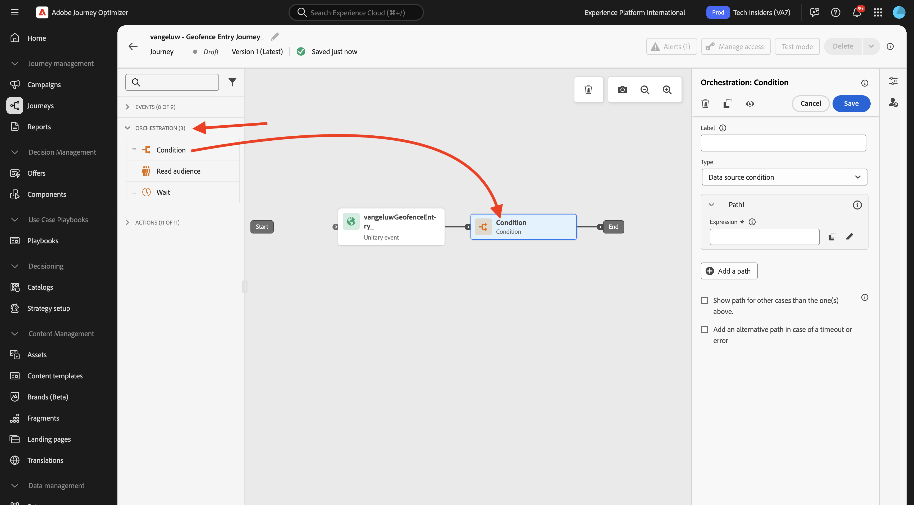
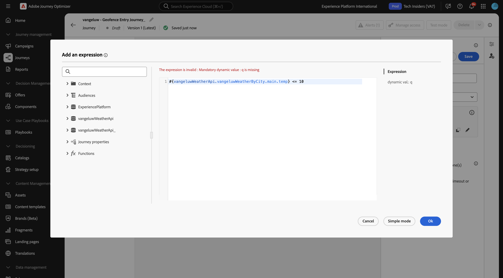
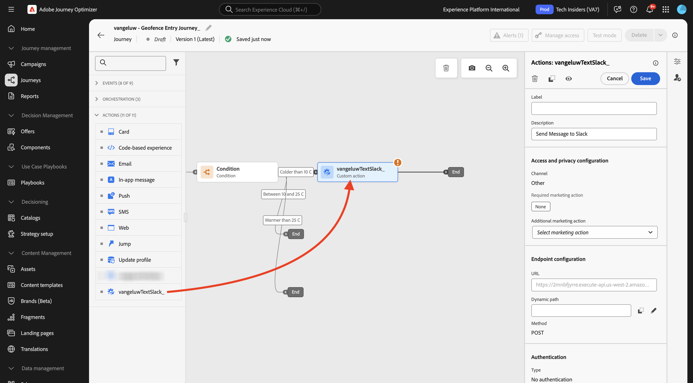
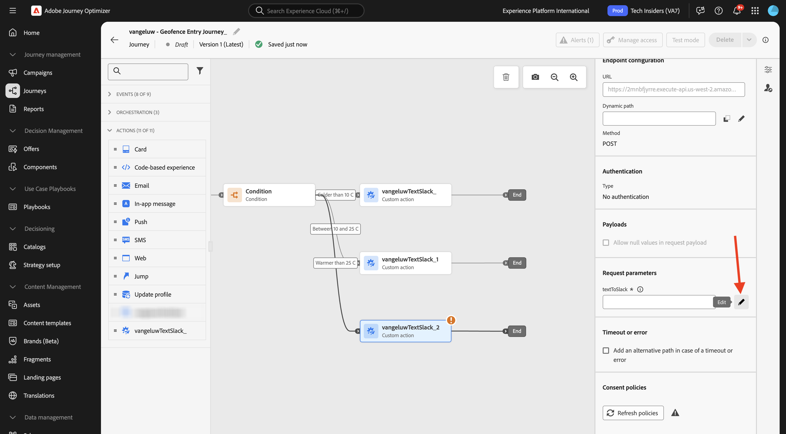
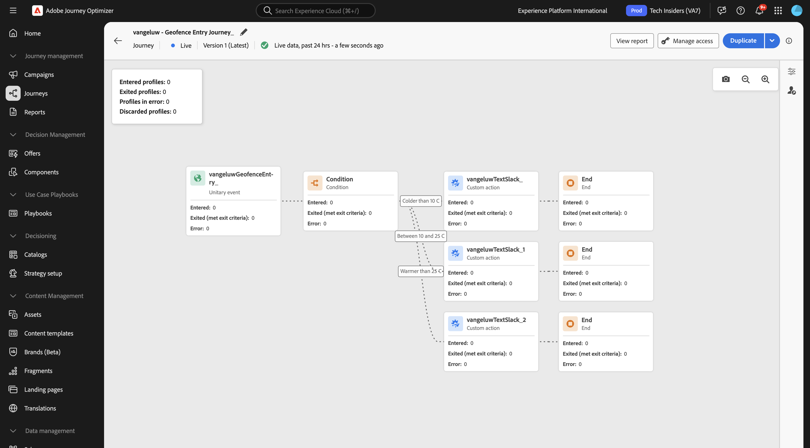

# 3.2.4 ジャーニーとメッセージの作成

この演習では、Adobe Journey Optimizerを使用して、ジャーニーを作成し、複数のテキストメッセージを作成します。

このユースケースでは、顧客の場所の気象条件に基づいて様々なメッセージを送信することが目標です。 次の 3 つのシナリオが定義されています。

- 摂氏 10 度より寒い
- 摂氏 10～25 度
- 摂氏 25 度より暖かい

これらの 3 つの条件の場合、Adobe Journey Optimizerで 3 つのメッセージを定義する必要があります。

## 3.2.4.1 ジャーニーの作成

[Adobe Experience Cloud](https://experience.adobe.com) に移動して、Adobe Journey Optimizerにログインします。 **Journey Optimizer** をクリックします。


Journey Optimizerの **ホーム** ビューにリダイレクトされます。 最初に、正しいサンドボックスを使用していることを確認します。 使用するサンドボックスは `--aepSandboxName--` です。 その後、サンドボックス **ージの** ホーム `--aepSandboxName--` ビューに移動します。


左側のメニューで、**ジャーニーに移動し** 「ジャーニーを作成 **」をクリックして**&#x200B;ジャーニーの作成を開始します。


まず、ジャーニーに名前を付ける必要があります。

ジャーニーの名前として、`--aepUserLdap-- - Geofence Entry Journey` を使用します。 現時点では、他の値を設定する必要はありません。 「**保存**」をクリックします。


画面の左側で、**イベント** を確認します。 以前に作成したイベントが、`--aepUserLdap--GeofenceEntry` という名前でそのリストに表示されます。 選択して、ジャーニーキャンバスにドラッグ&amp;ドロップします。 ジャーニーは次のようになります。


次に、「**オーケストレーション**」をクリックします。 使用可能な **オーケストレーション** 機能が表示されます。 **条件** を選択し、ジャーニーキャンバスにドラッグ&amp;ドロップします。



次に、この条件に 3 つのパスを設定する必要があります。

- 気温はセ氏 10 度より寒いです
- 気温はセ氏 10 度から 25 度の間です
- 気温は摂氏 25 度を超えています

最初の条件を定義します。

### 状態 1：摂氏 10 度より寒い

**条件** をクリックします。  **Path1** をクリックし、パスの名前を **10 C より寒い** に編集します。 Path1 の式の **編集** アイコンをクリックします。


すると、空の **シンプルなエディター** 画面が表示されます。 クエリはもう少し高度なので、**詳細設定モード** が必要です。 **詳細設定モード** をクリックします。


次に、コードを入力できる **詳細エディター** が表示されます。


以下のコードを選択して、**詳細エディター** に貼り付けます。

`#{--aepUserLdap--WeatherApi.--aepUserLdap--WeatherByCity.main.temp} <= 10`

その後、これが表示されます。



この条件の一部として気温を取得するには、顧客が現在いる市区町村を指定する必要があります。
**市区町村** は、Open Weather API ドキュメントで前に説明したように、動的パラメーター `q` にリンクする必要があります。

スクリーンショットに示されているフィールド **dynamic val: q** をクリックします。


次に、利用可能なデータソースの 1 つで、顧客の現在の市区町村を含むフィールドを見つける必要があります。この場合、**コンテキスト** の下でそれを見つける必要があります。


`--aepUserLdap--GeofenceEntry.placeContext.geo.city` に移動すると、フィールドを見つけることができます。

そのフィールドをクリックするか **+** をクリックすると、そのフィールドがパラメーター `q` の動的な値として追加されます。 このフィールドには、例えばモバイルアプリに実装した geolocation-service が入力されます。 この場合、デモ web サイトのデータ収集プロパティを使用して、これをシミュレートします。 「**OK**」をクリックします。


### 条件 2：摂氏 10～25 度

最初の条件を追加すると、この画面が表示されます。 **パスを追加** をクリックします。


**Path1** をダブルクリックし、パス名を **10～25 C** に編集します。 このパスの式の **編集** アイコンをクリックします。


すると、空の **シンプルなエディター** 画面が表示されます。 クエリはもう少し高度なので、**詳細設定モード** が必要です。 **詳細設定モード** をクリックします。


次に、コードを入力できる **詳細エディター** が表示されます。


以下のコードを選択して、**詳細エディター** に貼り付けます。

`#{--aepUserLdap--WeatherApi.--aepUserLdap--WeatherByCity.main.temp} > 10 and #{--aepUserLdap--WeatherApi.--aepUserLdap--WeatherByCity.main.temp} <= 25`

その後、これが表示されます。


この条件の一部として気温を取得するには、顧客が現在いる市区町村を指定する必要があります。
**市区町村** は、以前に Open Weather API ドキュメントで見たように、動的パラメーター **q** にリンクされている必要があります。

スクリーンショットに示されているフィールド **dynamic val: q** をクリックします。


次に、利用可能なデータソースの 1 つで、顧客の現在の市区町村を含むフィールドを見つける必要があります。


`--aepUserLdap--GeofenceEntry.placeContext.geo.city` に移動すると、フィールドを見つけることができます。 そのフィールドをクリックすると、パラメーター **q** の動的な値として追加されます。 このフィールドには、例えばモバイルアプリに実装した geolocation-service が入力されます。 この場合、デモ web サイトのデータ収集プロパティを使用して、これをシミュレートします。 「**OK**」をクリックします。


次に、3 番目の条件を追加します。

### 状態 3：摂氏 25 度より暖かい

2 番目の条件を追加すると、この画面が表示されます。 **パスを追加** をクリックします。


Path1 をダブルクリックして、名前を **25 C より暖かい** に変更します。
次に、このパスの式の **編集** アイコンをクリックします。


すると、空の **シンプルなエディター** 画面が表示されます。 クエリはもう少し高度なので、**詳細設定モード** が必要です。 **詳細設定モード** をクリックします。


次に、コードを入力できる **詳細エディター** が表示されます。


以下のコードを選択して、**詳細エディター** に貼り付けます。

`#{--aepUserLdap--WeatherApi.--aepUserLdap--WeatherByCity.main.temp} > 25`

その後、これが表示されます。


この条件の一部として気温を取得するには、顧客が現在いる市区町村を指定する必要があります。
**市区町村** は、以前に Open Weather API ドキュメントで見たように、動的パラメーター **q** にリンクされている必要があります。

スクリーンショットに示されているフィールド **dynamic val: q** をクリックします。


次に、利用可能なデータソースの 1 つで、顧客の現在の市区町村を含むフィールドを見つける必要があります。


```--aepUserLdap--GeofenceEntry.placeContext.geo.city``` に移動すると、フィールドを見つけることができます。 そのフィールドをクリックすると、パラメーター **q** の動的な値として追加されます。 このフィールドには、例えばモバイルアプリに実装した geolocation-service が入力されます。 この場合、デモ web サイトのデータ収集プロパティを使用して、これをシミュレートします。 「**OK**」をクリックします。


これで、3 つのパスが設定されました。 「**保存**」をクリックします。


これは学習目的のジャーニーなので、マーケターがメッセージを配信するために必要な様々なオプションを紹介するために、いくつかのアクションを設定します。

## 3.2.4.2 パスのメッセージを送信：10°C より寒い

温度コンテキストごとに、顧客にテキストメッセージを送信しようとします。 この演習では、携帯電話番号ではなく、実際のメッセージをSlack チャンネルに送信します。

パス **10°C より寒い** に焦点を当てましょう。


左側のメニューで、「**アクション**」に戻り、「アクション」 `--aepUserLdap--TextSlack` プションを選択して、「**メッセージ**」アクションの後にドラッグ&amp;ドロップします。



「**リクエストパラメーター**」までスクロールし、パラメーター **の** 編集 `textToSlack` アイコンをクリックします。


ポップアップウィンドウで、「**詳細設定モード**」をクリックします。


以下のコードを選択し、コピーして **詳細モードエディター** に貼り付けます。 「**OK**」をクリックします。

`"Brrrr..." + #{ExperiencePlatform.ProfileFieldGroup.profile.person.name.firstName} + ",  it's cold and freezing outside. Get comfortable at home with a 20% discount on a Disney+ subscription!"`


完了したアクションが表示されます。 上にスクロールして、「**保存**」をクリックします。


これで、ジャーニーのこのパスの準備が整いました。

## 3.2.4.3 パスのメッセージを送信：10° ～ 25°C

温度コンテキストごとに、顧客にメッセージを送信しようとします。 この演習では、携帯電話番号ではなく、実際のメッセージをSlack チャンネルに送信します。

**10～25°C** のパスに焦点を当ててみましょう。


左側のメニューで、「**アクション**」に戻り、「アクション」 `--aepUserLdap--TextSlack` プションを選択して、「**メッセージ**」アクションの後にドラッグ&amp;ドロップします。


「**リクエストパラメーター**」までスクロールし、パラメーター **の** 編集 `textToSlack` アイコンをクリックします。


ポップアップウィンドウで、「**詳細設定モード**」をクリックします。


以下のコードを選択し、コピーして **詳細モードエディター** に貼り付けます。 「**OK**」をクリックします。

`"What nice weather for the time of year, " + #{ExperiencePlatform.ProfileFieldGroup.profile.person.name.firstName} + " 20% discount on Apple AirPods so you can go for a walk and listen to your favorite podcast!"`


完了したアクションが表示されます。 上にスクロールして、「**保存**」をクリックします。


これで、ジャーニーのこのパスの準備が整いました。

## 3.2.4.4 パスのメッセージを送信：25°C より高い

温度コンテキストごとに、顧客にメッセージを送信しようとします。 この演習では、携帯電話番号ではなく、実際のメッセージをSlack チャンネルに送信します。

**25°C よりも暖かい** パスに焦点を当てましょう。


左側のメニューで、「**アクション**」に戻り、「アクション」 `--aepUserLdap--TextSlack` プションを選択して、「**メッセージ**」アクションの後にドラッグ&amp;ドロップします。


「**リクエストパラメーター**」までスクロールし、パラメーター **の** 編集 `textToSlack` アイコンをクリックします。



ポップアップウィンドウで、「**詳細設定モード**」をクリックします。


以下のコードを選択し、コピーして **詳細モードエディター** に貼り付けます。 「**OK**」をクリックします。

`"So warm, " + #{ExperiencePlatform.ProfileFieldGroup.profile.person.name.firstName} + "! 20% discount on adding 10GB of extra data so you can get online at the beach!"`


完了したアクションが表示されます。 「**保存**」をクリックします。


これで、ジャーニーのこのパスの準備が整いました。

## 3.2.4.5 ジャーニーの公開

これで、ジャーニーが完全に設定されました。 「**公開**」をクリックします。


もう一度 **公開** をクリックします。


これで、ジャーニーが公開されました。



## 次の手順

ジャーニーをトリガーする [3.2.5](./ex5.md){target="_blank"} に移動します

[Adobe Journey Optimizer：外部データソースとカスタムアクション &#x200B;](journey-orchestration-external-weather-api-sms.md){target="_blank"} に戻る

[&#x200B; すべてのモジュール &#x200B;](./../../../../overview.md){target="_blank"} に戻る
