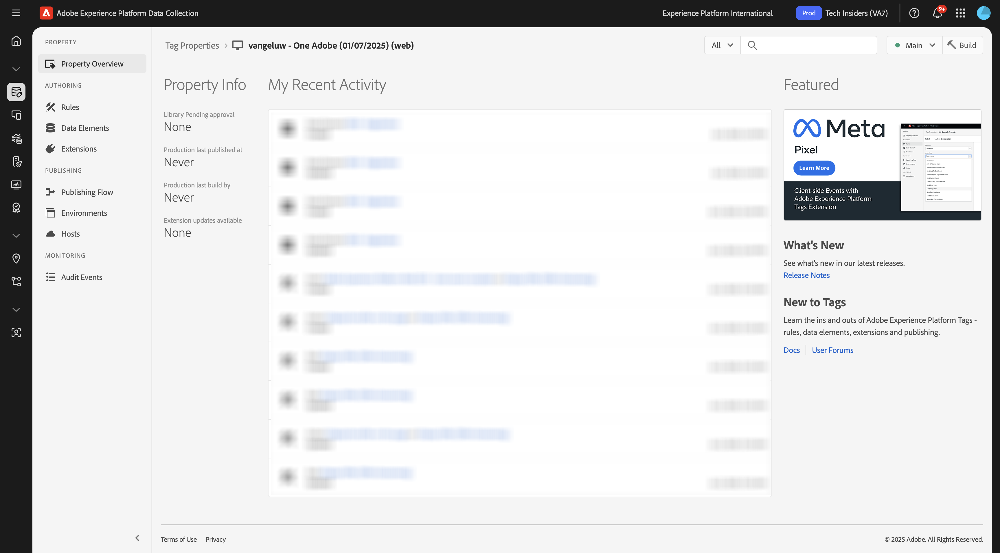
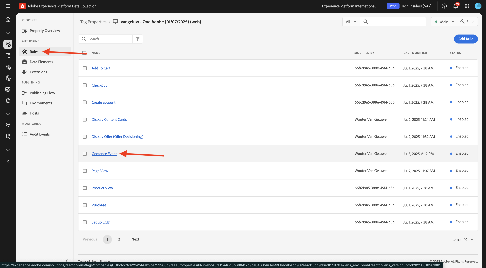
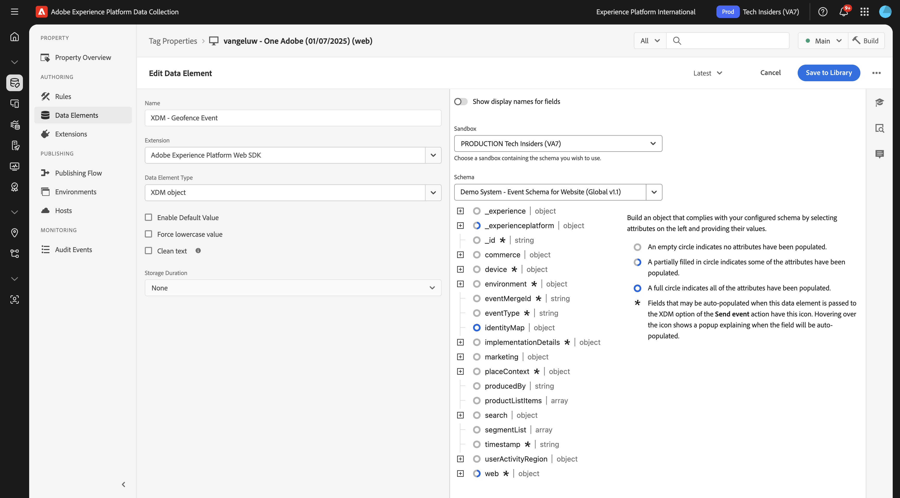
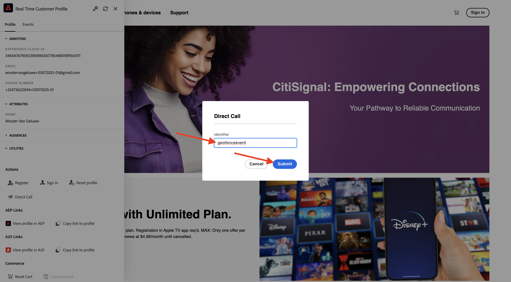

# 3.2.5 ジャーニーのトリガー

この演習では、このモジュールで設定したジャーニーをテストし、トリガーします。

## 3.2.5.1 ジオフェンスイベント設定の更新

[Adobe Experience Platform Data Collection に移動し &#x200B;](https://experience.adobe.com/launch/) 「**Tags**」を選択します。

これは、以前に表示したAdobe Experience Platform データ収集のプロパティページです。

**はじめに** で、デモシステムは次に、Web サイト用とモバイルアプリ用に 1 つのタグプロパティを作成しました。 `--aepUserLdap--` 検索 **[!UICONTROL ボックスで]** を検索して見つけます。 クリックして **Web** プロパティを開きます。

その後、これが表示されます。

左側のメニューで、**ルール** に移動し、ルール **ジオフェンスイベント** を検索します。 ルール **ジオフェンスイベント** をクリックして開きます。

このルールの詳細が表示されます。 クリックしてアクション **Adobe Experience Platform Web SDK - イベントを送信** を開きます。

次に、このアクションがトリガーされると、特定のデータ要素を使用して XDM データ構造が定義されます。 そのデータ要素を更新し、**演習 3.2.1** で設定したイベントの [&#x200B; イベント ID](./ex1.md) を定義する必要があります。

ここで、データ要素 **XDM - ジオフェンスイベント** を更新する必要があります。 これを行うには、**データ要素** に移動します。 **XDM - ジオフェンスイベント** を検索し、クリックしてデータ要素を開きます。

次の画面が表示されます。

フィールド `_experience.campaign.orchestration.eventID` に移動します。 現在の値を削除し、eventID をそこに貼り付けます。

イベント ID はAdobe Journey Optimizerの **設定/イベント** にあり、イベント ID はイベントのサンプルペイロードに次のように表示されます。`"eventID": "209a2eecb641e20a517909e186a559ced155384a26429a557eb259e5a470bca7"`

次に、このデータ要素で都市を定義する必要があります。 **placeContext/地域/市区町村** に移動し、任意の市区町村を入力します。 次に、「**保存**」または **ライブラリに保存** をクリックします。

最後に、変更を公開する必要があります。 左側のメニューで **公開フロー** に移動し、「**Man**」をクリックしてライブラリを開きます。

「**変更されたリソースをすべて追加**」をクリックし、「**開発用に保存およびビルド**」をクリックします。

## 3.2.5.2 ジャーニーのトリガー

[https://dsn.adobe.com](https://dsn.adobe.com) に移動します。 Adobe IDでログインすると、このが表示されます。 Web サイトプロジェクトで「。..**」** いう 3 つのドットをクリックし、「**実行**」をクリックして開きます。

その後、デモ Web サイトが開きます。 URL を選択してクリップボードにコピーします。

新しい匿名ブラウザーウィンドウを開きます。

前の手順でコピーしたデモ Web サイトの URL を貼り付けます。 その後、Adobe IDを使用してログインするように求められます。

アカウントタイプを選択し、ログインプロセスを完了します。

次に、匿名ブラウザーウィンドウに web サイトが読み込まれます。 演習ごとに、新しい匿名ブラウザーウィンドウを使用して、デモ Web サイトの URL を読み込む必要があります。

画面の左上隅にあるAdobe ロゴアイコンをクリックして、プロファイルビューアを開きます。

プロファイルビューアパネルを開き、リアルタイム顧客プロファイルに移動します。 プロファイルビューアパネルには、新しく追加されたメール識別子や電話識別子など、すべての個人データが表示されます。

プロファイルビューアパネルで **ユーティリティ** をクリックし、**直接呼出し** を選択します。

>[!NOTE]
>
>プロファイルビューアパネルに直接呼出しイベントを送信するオプションがない場合は、開発者ビューを開いて参照の **コンソール** に移動し、`_satellite.track('geofenceevent')` コマンドを貼り付けて送信することで、手動で送信できます。

`geofenceevent` と入力し、「**送信**」をクリックします。

数秒後に、Slack チャンネルにAdobe Journey Optimizerからのメッセージが表示されます。

## 次の手順

[&#x200B; 概要とメリット &#x200B;](./summary.md){target="_blank"} に移動します。

[Adobe Journey Optimizer：外部データソースとカスタムアクション &#x200B;](journey-orchestration-external-weather-api-sms.md){target="_blank"} に戻る

[&#x200B; すべてのモジュール &#x200B;](./../../../../overview.md){target="_blank"} に戻る
