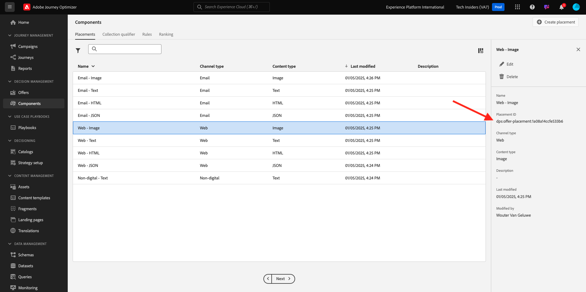

# 3.3.1 Offer Decisioning 101

## 3.3.1.1 用語

Offer Decisioningをより深く理解するために、Offer Decisioning アプリケーションサービスとAdobe Experience Platformの連携に関する [ 概要 ](https://experienceleague.adobe.com/docs/journey-optimizer/using/offer-decisioniong/get-started-decision/starting-offer-decisioning.html?lang=ja) を読むことを強くお勧めします。

Offer Decisioningを使用するには、次の概念を理解している必要があります。

| 用語 | 説明 |
| ------------------------- | -------------------------------------------------------------------------------------------------------------------------------------------------------------------------------------------------------------------------------------------------------- |
| **オファー** | オファーは、オファーを表示する資格のあるユーザーを指定するルールが関連付けられているマーケティングメッセージです。 オファーのステータスは、ドラフト、承認済みまたはアーカイブ済みです。 |
| **プレースメント** | エンドユーザーに対してオファーが表示される場所（またはチャネルタイプ）とコンテキスト（またはコンテンツタイプ）の組み合わせ。 実際には、テキスト、HTML、画像、モバイル、web、ソーシャル、インスタントメッセージング、非デジタルチャネルの JSON の組み合わせです。 |
| **ルール** | オファーに対するエンドユーザーの実施要件を定義および制御するロジック。 |
| **パーソナライズされたオファー** | 実施要件ルールおよび制約に基づいてカスタマイズできるマーケティングメッセージ。 |
| **フォールバックオファー** | エンドユーザーが使用されるコレクション内のオファーのいずれにも資格がない場合に表示されるデフォルトのオファーです。 |
| **キャッピング** | オファー定義で、1 つのオファーを合計で提示できる回数と特定のユーザーに提示できる回数を定義するために使用します。 |
| **優先度** | オファーの結果セットから優先度ランクを決定するレベル。 |
| **コレクション** | パーソナライズされたオファーリストからオファーのサブセットを除外し、Offer Decisioning プロセスを高速化するために使用されます。 |
| **決定** | マーケターが決定エンジンに対して、最適なオファーを提供することを求めている、オファー、プレースメントおよびプロファイルのセットの組み合わせ。 |
| **AEM Assets Essentials** | Adobe Experience Cloud ソリューションおよびAdobe Experience Platformをまたいでアセットの保存、検索、選択を行う、ユニバーサルで一元化されたエクスペリエンス。 |

{style="table-layout:auto"}

## 3.3.1.2 Offer Decisioning

[Adobe Experience Cloud](https://experience.adobe.com) に移動して、Adobe Journey Optimizerにログインします。 **Journey Optimizer** をクリックします。

Journey Optimizerの **ホーム** ビューにリダイレクトされます。 最初に、正しいサンドボックスを使用していることを確認します。 使用するサンドボックスは `--aepSandboxName--` です。 その後、サンドボックス `--aepSandboxName--` ージの **ホーム** ビューに移動します。

左側のメニューで、「**オファー**」をクリックします。 オファー、コレクション、決定などが含まれるオファーメニューが表示されます。

**コンポーネント** をクリックします。 プレースメント、コレクション修飾子、ルール、ランキングなどが表示されるようになります。

## 3.3.1.3 プレースメント

**プレースメント** に移動します。

「**プレースメント**」タブで、オファーのプレースメントを定義できます。 決定を定義する際、結果として生成されるオファーの表示場所（チャネルタイプ）と形式（コンテンツタイプ）をプレースメントで定義します。

環境にプレースメントが表示されない場合は、以下およびスクリーンショットに示すようにプレースメントを作成してください。

| 名前 | チャネルタイプ | コンテンツタイプ |
| ---------------------- | ------------ | ------------ |
| **非デジタル - テキスト** | 非デジタル | テキスト |
| **Web - JSON** | Web | JSON |
| **Web - HTML** | Web | HTML |
| **Web - テキスト** | Web | テキスト |
| **Web - 画像** | Web | 画像 |
| **メール - JSON** | メール | JSON |
| **メール -HTML** | メール | HTML |
| **メール – テキスト** | メール | テキスト |
| **メール - 画像** | メール | 画像 |

{style="table-layout:auto"}

**注意**：既に利用可能なプレースメントには何も変更しないでください。

任意のプレースメントをクリックして、設定を視覚化します。

プレースメントのすべてのフィールドが表示されます。

- プレースメントの **名前**
- **プレースメント ID**
- プレースメントの **チャネルタイプ**
- プレースメントの **コンテンツタイプ**。**テキスト**、**HTML**、&lbrace; 画像 **または** JSON **のいずれか**
- **説明** プレースメントの説明を追加できるフィールド

## 3.3.1.4 決定ルール

ルール（実施要件ルールとも呼ばれます）は、**オーディエンス** と同等です。 ルールは、実際にはオーディエンス自体ですが、Adobe Experience Platformのプロファイルに最適なオファーを提供するために、ルールをオファーで使用できる唯一の違いがあります。

以前のイネーブルメントモジュールに基づいてオーディエンスを定義する方法は既にわかっているので、セグメント化環境を簡単に見てみましょう。

**ルール** に移動します。 「**+ ルールを作成**」をクリックします。

Adobe Experience Platformのオーディエンス作成インターフェイスが表示されます。

これで、リアルタイム顧客プロファイルの結合スキーマの一部であるすべてのフィールドにアクセスし、任意のルールを作成できるようになりました。

また、**オーディエンス**/``--aepTenantId--`` に移動すれば、既に定義されているオーディエンスをAdobe Experience Platformで簡単に再利用できます。

次の画面が表示されます。

必要に応じて、独自のルールを設定できるようになりました。 この演習では、次の 2 つのルールが必要です。

- all – 男性の顧客
- all – 女性のお客様

これらのルールがまだ存在しない場合は、作成してください。 既に存在する場合は、それらのルールを使用し、新しいルールを作成しないでください。

ルールの作成に使用する属性は **XDM 個人プロファイル**/**人物**/**性別** です。

例えば、ルール **すべて – 男性の顧客** のルール定義を次に示します。

例えば、ルール **all - Female Customers** のルール定義を次に示します。

## 3.3.1.5 のオファー

**オファー** に移動し、「**オファー**」を選択します。 「**+ オファーを作成**」をクリックします。

このポップアップが表示されます。

今はオファーを作成しないでください。次の演習で作成します。

これで、次の 2 種類のオファーがあることがわかります。

- パーソナライズされたオファー
- フォールバックオファー

パーソナライズされたオファーは、特定の状況で表示する特定のコンテンツです。 パーソナライズされたオファーは、特定の条件が満たされた場合に、個人的でコンテキストに沿ったエクスペリエンスを提供するように特別に作成されています。

フォールバックオファーは、パーソナライズされたオファーの条件が満たされない場合に表示されるオファーです。

## 3.3.1.6 決定

決定は、プレースメント、パーソナライズされたオファーのコレクション、フォールバックオファーを組み合わせ、優先度、実施要件の制約、合計/ユーザーキャッピングなど、個々のパーソナライズされたオファーの特性に基づいて、Offer Decisioning エンジンが特定のプロファイルに最適なオファーを見つけるために最終的に使用します。

**決定** を設定するには、「**決定**」をクリックします。

次の演習では、独自のオファーと決定を設定します。

## 次の手順

[3.3.2 オファーと決定の設定 ](./ex2.md){target="_blank"} に移動します。

[Offer Decisioning](offer-decisioning.md){target="_blank"} に戻る

[ すべてのモジュール ](./../../../../overview.md){target="_blank"} に戻る
