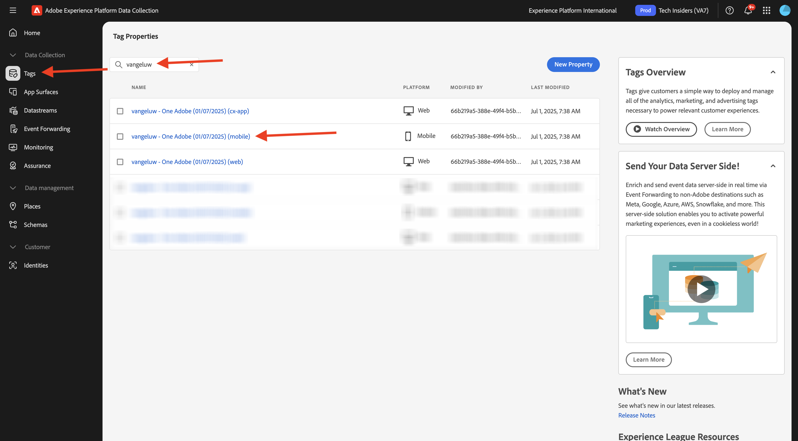
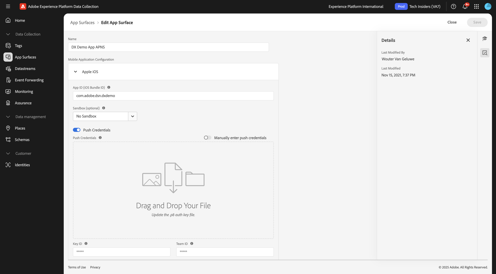
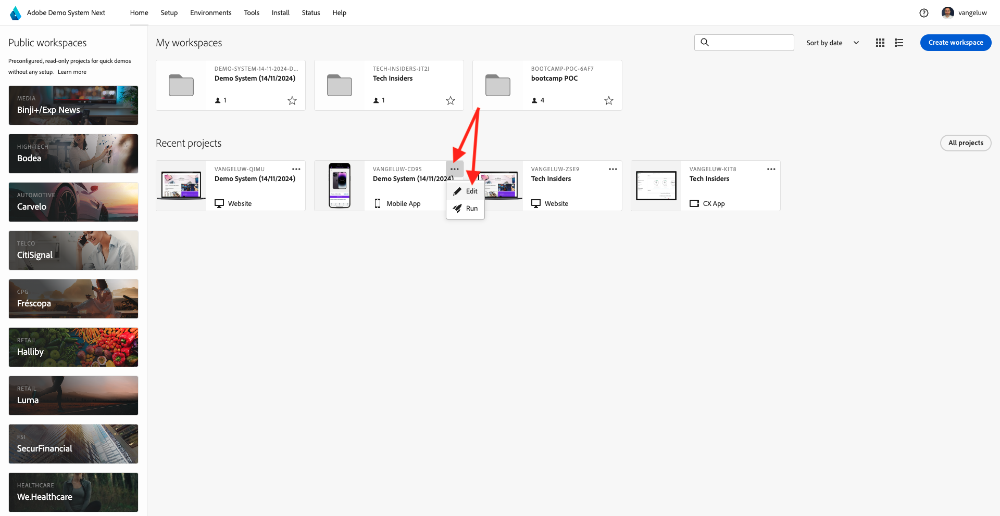

# 3.3.1 プッシュ通知の概要

Adobe Journey Optimizerでプッシュ通知を使用するには、確認して知っておくべき設定がいくつかあります。

検証するすべての設定を次に示します。

- Adobe Experience Platformのデータセットとスキーマ
- モバイル用データストリーム
- モバイルのデータ収集プロパティ
- プッシュ証明書のアプリサーフェス
- AEP Assuranceを使用したプッシュ設定のテスト

1 つずつ見ていきましょう。

[Adobe Experience Cloud](https://experience.adobe.com) に移動して、Adobe Journey Optimizerにログインします。 **Journey Optimizer** をクリックします。

Journey Optimizerの **ホーム** ビューにリダイレクトされます。 最初に、正しいサンドボックスを使用していることを確認します。 使用するサンドボックスは `--aepSandboxName--` です。 その後、サンドボックス **ージの** ホーム `--aepSandboxName--` ビューに移動します。

## 3.3.1.1 プッシュデータセット

Adobe Journey Optimizerは、データセットを使用して、モバイルデバイスからのプッシュトークンや、プッシュメッセージとのインタラクション（送信済みメッセージ、開封されたメッセージなど）をAdobe Journey Optimizerのデータセットに保存します。

これらのデータセットは、画面左側のメニューにある **データセット** に移動すると見つかります。 システムデータセットを表示するには、「**フィルターを有効にする** アイコンをクリックします。

**System** のオプションを有効にして、**AJO** を検索します。 プッシュ通知に使用するデータセットが表示されます。

## モバイル用 3.3.1.2 データストリーム

[https://experience.adobe.com/#/data-collection/](https://experience.adobe.com/#/data-collection/) に移動します。

左側のメニューで、**データストリーム** に移動し、[ はじめに ](./../../../../modules/getting-started/gettingstarted/ex2.md) で作成したデータストリームを検索します。名前は `--aepUserLdap-- - One Adobe Datastream (Mobile)` です。 クリックして開きます。

**2&rbrace;Adobe Experience Platform** サービスの「編集 **をクリックします。**

次に、定義したデータストリーム設定と、どのデータセットイベントおよびプロファイル属性に保存されるかを確認します。

また、まだ有効になっていない場合は、次のオプションを有効にする必要があります。

- **Offer Decisioning**
- **パーソナライゼーションの宛先**
- **Adobe Journey Optimizer**

「**保存**」をクリックします。

## モバ 3.3.1.3 ルのデータ収集プロパティを確認するには

[https://experience.adobe.com/#/data-collection/](https://experience.adobe.com/#/data-collection/) の **Tags** に移動します。 [ はじめに ](./../../../../modules/getting-started/gettingstarted/ex1.md) モジュールの一部として、データ収集タグのプロパティが作成されました。

これらのデータ収集タグのプロパティは、既に以前のモジュールの一部として使用しています。

クリックして、モバイルのデータ収集プロパティを開きます。

データ収集プロパティで、「**拡張機能**」に移動します。 次に、モバイルアプリに必要な様々な拡張機能が表示されます。 拡張機能 **Adobe Experience Platform Edge Networkをクリックして選択し** 「**設定**」を選択します。

その後、モバイルのデータストリームがここにリンクされていることがわかります。 次に、「**キャンセル**」をクリックして、拡張機能の概要に戻ります。

その後、ここに戻ってきます。 **AEP Assurance** の拡張機能が表示されます。 AEP Assuranceは、モバイルアプリでデータを収集したりエクスペリエンスを提供したりする方法を検査、配達確認、シミュレートおよび検証するのに役立ちます。 AEP Assuranceについて詳しくは、[https://experienceleague.adobe.com/en/docs/experience-platform/assurance/home](https://experienceleague.adobe.com/ja/docs/experience-platform/assurance/home) を参照してください。

次に、「**設定**」をクリックして、拡張機能 **2&rbrace;Adobe Journey Optimizer&rbrace; を開きます。**&#x200B;この拡張機能により、Adobe Journey Optimizerのプッシュ通知と測定が可能になります。

プッシュイベントをトラッキングするデータセットがリンクされている場所がわかります。 データ収集プロパティを変更する必要はありません。 前の画面に戻るには、「**キャンセル**」をクリックします。

## 3.3.1.4 アプリサーフェスの設定を確認する

[https://experience.adobe.com/#/data-collection/](https://experience.adobe.com/#/data-collection/) に移動します。 左側のメニューで **アプリサーフェス** に移動し、「DX Demo App APNS **のアプリサーフェスを開き** す。

iOSとAndroid用に設定されたアプリサーフェスが表示されます。

## 3.3.1.5 AEP Assuranceを使用してプッシュ通知の設定をテストします。

**DX デモ** モバイルアプリケーションは **はじめに** モジュールの一部として既にインストールされています。 アプリがインストールされると、デバイスのホーム画面に表示されます。 アイコンをクリックして、アプリを開きます。

ログインすると、通知を送信する権限を要求する通知が表示されます。 チュートリアルの一部として通知を送信するので、「**許可**」をクリックします。

その後、アプリのホームページが表示されます。 **設定** に移動します。

設定では、現在 **公開プロジェクト** がアプリに読み込まれていることがわかります。 **カスタムプロジェクト** をクリックします。

これで、カスタムプロジェクトを読み込めるようになりました。 QR コードをクリックして、プロジェクトを簡単に読み込みます。

**はじめに** の節を実行すると、次の結果が得られます。 クリックして、作成された **モバイル小売プロジェクト** を開きます。

誤ってブラウザーウィンドウを閉じてしまった場合や、今後のデモまたはイネーブルメントセッションの際には、[https://dsn.adobe.com/projects](https://dsn.adobe.com/projects) にアクセスして web サイトプロジェクトにアクセスすることもできます。 Adobe IDでログインすると、このが表示されます。 モバイルアプリプロジェクトをクリックして開きます。

次に、「**実行** をクリックします。

QR コードを含むこのポップアップが表示されます。 モバイルアプリ内からこの QR コードをスキャンします。

その後、アプリにプロジェクト ID が表示され、「切り替え **をクリックでき** す。

これで、アプリを使用する準備が整いました。

ここでは、QR コードをスキャンして、モバイルデバイスをAssurance セッションに接続する必要があります。

AEP Assuranceのセッションを開始するには、[https://experience.adobe.com/#/data-collection/](https://experience.adobe.com/#/data-collection/) に移動します。 左側のメニューで **0&rbrace;Assurance&rbrace; をクリックします。**&#x200B;次に、「**セッションを作成**」をクリックします。

**ディープリンク接続** を選択してから、**開始** をクリックします。

次の値を入力します。

- セッション名：`--aepUserLdap-- - Push Debugging`
- ベース URL: `dxdemo://default`

「**次へ**」をクリックします。

画面に QR コードが表示されるので、iOS デバイスでスキャンする必要があります。

モバイルデバイスでカメラアプリを開き、Assuranceに表示される QR コードをスキャンします。

PIN コードを入力するように求めるポップアップ画面が表示されます。 AEP Assurance画面から PIN コードをコピーし、「**接続**」をクリックします。

その後、これが表示されます。

Assuranceで、クライアントデバイスがAssurance セッションに接続されていることがわかります。 次に、「**設定**」をクリックします。

下にスクロールして **プッシュデバッグ** を表示します。 **+** アイコンをクリックしてから、「**保存** をクリックします。

**プッシュデバッグ** に移動します。 これが表示されます。

説明：

- 最初の列 **クライアント** には、iOS デバイスで使用可能な識別子が表示されます。 ECID とプッシュトークンが表示されます。
- 2 番目の列には、**App Storeの資格情報と設定** が表示されます
- 2 番目の列には、**プロファイル** 情報と、プッシュトークンが格納されているプラットフォーム（APNS または APNSSandbox）に関する追加情報が表示されます。 「**プロファイルを検査**」ボタンをクリックすると、Adobe Experience Platformに移動し、完全なリアルタイム顧客プロファイルが表示されます。

プッシュ設定をテストするには、「**テストプッシュ設定を送信** ボタンに移動します。 「**テストプッシュ通知を送信**」をクリックします

**プッシュ通知を送信** ボタンをクリックしたときに **DX デモ** アプリが開いていないことを確認する必要があります。 アプリが開いている場合、プッシュ通知はバックグラウンドで受信され、表示されない可能性があります。

次に、このようなプッシュ通知がモバイルデバイスに表示されます。

プッシュ通知を受け取った場合は、設定が正しく、正常に機能しており、実際のジャーニーを作成して、Journey Optimizerからプッシュメッセージを送信できるようになりました。

## 次の手順

[3.3.2 プッシュメッセージを使用したジャーニーの設定を参照してください ](./ex2.md){target="_blank"}

[Adobe Journey Optimizer: プッシュとアプリ内メッセージ ](ajopushinapp.md){target="_blank"} に戻る

[ すべてのモジュール ](./../../../../overview.md){target="_blank"} に戻る
