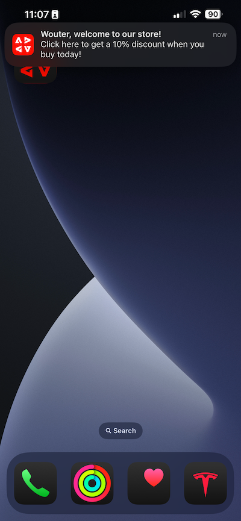

# 3.3.2 プッシュメッセージによるジャーニーの設定

## 新 3.4.4.6 いイベントを作成するには

**Journey Optimizer** に移動します。 左側のメニューで、**設定** に移動し、**イベント** の下の **管理** をクリックします。

**イベント** 画面には、次のようなビューが表示されます。 **イベントを作成** をクリックします。

空のイベント設定が表示されます。
まず、イベントに `--aepUserLdap--StoreEntryEvent` のような名前を付け、説明を `Store Entry Event` に設定します。
次に「**イベントタイプ** の選択です。 **単一** を選択します。
次に、「**イベント ID タイプ** の選択です。 「**システム生成**」を選択します。

次に、スキーマを選択します。 この演習では、スキーマを準備しました。 スキーマ `Demo System - Event Schema for Mobile App (Global v1.1) v.1` を使用してください。

スキーマを選択すると、「**ペイロード**」セクションで多数のフィールドが選択されます。 これで、イベントが完全に設定されました。

「**保存**」をクリックします。

これで、イベントが設定され、保存されました。 イベントを再度クリックすると、**イベントを編集** 画面が再度開きます。

**ペイロード** フィールドにマウスポインターを置き、**ペイロードを表示** アイコンをクリックします。

これで、期待されるペイロードの例が表示されます。

イベントには一意のオーケストレーション eventID があり、`_experience.campaign.orchestration.eventID` が表示されるまでペイロードを下にスクロールすると見つかります。

イベント ID は、次の手順で作成するジャーニーをトリガーにするためにAdobe Experience Platformに送信する必要があるものです。 次の手順で必要になるので、この eventID を書き留めます。
`"eventID": "89acd341ec2b7d1130c9a73535029debf2ac35f486bc99236b1a5091d6f4bc68"`

**OK** をクリックし、続いて **キャンセル** をクリックします。

## ジャ 3.4.4.7 ニーの作成

メニューで、**ジャーニーに移動し** 「**ジャーニーを作成**」をクリックします。

その後、これが表示されます。 ジャーニーに名前を付けます。 `--aepUserLdap-- - Store Entry journey`.を使用します。「**保存**」をクリックします。

まず、ジャーニーの出発点としてイベントを追加する必要があります。 イベント `--aepUserLdap--StoreEntryEvent` を検索して、キャンバスにドラッグ&amp;ドロップします。 「**保存**」をクリックします。

次に、**アクション** で **プッシュ** アクションを検索します。 **プッシュ** アクションをキャンバスにドラッグ&amp;ドロップします。

**カテゴリ** を **マーケティング** に設定し、プッシュ通知の送信を可能にするプッシュサーフェスを選択します。 この場合、選択するメールサーフェスは **プッシュ - iOS - Android** です。

>[!NOTE]
>
>前に説明したように、**アプリサーフェス** を使用しているJourney Optimizer内にチャネルが存在する必要があります。

次の手順では、メッセージを作成します。 それには、「**コンテンツを編集** をクリックします。

その後、これが表示されます。 **タイトル** フィールドの **パーソナライズ機能** アイコンをクリックします。

その後、これが表示されます。 リアルタイム顧客プロファイルから任意のプロファイル属性を直接選択できるようになりました。

フィールド **名** を検索し、フィールド **名** の横にある **+** アイコンをクリックします。 次に、名のパーソナライゼーショントークンが追加されています：**{{profile.person.name.firstName}}**。

次に、テキスト **を追加します。** の後ろに **{{profile.person.name.firstName}}** る。

「**保存**」をクリックします。

あなたはこれを手に入れました。 **本文** フィールドの **パーソナライズ機能** アイコンをクリックします。

このテキストを入力してください **今日ご購入いただくと、10% の割引が適用されます。** 保存 **をクリック** ます。

これで完了です。 左上隅の矢印をクリックして、ジャーニーに戻ります。

「**保存**」をクリックして、プッシュアクションを閉じます。

「**公開**」をクリックします。

もう一度 **公開** をクリックします。

これで、ジャーニーが公開されました。

## 3.4.4.8 ジャーニーのテストとプッシュメッセージ

DX Demo 2.0 モバイルアプリケーションで、**設定** 画面に移動します。 **ストアエントリ** ボタンをクリックします。

>[!NOTE]
>
>「**ストアエントリ**」ボタンは現在実装中です。 アプリにはまだ表示されません。

**ストアエントリ** アイコンをクリックした後、必ずアプリを直ちに閉じてください。閉じないと、プッシュメッセージは表示されません。

数秒後に、メッセージが表示されます。

この演習は完了しました。

## 次の手順

[3.3.3 アプリ内メッセージを使用したキャンペーンの設定に移動 ](./ex3.md){target="_blank"}

[Adobe Journey Optimizer: プッシュとアプリ内メッセージ ](ajopushinapp.md){target="_blank"} に戻る

[ すべてのモジュール ](./../../../../overview.md){target="_blank"} に戻る
