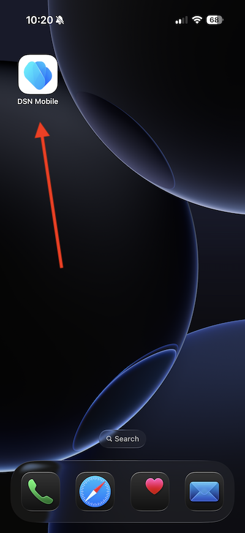

# 3.3.2 プッシュメッセージによるジャーニーの設定

[Adobe Experience Cloud](https://experience.adobe.com) に移動して、Adobe Journey Optimizerにログインします。 **Journey Optimizer** をクリックします。

Journey Optimizerの **ホーム** ビューにリダイレクトされます。 最初に、正しいサンドボックスを使用していることを確認します。 使用するサンドボックスは `--aepSandboxName--` です。 その後、サンドボックス **ージの** ホーム `--aepSandboxName--` ビューに移動します。

## 新 3.3.2.1 いイベントを作成するには

左側のメニューで、**設定** に移動し、**イベント** の下の **管理** をクリックします。

**イベント** 画面には、次のようなビューが表示されます。 **イベントを作成** をクリックします。

空のイベント設定が表示されます。
まず、イベントに `--aepUserLdap--StoreEntryEvent` のような名前を付け、説明を `Store Entry Event` に設定します。
次に「**イベントタイプ** の選択です。 **単一** を選択します。
次に、「**イベント ID タイプ** の選択です。 「**システム生成**」を選択します。

次に、スキーマを選択します。 この演習では、スキーマを準備しました。 スキーマ `Demo System - Event Schema for Mobile App (Global v1.1) v.1` を使用してください。

スキーマを選択すると、「**ペイロード**」セクションで多数のフィールドが選択されます。 フィールド **名前空間** が **ECID** に設定されていることを確認します。 これで、イベントが完全に設定されました。

「**保存**」をクリックします。

これで、イベントが設定され、保存されました。 イベントを再度クリックすると、**イベントを編集** 画面が再度開きます。

**ペイロード** フィールドにマウスポインターを置き、**ペイロードを表示** アイコンをクリックします。

これで、期待されるペイロードの例が表示されます。

イベントには一意のオーケストレーション eventID があり、`_experience.campaign.orchestration.eventID` が表示されるまでペイロードを下にスクロールすると見つかります。

イベント ID は、次の手順で作成するジャーニーをトリガーにするためにAdobe Experience Platformに送信する必要があるものです。 次の手順で必要になるので、この eventID を書き留めます。
`"eventID": "aa895251f76831e6440f169f1bb9d2a4388f0696d8e2782cfab192a275817dfa"`

「**OK**」をクリックします。

**キャンセル** をクリックします。

## ジャ 3.3.2.2 ニーの作成

左側のメニューで、**ジャーニーに移動し** 「**ジャーニーを作成**」をクリックします。

その後、これが表示されます。 ジャーニーに `--aepUserLdap-- - Store Entry journey` という名前を付けます。 「**保存**」をクリックします。

まず、ジャーニーの出発点としてイベントを追加する必要があります。 イベント `--aepUserLdap--StoreEntryEvent` を検索して、キャンバスにドラッグ&amp;ドロップします。 「**保存**」をクリックします。

次に、**アクション** で **プッシュ** アクションを検索します。 **プッシュ** アクションをキャンバスにドラッグ&amp;ドロップします。

**カテゴリ** を **マーケティング** に設定し、プッシュ通知の送信を可能にするプッシュサーフェスを選択します。 この場合、選択するメールサーフェスは **プッシュ - iOS - Android** です。

>[!NOTE]
>
>前に説明したように、**アプリサーフェス** を使用しているJourney Optimizer内にチャネルが存在する必要があります。

次の手順では、メッセージを作成します。 それには、「**コンテンツを編集** をクリックします。

その後、これが表示されます。 **タイトル** フィールドの **パーソナライズ機能** アイコンをクリックします。

その後、これが表示されます。 リアルタイム顧客プロファイルから任意のプロファイル属性を直接選択できるようになりました。

フィールド **名** を検索し、フィールド **名** の横にある **+** アイコンをクリックします。 次に、名のパーソナライゼーショントークンが追加されています：**{{profile.person.name.firstName}}**。

次に、テキスト **を追加します。** の後ろに **{{profile.person.name.firstName}}** る。

「**保存**」をクリックします。

あなたはこれを手に入れました。 **本文** フィールドの **パーソナライズ機能** アイコンをクリックします。

このテキストを入力してください **今日ご購入いただくと、10% の割引が適用されます。** 保存 **をクリック** ます。

これで完了です。 左上隅の矢印をクリックして、ジャーニーに戻ります。

「**保存**」をクリックして、プッシュアクションを閉じます。

「**公開**」をクリックします。

もう一度 **公開** をクリックします。

これで、ジャーニーが公開されました。

## 3.3.2.3 モバイルのデータ収集プロパティを更新

**はじめに** で、デモシステムは次に、Web サイト用とモバイルアプリ用に 1 つのタグプロパティを作成しました。 `--aepUserLdap--` 検索 **ボックスで** を検索して見つけます。 クリックして **モバイル** プロパティを開きます。

この画像が表示されます。

左側のメニューで、**ルール** に移動し、をクリックしてルール **場所エントリ** を開きます。

この画像が表示されます。 アクション **Mobile Core - データを添付** をクリックします。

この画像が表示されます。

`--aepUserLdap--StoreEntryEvent`JSON ペイロード **ウィンドウにイベント** の eventID を貼り付けます。 「**変更を保存**」をクリックします。

**保存** または **ライブラリに保存** をクリックします。

**公開フロー** に移動し、クリックしてライブラリ **メイン** を開きます。

「**変更されたリソースをすべて追加**」をクリックし、「**開発用に保存およびビルド**」をクリックします。

## 3.3.2.4 ジャーニーのテストとプッシュメッセージ

**DSN Mobile** アプリケーションを開きます。

**ストアロケーター** ページに移動します。

**POI エントリをシミュレート** をクリックします。

数秒後に、プッシュ通知が表示されます。

## 次の手順

[3.3.3 アプリ内メッセージを使用したキャンペーンの設定に移動 ](./ex3.md){target="_blank"}

[Adobe Journey Optimizer: プッシュとアプリ内メッセージ ](ajopushinapp.md){target="_blank"} に戻る

[ すべてのモジュール ](./../../../../overview.md){target="_blank"} に戻る