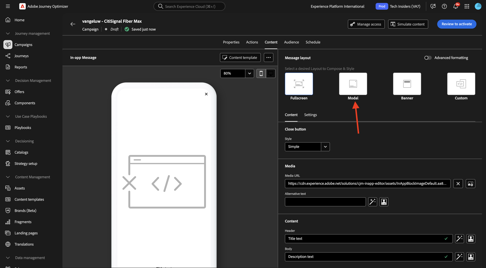
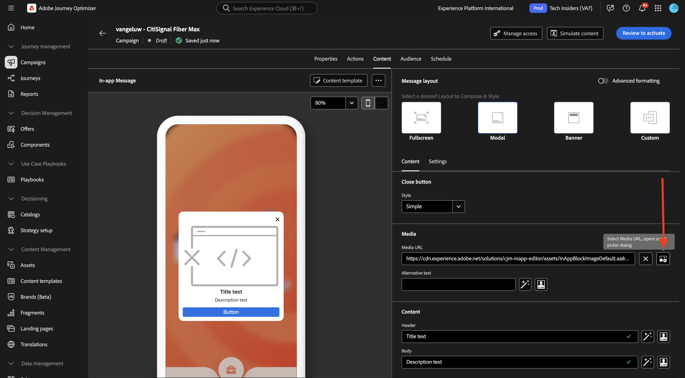

# 3.3.3 アプリ内メッセージを含むキャンペーンの設定

[Adobe Experience Cloud](https://experience.adobe.com) に移動して、Adobe Journey Optimizerにログインします。 **Journey Optimizer** をクリックします。

Journey Optimizerの **ホーム** ビューにリダイレクトされます。 最初に、正しいサンドボックスを使用していることを確認します。 使用するサンドボックスは `--aepSandboxName--` です。 その後、サンドボックス **ージの** ホーム `--aepSandboxName--` ビューに移動します。

## 3.3.3.1 アプリ内メッセージチャネルの設定

左側のメニューで、**チャネル** に移動し、**チャネル設定** を選択します。 **チャネル設定を作成** をクリックします。

名前 `--aepUserLdap--_In-app_Messages` を入力し、チャンネル **アプリ内メッセージ** を選択してから、プラットフォーム **Web**、**iOS** および **Android** を有効にします。

下にスクロールすると、これが表示されます。

**単一ページ** が有効になっていることを確認します。

**Web** については、**はじめに** モジュールの一部として以前に作成した web サイトの URL を入力します。次に `https://dsn.adobe.com/web/--aepUserLdap---XXXX` を示します。 必ず **XXXX** を web サイトの一意のコードに変更してください。

**iOS** および **Android** には、`com.adobe.dsn.dxdemo` と入力します。

上にスクロールして、「送信 **をクリックし** す。

これで、チャネル設定を使用する準備が整いました。

## 3.3.3.2 アプリ内メッセージ用のスケジュール済みキャンペーンの設定

左側のメニューで **キャンペーン** に移動し、「**キャンペーンを作成**」をクリックします。

**スケジュール済み – マーケティング** を選択し、「**作成**」をクリックします。

`--aepUserLdap-- - CitiSignal Fiber Max` という名前を入力し、「**アクション**」をクリックします。

「**+アクションを追加**」をクリックし、「**アプリ内メッセージ**」を選択します。

前の手順で作成したアプリ内メッセージチャネル設定（`--aepUserLdap--_In-app_Messages`）を選択します。 「**コンテンツを編集**」をクリックします。

この画像が表示されます。 **モーダル** をクリックします。

**レイアウトを変更** をクリックします。

**メディア URL** アイコンをクリックして、AEM Assetsからアセットを選択します。

フォルダー **citignal-images** に移動し、画像ファイル **neon-rabbit.jpg** を選択します。 「**選択**」をクリックします。

**ヘッダー** テキストには、`CitiSignal Fiber Max` を使用します。
**本文** テキストには、`Conquer lag with Fiber Max` を使用します。

**Button #1 text** を `Go to Plans` に設定します。
**target** を `com.adobe.dsn.dxdemo://plans` に設定します。

**アクティブ化するレビュー** をクリックします。

**アクティブ化** をクリックします。

これで、キャンペーンのステータスが「**アクティブ化中** に設定されました。 キャンペーンが開始されるまでに数分かかる場合があります。

ステータスが **ライブ** に変更されたら、キャンペーンをテストできます。

## 3.3.3.3 モバイルでのアプリ内メッセージキャンペーンのテスト

モバイルデバイスで、アプリを開きます。 アプリを起動すると、新しいアプリ内メッセージが表示されます。 「計画に進む **ボタンをクリックし** す。

その後、**プラン** ページに移動します。

## 次の手順

[&#x200B; 概要とメリット &#x200B;](./summary.md){target="_blank"} に移動します。

[Adobe Journey Optimizer: プッシュとアプリ内メッセージ &#x200B;](ajopushinapp.md){target="_blank"} に戻る

[&#x200B; すべてのモジュール &#x200B;](./../../../../overview.md){target="_blank"} に戻る
