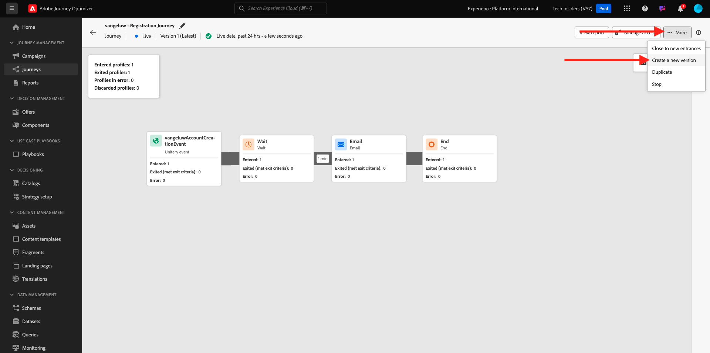
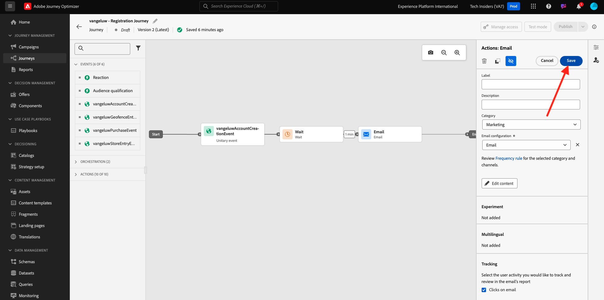
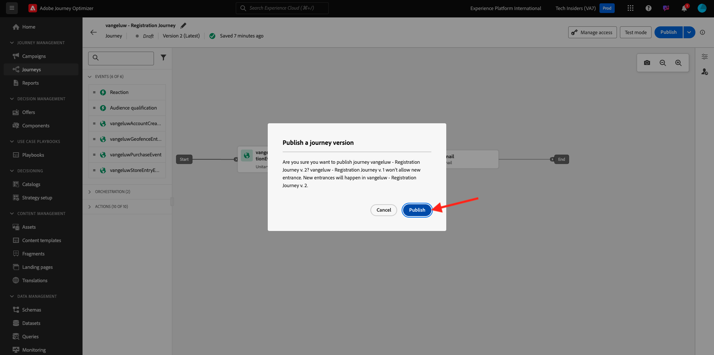

# 3.3.5 メールでの決定の使用

この演習では、決定を使用してメールと SMS の配信をパーソナライズします。

**ジャーニー** に移動します。 演習 3.1.3 で作成した `--aepUserLdap-- - Registration Journey` という名前のジャーニーを見つけます。 ジャーニーをクリックして開きます。

その後、これが表示されます。 「**...」をクリックします。詳細を表示し**[**新しいバージョンの作成**] をクリックします。

**新しいバージョンを作成** をクリックします。

**メール** アクションをクリックし、**コンテンツを編集** をクリックします。

その後、メッセージダッシュボードが表示されます。 **メール本文を編集** をクリックします。

その後、これが表示されます。 新しい **1:1 列** 構造コンポーネントをキャンバスにドラッグします。

メニューの **コンテンツ** に移動します。 **オファーの決定** コンポーネントを選択し、次に示すように、このコンポーネントをメールのコンテンツオファープレースホルダーにドラッグ&amp;ドロップします。 次に、「**追加** をクリックします。

メールに含めるプレースメントのタイプを選択します。 **プレースメント** ドロップダウンメニューで **メール – 画像** を選択し、決定 `--aepUserLdap-- - CitiSignal Decision` を選択します。 「**追加**」をクリックします。

これで、すべてのパーソナライズされたオファーとフォールバックオファーを切り替えることができ、それらのすべてが電子メールデザイナー内で視覚化されます。 「**保存**」をクリックします。

ここで、矢印をクリックして前の画面に戻ります。

左上隅の矢印をクリックして、ジャーニーに戻ります。

**保存** をクリックして、**メール** アクションを閉じます。

**公開** をクリックして、更新したジャーニーを公開します。

「**公開** を再度クリックして確認します。

メッセージが公開されました。

デモ Web サイトで新しいアカウントを作成すると、このメールが届きます。

この演習は完了しました。

## 次の手順

[3.3.6 API を使用した決定のテストに移動します ](./ex6.md){target="_blank"}

[Offer Decisioning](offer-decisioning.md){target="_blank"} に戻る

[ すべてのモジュール ](./../../../../overview.md){target="_blank"} に戻る
