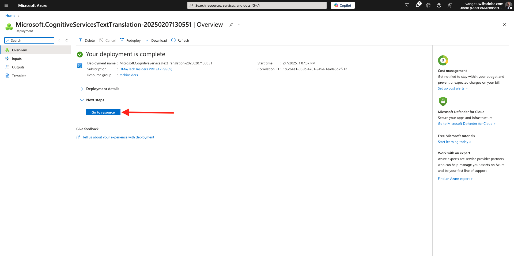
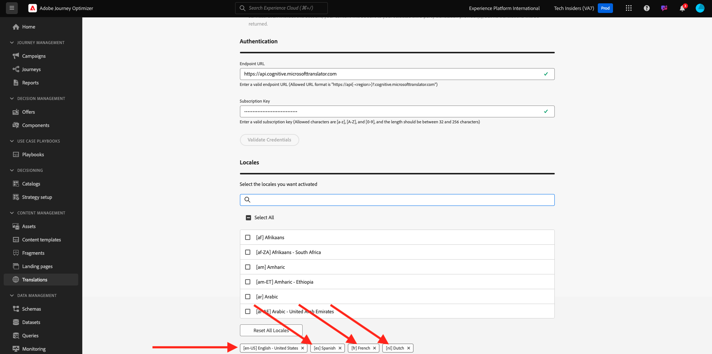
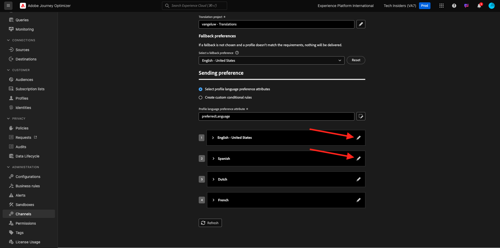

# 3.5.1 翻訳プロバイダー

## 3.5.1.1 Microsoft Azure Translator の設定

[https://portal.azure.com/#home](https://portal.azure.com/#home) に移動します。

検索バーに「`translators`」と入力します。 次に、「**+作成**」をクリックします。

**トランスレーターを作成** を選択します。

**サブスクリプション ID** と **リソースグループ** を選択します。
**地域** を **グローバル** に設定します。
**Pricing Tier** を **Free F0** に設定します。

「**レビューと作成**」を選択します。

「**作成**」を選択します。

「**リソースに移動**」を選択します。

左側のメニューで、**リソース管理**/**キーとエンドポイント** に移動します。 クリックしてキーをコピーします。

## 3.5.1.2 ロケール辞書

[https://experience.adobe.com/](https://experience.adobe.com/) に移動します。 **Journey Optimizer** をクリックします。

左側のメニューで **翻訳** に移動し、**ロケール辞書** に移動します。 このメッセージが表示されたら、「**デフォルトのロケールを追加**」をクリックします。

この画像が表示されます。

## 3.5.1.3 AJOで翻訳プロバイダーを設定する

[https://experience.adobe.com/](https://experience.adobe.com/) に移動します。 **Journey Optimizer** をクリックします。

左側のメニューで、**翻訳** に移動し、**プロバイダー** に移動します。 **プロバイダーを追加** をクリックします。

**プロバイダー** で、「**Microsoft Translator**」を選択します。 翻訳プロバイダーの使用を有効にするには、このチェックボックスをオンにします。 Microsoft Azure トランスレーターからコピーしたキーを貼り付けます。 次に、「**認証情報を検証**」をクリックします。

認証情報が正常に検証されます。 該当する場合は、下にスクロールして翻訳言語を選択します。

`[en-US] English`、`[es] Spanish`、`[fr] French`、`[nl] Dutch` を必ず選択してください。

上にスクロールして、「**保存**」をクリックします。

これで、**翻訳プロバイダー** を使用する準備が整いました。

## 3.5.1.4 翻訳プロジェクトの設定

[https://experience.adobe.com/](https://experience.adobe.com/) に移動します。 **Journey Optimizer** をクリックします。

左側のメニューで **翻訳** に移動し、**ロケール辞書** に移動します。 このメッセージが表示されたら、「**プロジェクトを作成**」をクリックします。

名前 `--aepUserLdap-- - Translations` を入力し、**Source ロケール** を `[en-US] English - United States` に設定して、「承認された翻訳を自動的に公開する **と** レビューワークフローを有効にする **の両方を有効にするには、チェックボックスをオンにし** す。 次に、「**+ ロケールを追加**」をクリックします。

「`fr`」を検索し、「`[fr] French`」のチェックボックスを有効にして、「**Microsoft Translator**」のチェックボックスを有効にします。 「**+ ロケールを追加**」をクリックします。

「`es`」を検索し、「`[es] Spanish`」のチェックボックスを有効にして、「**Microsoft Translator**」のチェックボックスを有効にします。 「**+ ロケールを追加**」をクリックします。

「`nl`」を検索し、「`[nl] Spanish`」のチェックボックスを有効にして、「**Microsoft Translator**」のチェックボックスを有効にします。 「**+ ロケールを追加**」をクリックします。

「**保存**」をクリックします。

これで、**翻訳** プロジェクトを使用する準備が整いました。

## 3.5.1.5 言語設定の指定

**チャネル**/**一般設定**/**言語設定** に移動します。 **言語設定を作成** をクリックします。

`--aepUserLdap--_translations` という名前を使用します。 **翻訳プロジェクト** を選択します。 次に、「**編集** アイコンをクリックします。

前の手順で作成した翻訳プロジェクトを選択します。 「**選択**」をクリックします。

この画像が表示されます。 **フォールバック環境設定** を **英語 – 米国** に設定します。 **プロファイル言語の優先属性を選択** をクリックして選択します。これにより、顧客プロファイルのどのフィールドを使用して翻訳を読み込むかを決定します。 次に、「**編集**」アイコンをクリックして、使用するフィールドを選択します。

検索バーに **優先言語** と入力し、「**優先言語**」フィールドを選択します。

**英語/米国** と **オランダ語** の両方の **編集** アイコンをクリックして、設定を確認します。

次に、**英語/米国** の設定を示します。 **キャンセル** をクリックします。

クリックして **オランダ語** の設定を表示します。 **キャンセル** をクリックします。

上にスクロールして、「送信 **をクリックし** す。

これで、言語設定が構成されました。

この演習は完了しました。

## 次の手順

[3.5.2 キャンペーンの作成 &#x200B;](./ex2.md) に移動します。

[Adobe Journey Optimizer：翻訳サービス &#x200B;](./ajotranslationsvcs.md){target="_blank"} に戻る

[&#x200B; すべてのモジュール &#x200B;](./../../../../overview.md){target="_blank"} に戻る
