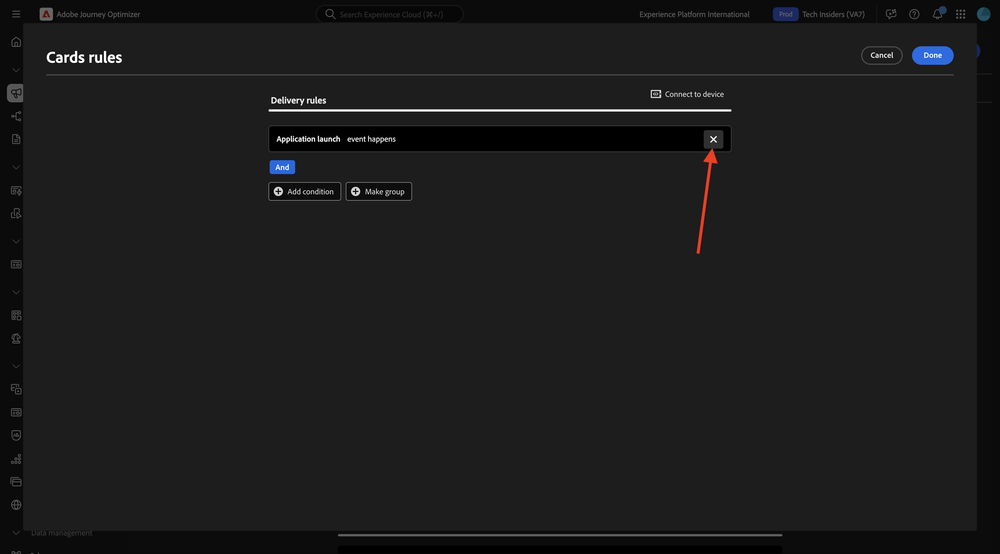
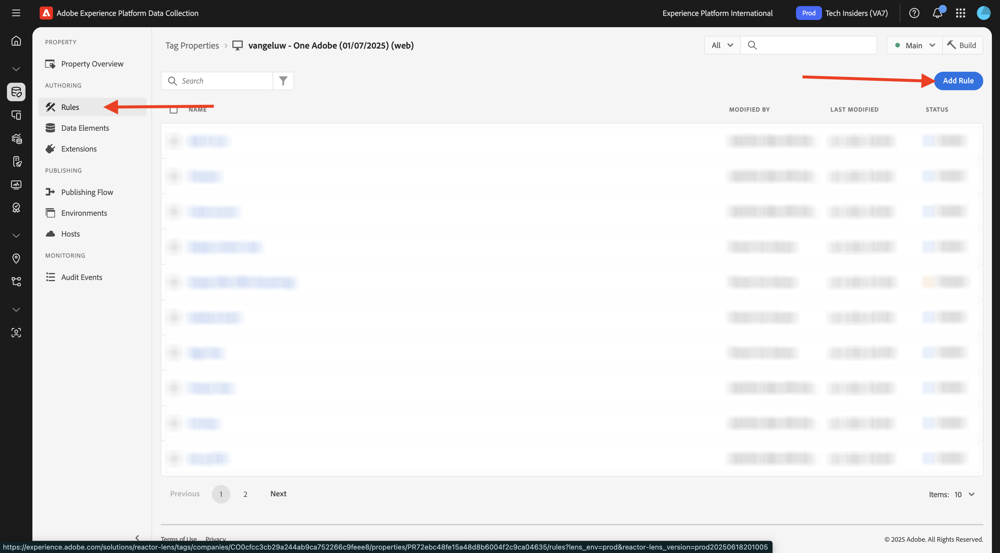
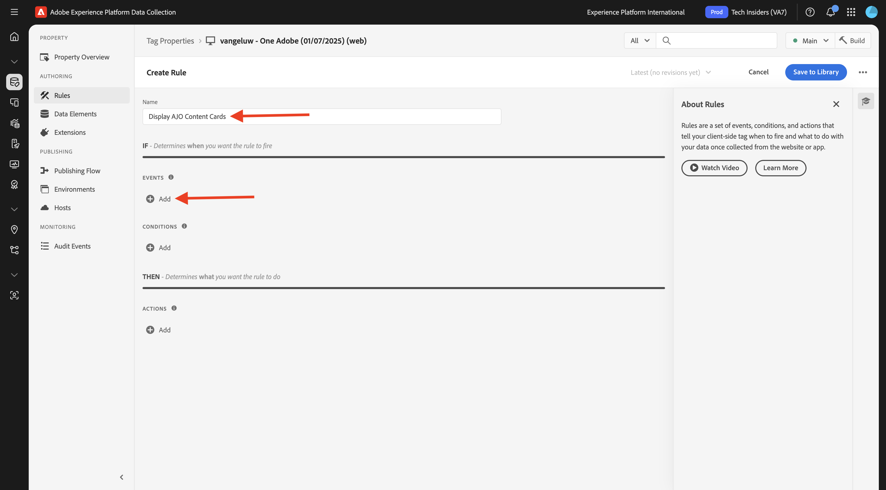

# 3.6.1 コンテンツカード

[Adobe Experience Cloud](https://experience.adobe.com) に移動して、Adobe Journey Optimizerにログインします。 **Journey Optimizer** をクリックします。


Journey Optimizerの **ホーム** ビューにリダイレクトされます。 最初に、正しいサンドボックスを使用していることを確認します。 使用するサンドボックスは `--aepSandboxName--` です。 その後、サンドボックス **ージの** ホーム `--aepSandboxName--` ビューに移動します。


## 3.6.1.1 コンテンツカードチャネルの設定

左側のメニューで、**チャネル** に移動し、**チャネル設定** を選択します。 **チャネル設定を作成** をクリックします。


名前 `--aepUserLdap--_Content_Cards_Web` を入力し、チャネル **コンテンツカード** を選択して、プラットフォーム **Web** を有効にします。


下にスクロールし、「**単一ページ**」オプションが有効になっていることを確認します。

**はじめに** モジュールの一部として以前に作成した web サイトの URL を入力します。次のように表示されます：`https://dsn.adobe.com/web/--aepUserLdap---XXXX`。 必ず **XXXX** を web サイトの一意のコードに変更してください。

>[!IMPORTANT]
>
>上記の CitiSignal デモ Web サイトの URL `https://dsn.adobe.com/web/--aepUserLdap---XXXX` への参照は、実際の URL に変更する必要があります。 URL は、[https://dsn.adobe.com/](https://dsn.adobe.com/) の Web サイト プロジェクトで確認できます。

フィールド **ページ上の場所** を `CitiSignalContentCardContainer` に設定します。


上にスクロールして、「送信 **をクリックし** す。


これで、チャネル設定を使用する準備が整いました。


## コンテンツカード用にスケジュール済みキャンペーンを設定で 3.6.1.2 ない

左側のメニューで **キャンペーン** に移動し、「**キャンペーンを作成**」をクリックします。


**スケジュール済み – マーケティング** を選択し、「**作成**」をクリックします。


`--aepUserLdap-- - CitiSignal Fiber Max Content Cards` という名前を入力し、「**アクション**」をクリックします。


「**+アクションを追加**」をクリックし、「**コンテンツカード**」を選択します。


前の手順で作成したコンテンツカードチャネル設定（`--aepUserLdap--_Content_Cards_Web`）を選択します。

次に、「**ルールを編集**」をクリックします。


**X** をクリックして、現在のルールを削除します。



「**+条件を追加**」をクリックします。


条件 **Platform にデータを送信** を選択します。 「**完了**」をクリックします。


この画像が表示されます。 「**コンテンツを編集**」をクリックします。


この画像が表示されます。


次の設定を行います。

- **タイトル**: `CitiSignal Fiber Max`
- **本文**: `Lightning speed for gamers`
- **ターゲット URL**: `https://dsn.adobe.com/web/--aepUserLdap---XXXX/plans`

>[!IMPORTANT]
>
>上記の CitiSignal デモ Web サイトの URL `https://dsn.adobe.com/web/--aepUserLdap---XXXX/plans` への参照は、実際の URL に変更する必要があります。 URL は、[https://dsn.adobe.com/](https://dsn.adobe.com/) の Web サイト プロジェクトで確認できます。

アイコンをクリックし、AEM Assetsからアセットを選択して URL を変更します。


folder **citignal-imaes に移動し** ファイル **`neon_rabbit_banner.jpg`** を選択します。 「**選択**」をクリックします。


これで完了です。 「**+追加ボタン**」をクリックします。


ボタンの次の設定を行います。

- **ボタンのタイトル**: `Upgrade now!`
- **インタラクションイベント**:`click`
- **ターゲット**: `https://dsn.adobe.com/web/--aepUserLdap---XXXX/plans`

>[!IMPORTANT]
>
>上記の CitiSignal デモ Web サイトの URL `https://dsn.adobe.com/web/--aepUserLdap---XXXX/plans` への参照は、実際の URL に変更する必要があります。 URL は、[https://dsn.adobe.com/](https://dsn.adobe.com/) の Web サイト プロジェクトで確認できます。

**アクティブ化するレビュー** をクリックします。


**アクティブ化** をクリックします。


その後、キャンペーンがアクティブ化されます（数分かかる場合があります）。


数分後、キャンペーンはライブになります。


## 3.6.1.3 DSN Web サイトの更新

Web サイトにコンテンツカードを表示するには、CitiSignal デモサイトのホームページのデザインを変更する必要があります。

[https://dsn.adobe.com/](https://dsn.adobe.com/) に移動します。 Web サイトで「**3 ドット**」をクリックし、「**編集**」をクリックします。


クリックしてページ **ホーム** を選択します。 「**コンテンツを編集**」をクリックします。


ヒーロー画像の上にマウスポインターを置き、「**+**」ボタンをクリックします。


**一般** に移動し、「**バナー**」を選択してから「**追加**」をクリックします。


新しく作成したバナーをクリックして選択します。 **スタイル** に移動し、「`CitiSignalContentCardContainer` カスタム CSS クラス **」フィールドに** と入力します。


**整列** に移動します。 フィールド **Alignment** を `left` に設定し、フィールド **Vertical Alignment** を `middle` に設定します。

**X** アイコンをクリックして、ダイアログウィンドウを閉じます。


これで、web サイトデザインの変更が行われました。

新しいブラウザーウィンドウでサイトを開くと、次のようになります。 グレーの領域は新しく作成されたバナーですが、まだコンテンツがありません。


コンテンツが新しく作成されたバナーに動的に読み込まれるようにするには、データ収集タグのプロパティを変更する必要があります。

## デ 3.6.1.4 タ収集タグプロパティを更新するには

[https://experience.adobe.com/#/data-collection/](https://experience.adobe.com/#/data-collection/) の **Tags** に移動します。 [ はじめに ](./../../../../modules/getting-started/gettingstarted/ex1.md) モジュールの一部として、データ収集タグのプロパティが作成されました。

これらのデータ収集タグのプロパティは、既に以前のモジュールの一部として使用しています。

クリックすると、Web のデータ収集プロパティが開きます。


左側のメニューで、**ルール** に移動し、をクリックしてルール **ページビュー** を開きます。


アクション **「ページビュー」エクスペリエンスイベントを送信** をクリックします。


**ページビュー** ルールの一部として、特定のサーフェスについて、Edgeからパーソナライゼーション手順をリクエストする必要があります。 サーフェスは、前の手順で設定したバナーです。 これを行うには、**Personalizationまでスクロールし** 「`web://dsn.adobe.com/web/--aepUserLdap---XXXX#CitiSignalContentCardContainer` サーフェス **」に** と入力します。

>[!IMPORTANT]
>
>上記の CitiSignal デモ Web サイトの URL `web://dsn.adobe.com/web/--aepUserLdap---XXXX#CitiSignalContentCardContainer` への参照は、実際の URL に変更する必要があります。 URL は、[https://dsn.adobe.com/](https://dsn.adobe.com/) の Web サイト プロジェクトで確認できます。

「**変更を保存**」をクリックします。


**保存** または **ライブラリに保存** をクリックします。


左側のメニューで、「**ルール**」に移動し、「**ルールを追加**」をクリックします。



`Display AJO Content Cards` という名前を入力します。 「**+追加**」をクリックして、新しいイベントを追加します。



**拡張機能**:**Adobe Experience Platform Web SDK** を選択し、**イベントタイプ**: **購読ルールセットの項目** を選択します。

**スキーマ** の下で **コンテンツカード** を選択します。

**サーフェス** の下に、`web://dsn.adobe.com/web/--aepUserLdap---XXXX#CitiSignalContentCardContainer` と入力します

>[!IMPORTANT]
>
>上記の CitiSignal デモ Web サイトの URL `web://dsn.adobe.com/web/--aepUserLdap---XXXX#CitiSignalContentCardContainer` への参照は、実際の URL に変更する必要があります。 URL は、[https://dsn.adobe.com/](https://dsn.adobe.com/) の Web サイト プロジェクトで確認できます。

「**変更を保存**」をクリックします。


この画像が表示されます。 「**+追加**」をクリックして、新しいアクションを追加します。


**拡張機能**:**コア** を選択し、**アクションタイプ**:**カスタムコード** を選択します。

**Language**:**JavaScript} のチェックボックスをオンにして** 編集画面を開く **をクリックし** す。


すると、空のエディターウィンドウが表示されます。


以下のコードをエディターに貼り付けて、「**保存**」をクリックします。

```javascript
if (!Array.isArray(event.propositions)) {
  console.log("No personalization content");
  return;
}

console.log(">>> Content Card response from Edge: ", event.propositions);

event.propositions.forEach(function (payload) {
  payload.items.forEach(function (item) {
    if (!item.data || !item.data.content || item.data.content === "undefined") {
      return;
    }
    console.log(">>> Content Card response from Edge: ", item);
    const { content } = item.data;
    const { title, body, image, buttons } = content;
    const titleValue = title.content;
    const description = body.content;
    const imageUrl = image.url;
    const buttonLabel = buttons[0]?.text.content;
    const buttonLink = buttons[0]?.actionUrl;
    const html = `<div  class="Banner Banner--alignment-left Banner--verticalAlignment-left hero-banner ContentCardContainer"  oxygen-component-id="cmp-0"  oxygen-component="Banner"  role="presentation"  style="color: rgb(255, 255, 255); height: 60%;">  <div class="Image" role="presentation">      </div>  <div class="Banner__content">    <div class="Title Title--alignment-left Title--textAlignment-left">      <div class="Title__content" role="presentation">        <strong class="Title__pretitle">${titleValue}</strong>        <h2>${description}</h2>      </div>    </div>    <div class="Button Button--alignment-left Button--variant-cta">              <button          class="Dniwja_spectrum-Button Dniwja_spectrum-BaseButton Dniwja_i18nFontFamily Dniwja_spectrum-FocusRing Dniwja_spectrum-FocusRing-ring"          type="button"          data-variant="accent"          data-style="fill"          onclick="window.open('${buttonLink}')"       style="color:#FFFFFF;padding: 12px 28px;font-size: 24px;font-family: adobe-clean;font-weight: bolder;" >          <span            id="react-aria5848951631-49"            class="Dniwja_spectrum-Button-label"            >${buttonLabel}</span          >        </button>            </div>  </div></div>`;
    if (document.querySelector(".CitiSignalContentCardContainer")) {
      const contentCardContainer = document.querySelector(
        ".CitiSignalContentCardContainer"
      );
      contentCardContainer.innerHTML = html;
      contentCardContainer.style.height = "60%";
    }
  });
});
```


「**変更を保存**」をクリックします。


**保存** または **ライブラリに保存** をクリックします。


左側のメニューで、**公開フロー** に移動し、をクリックして **メイン** ライブラリを開きます。


「**変更されたリソースをすべて追加**」をクリックし、「**開発用に保存およびビルド**」をクリックします。


## 3.6.1.5 Web サイトでのコンテンツカードのテスト

[https://dsn.adobe.com](https://dsn.adobe.com) に移動します。 Adobe IDでログインすると、このが表示されます。 Web サイトプロジェクトで「。..**」** いう 3 つのドットをクリックし、「**実行**」をクリックして開きます。


その後、デモ Web サイトが開きます。 URL を選択してクリップボードにコピーします。


新しい匿名ブラウザーウィンドウを開きます。


前の手順でコピーしたデモ Web サイトの URL を貼り付けます。 その後、Adobe IDを使用してログインするように求められます。


アカウントタイプを選択し、ログインプロセスを完了します。


CitiSignal web サイトが読み込まれ、以前に設定した空のグレーの領域ではなく、設定したコンテンツカードが表示されます。


## 次の手順

[3.6.2 ランディングページ ](./ex2.md) 移動

[Adobe Journey Optimizer：コンテンツ管理 ](./ajocontent.md){target="_blank"} に戻る

[ すべてのモジュール ](./../../../../overview.md){target="_blank"} に戻る
