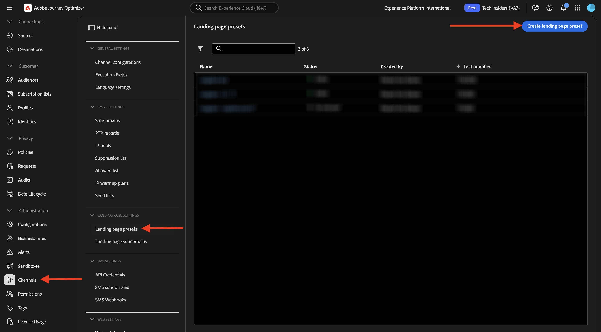
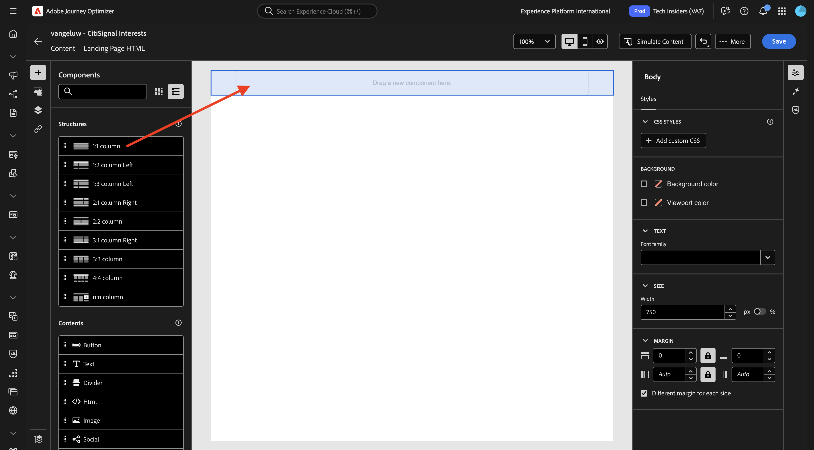
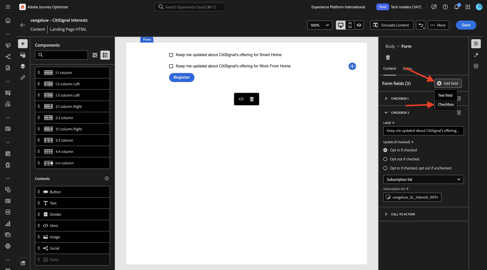
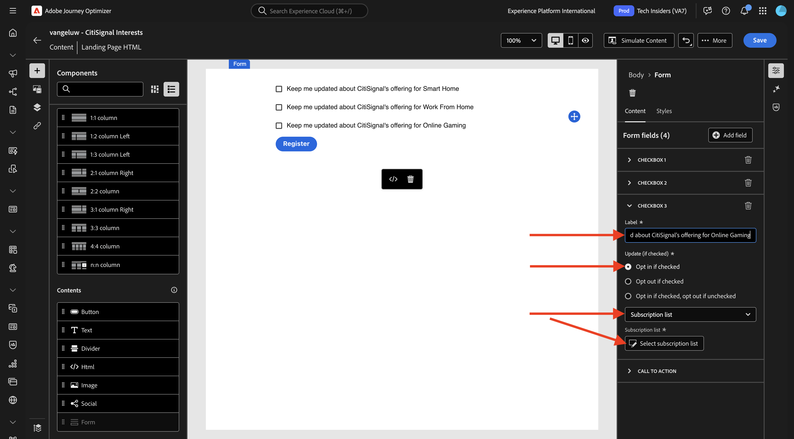
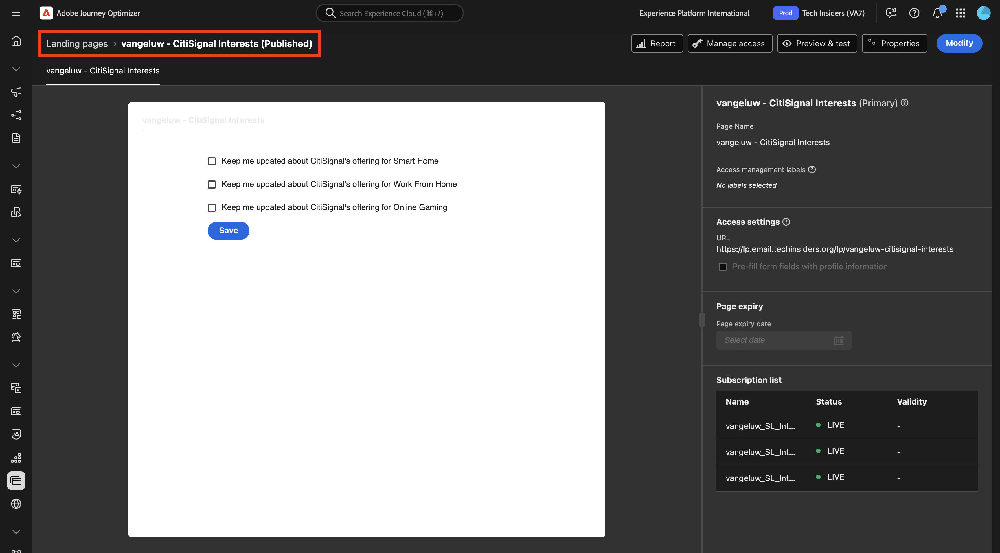

# 3.6.2 ランディングページ

[Adobe Experience Cloud](https://experience.adobe.com) に移動して、Adobe Journey Optimizerにログインします。 **Journey Optimizer** をクリックします。

Journey Optimizerの **ホーム** ビューにリダイレクトされます。 最初に、正しいサンドボックスを使用していることを確認します。 使用するサンドボックスは `--aepSandboxName--` です。 その後、サンドボックス **ージの** ホーム `--aepSandboxName--` ビューに移動します。

## 3.6.2.1 購読リスト

Adobe Journey Optimizerのランディングページは、**サブスクリプションリスト** と連携して機能します。 ランディングページを設定するには、まず **購読リスト** を設定する必要があります。

CitiSignal は、次のドメインに対するお客様の関心について尋ねたいと考えています。

- スマートホーム
- 自宅で作業する
- オンラインゲーム

これらのドメインのいずれかに興味を示した顧客は、今後のキャンペーンの一環として後で特定のコンテンツでターゲットに設定できるように、特定のリストに追加する必要があります。

次に、3 つの購読リストを作成します。

左側のメニューで、**購読リスト** に移動します。 **購読リストを作成** をクリックします。

**タイトル** には、`--aepUserLdap--_SL_Interest_in_Smart_Home` を使用します。
**説明** には、`Interest in Smart Home` を使用します。

「**送信**」をクリックします。

**購読リストを作成** をクリックして、別のリストを作成します。

**タイトル** には、`--aepUserLdap--_SL_Interest_WFH` を使用します。
**説明** には、`Interest in Work From Home` を使用します。

「**送信**」をクリックします。

**購読リストを作成** をクリックして、別のリストを作成します。

**タイトル** には、`--aepUserLdap--_SL_Interest_Online_Gaming` を使用します。
**説明** には、`Interest in Online Gaming` を使用します。

「**送信**」をクリックします。

これで、必要な 3 つのリストが作成されました。

## 3.6.2.2 ランディングページプリセット

Adobe Journey Optimizerでランディングページを使用するには、プリセットを作成する必要があります。

左側のメニューで、**管理**/**チャネル** に移動し、「**ランディングページプリセット**」を選択します。

**ランディングページプリセットを作成** をクリックします。

フィールド **名前** には、`--aepUserLdap-- - CitiSignal LP` を使用し、お使いのインスタンスで使用可能なサブドメインを選択します。

>[!NOTE]
>
>インスタンスにサブドメインが表示されない場合は、AJO管理者にサブドメインを追加してもらってください。

「**送信**」をクリックします。

これで、ランディングページプリセットが作成されました。

## 3.6.2.3 ランディングページ

これで、ランディングページを作成できるようになりました。 左側のメニューで、**コンテンツ管理**/**ランディングページ** に移動します。

**ランディングページを作成** をクリックします。

フィールド **タイトル** には、`vangeluw - CitiSignal Interests` を使用します。 次に、前の手順で設定した **ランディングページプリセット** を選択します。

「**作成**」をクリックします。

この画像が表示されます。

フィールド **ページ名** を `--aepUserLdap-- - CitiSignal Interests` に変更します。

**アクセス設定**:`--aepUserLdap---citisignal-interests` の下にこのカスタム名を入力します。

**Designerを開く** をクリックします。

「**ゼロからデザイン**」を選択します。

この画像が表示されます。

構造コンポーネント **1:1 列** をキャンバスに追加します。

キャンバスにコンテンツコンポーネント **フォーム** を追加します。

**チェックボックス 1** のフィールド **ラベル** を `Keep me updated about CitiSignal's offering for Smart Home` に更新します。

「**オンの場合はオプトイン**」チェックボックスが有効になっており、**購読リスト**」が選択されていることを確認します。

次に、「**購読リストを選択**」をクリックします。

次に、リスト `--aepUserLdap--_SL_Interest_in_Smart_Home` を選択し、「**選択**」をクリックします。

「**+ フィールドを追加」をクリックし** 「**チェックボックス**」を選択します。

この画像が表示されます。

**チェックボックス 2** のフィールド **ラベル** を `Keep me updated about CitiSignal's offering for Work From Home` に更新します。

「**オンの場合はオプトイン**」チェックボックスが有効になっており、**購読リスト**」が選択されていることを確認します。

次に、「**購読リストを選択**」をクリックします。

次に、リスト `--aepUserLdap--_SL_Interest_WFH` を選択し、「**選択**」をクリックします。

「**+ フィールドを追加」をクリックし** 「**チェックボックス**」を選択します。

この画像が表示されます。

**チェックボックス 3** のフィールド **ラベル** を `Keep me updated about CitiSignal's offering for Online Gaming` に更新します。

「**オンの場合はオプトイン**」チェックボックスが有効になっており、**購読リスト**」が選択されていることを確認します。

次に、「**購読リストを選択**」をクリックします。

次に、リスト `--aepUserLdap--_SL_Interest_Online_Gaming` を選択し、「**選択**」をクリックします。

この画像が表示されます。

フォームフィールド **CALL TO ACTION** に移動します。

次のフィールドを更新します。

- **テキスト** - ボタンラベル：`Save`。
- **確認アクション**: **確認テキスト** を選択します。
- **確認テキスト**：使用 `Thanks for updating your preferences!`
- **エラーアクション**:「**エラーテキスト**」を選択します。
- **エラーテキストについて**：次を使用します：`There was an error updating your preferences.`

「**保存**」をクリックし、左上隅の矢印をクリックして前の画面に戻ります。

「**公開**」をクリックします。

もう一度 **公開** をクリックします。

ランディングページが公開され、メールで使用できるようになりました。

## メール 3.6.2.4 ランディングページを含める

演習 3.1 では、`--aepUserLdap-- - Registration Journey` というジャーニーを作成しました。

これで、そのジャーニーのメールメッセージを更新して、ランディングページへのリンクを含めることができるはずです。

左側のメニューで、**ジャーニーに移動し** クリックしてジャーニー `--aepUserLdap-- - Registration Journey` を開きます。

**詳細…** をクリックしてから、「**新しいバージョンを作成**」を選択します。

**新しいバージョンを作成** をクリックします。

クリックして **メール** アクションを選択し、「**コンテンツを編集**」を選択します。

**メール本文を編集** をクリックします。

次のようなメッセージが表示されます。 キャンバスに新しい構造コンポーネント **1:1 列** を追加します。

新しく作成した構造コンポーネントに新しいコンテンツコンポーネント **テキスト** を追加します。

次のテキストを **テキスト** コンテンツコンポーネントに貼り付けます。

`Would you like to hear from us about Smart Home news? Do you work from home and would you like to hear our tips? Or are you an avid online gamer and do you want to receive our game reviews? Click here to update your preferences and interests!`

テキストのスタイルをこのように設定し、`here` という単語を選択します。 **リンク** アイコンをクリックします。

リンクの **タイプ** を「ランディングページ **&#x200B;**&#x200B;に設定し、フィールド **ターゲット** を **空白** に設定します。

**編集** アイコンをクリックして、リンクするランディングページを選択します。

ランディングページ `--aepUserLdap-- - CitiSignal Interests` を選択します。 「**選択**」をクリックします。

この画像が表示されます。 「**保存**」をクリックします。

左上隅の矢印をクリックして、前の画面に戻ります。

左上隅の矢印をクリックして、前の画面に戻ります。

「**保存**」をクリックします。

「**公開**」をクリックします。

もう一度 **公開** をクリックします。

これで変更が公開され、ジャーニーをテストできます。

## 3.6.2.5 ジャーニーとランディングページのテスト

[https://dsn.adobe.com](https://dsn.adobe.com) に移動します。 Adobe IDでログインすると、このが表示されます。 Web サイトプロジェクトで「。..**」** いう 3 つのドットをクリックし、「**実行**」をクリックして開きます。

その後、デモ Web サイトが開きます。 URL を選択してクリップボードにコピーします。

新しい匿名ブラウザーウィンドウを開きます。

前の手順でコピーしたデモ Web サイトの URL を貼り付けます。 その後、Adobe IDを使用してログインするように求められます。

アカウントタイプを選択し、ログインプロセスを完了します。

次に、匿名ブラウザーウィンドウに web サイトが読み込まれます。 演習ごとに、新しい匿名ブラウザーウィンドウを使用して、デモ Web サイトの URL を読み込む必要があります。 **サインイン** に移動します

**アカウントを作成** をクリックします。 詳細を入力し、**登録** をクリックします。

これで、ホームページにリダイレクトされます。 プロファイルビューアパネルを開き、リアルタイム顧客プロファイルに移動します。 プロファイルビューアパネルには、新しく追加されたメール識別子や電話識別子など、すべての個人データが表示されます。

アカウントを作成してから 1 分が経過すると、Adobe Journey Optimizerからアカウント作成メールが届きます。

メールに記載されているリンクをクリックして、環境設定を更新します。

作成したフォームが表示されます。 一部のチェックボックスを有効にして、「**保存**」をクリックします。

確認メッセージが表示されます。

## 3.6.2.6 購読リストのレポート

購読リストに関して使用可能なレポートを表示するには、左側のメニューで **購読リスト** に移動し、をクリックして、以前に設定した購読リストの 1 つを開きます。

**レポート** をクリックします。

リストの概要と、購読または購読解除したユーザーの数が表示されます。

## 次の手順

[3.6.3 AJOとGenStudio for Performance Marketing](./ex3.md)

[Adobe Journey Optimizer：コンテンツ管理 &#x200B;](./ajocontent.md){target="_blank"} に戻る

[&#x200B; すべてのモジュール &#x200B;](./../../../../overview.md){target="_blank"} に戻る
