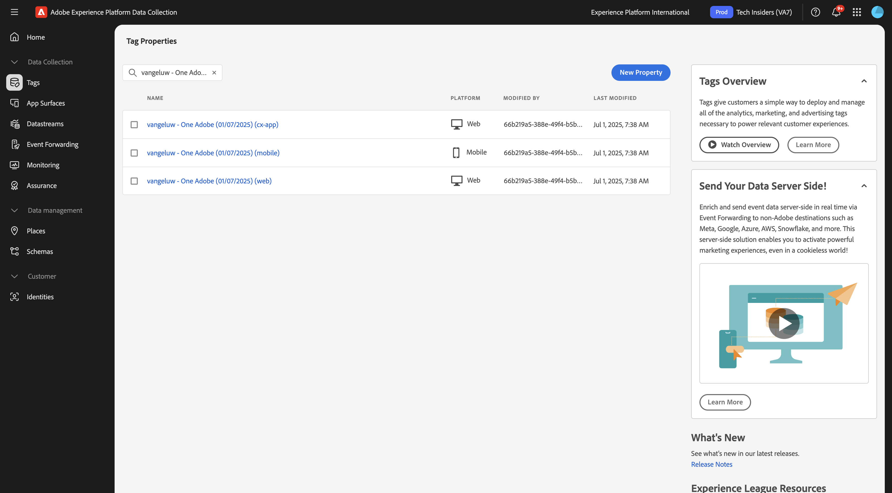

# 3.7.3 Experience Decisioning の Web SDKのセットアップ

## 3.7.3.1 データストリームを更新する

[ はじめに ](./../../../../modules/getting-started/gettingstarted/ex2.md) で、独自の **データストリーム** を作成しました。 その後、`--aepUserLdap-- - Demo System Datastream` という名前を使用しました。

## パーソナライズされたオファー 3.7.3.2 リクエストするようにAdobe Experience Platform データ収集クライアントプロパティを設定するには、

[https://experience.adobe.com/#/data-collection/](https://experience.adobe.com/#/data-collection/) の **Tags** に移動します。 `--aepUserLdap-- - Demo System (DD/MM/YYYY)` という名前のデータ収集プロパティを検索します。 Web 用データ収集クライアントプロパティを開きます。

## パーソナラ 3.7.3.3 ズされたオファーを受信および適用するようにAdobe Experience Platform データ収集クライアントプロパティを設定するには、

[https://experience.adobe.com/#/data-collection/](https://experience.adobe.com/#/data-collection/) の **[!UICONTROL プロパティ]** に移動します。 `--aepUserLdap-- - Demo System (DD/MM/YYYY)` という名前のデータ収集プロパティを検索します。 Web のデータ収集プロパティを開きます。

次の演習では、Adobe Journey Optimizerで作成したオファーと決定を、Adobe Target エクスペリエンスのターゲット設定アクティビティと組み合わせる方法を説明します。

## 次の手順

[ 概要とメリット ](./summary.md){target="_blank"} に移動します。

[Experience Decisioning](ajo-decisioning.md){target="_blank"} に戻る

[ すべてのモジュール ](./../../../../overview.md){target="_blank"} に戻る
