# 3.8.1 リレーショナル・データ基盤の設定

[https://experience.adobe.com](https://experience.adobe.com) に移動して、Adobe Journey Optimizerにログインします。 **Journey Optimizer** をクリックします。

Journey Optimizerの **ホーム** ビューにリダイレクトされます。 最初に、正しいサンドボックスを使用していることを確認します。 使用するサンドボックスは `--aepSandboxName--` です。

## 3.8.1.1 リレーショナルベースのスキーマのセットアップ

リレーショナルベースのスキーマは、モデルベースのデータモデルの正式な定義です。

次の内容が指定されています。

- テーブルのセット
- 各テーブルの列
- 制約
- テーブル間の関係

モデルベースのデータモデルでのスキーマやテーブルの整理は、データを複数のテーブルに構造化することです。各テーブルに 1 つのタイプのエンティティ/スキーマが格納されていることを確認します。

Adobe Journey Optimizer オーケストレートキャンペーンで使用するデータをに取り込む場合は、次のソースを使用できます。

- Amazon S3
- Google Cloud Storage
- SFTP
- Snowflake
- Google BigQuery
- Data Landing Zone
- Azure Databricks
- ローカルファイルのアップロード

この演習の最初の手順は、リレーショナルベースの XDM スキーマの設定です。 左側のメニューで、下にスクロールして **データ管理**、「**スキーマ**」を選択します。 「**+ スキーマを作成**」をクリックします。

「**リレーショナル**」を選択します。

**DDL ファイルをアップロード** を選択してから、**ファイルを選択** をクリックします。

[citignal_ddl_tables_only.sql](./assets/citisignal_ddl_tables_only.sql) ファイルをデスクトップにダウンロードします。

ファイル **`citisignal_ddl_tables_only.sql`** を選択し、「**開く**」をクリックします。

この画像が表示されます。 「**次へ**」をクリックします。

### ID

一部のスキーマには個人識別子が含まれており、これらのフィールドは **ID** としてマークされる必要があります。そのため、その特定のタイプの ID に適用される **名前空間** を選択する必要があります。

**`citisignal_accounts`**

このスキーマの場合は、「**account_id**」フィールドに移動して「**ID**」タイプを「**デモシステム - CRMID**」に設定します。

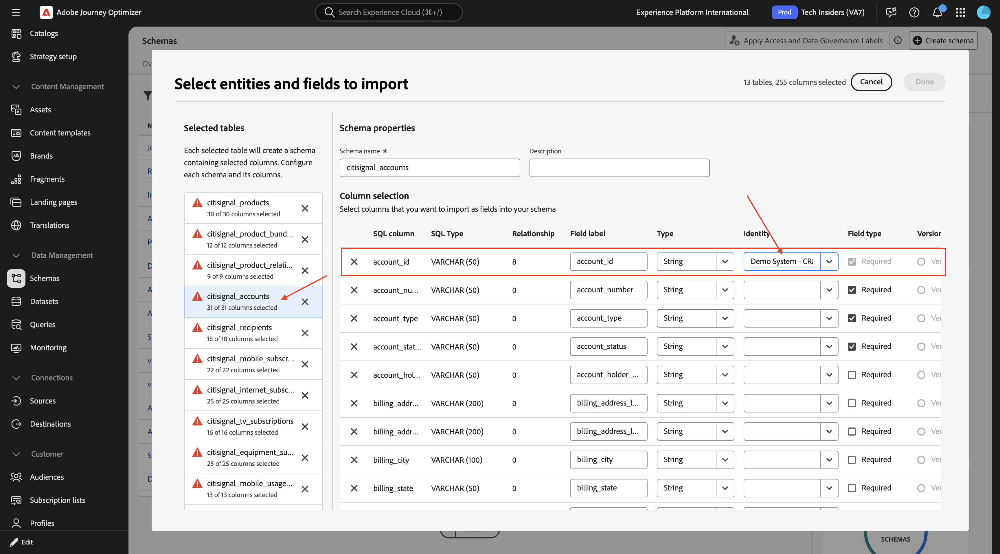

**`citisignal_recipients`**

このスキーマの場合、**account_id** フィールドに移動して **ID** タイプを **デモシステム - CRMID** に設定し、**email** フィールドに移動して **ID** タイプを **メール** に設定します。

### バージョン管理

これらのスキーマに対して取り込まれるデータへの更新を追跡するために、アップロードされたデータのバージョンを追跡するために使用されるフィールドを設定する必要があります。 これらすべてのスキーマでこれに使用されるフィールドは、アップロードされたデータのタイムスタンプを含むフィールド **lastmodified** です。

次に、これらの各スキーマのフィールド **lastmodified** の **バージョン管理** のチェックボックスをオンにする必要があります。

**`citisignal_products`**

**lastmodified** フィールドの「**バージョン管理** のチェックボックスをオンにします。

**`citisignal_product_bundles`**

**lastmodified** フィールドの「**バージョン管理** のチェックボックスをオンにします。

**`citisignal_product_relationships`**

**lastmodified** フィールドの「**バージョン管理** のチェックボックスをオンにします。

**`citisignal_accounts`**

**lastmodified** フィールドの「**バージョン管理** のチェックボックスをオンにします。

**`citisignal_recipients`**

**lastmodified** フィールドの「**バージョン管理** のチェックボックスをオンにします。

**`citisignal_mobile_subscriptions`**

**lastmodified** フィールドの「**バージョン管理** のチェックボックスをオンにします。

**`citisignal_internet_subscriptions`**

**lastmodified** フィールドの「**バージョン管理** のチェックボックスをオンにします。

**`citisignal_tv_subscriptions`**

**lastmodified** フィールドの「**バージョン管理** のチェックボックスをオンにします。

**`citisignal_equipment_subscriptions`**

**lastmodified** フィールドの「**バージョン管理** のチェックボックスをオンにします。

**`citisignal_mobile_usage_summary`**

**lastmodified** フィールドの「**バージョン管理** のチェックボックスをオンにします。

**`citisignal_internet_usage_summary`**

**lastmodified** フィールドの「**バージョン管理** のチェックボックスをオンにします。

**`citisignal_offers`**

**lastmodified** フィールドの「**バージョン管理** のチェックボックスをオンにします。

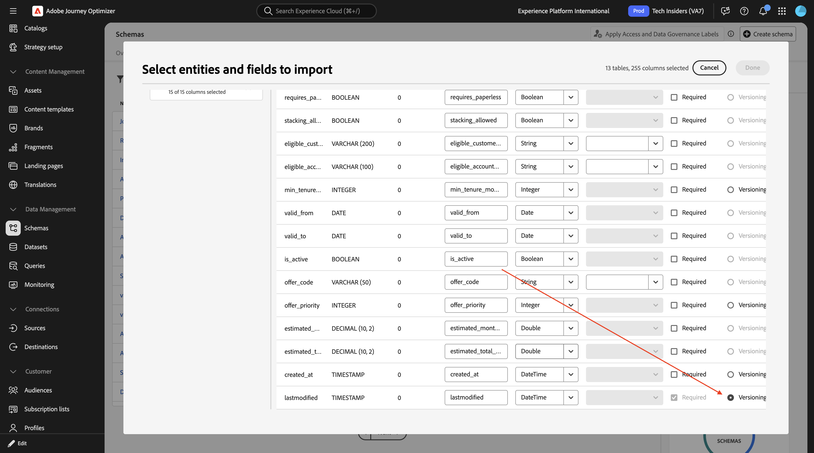

**`citisignal_offer_eligibility`**

**lastmodified** フィールドの「**バージョン管理** のチェックボックスをオンにします。

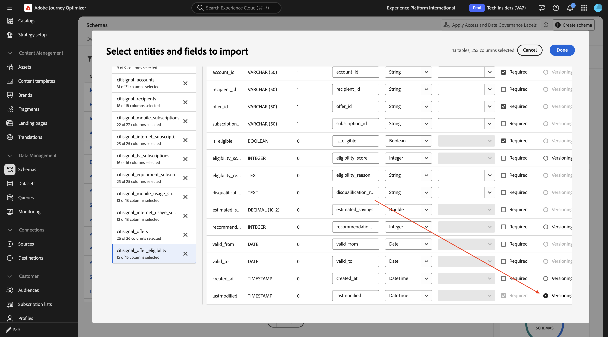

### スキーマ名

共有サンドボックスでイネーブルメント目的でこれらのスキーマを取り込む場合は、特定のサンドボックス内で一意になるように各スキーマの名前を変更する必要があります。 この変更を行う理由は、スキーマ名の競合を避けるためです。

このラボでは、各スキーマ名の前に LDAP を追加する必要があります。つまり、すべてのスキーマ名には次のプレフィックスを付ける必要があります。`--aepUserLdap--_`

**`citisignal_products`**

スキーマの名前を `--aepUserLdap--_ citisignal_products` に変更します。

**`citisignal_product_bundles`**

スキーマの名前を `--aepUserLdap--_ citisignal_product_bundles` に変更します。

**`citisignal_product_relationships`**

スキーマの名前を `--aepUserLdap--_ citisignal_product_relationships` に変更します。

**`citisignal_accounts`**

スキーマの名前を `--aepUserLdap--_ citisignal_accounts` に変更します。

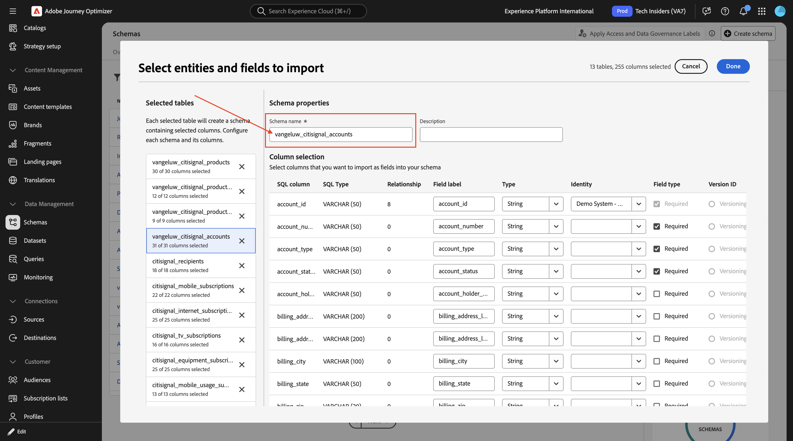

**`citisignal_recipients`**

スキーマの名前を `--aepUserLdap--_ citisignal_recipients` に変更します。

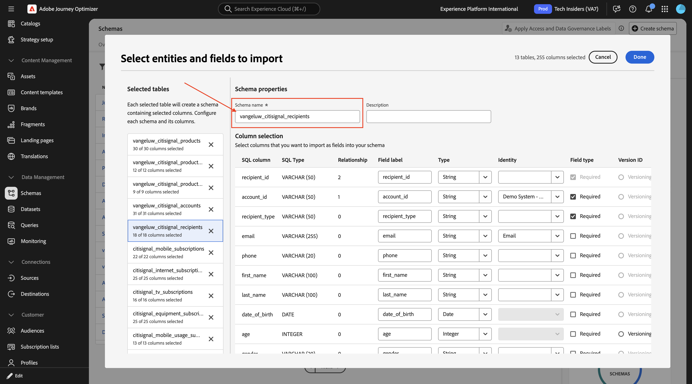

**`citisignal_mobile_subscriptions`**

スキーマの名前を `--aepUserLdap--_ citisignal_mobile_subscriptions` に変更します。

**`citisignal_internet_subscriptions`**

スキーマの名前を `--aepUserLdap--_ citisignal_internet_subscriptions` に変更します。

**`citisignal_tv_subscriptions`**

スキーマの名前を `--aepUserLdap--_ citisignal_internet_subscriptions` に変更します。

**`citisignal_equipment_subscriptions`**

スキーマの名前を `--aepUserLdap--_ citisignal_equipment_subscriptions` に変更します。

**`citisignal_mobile_usage_summary`**

スキーマの名前を `--aepUserLdap--_ citisignal_mobile_usage_summary` に変更します。

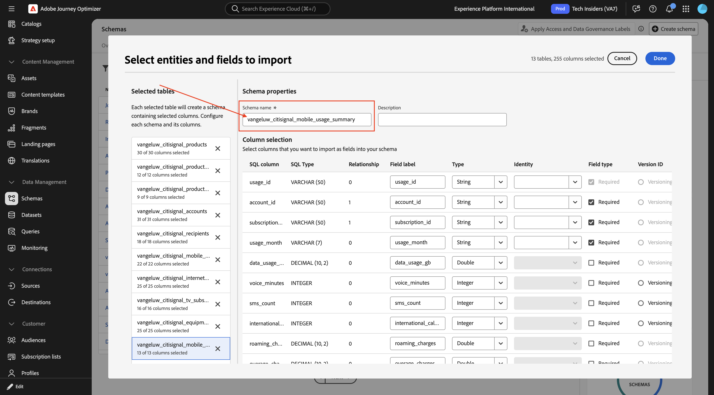

**`citisignal_internet_usage_summary`**

スキーマの名前を `--aepUserLdap--_ citisignal_internet_usage_summary` に変更します。

**`citisignal_offers`**

スキーマの名前を `--aepUserLdap--_ citisignal_offers` に変更します。

**`citisignal_offer_eligibility`**

スキーマの名前を `--aepUserLdap--_ citisignal_offer_eligibility` に変更します。

これで、スキーマを保存する準備が整いました。 「**完了**」をクリックします。

この画像が表示されます。 「**保存**」をクリックします。

**ジョブを開く** をクリックします。

この画像が表示されます。 ジョブが正常に完了するまで待ってから、次の手順に進んでください。

ジョブが正常に完了したら、次の手順に進むことができます。 これには 5～10 分かかることがあります。

リレーショナル XDM スキーマが設定され、データが取り込まれたので、そのデータを使用して、次の演習で調整されたキャンペーンを作成するために開始できます。

## 3.8.1.2 データ取得

**データセット** に移動します。 作成したスキーマごとに作成されたデータセットが表示されます。

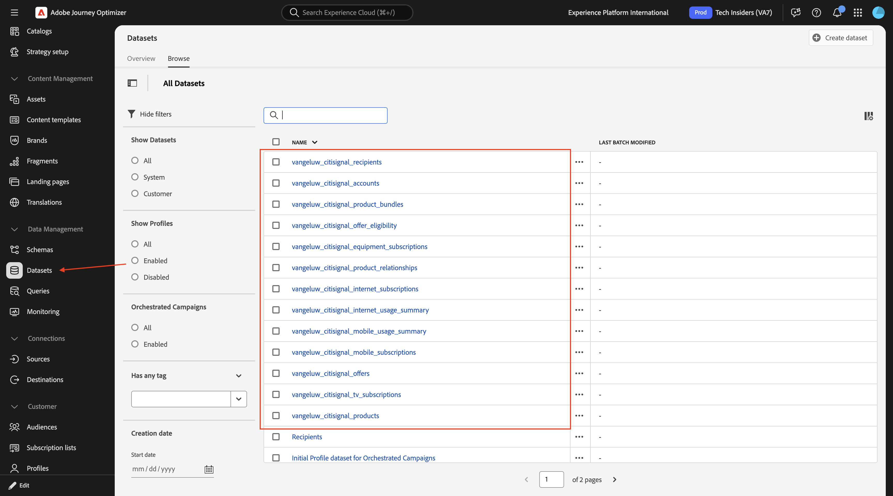

ファイル [data.zip](./assets/data.zip) をデスクトップにダウンロードし、解凍します。

フォルダー **data** を開きます。 作成した各スキーマの CSV ファイルが表示されます。 次に、そのデータを対応する各データセットにアップロードする必要があります。 このラボでは、各データセットにローカルファイルをアップロードします。

**`vangeluw_citisignal_products`**

**ソース** に移動して `local` を検索し、「**ローカルファイルのアップロード** の下の **データを追加** をクリックします。

**チェンジ データ キャプチャを有効にする** の切り替えを有効にします。

データセット `vangeluw_citisignal_products` を選択します。

「**次へ**」をクリックします。

**ファイルを選択** をクリックします。 ファイル **`citisignal_products.csv`** を選択し、「**開く**」をクリックします。

「**次へ**」をクリックします。

「**完了**」をクリックします。

数分後、データがデータセットに取り込まれていることを確認できます。

**`vangeluw_citisignal_product_bundles`**

**ソース** に移動して `local` を検索し、「**ローカルファイルのアップロード** の下の **データを追加** をクリックします。

**チェンジ データ キャプチャを有効にする** の切り替えを有効にします。

データセット `vangeluw_citisignal_product_bundles` を選択します。

「**次へ**」をクリックします。

**ファイルを選択** をクリックします。 ファイル **`citisignal_product_bundles.csv`** を選択し、「**開く**」をクリックします。

「**次へ**」をクリックします。

「**完了**」をクリックします。

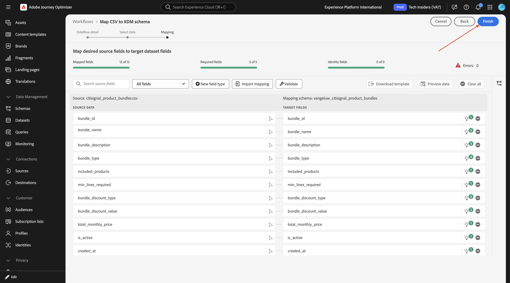

数分後、データがデータセットに取り込まれていることを確認できます。

**`vangeluw_citisignal_product_relationships`**

**ソース** に移動して `local` を検索し、「**ローカルファイルのアップロード** の下の **データを追加** をクリックします。

**チェンジ データ キャプチャを有効にする** の切り替えを有効にします。

データセット `vangeluw_citisignal_product_relationships` を選択します。

「**次へ**」をクリックします。

**ファイルを選択** をクリックします。 ファイル **`citisignal_product_relationships.csv`** を選択し、「**開く**」をクリックします。

「**次へ**」をクリックします。

「**完了**」をクリックします。

数分後、データがデータセットに取り込まれていることを確認できます。

**`vangeluw_citisignal_accounts`**

**ソース** に移動して `local` を検索し、「**ローカルファイルのアップロード** の下の **データを追加** をクリックします。

**チェンジ データ キャプチャを有効にする** の切り替えを有効にします。

データセット `vangeluw_citisignal_accounts` を選択します。

「**次へ**」をクリックします。

**ファイルを選択** をクリックします。 ファイル **`citisignal_accounts.csv`** を選択し、「**開く**」をクリックします。

「**次へ**」をクリックします。

「**完了**」をクリックします。

数分後、データがデータセットに取り込まれていることを確認できます。

**`vangeluw_citisignal_recipients`**

**ソース** に移動して `local` を検索し、「**ローカルファイルのアップロード** の下の **データを追加** をクリックします。

**チェンジ データ キャプチャを有効にする** の切り替えを有効にします。

データセット `vangeluw_citisignal_recipients` を選択します。

「**次へ**」をクリックします。

**ファイルを選択** をクリックします。 ファイル **`citisignal_recipients.csv`** を選択し、「**開く**」をクリックします。

「**次へ**」をクリックします。

「**完了**」をクリックします。

数分後、データがデータセットに取り込まれていることを確認できます。

**`vangeluw_citisignal_mobile_subscriptions`**

**ソース** に移動して `local` を検索し、「**ローカルファイルのアップロード** の下の **データを追加** をクリックします。

**チェンジ データ キャプチャを有効にする** の切り替えを有効にします。

データセット `vangeluw_citisignal_mobile_subscriptions` を選択します。

「**次へ**」をクリックします。

**ファイルを選択** をクリックします。 ファイル **`citisignal_mobile_subscriptions.csv`** を選択し、「**開く**」をクリックします。

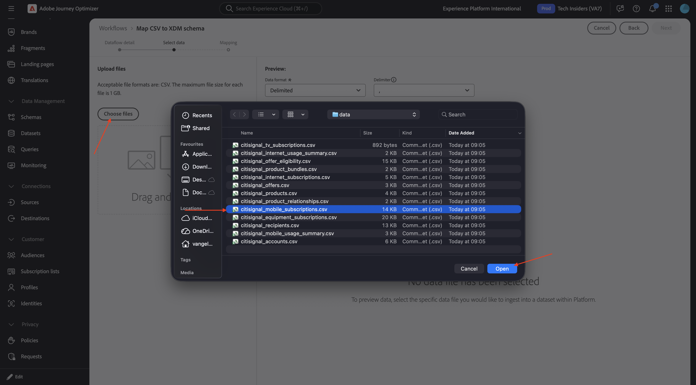

「**次へ**」をクリックします。

「**完了**」をクリックします。

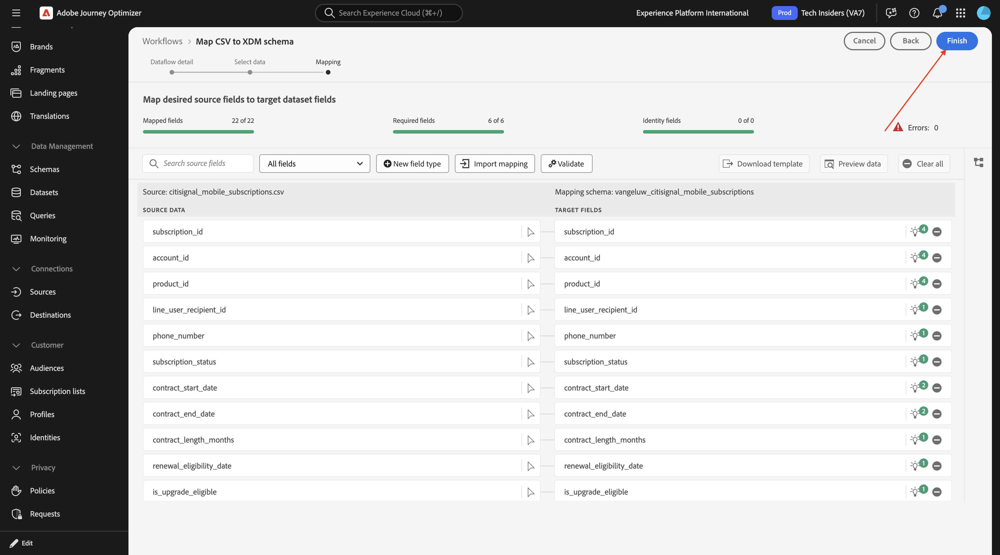

数分後、データがデータセットに取り込まれていることを確認できます。

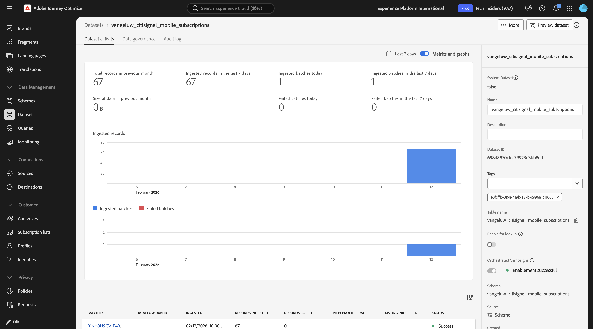

**`vangeluw_citisignal_internet_subscriptions`**

**ソース** に移動して `local` を検索し、「**ローカルファイルのアップロード** の下の **データを追加** をクリックします。

**チェンジ データ キャプチャを有効にする** の切り替えを有効にします。

データセット `vangeluw_citisignal_internet_subscriptions` を選択します。

「**次へ**」をクリックします。

**ファイルを選択** をクリックします。 ファイル **`citisignal_internet_subscriptions.csv`** を選択し、「**開く**」をクリックします。

「**次へ**」をクリックします。

「**完了**」をクリックします。

数分後、データがデータセットに取り込まれていることを確認できます。

**`vangeluw_citisignal_tv_subscriptions`**

**ソース** に移動して `local` を検索し、「**ローカルファイルのアップロード** の下の **データを追加** をクリックします。

**チェンジ データ キャプチャを有効にする** の切り替えを有効にします。

データセット `vangeluw_citisignal_tv_subscriptions` を選択します。

「**次へ**」をクリックします。

**ファイルを選択** をクリックします。 ファイル **`citisignal_tv_subscriptions.csv`** を選択し、「**開く**」をクリックします。

「**次へ**」をクリックします。

「**完了**」をクリックします。

数分後、データがデータセットに取り込まれていることを確認できます。

**`vangeluw_citisignal_equipment_subscriptions`**

**ソース** に移動して `local` を検索し、「**ローカルファイルのアップロード** の下の **データを追加** をクリックします。

**チェンジ データ キャプチャを有効にする** の切り替えを有効にします。

データセット `vangeluw_citisignal_equipment_subscriptions` を選択します。

「**次へ**」をクリックします。

**ファイルを選択** をクリックします。 ファイル **`citisignal_equipment_subscriptions.csv`** を選択し、「**開く**」をクリックします。

「**次へ**」をクリックします。

「**完了**」をクリックします。

数分後、データがデータセットに取り込まれていることを確認できます。

**`vangeluw_citisignal_mobile_usage_summary`**

**ソース** に移動して `local` を検索し、「**ローカルファイルのアップロード** の下の **データを追加** をクリックします。

**チェンジ データ キャプチャを有効にする** の切り替えを有効にします。

データセット `vangeluw_citisignal_mobile_usage_summary` を選択します。

「**次へ**」をクリックします。

**ファイルを選択** をクリックします。 ファイル **`citisignal_mobile_usage_summary.csv`** を選択し、「**開く**」をクリックします。

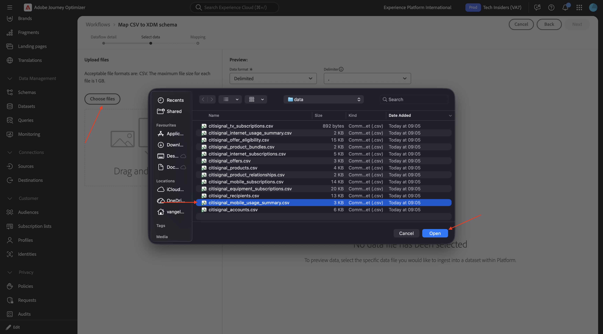

「**次へ**」をクリックします。

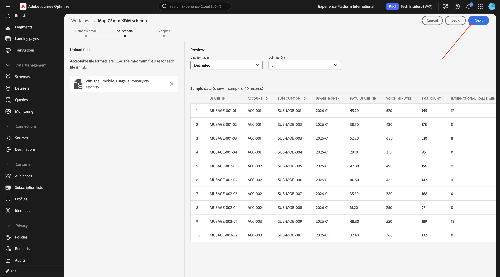

「**完了**」をクリックします。

数分後、データがデータセットに取り込まれていることを確認できます。

**`vangeluw_citisignal_internet_usage_summary`**

**ソース** に移動して `local` を検索し、「**ローカルファイルのアップロード** の下の **データを追加** をクリックします。

**チェンジ データ キャプチャを有効にする** の切り替えを有効にします。

データセット `vangeluw_citisignal_internet_usage_summary` を選択します。

「**次へ**」をクリックします。

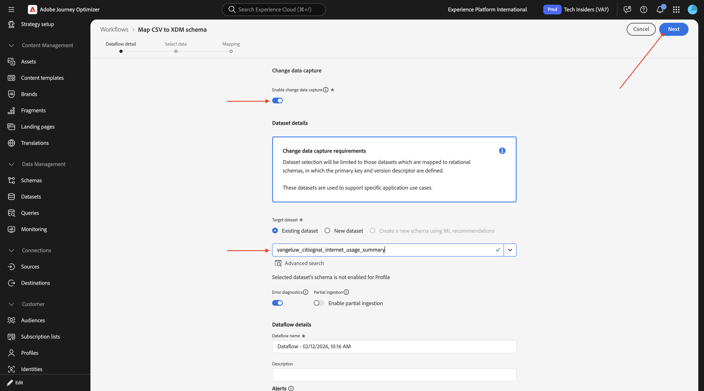

**ファイルを選択** をクリックします。 ファイル **`citisignal_internet_usage_summary.csv`** を選択し、「**開く**」をクリックします。

「**次へ**」をクリックします。

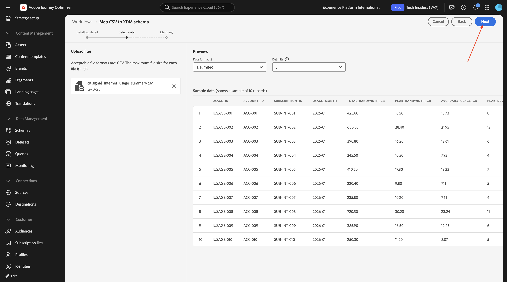

「**完了**」をクリックします。

数分後、データがデータセットに取り込まれていることを確認できます。

**`vangeluw_citisignal_offers`**

**ソース** に移動して `local` を検索し、「**ローカルファイルのアップロード** の下の **データを追加** をクリックします。

**チェンジ データ キャプチャを有効にする** の切り替えを有効にします。

データセット `vangeluw_citisignal_offers` を選択します。

「**次へ**」をクリックします。

**ファイルを選択** をクリックします。 ファイル **`citisignal_offers.csv`** を選択し、「**開く**」をクリックします。

「**次へ**」をクリックします。

「**完了**」をクリックします。

数分後、データがデータセットに取り込まれていることを確認できます。

**`vangeluw_citisignal_offer_eligibility`**

**ソース** に移動して `local` を検索し、「**ローカルファイルのアップロード** の下の **データを追加** をクリックします。

**チェンジ データ キャプチャを有効にする** の切り替えを有効にします。

データセット `vangeluw_citisignal_offer_eligibility` を選択します。

「**次へ**」をクリックします。

**ファイルを選択** をクリックします。 ファイル **`citisignal_offer_eligibility.csv`** を選択し、「**開く**」をクリックします。

「**次へ**」をクリックします。

「**完了**」をクリックします。

数分後、データがデータセットに取り込まれていることを確認できます。

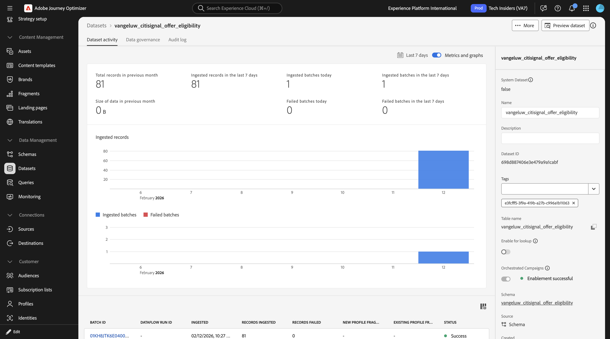

すべてのデータが取り込まれるようになりました。 次の演習では、調整されたキャンペーンの一部としてそのデータを使用します。

## 次の手順

[&#x200B; オーケストレートキャンペーンの作成 &#x200B;](./ex2.md){target="_blank"} に移動します

[Adobe Journey Optimizer：調整されたキャンペーン &#x200B;](./ajocampaigns.md){target="_blank"} に戻る

[&#x200B; すべてのモジュール &#x200B;](./../../../../overview.md){target="_blank"} に戻る
