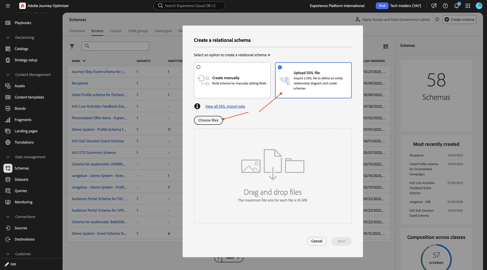

# 3.8.1 リレーショナル・データ基盤の設定

[https://experience.adobe.com](https://experience.adobe.com) に移動して、Adobe Journey Optimizerにログインします。 **Journey Optimizer** をクリックします。

Journey Optimizerの **ホーム** ビューにリダイレクトされます。 最初に、正しいサンドボックスを使用していることを確認します。 使用するサンドボックスは `--aepSandboxName--` です。

## 3.8.1.1 リレーショナルベースのスキーマのセットアップ

リレーショナルベースのスキーマは、モデルベースのデータモデルの正式な定義です。

次の内容が指定されています。

- テーブルのセット
- 各テーブルの列
- 制約
- テーブル間の関係

モデルベースのデータモデルでのスキーマやテーブルの整理は、データを複数のテーブルに構造化することです。各テーブルに 1 つのタイプのエンティティ/スキーマが格納されていることを確認します。

Adobe Journey Optimizer オーケストレートキャンペーンで使用するデータをに取り込む場合は、次のソースを使用できます。

- Amazon S3
- Google Cloud Storage
- SFTP
- Snowflake
- Google BigQuery
- Data Landing Zone
- Azure Databricks
- ローカルファイルのアップロード

この演習の最初の手順は、リレーショナルベースの XDM スキーマの設定です。 左側のメニューで、下にスクロールして **データ管理**、「**スキーマ**」を選択します。 「**+ スキーマを作成**」をクリックします。

「**リレーショナル**」を選択します。

**DDL ファイルをアップロード** を選択してから、**ファイルを選択** をクリックします。

リレーショナル XDM スキーマが設定され、データが取り込まれたので、そのデータを使用して、次の演習で調整されたキャンペーンを作成するために開始できます。

## 3.8.1.2 データ取得

## 次の手順

[ オーケストレートキャンペーンの作成 ](./ex2.md){target="_blank"} に移動します

[Adobe Journey Optimizer：キャンペーン ](./ajocampaigns.md){target="_blank"} に戻る

[ すべてのモジュール ](./../../../../overview.md){target="_blank"} に戻る
