# 3.8.2 オーケストレーションされたキャンペーンの作成

## オーケテ 3.8.2.1 ト済みキャンペーンの作成

**キャンペーン** に移動します。 **キャンペーンを作成** をクリックします。

**オーケストレーション – マーケティング** を選択し、「**確認**」をクリックします。

キャンペーン名 `--aepUserLdap-- - CitiSignal Family Account Optimization Campaign` を入力し、「**保存** をクリックします。

この画像が表示されます。 **+** アイコンをクリックします。

「**分岐**」を選択します。

### オーディエンス 1 を作成

**+** アイコンをクリックし、「**オーディエンスを作成**」を選択します。

クリックして、**ターゲティングディメンション** のフォルダーを開きます。

「**`--aepUserLdap--_citisignal_recipients`**」を選択し、「**確認**」をクリックします。

**オーディエンスを作成** をクリックします。

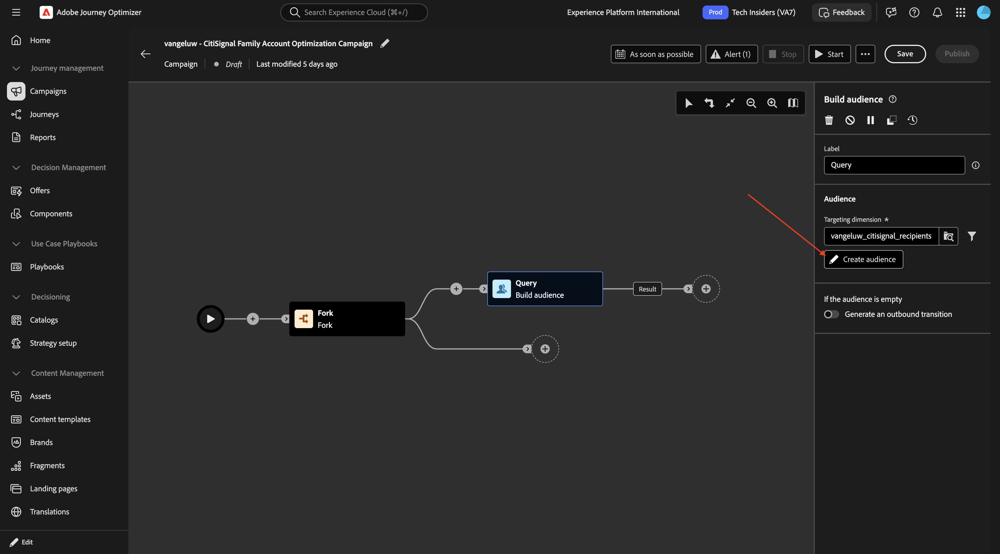

「**条件を追加**」をクリックします。

**recipient_type** を選択し、「**確認**」をクリックします。

フィールド **`account_holder`** 値 **に** と入力し、「**計算**」をクリックします。

**ターゲットとするプロファイル** の数が表示されます。 示されているように、グレーの領域の任意の場所をクリックします。

「**条件を追加**」をクリックします。

**`citisignal_accounts`** にドリルダウンします。

「**`account_status`**」を選択し、「**確認**」をクリックします。

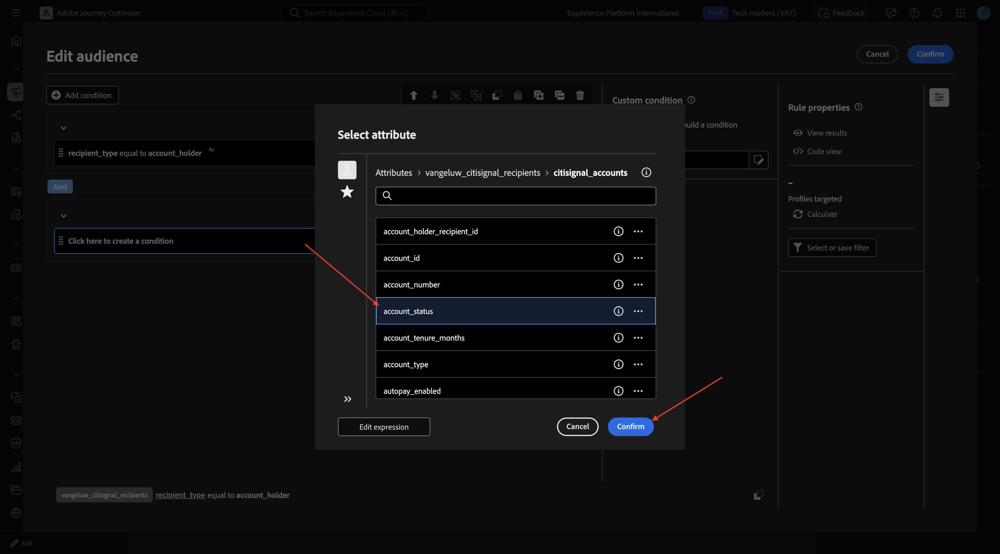

フィールド **`active`** 値 **に** と入力します。 次に、グレーの領域の任意の場所をクリックします。

「**条件を追加**」をクリックします。

**`citisignal_mobile_subscriptions`** にドリルダウンします。

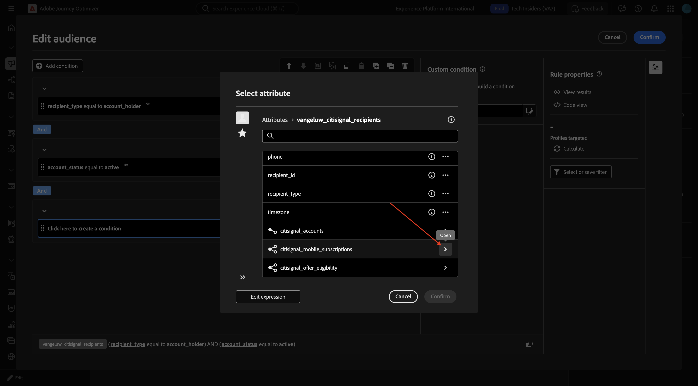

「**`subscription_id`**」を選択し、「**確認**」をクリックします。

**データを集計** のスイッチャーを有効にします。 次に、以下を選択します。

- **集計関数**: **Count**
- **演算子**: **以上**
- **値**: **1**

「**確認**」をクリックします。

この画像が表示されます。 「**確認**」をクリックします。

### オーディエンス 2 を作成

別のパスにある次のノードの「**+**」アイコンをクリックします。

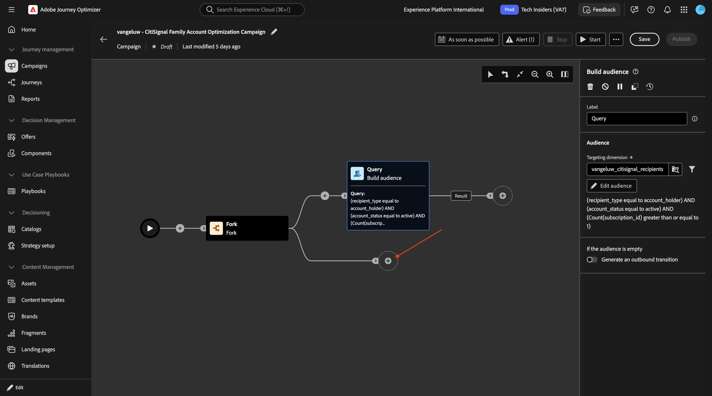

**オーディエンスを作成** を選択します。

クリックして、**ターゲティングディメンション** のフォルダーを開きます。

「**`--aepUserLdap--_mobile_subscriptions`**」を選択し、「**確認**」をクリックします。

**オーディエンスを作成** をクリックします。

「**条件を追加**」をクリックします。

**subscription_status** を選択し、「**確認**」をクリックします。

フィールド **`active`** 値 **に** と入力します。 次に、「**条件を追加**」をクリックします。

「**`is_upgrade_eligible`**」を選択し、「**確認**」をクリックします。

**Value** を **true** に設定します

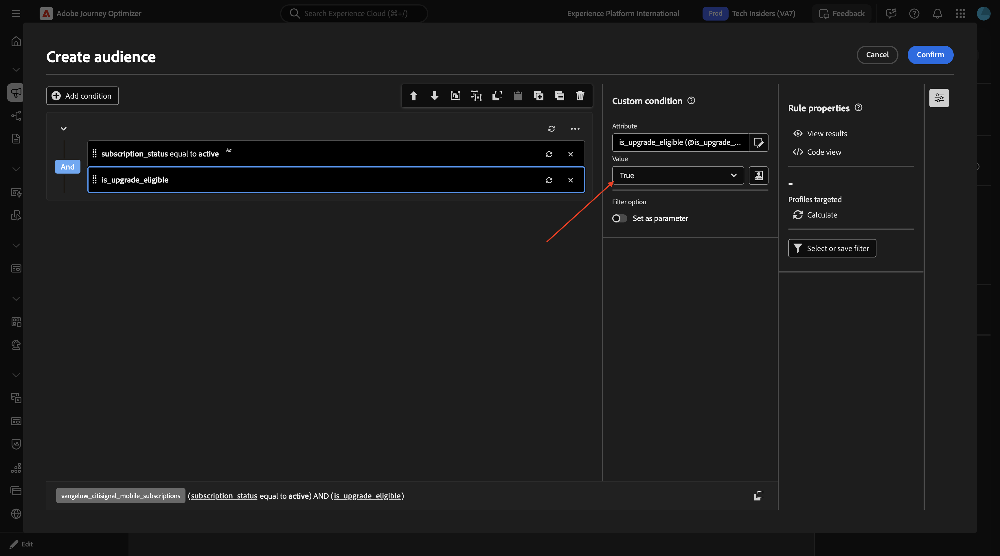

「**計算**」をクリックして、このオーディエンスに適合するプロファイルの推定を表示します。 次に、「**確認**」をクリックします。

### 分割

**+** アイコンをクリックし、「**分割**」を選択します。

フィールド **ラベル** を **90/10 Treatment vs Control** に変更します。 クリックしてオブジェクト **サブセット** を開きます。

**制限を有効にする** のスイッチャーを有効にし、**制限サイズ** を **10 perecent** に設定します。

**セグメントを追加** をクリックすると、**Result** オブジェクトが追加されていることがわかります。

「**保存**」をクリックします。

### オーディエンスの保存

**+** アイコンをクリックし、「**オーディエンスを保存**」を選択します。

フィールド **オーディエンスラベル** を **`--aepUserLdap-- - Control Group`** に設定します。 「**オーディエンスマッピングを追加**」をクリックします。

**ターゲティングディメンション** にドリルダウンします。

「**`account_id`**」を選択し、「**確認**」をクリックします。

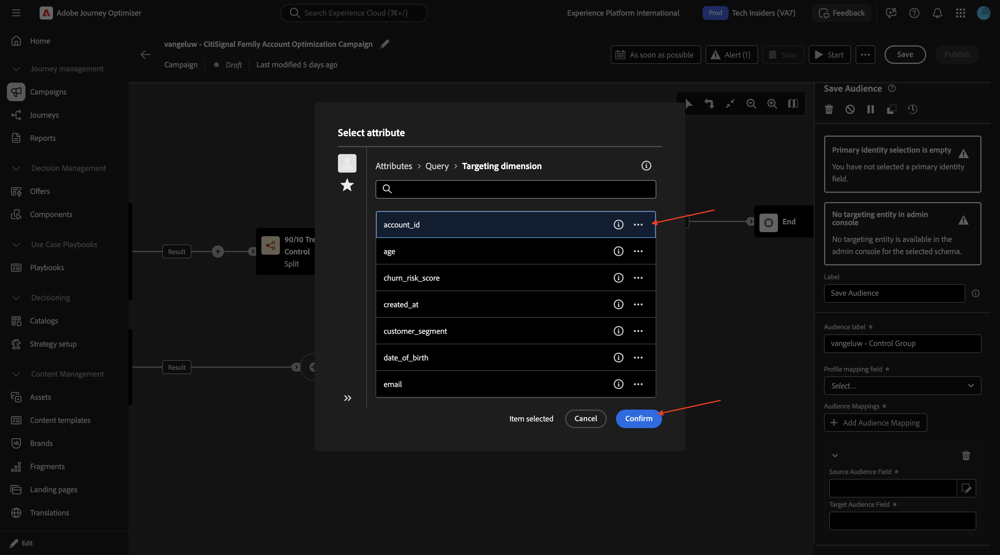

**プロファイルマッピングフィールド** を **`--aepUserLdap--_citisignal_recipients - account_id`** に設定します。

### エンリッチメント：インターネット購読

**+** アイコンをクリックします。

**エンリッチメント** を選択します。

この画像が表示されます。 「**エンリッチメントデータを追加**」をクリックします。

**`Targeting dimension`** にドリルダウンします。

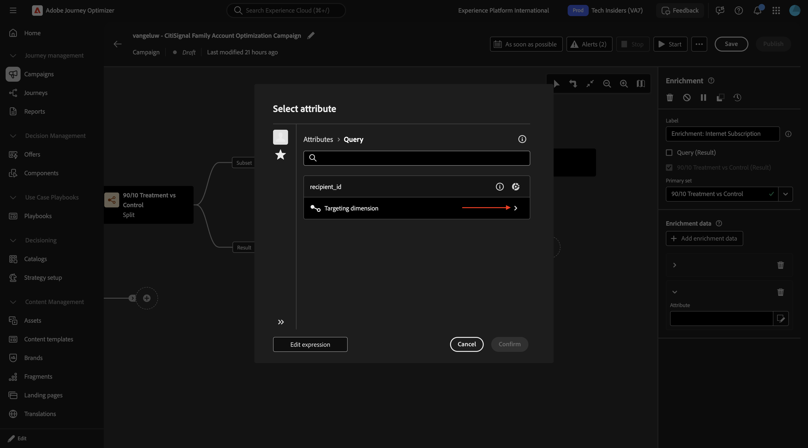

**`citisignal_accounts`** にドリルダウンします。

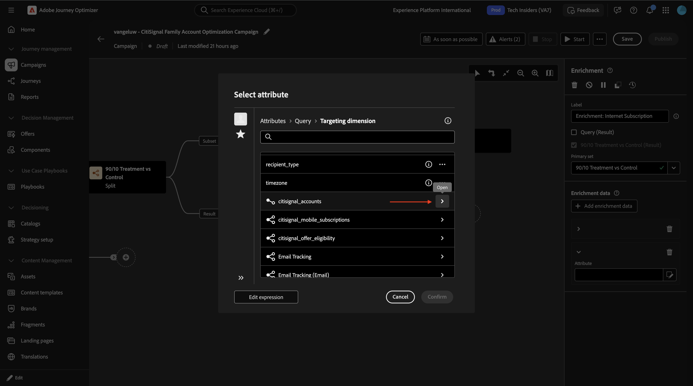

**`citisignal_internet_subscriptions`** にドリルダウンします。

「**`account_id`**」を選択し、「**確認**」をクリックします。

この画像が表示されます。 **属性を追加** をクリックします。

「**`subscription_status`**」を選択し、「**確認**」をクリックします。

**属性を追加** をクリックします。

「**`connection_type`**」を選択し、「**確認**」をクリックします。

**属性を追加** をクリックします。

「**`service_city`**」を選択し、「**確認**」をクリックします。

**属性を追加** をクリックします。

「**`avg_bandwidth_usage_gb`**」を選択し、「**確認**」をクリックします。

**属性を追加** をクリックします。

「**`data_cap_gb`**」を選択し、「**確認**」をクリックします。

**属性を追加** をクリックします。

「**`advertised_speed_mbps`**」を選択し、「**確認**」をクリックします。

**属性を追加** をクリックします。

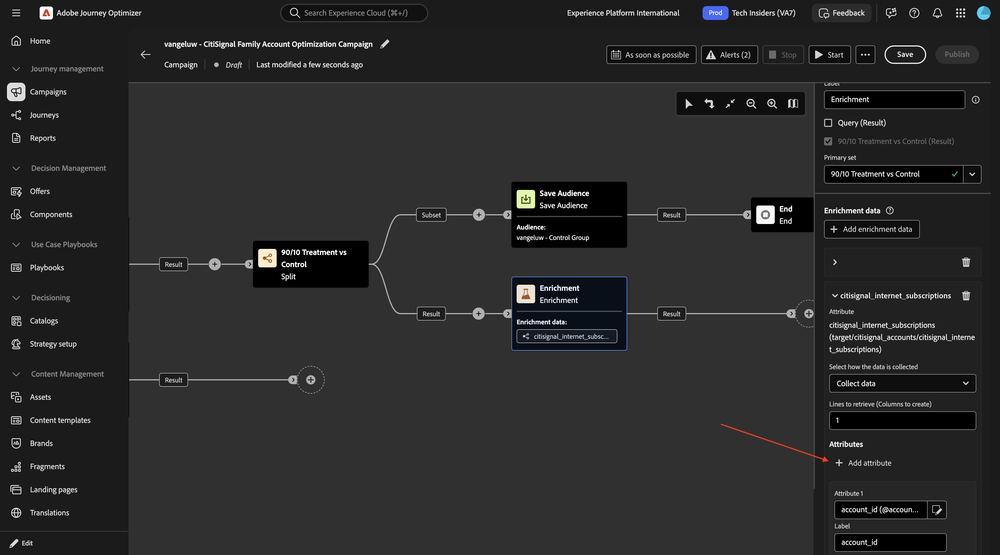

「**`monthly_recurring_charge`**」を選択し、「**確認**」をクリックします。

「**保存**」をクリックします。

上にスクロールして、フィールド **ラベル** を `Enrichment: Internet Subscription` に変更します。

### エンリッチメント：モバイルデバイス購読

次のノードにある「**+**」アイコンをクリックし、「**エンリッチメント**」を選択します。

フィールド **ラベル** を `Enrichment: Mobile Devices Subscription` に変更し、「**エンリッチメントデータを追加** をクリックします。

**ターゲティングディメンション** にドリルダウンします。

**`citisignal_accounts`** にドリルダウンします。

**`citisignal_mobile_subscriptions`** にドリルダウンします。

「**`phone_number`**」を選択し、「**確認**」をクリックします。

**属性を追加** をクリックします。

**`citisignal_equipment_subscriptions`** にドリルダウンします。

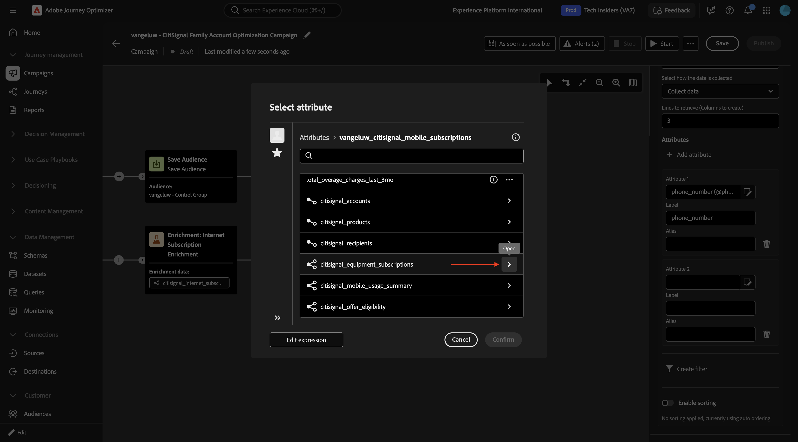

「**`model`**」を選択し、「**確認**」をクリックします。

**属性を追加** をクリックします。

**`citisignal_equipment_subscriptions`** にドリルダウンします。

「**`recommended_device_model`**」を選択し、「**確認**」をクリックします。

**属性を追加** をクリックします。

**`citisignal_equipment_subscriptions`** にドリルダウンします。

「**`is_upgrade_eligible`**」を選択し、「**確認**」をクリックします。

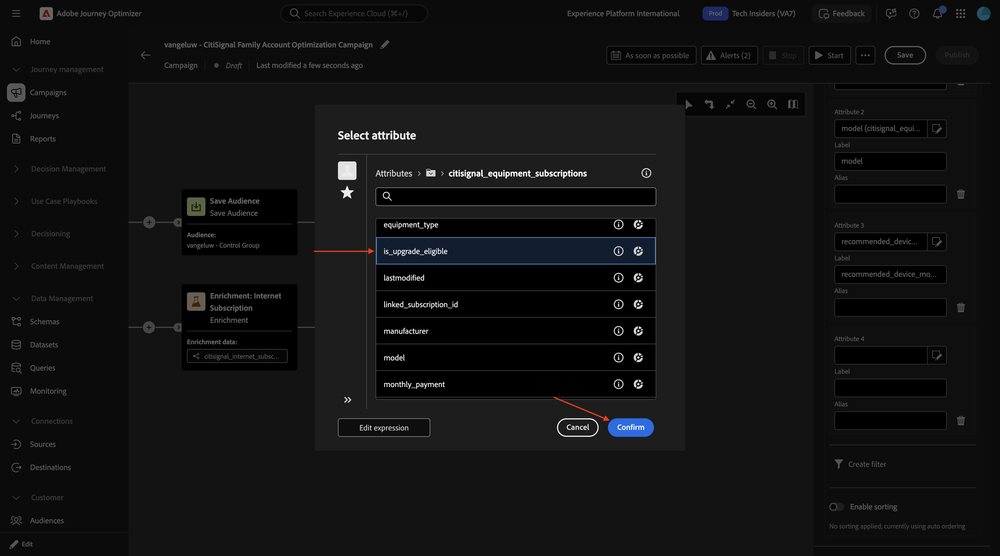

これで、テスト実行を行って進捗をテストし、キャンペーンで使用可能なデータを確認できます。

変更を保存し、「**開始**」をクリックします。

しばらくすると、これが表示されます。 **結果をプレビュー** をクリックします。

これに似た情報が表示されます。 「**閉じる**」をクリックします。

ノード **エンリッチメント：モバイルデバイス購読** に戻ります。

**属性を追加** をクリックします。

「**`account_id`**」を選択し、「**確認**」をクリックします。

**属性を追加** をクリックします。

「**`subscription_id`**」を選択し、「**確認**」をクリックします。

**属性を追加** をクリックします。

「**`renewal_eligibility_date`**」を選択し、「**確認**」をクリックします。

**属性を追加** をクリックします。

「**`line_user_recipient_id`**」を選択し、「**確認**」をクリックします。

**属性を追加** をクリックします。

「**`current_device_id`**」を選択し、「**確認**」をクリックします。

**属性を追加** をクリックします。

「**`contract_start_date`**」を選択し、「**確認**」をクリックします。

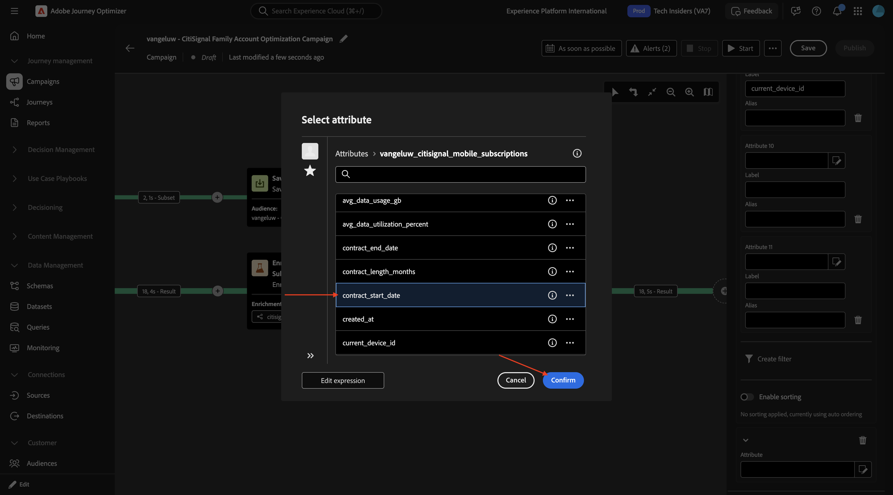

**属性を追加** をクリックします。

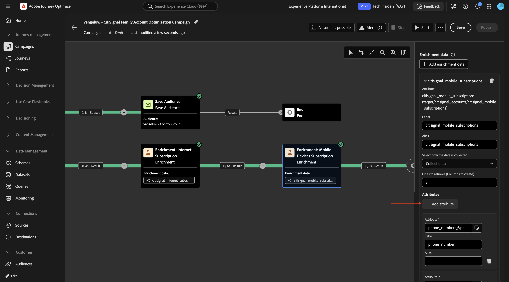

**`citisignal_equipment_subscriptions`** にドリルダウンします。

「**`manufacturer`**」を選択し、「**確認**」をクリックします。

**属性を追加** をクリックします。

**`citisignal_equipment_subscriptions`** にドリルダウンします。

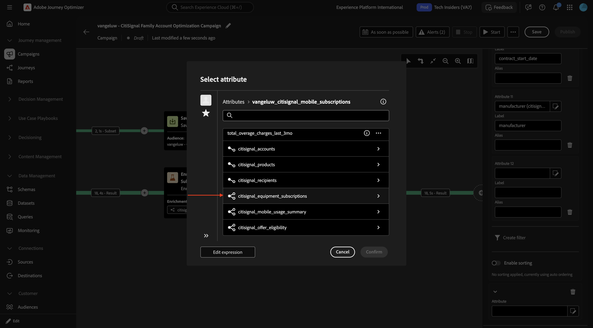

「**`device_age_months`**」を選択し、「**確認**」をクリックします。

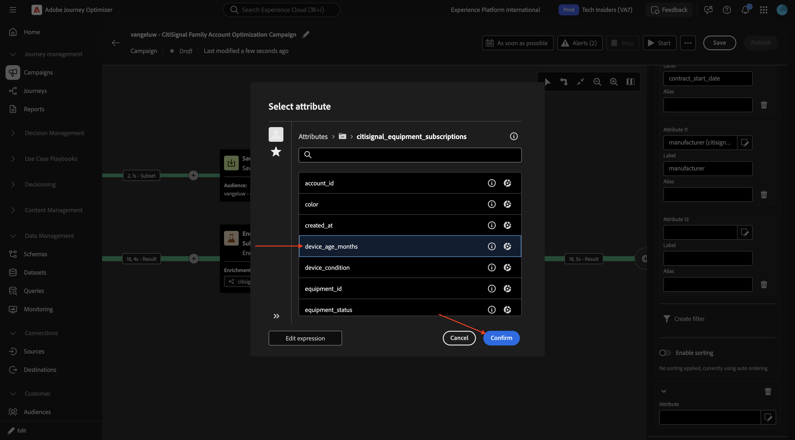

**属性を追加** をクリックします。

**`citisignal_equipment_subscriptions`** にドリルダウンします。

「**`trade_in_value`**」を選択し、「**確認**」をクリックします。

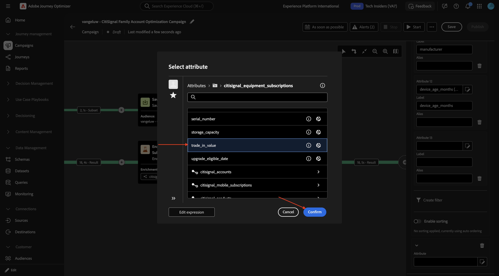

**属性を追加** をクリックします。

**`citisignal_equipment_subscriptions`** にドリルダウンします。

「**`monthly_payment`**」を選択し、「**確認**」をクリックします。

### エンリッチメント：モバイルデバイス購読

これで完了です。 「**保存**」をクリックします。次に、「**+**」アイコンをクリックして新しいノードを追加し、「**エンリッチメント**」を選択します。

この画像が表示されます。 「**エンリッチメントデータを追加**」をクリックします。

**ターゲティングディメンション** にドリルダウンします。

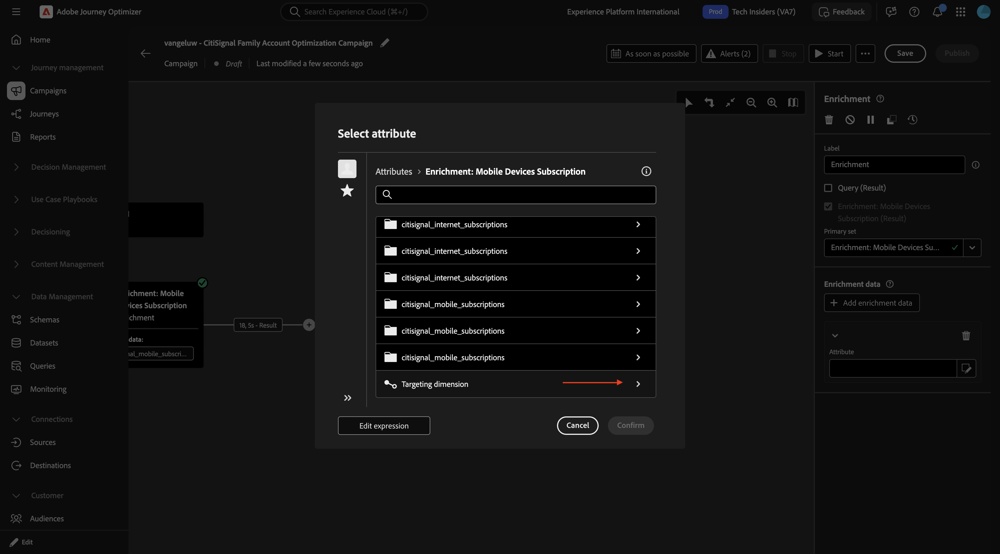

**`citisignal_offer_eligibility`** にドリルダウンします。

**`citisignal_offers`** にドリルダウンします。

「**`offer_name`**」を選択し、「**確認**」をクリックします。

**属性を追加** をクリックします。

**`citisignal_offers`** にドリルダウンします。

「**`offer_code`**」を選択し、「**確認**」をクリックします。

**属性を追加** をクリックします。

**`citisignal_offers`** にドリルダウンします。

「**`offer_description`**」を選択し、「**確認**」をクリックします。

**属性を追加** をクリックします。

**`citisignal_offers`** にドリルダウンします。

「**`offer_description`**」を選択し、「**確認**」をクリックします。

**並べ替えを有効にする** をオンにします。

**`citisignal_offers`** にドリルダウンします。

「**`offer_priority`**」を選択し、「**確認**」をクリックします。

これで、キャンペーンをテストできます。 「**開始**」をクリックします。

しばらくするとこれが表示されます。 **結果** をクリックし、**結果をプレビュー** を選択します。

これに似た情報が表示されます。

### メールアクティビティ

**+** アイコンをクリックし、「**メール**」を選択します。

**メールを編集** をクリックします。

**アクション** に移動します。

前に作成した **メールチャネル設定** を選択し、「**コンテンツを編集**」をクリックします。

**件名** に、次を貼り付けます。

`{{target.--aepUserLdap--_citisignal_recipients.first_name}}, Your CitiSignal Family Account Summary`

**メール本文を編集** をクリックします。

[family_account_review.zip](./assets/family_account_review.zip) ファイルをデスクトップにダウンロードします。

**HTMLを読み込み** をクリックします。

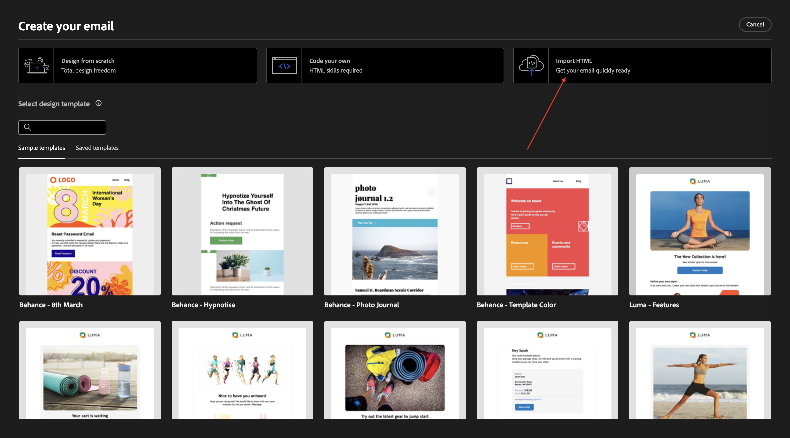

クリックしてファイルを選択します。

ファイル **`family_account_review.zip`** を選択します。

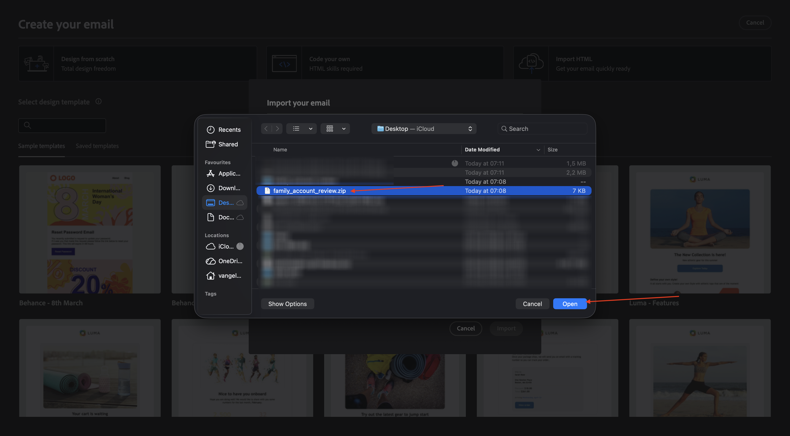

「**次へ**」をクリックします。

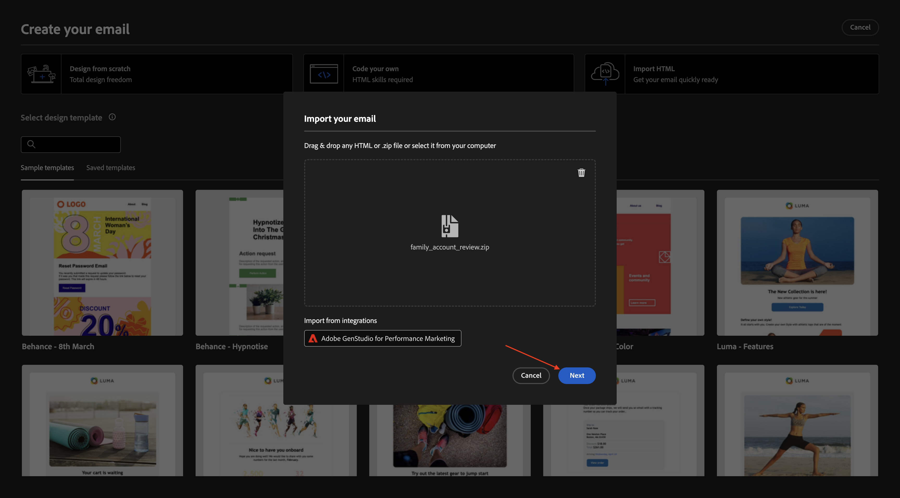

この画像が表示されます。

## 次の手順

[Adobe Journey Optimizer：調整されたキャンペーン ](./ajocampaigns.md){target="_blank"} に戻る

[ すべてのモジュール ](./../../../../overview.md){target="_blank"} に戻る
