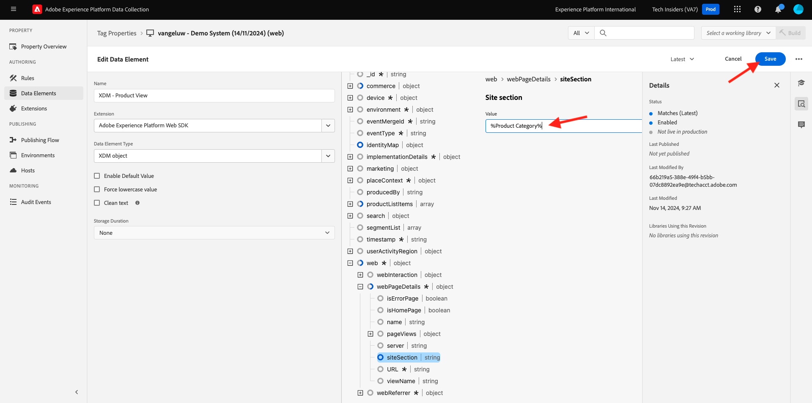
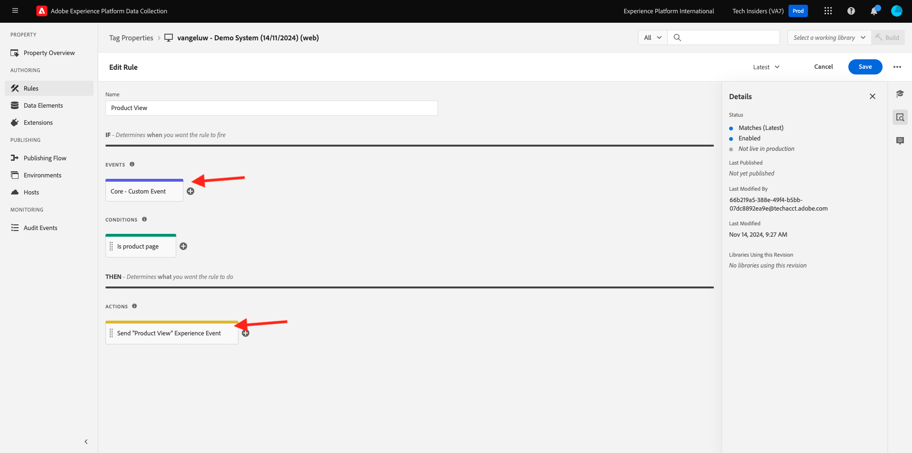
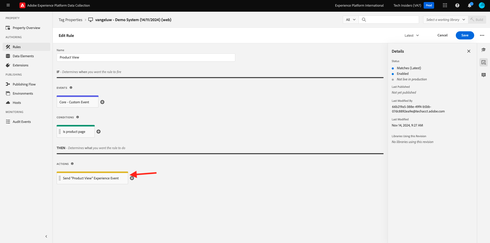

# 1.1.3 Adobe Experience Platform Data Collection の概要

## コンテキスト

次に、Adobe Experience Platform Data Collection の構成要素を深く掘り下げて、デモ Web サイトにインストールされている内容を理解します。 Adobe Experience Platform Web SDK拡張機能を詳しく見ていき、データ要素とルールを設定し、ライブラリを公開する方法を説明します。

## Adobe Experience Platform Web SDK タグ拡張機能

タグ拡張機能は、Adobe Experience Platform データ収集インターフェイスとライブラリ機能を拡張する、パッケージ化されたコードセットです。 Adobe Experience Platform Data Collection はプラットフォームであり、タグ拡張機能はプラットフォーム上で実行されるアプリのようなものです。 このチュートリアルで使用する拡張機能はすべてAdobeで作成および管理されますが、サードパーティは独自の拡張機能を作成して、Adobe Experience Platform データ収集ユーザーが管理する必要があるカスタムコードの量を制限することができます。

[Adobe Experience Platform Data Collection に移動し &#x200B;](https://experience.adobe.com/launch/) 「**Tags**」を選択します。

これは、以前に表示したAdobe Experience Platform データ収集のプロパティページです。

**はじめに** で、デモシステムは 2 つのクライアントプロパティを作成しました。1 つは Web サイト用、もう 1 つはモバイルアプリ用です。 **[!UICONTROL 検索]** ボックスで `--aepUserLdap--` を検索して見つけます。
クリックして **Web** プロパティを開きます。

次に、プロパティの概要ページが表示されます。 左側のパネルで **[!UICONTROL 拡張機能]** をクリックし、**Adobe Experience Platform Web SDKをクリックしてから**&#x200B;**[!UICONTROL 設定]** をクリックします。

Adobe Experience Platform Web SDKへようこそ。 ここでは、[&#x200B; はじめに &#x200B;](./../../../../modules/getting-started/gettingstarted/ex2.md) で作成したデータストリームやその他の高度な設定を使用して拡張機能を設定できます。

デフォルトのエッジドメインは、常に **edge.adobedc.net** です。 Adobe Experience CloudまたはAdobe Experience Platform環境に CNAME 設定を実装した場合は、**[!UICONTROL Edge ドメイン]** を更新する必要があります。

インスタンスのエッジドメインがデフォルトのドメインと異なる場合は、ここでエッジドメインを更新してください。 不明な場合は、デフォルトのドメインを使用します。 エッジドメインを使用すると、ファーストパーティトラッキングサーバーを設定することができ、その後、バックエンドで CNAME 設定を使用して、データがAdobeに確実に収集されるようにします。

「**[!UICONTROL データストリーム]**」の「**はじめに**」セクションで、データストリームを既に選択しています。 各環境に対して、「**[!UICONTROL データストリーム]** ボックスのリストから `--aepUserLdap-- - Demo System Datastream` のデータストリームを選択しました。

「**[!UICONTROL 保存]**」をクリックして、拡張機能ビューに戻ります。

## データ要素

データ要素は、データディクショナリ（またはデータマップ）の構築ブロックです。データ要素を使用して、マーケティングおよび広告テクノロジー全体でデータを収集、整理、配信します。

単一のデータ要素は、クエリ文字列、URL、cookie 値、JavaScript 変数などに値をマッピングできる変数です。この値は、Adobe Experience Platform データ収集全体で変数名によって参照できます。 このデータ要素コレクションは、ルール（イベント、条件、アクション）の作成に使用する、定義済みデータの辞書になります。このデータディクショナリは、プロパティに追加した拡張機能で使用するために、すべてのAdobe Experience Platform Data Collection で共有されます。

次に、既存のデータ要素を、Web SDKに適した形式で編集します。

左側のパネルで「データ要素」をクリックして、データ要素ページに移動します。

>[!NOTE]
>
>この演習ではデータ要素のみを編集していますが、このページには「**[!UICONTROL データ要素の追加]**」ボタンが表示されます。このボタンを使用して、データディクショナリに新しい変数を追加します。 これは、Adobe Experience Platform Data Collection 全体で使用できます。 他の既存のデータ要素を見てみてください。主にローカルストレージをデータソースとして使用しています。

検索バーに「**XDM – 製品表示**」と入力し、返されるデータ要素をクリックします。

この画面には、編集する XDM オブジェクトが表示されます。 エクスペリエンスデータモデル（XDM）は、このテクニカルチュートリアルでさらに詳しく説明する概念ですが、現時点では、Adobe Experience Platform web SDKで必要な形式として理解すれば十分です。 デモ Web サイトの記事ページで収集されたデータに、もう少し情報を追加します。

ツリーの下部にある **Web** の横のプラスボタンをクリックします。

**webPageDetails** の横にあるプラスボタンをクリックします。

**siteSection** をクリックします。 **siteSection** がまだデータ要素にリンクされていないことがわかります。 それを変えましょう。

上にスクロールし、テキスト `%Product Category%` を入力します。 「**[!UICONTROL 保存]**」をクリックします。

この時点で、Adobe Experience Platform Web SDK拡張機能がインストールされ、XDM 構造に対してデータを収集するためのデータ要素を更新しました。 次に、正しいタイミングでデータを送信するルールを確認しましょう。

## ルール

Adobe Experience Platformのデータ収集は、ルールベースのシステムです。 ユーザーの操作に関する各種データを参照します。ルールで設定された条件が満たされると、ルールは、特定した拡張機能、スクリプトまたはクライアント側コードをトリガーします。

異なる製品を 1 つのソリューションに統合するマーケティングおよび広告テクノロジーのデータと機能を統合するためのルールを構築します。

記事ページにデータを送信するルールを分類しましょう。

左側のパネルで **[!UICONTROL ルール]** をクリックします。

`Product View` を **[!UICONTROL 検索]** します。

返されるルールをクリックします。

このルールを構成する個々の要素を見てみましょう。

すべてのルールに対して：指定した **[!UICONTROL イベント]** が発生すると、**[!UICONTROL 条件]** が評価され、必要に応じて指定した **[!UICONTROL アクション]** が実行されます。

イベント **コア – カスタムイベント** をクリックします。 これは、が読み込まれるビューです。

**イベントタイプ** ドロップダウンをクリックします。

条件が true の場合に、Adobe Experience Platform データ収集に対してアクションを実行するようシグナルを送信するために使用できる、標準インタラクションの一部をリストします。

ルールに戻るには、「**[!UICONTROL キャンセル]**」をクリックします。

アクション **「製品表示」エクスペリエンスイベントを送信** をクリックします。

ここでは、Adobe Experience Platform web SDKによって Edge に送信されているデータを確認できます。 具体的には、Web SDKの **alloy** **[!UICONTROL インスタンス]** を使用します。 イベント **[!UICONTROL タイプ]** は **Commerce商品（買い物かご）表示** に設定されており、送信している XDM データは、以前に変更した **XDM – 商品表示** データ要素です。

これでルールを確認したので、Adobe Experience Platform Data Collection ですべての変更を公開できます。

## ライブラリでの公開

最後に、更新したルールとデータ要素を検証するには、編集した項目を含むライブラリをプロパティに公開する必要があります。 Adobe Experience Platform Data Collection の **[!UICONTROL 公開]** セクションでは、いくつかの簡単な手順を実行する必要があります。

左側のナビゲーションで **[!UICONTROL 公開フロー]** をクリックします

**メイン** という既存のライブラリをクリックします。

「**変更されたすべてのリソースを追加**」ボタンをクリックします。 次に、
**開発用に保存してビルド** ボタンをクリックします。

ライブラリのビルドには数分かかる場合があり、完了すると、ライブラリ名の左側に緑のドットが表示されます。

公開フロー画面で確認できるように、Adobe Experience Platform データ収集の公開プロセスには多くの詳細があり、これはこのチュートリアルの範囲外です。 開発環境では、単一のライブラリを使用します。

## 次の手順

[1.1.4 クライアントサイド web データ収集 &#x200B;](./ex4.md){target="_blank"} に移動します。

[Adobe Experience Platform データ収集の設定と web SDK タグ拡張機能 &#x200B;](./data-ingestion-launch-web-sdk.md){target="_blank"} に戻ります

[&#x200B; すべてのモジュール &#x200B;](./../../../../overview.md){target="_blank"} に戻る
