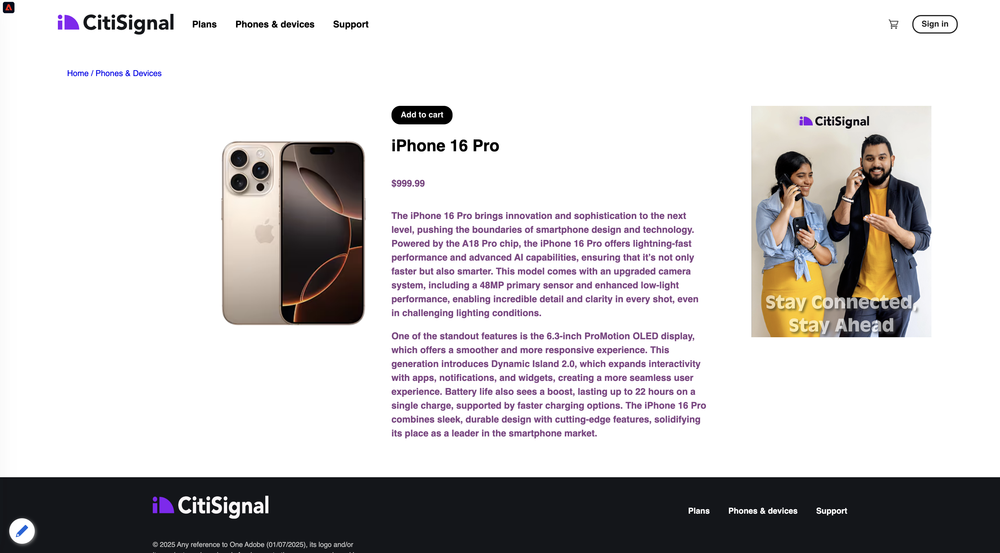
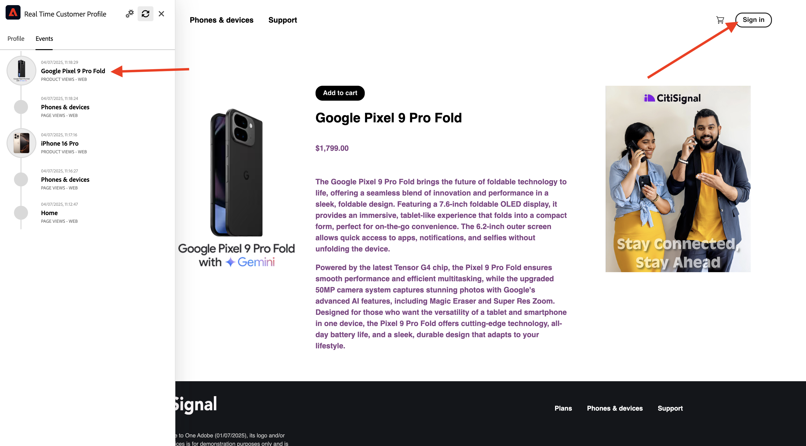

# 1.2.1 ウェブサイト上で不明から既知へ

## コンテキスト

未知のものから既知のものへのジャーニーは、獲得から定着までのカスタマージャーニーと同様に、最近のブランドの間で最も重要なトピックの 1 つです。

Adobe Experience Platformはこの道のりで大きな役割を果たします。 プラットフォームは、コミュニケーションの頭脳であり、記録のエクスペリエンスシステムです。

Platform は、「顧客 **という単語が単なる** 既知 **の顧客よりも広い環境** す。 これは、ブランドと話す際に言及すべき非常に重要です。web サイト上の未知訪問者も、Platform の観点から見た顧客であり、未知訪問者としての行動もすべて Platform に送信されます。 このアプローチのおかげで、この顧客が最終的に既知の顧客になると、ブランドはその瞬間の前に何が起こったかを視覚化することができます。 これは、アトリビューションとエクスペリエンスの最適化の観点から役立ちます。

## どうするつもり

データをAdobe Experience Platformに取り込み、そのデータは ECID やメールアドレスなどの識別子にリンクされます。 その目的は、設定の観点から、やろうとしていることのビジネスコンテキストを理解することです。 次の演習では、独自のサンドボックス環境で、すべてのデータ取り込みを可能にするために必要なすべての設定を開始します。

### 顧客ジャーニーフロー

[https://dsn.adobe.com](https://dsn.adobe.com) に移動します。 Adobe IDでログインすると、このが表示されます。 Web サイトプロジェクトで「。..**」** いう 3 つのドットをクリックし、「**実行**」をクリックして開きます。

その後、デモ Web サイトが開きます。 URL を選択してクリップボードにコピーします。

新しい匿名ブラウザーウィンドウを開きます。

前の手順でコピーしたデモ Web サイトの URL を貼り付けます。 その後、Adobe IDを使用してログインするように求められます。

アカウントタイプを選択し、ログインプロセスを完了します。

次に、匿名ブラウザーウィンドウに web サイトが読み込まれます。 デモごとに、新しい匿名ブラウザーウィンドウを使用して、デモ Web サイトの URL を読み込む必要があります。

画面の左上隅にあるAdobe ロゴアイコンをクリックして、プロファイルビューアを開きます。

現在は不明なこの顧客の主要識別子として **0&rbrace;Experience Cloud ID&rbrace; を持つプロファイルビューアパネルとリアルタイム顧客プロファイルをご覧ください。**

また、顧客の行動に基づいて収集されたすべてのエクスペリエンスイベントを表示することもできます。 リストは現在空ですが、すぐに変更されます。

**電話とデバイス** 製品カテゴリに移動します。 次に、商品 **iPhone 15 Pro** をクリックします。

製品の詳細ページが表示されます。 前のモジュールで確認した Web SDKの実装を使用して、タイプ **製品表示** のエクスペリエンスイベントがAdobe Experience Platformに送信されました。

プロファイルビューアパネルを開き、**エクスペリエンスイベント** を確認します。

>[!NOTE]
>
>イベントがすぐに表示されない場合は、ページを更新してください。

**電話とデバイス** カテゴリページに戻り、別の製品をクリックします。 別のエクスペリエンスイベントがAdobe Experience Platformに送信された。

プロファイルビューアパネルを開きます。 **製品表示** タイプの 2 つのエクスペリエンスイベントが表示されます。 ビヘイビアーは匿名ですが、適切な同意が得られると、すべてのクリックをトラッキングしてAdobe Experience Platformに保存できます。 匿名の顧客が認識されると、すべての匿名の行動を既知のプロファイルに自動的に結合できます。

**ログイン** をクリックして、登録/ログインページに移動します。

**アカウントを作成** をクリックします。

詳細を入力して **登録** をクリックすると、前のページにリダイレクトされます。

プロファイルビューアパネルを開き、リアルタイム顧客プロファイルに移動します。 プロファイルビューアパネルには、新しく追加されたメール識別子や電話識別子など、すべての個人データが表示されます。

プロファイルビューアパネルで、「エクスペリエンスイベント」に移動します。 以前に表示した 2 つの製品がプロファイルビューアパネルに表示されます。 これらの両方のイベントが、「既知の」プロファイルにも接続されるようになりました。

データをAdobe Experience Platformに取り込み、そのデータを ECID やメールアドレスなどの識別子にリンクしました。 このジャーニーの目標は、実行しようとしている内容のビジネスコンテキストを理解することです。 次の演習では、すべてのデータ取り込みを可能にするために必要なすべての設定を開始します。

## 次の手順

[1.2.2 スキーマの設定と識別子の設定を参照してください &#x200B;](./ex2.md){target="_blank"}

[&#x200B; データ取り込み &#x200B;](./data-ingestion.md){target="_blank"} に戻る

[&#x200B; すべてのモジュール &#x200B;](./../../../../overview.md){target="_blank"} に戻る
