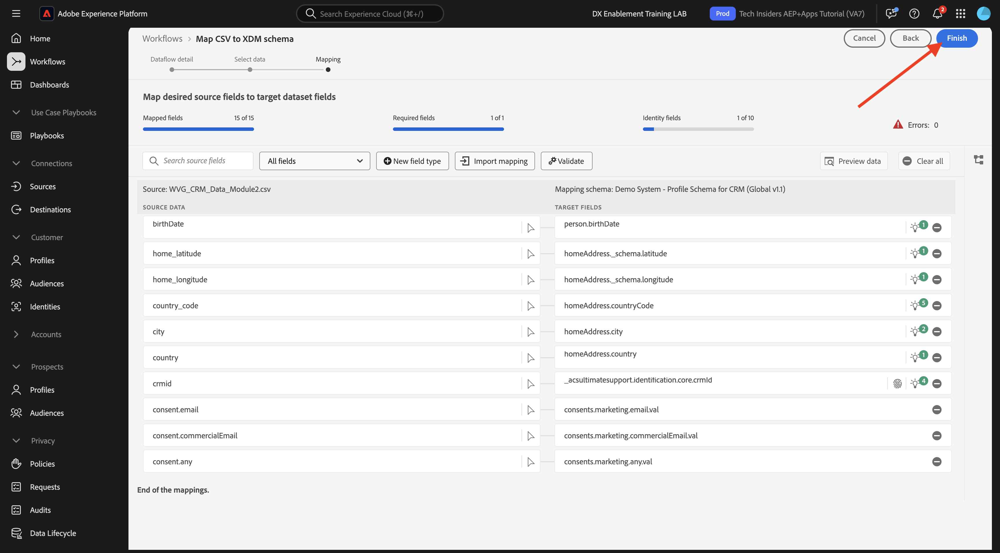

# 1.2.4 オフラインソースからのデータ取り込み

この演習の目標は、Platform で CRM データなどの外部データをオンボーディングすることです。

## 学習内容

- テストデータの生成方法を説明します
- CSV の取り込み方法を学ぶ
- ワークフローを介したデータ取り込みに web UI を使用する方法を説明します
- Experience Platformのデータガバナンス機能について

## リソース

- モカルーー：[https://www.mockaroo.com/](https://www.mockaroo.com/)
- Adobe Experience Platform: [https://experience.adobe.com/platform/](https://experience.adobe.com/platform/)

## タスク

- デモデータを含む CSV ファイルを作成します。 使用可能なワークフローを使用して、Adobe Experience Platformに CSV ファイルを取り込みます。
- Adobe Experience Platformのデータガバナンスオプションについて

## データジェネレーターツールを使用した CRM データセットの作成

この演習では、1,000 個の CRM データの横断抽出ラインが必要です。

[https://www.mockaroo.com/12674210](https://www.mockaroo.com/12674210) に移動して、Mockaroo テンプレートを開きます。

テンプレートには、次のフィールドがあります。

- ID
- first_name
- last_name
- メール
- 性別
- birthdate
- home_latitude
- home_経度
- country_code
- 都市
- 国
- crmId
- consent.email
- consent.commercialEmail
- consent.any

これらのフィールドはすべて、Platform に適合するデータを生成するように定義されています。

CSV ファイルを生成するには、「**[!UICONTROL データを生成]**」ボタンをクリックし、1000 行のデモデータを含む CSV ファイルを作成してダウンロードします。

CSV ファイルを開いて、その内容を視覚化します。

CSV ファイルの準備が整ったら、AEP での取り込みを続行できます。

### データセットの検証

[https://experience.adobe.com/platform](https://experience.adobe.com/platform) に移動します。

続行する前に、**[!UICONTROL サンドボックス]** を選択する必要があります。 選択するサンドボックスの名前は ``--aepSandboxName--`` です。

Adobe Experience Platformで、画面左側のメニューにある **[!UICONTROL データセット]** をクリックします。

共有データセットを使用します。 共有データセットは既に作成されており、**[!UICONTROL デモシステム - CRM 用プロファイルデータセット （グローバル v1.1）]** と呼ばれています。 クリックして開きます。

概要画面には、3 つの主な情報が表示されます。

>[!NOTE]
>
>過去 7 日間にアクティビティが発生していない場合、データセットのビューが空である可能性があります。

まず、[!UICONTROL &#x200B; データセットアクティビティ &#x200B;] ダッシュボードには、データセット内の CRM レコードの合計数と、取り込んだバッチとそのステータスが表示されます

次に、ページを下にスクロールすると、いつデータのバッチが取り込まれたか、オンボードされたレコードの数、およびバッチが正常にオンボードされたかどうかを確認できます。 **[!UICONTROL バッチ ID]** は特定のバッチジョブの識別子で、**[!UICONTROL バッチ ID]** は重要です。特定のバッチが正常にオンボードされなかった理由のトラブルシューティングに使用できるからです。

最後に、「[!UICONTROL &#x200B; データセット &#x200B;] 情報」タブには、[!UICONTROL &#x200B; データセット ID] （トラブルシューティングの観点からは重要）、データセットの名前、データセットがプロファイルに対して有効になっているかどうかなど、重要な情報が表示されます。

ここで最も重要な設定は、データセットとスキーマの間のリンクです。 スキーマは、取得できるデータとそのデータの外観を定義します。

この例では、**[!UICONTROL Demo System - Profile Schema for CRM （Global v1.1）]** を使用しています。このスキーマは、**[!UICONTROL Profile]** クラスにマッピングされ、フィールドグループとも呼ばれる拡張機能を実装しています。

スキーマの名前をクリックすると、[!UICONTROL &#x200B; スキーマ &#x200B;] の概要が表示されます。このスキーマに対してアクティブ化されたすべてのフィールドが表示されます。

すべてのスキーマには、カスタムのプライマリ記述子を定義する必要があります。 CRM データセットの場合、スキーマによって、フィールド **[!UICONTROL crmId]** がプライマリ識別子である必要があると定義されています。 スキーマを作成して [!UICONTROL &#x200B; リアルタイム顧客プロファイル &#x200B;] にリンクする場合は、プライマリ記述子を参照するカスタム [!UICONTROL &#x200B; フィールドグループ &#x200B;] を定義する必要があります。

また、プライマリ ID が `--aepTenantId--.identification.core.crmId` にあり、**[!UICONTROL デモシステム - CRMID] の [!UICONTROL &#x200B; 名前空間]** にリンクされていることもわかります。

すべてのスキーマなど、「リアルタイム顧客プロファイル [!UICONTROL &#x200B; で使用する必要があるすべてのデータセットには &#x200B;]1 つの [!UICONTROL プライマリID] が必要です。 この [!UICONTROL プライマリID] は、そのデータセット内の顧客に対する、ブランドによるユーザー ID です。 CRM データセットの場合はメールアドレスまたは CRM ID であり、コールセンターデータセットの場合は顧客の携帯電話番号である可能性があります。

各データセットに対して個別の固有スキーマを作成し、各データセットの記述子を特別に設定して、ブランドで使用される現在のソリューションの動作方法に一致させることをお勧めします。

### ワークフローを使用した CSV ファイルの XDM スキーマへのマッピング

この演習の目標は、AEP に CRM データをオンボーディングすることです。 Platform で取り込まれるすべてのデータは、特定の XDM スキーマにマッピングする必要があります。 現在、片側に 1000 行の CSV データセットと、反対側にスキーマにリンクされたデータセットがあります。 そのデータセットに CSV ファイルを読み込むには、マッピングを行う必要があります。 このマッピングの演習を容易にするために、Adobe Experience Platformで **[!UICONTROL ワークフロー]** を使用できます。

「**[!UICONTROL CSV を XDM スキーマにマッピング]**」をクリックし、「**[!UICONTROL 起動]**」をクリックしてプロセスを開始します。

次の画面で、ファイルを取り込むデータセットを選択する必要があります。 既存のデータセットを選択するか、新しいデータセットを作成するかを選択できます。 この演習では、既存のデータセットを再利用します。以下に示すように **[!UICONTROL デモシステム - CRM 用プロファイルデータセット （グローバル v1.1）]** を選択し、他の設定はデフォルトのままにします。

「**次へ**」をクリックします。

CSV ファイルをドラッグ&amp;ドロップするか、「**[!UICONTROL ファイルを選択]**」をクリックして、コンピューター上のデスクトップに移動し、CSV ファイルを選択します。

CSV ファイルを選択すると、すぐにアップロードされ、ファイルのプレビューが数秒以内に表示されます。

「**次へ**」をクリックします。

次に、CSV ファイルの列ヘッダーを **[!UICONTROL デモシステム - CRM 用プロファイルデータセット]** の XDM プロパティにマッピングする必要があります。

Adobe Experience Platformは、[!UICONTROL Source属性を [!UICONTROL &#x200B; ターゲットスキーマフィールド &#x200B;] にリンクすることにより、既にいくつかの提案を行ってい &#x200B;] す。

>[!NOTE]
>
>マッピング画面にエラーが表示されても、心配はいりません。 以下の手順に従うと、これらのエラーは解決されます。

[!UICONTROL &#x200B; スキーママッピング &#x200B;] の場合、Adobe Experience Platformは既にフィールドをリンクしようとしています。 ただし、マッピングのすべての提案が正しいわけではありません。 次に、**ターゲットフィールド** を 1 つずつ更新する必要があります。

#### birthdate

Source スキーマフィールド **birthDate** は、ターゲットフィールド **person.birthDate** にリンクする必要があります。

#### 都市

Source スキーマフィールド **市区町村** は、ターゲットフィールド **homeAddress.city** にリンクする必要があります。

#### 国

Source スキーマフィールド **国** は、ターゲットフィールド **homeAddress.country** にリンクする必要があります。

#### country_code

Source スキーマフィールド **country_code** は、ターゲットフィールド **homeAddress.countryCode** にリンクする必要があります。

#### メール

Source スキーマフィールド **email** は、ターゲットフィールド **personalEmail.address** にリンクする必要があります。

#### crmid

Source スキーマフィールド **crmid** は、ターゲットフィールド **`--aepTenantId--`.identification.core.crmId** にリンクする必要があります。

#### first_name

Source スキーマフィールド **first_name** は、ターゲットフィールド **person.name.firstName** にリンクする必要があります。

#### 性別

Source スキーマフィールド **gender** は、ターゲットフィールド **person.gender** にリンクする必要があります。

#### home_latitude

Source スキーマフィールド **home_latitude** は、ターゲットフィールド **homeAddress._schema.latitude**.

#### home_経度

Source スキーマフィールド **home_longitude** は、ターゲットフィールド **homeAddress._schema.longitude**.

#### ID

Source スキーマフィールド **id** は、ターゲットフィールド **_id** にリンクする必要があります。

#### last_name

Source スキーマフィールド **last_name** は、ターゲットフィールド **person.name.lastName** にリンクする必要があります。

#### consents.marketing.email.val

Source スキーマフィールド **consent.email** は、ターゲットフィールド **consents.marketing.email.val** にリンクする必要があります。

#### consents.marketing.commercialEmail.val

Source スキーマフィールド **consent.commercialEmail** をターゲットフィールド **consents.marketing.commercialEmail.val** にリンクする必要があります。

#### consents.marketing.any.val

Source スキーマフィールド **consent.any** は、ターゲットフィールド **consents.marketing.any.val** にリンクする必要があります。

これで、このが得られます。 「**完了**」をクリックします。

「**[!UICONTROL 完了]**」をクリックすると、**データフロー** の概要が表示されます。数分後、画面を更新して、ワークフローが正常に完了したかどうかを確認できます。 **ターゲットデータセット名** をクリックします。

次に、取り込みが処理されたデータセットが表示され、たった今取り込まれた [!UICONTROL &#x200B; バッチ ID] と、1,000 件のレコードが取り込まれたステータス **[!UICONTROL 成功]** が表示されます。 **[!UICONTROL データセットをプレビュー]** をクリックします。

読み込まれたデータが正しいことを確認するためのデータセットの小さなサンプルが表示されます。

データが読み込まれたら、データセットに対して正しいデータガバナンスアプローチを定義できます。

### データセットへのデータガバナンスの追加

顧客データを取り込んだので、このデータセットが使用および書き出し制御のために適切に管理されていることを確認する必要があります。 「**[!UICONTROL データガバナンス]**」タブをクリックして、契約、ID、機密、パートナーエコシステム、カスタムなど、複数のタイプの制限を設定できることに注意してください。

データセット全体の ID データを制限します。 データセット名にポインタを合わせ、鉛筆アイコンをクリックして設定を編集します。

**[!UICONTROL ID ラベル]** に移動すると、「**[!UICONTROL I2]**」オプションがオンになっていることがわかります。これにより、このデータセット内のすべての情報が少なくとも間接的に個人を特定できると仮定します。

「**[!UICONTROL 変更を保存]**」をクリックします。

別のモジュールでは、データガバナンスとラベルのフレームワークを決定します。

これで、Adobe Experience Platformに CRM データを正常に取り込み、分類できました。

## 次の手順

[1.2.5 データランディングゾーン &#x200B;](./ex5.md){target="_blank"} 移動

[&#x200B; データ取り込み &#x200B;](./data-ingestion.md){target="_blank"} に戻る

[&#x200B; すべてのモジュール &#x200B;](./../../../../overview.md){target="_blank"} に戻る
