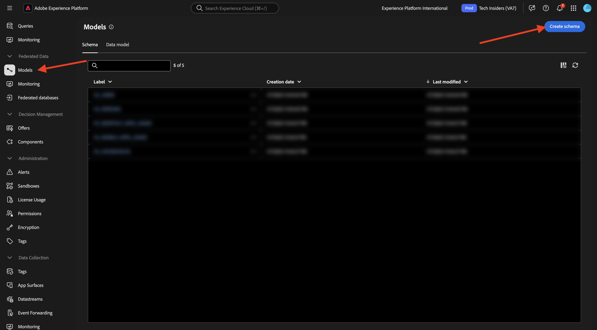
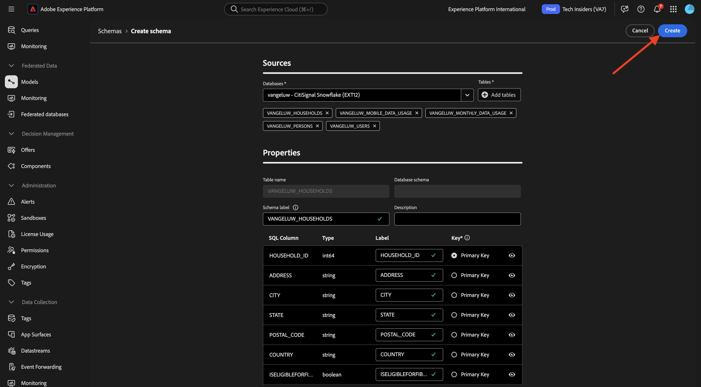
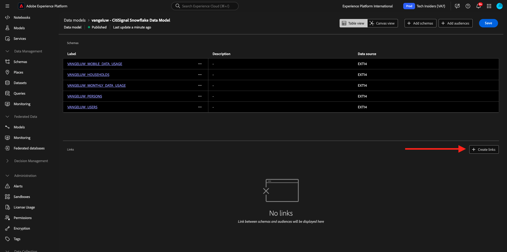
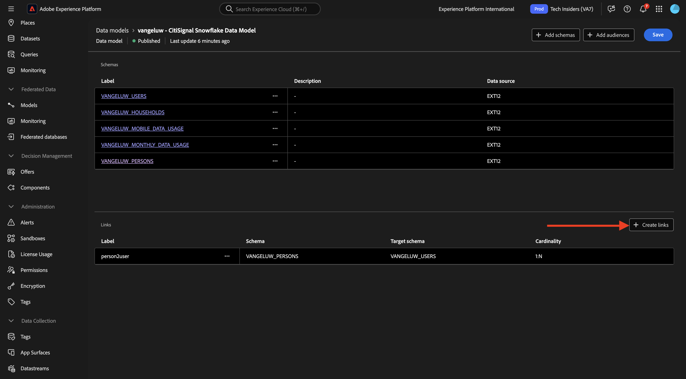
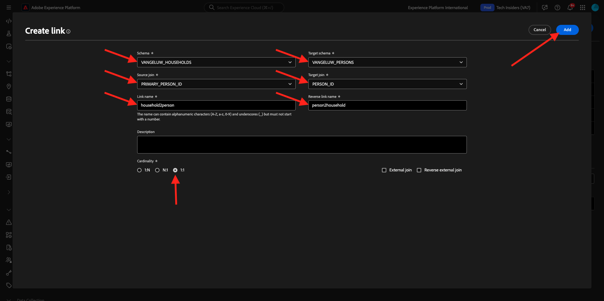
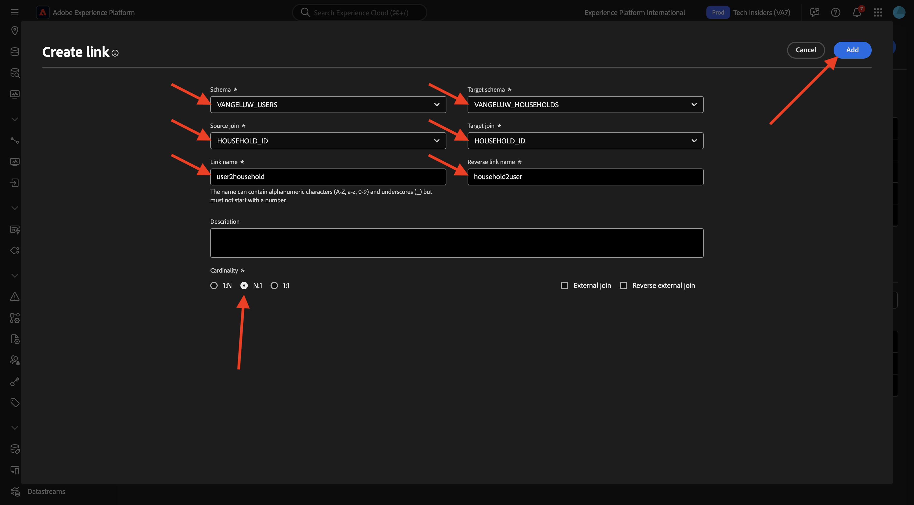
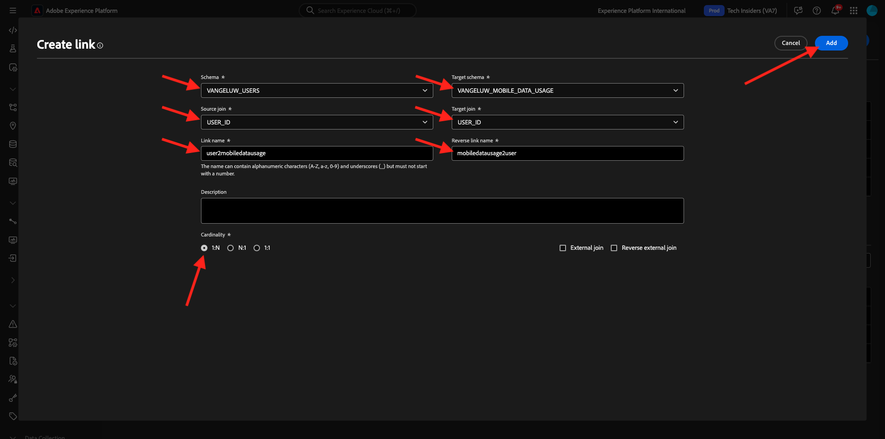

# 1.3.2 スキーマ、データモデル、リンクの作成

これで、Adobe Experience Platformでフェデレーテッド データベースを設定できます。

URL:[https://experience.adobe.com/platform](https://experience.adobe.com/platform) に移動して、Adobe Experience Platformにログインします。

ログインすると、Adobe Experience Platformのホームページが表示されます。

続行する前に、**サンドボックス** を選択する必要があります。 選択するサンドボックスの名前は `--aepSandboxName--` です。 適切なサンドボックスを選択すると、画面が変更され、専用のサンドボックスが表示されます。

## 1.3.2.1 AEPでのフェデレーテッド データベースのセットアップ

左側のメニューで **連合データベース** をクリックします。 次に、「**連合データベースを追加**」をクリックします。

**ラベル** として、`--aepUserLdap-- - CitiSignal Snowflake` を使用し、タイプとして **Snowflake** を選択します。

詳細で、資格情報を入力する必要があります。この資格情報は次のようになります。

**サーバー**:

Snowflakeで、**管理者/アカウント** に移動します。 アカウントの横にある 3 **...** をクリックし、「**URL を管理**」をクリックします。

その後、これが表示されます。 **現在の URL** をコピーし、AEPの **サーバー** フィールドに貼り付けます。

**ユーザー**：演習 1.3.1.1 で前に作成したユーザー名
**パスワード**：演習 1.3.1.1 で以前に作成したパスワード
**データベース**: **CITISIGNAL** を使用します

最後に、これを取得します。 **接続をテスト** をクリックします。 テストが成功した場合は、「**関数をデプロイ**」をクリックすると、ワークフローエンジンに必要な関数がSnowflake側に作成されます。

接続が正常にテストされ、機能がデプロイされると、設定が保存されます。

**フェデレーション データベース** メニューに戻ると、接続が表示されます。

## AEP1.3.2.2 スキーマを作成するには

左側のメニューで **モデル** をクリックし、**スキーマ** に移動します。 **スキーマを作成** をクリックします。

連合データベースを選択して、「**次へ**」をクリックします。

その後、これが表示されます。 以前にSnowflakeで作成した 5 つのテーブルを選択します。

- `--aepUserLdap--_HOUSEHOLDS`
- `--aepUserLdap--_MOBILE_DATA_USAGE`
- `--aepUserLdap--_MONTHLY_DATA_USAGE`
- `--aepUserLdap--_PERSONS`
- `--aepUserLdap--_USERS`

「**次へ**」をクリックします。

AEPは各テーブルの情報を読み込み、UI に表示します。

テーブルごとに、次の操作を実行できます。

- スキーマのラベルを変更する
- 説明を追加する
- すべてのフィールドの名前を変更し、表示を設定する
- スキーマのプライマリキーを選択

この演習では、変更は必要ありません。

「**完了**」をクリックします。

その後、これが表示されます。 任意のスキーマをクリックして、情報を確認できます。 例として、「**`--aepUserLdap--_PERSONS`**」をクリックします。

設定を編集する機能が備わったことがわかります。 **データ** をクリックして、Snowflake データベースにあるデータのサンプルを表示します。

データのサンプルが表示されます。 このデータはSnowflakeから直接読み込まれ、AEPには保持されません。

## AEP1.3.2.3 モデルを作成するには

左側のメニューで、**モデル** に移動し、**データモデル** に移動します。 **データモデルを作成** をクリックします。

ラベルには、`--aepUserLdap-- - CitiSignal Snowflake Data Model` を使用します。 「**作成**」をクリックします。

「**スキーマを追加**」をクリックします。

スキーマを選択し、「**追加**」をクリックします。

その後、これが表示されます。 「**保存**」をクリックします。

### ユーザー – ユーザー

これで、スキーマ間のリンクの定義を開始できます。 リンクの定義を開始するには、「**リンクを作成**」をクリックする必要があります。

まず、テーブル `--aepUserLdap--_USERS` と `--aepUserLdap--_PERSONS` の間のリンクを定義する必要があります。

「**追加**」をクリックします。

### 世帯 – 人物

その後、ここに戻ります。 **リンクを作成** をクリックして、別のリンクを作成します。

次に、テーブル `--aepUserLdap--_HOUSEHOLDS` と `--aepUserLdap--_PERSONS` の間のリンクを定義する必要があります。

「**追加**」をクリックします。

### ユーザー – MONTHLY_DATA_USAGE

その後、ここに戻ります。 **リンクを作成** をクリックして、別のリンクを作成します。

次に、テーブル `--aepUserLdap--_USERS` と `--aepUserLdap--_MONTHLY_DATA_USAGE` の間のリンクを定義する必要があります。

「**追加**」をクリックします。

### ユーザー – 世帯

その後、ここに戻ります。 **リンクを作成** をクリックして、別のリンクを作成します。

次に、テーブル `--aepUserLdap--_USERS` と `--aepUserLdap--_HOUSEHOLDS` の間のリンクを定義する必要があります。

「**追加**」をクリックします。

### ユーザー – MOBILE_DATA_USAGE

その後、ここに戻ります。 **リンクを作成** をクリックして、別のリンクを作成します。

次に、テーブル `--aepUserLdap--_USERS` と `--aepUserLdap--_MOBILE_DATA_USAGE` の間のリンクを定義する必要があります。

「**追加**」をクリックします。

この画像が表示されます。 「**保存**」をクリックします。

これで、Adobe Experience Platformでの Federated Database の設定が完了しました。 これで、連合オーディエンス構成で連合データの使用を開始できます。

## 次の手順

[1.3.3 フェデレーション構成の作成 ](./ex3.md){target="_blank"} に移動

[Federated Audience Composition](./fac.md){target="_blank"} に戻る

[ すべてのモジュール ](./../../../../overview.md){target="_blank"} に戻る
