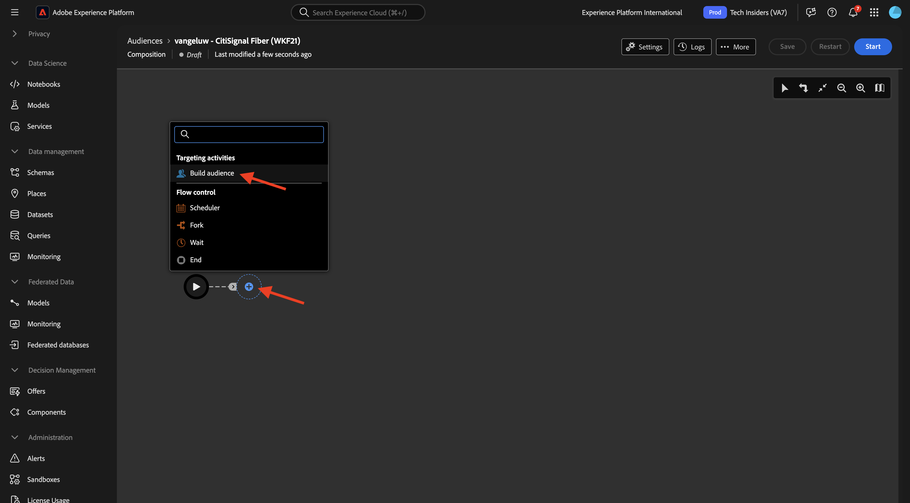
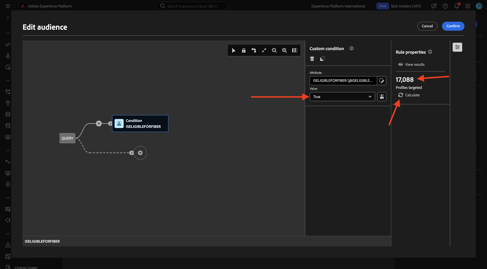
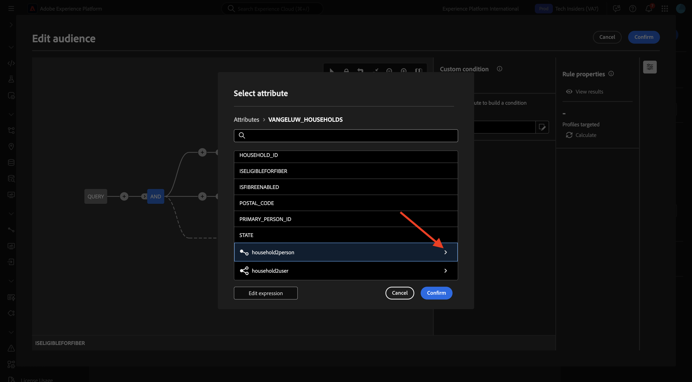
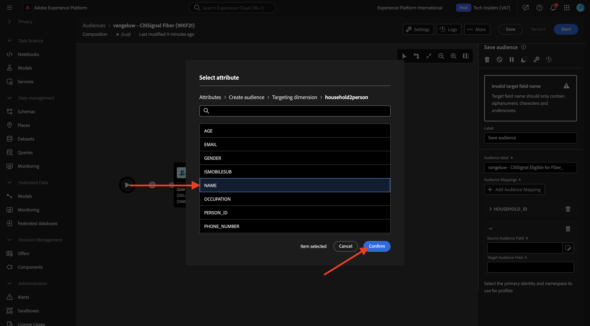
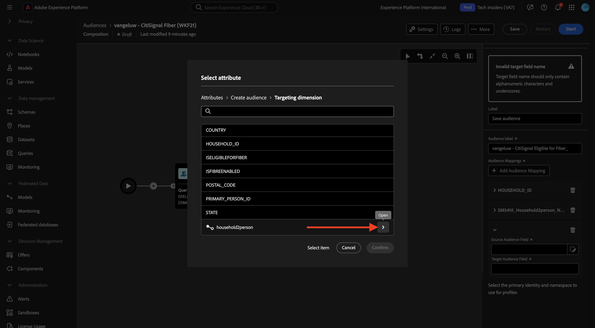
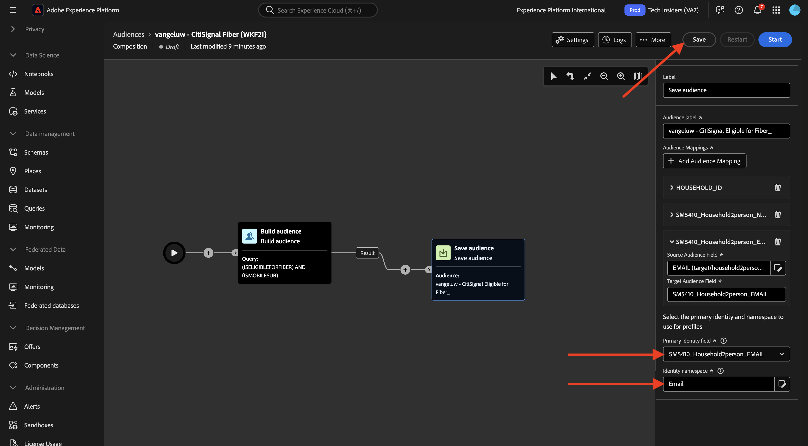
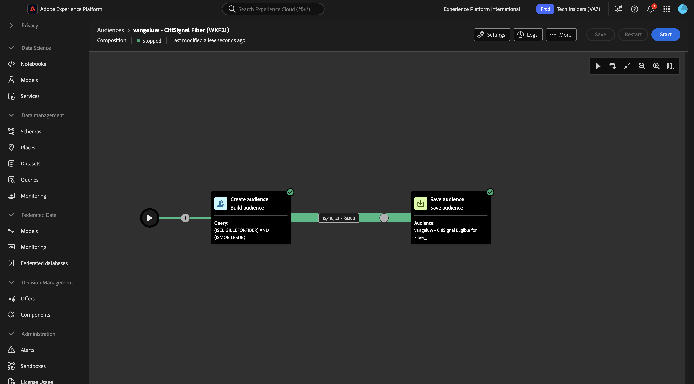

# 1.3.3 フェデレーション構成の作成

AEPで federated audience コンポジションを設定できるようになりました。

URL:[https://experience.adobe.com/platform](https://experience.adobe.com/platform) に移動して、Adobe Experience Platformにログインします。

ログインすると、Adobe Experience Platformのホームページが表示されます。

続行する前に、**サンドボックス** を選択する必要があります。 選択するサンドボックスの名前は `--aepSandboxName--` です。 適切なサンドボックスを選択すると、画面が変更され、専用のサンドボックスが表示されます。

## オ 1.3.3.1 ディエンスの作成

左側のメニューで、**オーディエンス** に移動し、次に **フェデレーテッド コンポジション** に移動します。 **コンポジションを作成** をクリックします。

ラベルには、`--aepUserLdap-- - CitiSignal Fiber` を使用します。 前の演習で作成したデータモデル（`--aepUserLdap-- - CitiSignal Snowflake Data Model` という名前）を選択します。 「**作成**」をクリックします。

その後、これが表示されます。

**+** アイコンをクリックし、「**オーディエンスを作成** をクリックします。

その後、これが表示されます。 **オーディエンスを作成** を選択します。 **検索** アイコンをクリックして、スキーマを選択します。

スキーマ **`--aepUserLdap--_HOUSEHOLDS`** を選択します。 「**確認**」をクリックします。

次に、「**続行** をクリックします。

これで、Snowflakeに送信されるクエリの作成を開始できます。 **+** アイコン、「**カスタム条件** の順にクリックします。

属性 **ISELIGIBLEFORFIBER** を選択し、「**確認**」をクリックします。

その後、これが表示されます。 フィールド **値** を **True** に設定します。 「**計算**」をクリックして、クエリをSnowflakeにプッシュし、選定されたプロファイルの推定を取得します。

次に、「**+**」アイコンを再度クリックし、「**カスタム条件**」を再度クリックして別の条件を追加します。

2 番目に追加する条件は `Is the user an existing CitiSignal Mobile subscriber?` です。 この質問に答える方法は、世帯と世帯の主要顧客との関係を使用することです。これは、別のテーブル **`--aepUserLdap--_PERSONS`** で定義されています。 「**household2person**」リンクを使用して、属性メニューをドリルダウンできます。

属性 **ISMOBILESUB** を選択し、「**確認**」をクリックします。

フィールド **値** を **True** に設定します。もう一度 **計算** をクリックして、ターゲットにするプロファイルの数を更新します。 「**確認**」をクリックします。

**+** アイコン、「**オーディエンスを保存** の順にクリックします。

**オーディエンスラベル** を `--aepUserLdap-- - CitiSignal Eligible for Fiber` に設定します。

「**+ オーディエンスマッピングを追加**」をクリックします。

**HOUSEHOLD_ID** を選択し、「**確認**」をクリックします。

「**+ オーディエンスマッピングを追加**」をクリックします。

**ターゲティングディメンション** をクリックしてドリルダウンします。

リンク **household2person** をクリックしてドリルダウンします。

フィールド **名前** を選択します。 「**確認**」をクリックします。

「**+ オーディエンスマッピングを追加**」をクリックします。

**ターゲティングディメンション** をクリックしてドリルダウンします。

リンク **household2person** をクリックしてドリルダウンします。

「**メール**」フィールドを選択します。 「**確認**」をクリックします。

その後、これが表示されます。 次に、**プライマリ ID フィールド** を設定し、**Household2person_EMAIL** に設定する必要があります。 **ID 名前空間** を **メール** に設定します。

「**保存**」をクリックします。

君の作文はもう仕上がっている。 「**スタート**」をクリックして実行します。

これで、クエリがSnowflakeにプッシュされ、そこでソースデータに対してクエリが実行されます。 結果はAEPにプッシュされますが、ソースデータはSnowflakeに残ります。

これでオーディエンスにデータが入力され、オーディエンスはAEP エコシステム内からターゲット設定できるようになりました。

## 次の手順

[&#x200B; 概要とメリット &#x200B;](./summary.md){target="_blank"} に移動します。

[Federated Audience Composition](./fac.md){target="_blank"} に戻る

[&#x200B; すべてのモジュール &#x200B;](./../../../../overview.md){target="_blank"} に戻る
