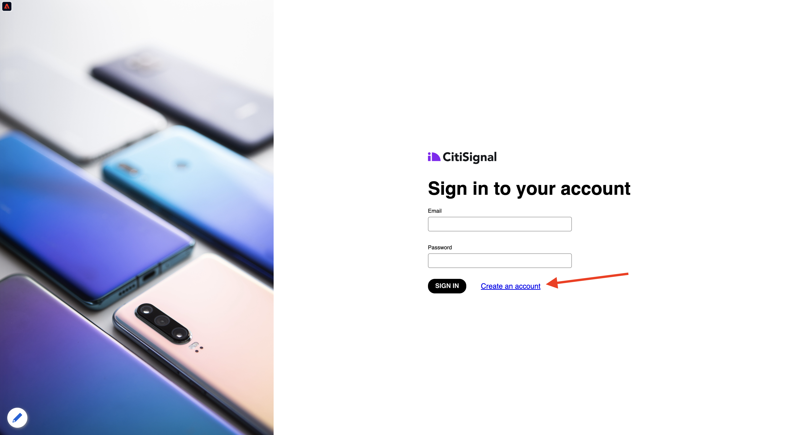

# 2.1.1 ウェブサイト上で不明から既知へ

## コンテキスト

未知のものから既知のものへのジャーニーは、獲得から定着までのカスタマージャーニーと同様に、最近のブランドの間で最も重要なトピックの 1 つです。

Adobe Experience Platformはこの道のりで大きな役割を果たします。 プラットフォームは、「記録のエクスペリエンスシステム」と呼ばれるコミュニケーションの頭脳です。

Platform は、既知の顧客だけでなく、顧客という言葉が広い環境です。 Web サイト上の未知訪問者も、Platform の観点からは顧客なので、未知訪問者としての行動もすべて Platform に送信されます。 このアプローチのおかげで、この訪問者が最終的に既知の顧客になると、ブランドはその瞬間の前に何が起こったかを視覚化できます。 これは、アトリビューションとエクスペリエンスの最適化の観点から役立ちます。

## カスタマージャーニーフロー

[https://dsn.adobe.com](https://dsn.adobe.com) に移動します。 Adobe IDでログインすると、このが表示されます。 Web サイトプロジェクトで「。..**」** いう 3 つのドットをクリックし、「**実行**」をクリックして開きます。

その後、デモ Web サイトが開きます。 URL を選択してクリップボードにコピーします。

新しい匿名ブラウザーウィンドウを開きます。

前の手順でコピーしたデモ Web サイトの URL を貼り付けます。 その後、Adobe IDを使用してログインするように求められます。

アカウントタイプを選択し、ログインプロセスを完了します。

次に、匿名ブラウザーウィンドウに web サイトが読み込まれます。 演習ごとに、新しい匿名ブラウザーウィンドウを使用して、デモ Web サイトの URL を読み込む必要があります。

画面の左上隅にあるAdobe ロゴアイコンをクリックして、プロファイルビューアを開きます。

現在は不明なこの顧客の主要識別子として **0&rbrace;Experience Cloud ID&rbrace; を持つプロファイルビューアパネルとリアルタイム顧客プロファイルをご覧ください。**

また、顧客の行動に基づいて収集されたすべてのエクスペリエンスイベントを表示することもできます。 リストは現在空ですが、すぐに変更されます。

**電話とデバイス** 製品カテゴリに移動します。 次に、商品 **iPhone 16 Pro** をクリックします。

製品の詳細ページが表示されます。 **製品表示** タイプのイベントが、モジュール 1 で確認した Web SDKの実装を使用してAdobe Experience Platformに送信されました。

Provile ビューアパネルを開き、**イベント** を確認します。

**電話とデバイス** カテゴリページに戻り、別の製品をクリックします。 別のエクスペリエンスイベントがAdobe Experience Platformに送信された。 プロファイルビューアパネルを開きます。 タイプ **製品表示** の 2 つのイベントが表示されます。 ビヘイビアーは匿名ですが、適切な同意が得られると、すべてのクリックをトラッキングしてAdobe Experience Platformに保存できます。 匿名の顧客が認識されると、すべての匿名の行動を既知のプロファイルに自動的に結合できます。

「**ログイン**」をクリックします。

**アカウントを作成** をクリックします。

詳細を入力して **登録** をクリックすると、前のページにリダイレクトされます。

プロファイルビューアパネルを開き、リアルタイム顧客プロファイルに移動します。 プロファイルビューアパネルには、新しく追加されたメール識別子や電話識別子など、すべての個人データが表示されます。

プロファイルビューアパネルで、「エクスペリエンスイベント」に移動します。 以前に表示した 2 つの製品がプロファイルビューアパネルに表示されます。 これらの両方のイベントが、「既知の」プロファイルにも接続されるようになりました。

データをAdobe Experience Platformに取り込み、そのデータを ECID やメールアドレスなどの識別子にリンクしました。 このジャーニーの目標は、実行しようとしている内容のビジネスコンテキストを理解することです。 次の演習では、すべてのデータ取り込みを可能にするために必要なすべての設定を開始します。

### モバイルアプリの操作

既知の顧客になった後、モバイルアプリを使用し始めます。 iPhoneでモバイルアプリを開き、アプリにログインします。

アプリがインストールされていない場合、またはインストール方法が思い出せない場合は、こちらをご覧ください。[&#x200B; モバイルアプリを使用 &#x200B;](../../../getting-started/gettingstarted/ex5.md)

指示に従ってアプリをインストールすると、Citi Signal ブランドが読み込まれたアプリのランディングページが表示されます。 画面の左上にあるアカウントアイコンをクリックします。

ログイン画面で、デスクトップ web サイトで使用したメールアドレスでログインします。 **ログイン** をクリックします。

その後、ログインしたという確認が表示されます。

アプリのホーム画面に移動し、ページ **電話とデバイス** に移動します。

ページ上の任意の製品をクリックします。

製品の詳細ページが表示されます。

アプリのホーム画面に移動し、Adobe アイコンをクリックして、プロファイルビューアパネルを表示します。 次に、「**プロファイル属性**」ビューが表示され、web とモバイルアプリのアクティビティを組み合わせたビューが表示されます。 **イベント** に移動します

その後、「**エクスペリエンスイベント**」セクションに、先ほど表示した製品と、以前に web サイトセッションで表示したすべての製品表示が表示されます。

>[!NOTE]
>
>アプリと web サイトに統合ビューが表示されるまで、数分かかる場合があります。

デスクトップコンピューターに戻り、ホームページを更新します。その後、製品もそこに表示されます。

>[!NOTE]
>
>アプリと web サイトに統合ビューが表示されるまで、数分かかる場合があります。

データをAdobe Experience Platformに取り込み、そのデータを ECID やメールアドレスなどの識別子にリンクしました。 この演習の目的は、実行しようとしている内容のビジネスコンテキストを理解することです。 これで、リアルタイムのクロスデバイス顧客プロファイルを効果的に作成できました。 次の演習では、Adobe Experience Platformでプロファイルを視覚化します。

## 次の手順

[2.1.2 に移動します。独自のリアルタイム顧客プロファイルの視覚化 – UI](./ex2.md){target="_blank"}

[&#x200B; リアルタイム顧客プロファイル &#x200B;](./real-time-customer-profile.md){target="_blank"} に戻る

[&#x200B; すべてのモジュール &#x200B;](./../../../../overview.md){target="_blank"} に戻る
