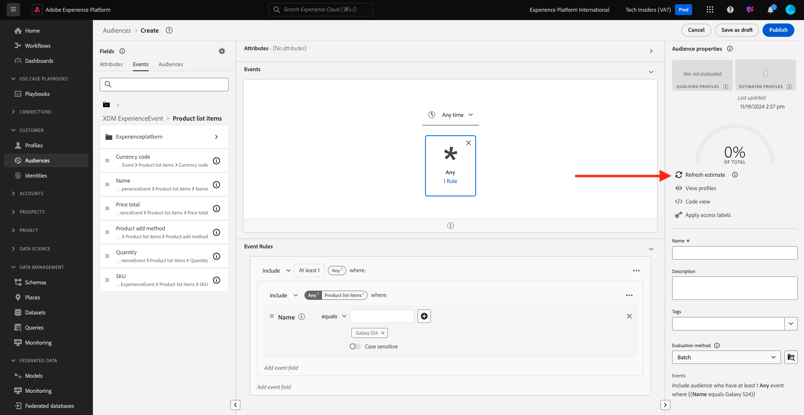

# 2.3.1 オーディエンスの作成

この演習では、Adobe Experience Platformのオーディエンスビルダーを使用してオーディエンスを作成します。

## コンテキスト

顧客の関心に応えるには、リアルタイムである必要があります。 顧客の行動にリアルタイムで対応する方法の 1 つは、オーディエンスがリアルタイムで適格であるという条件で、オーディエンスを使用することです。 この演習では、使用している web サイトでの実際のアクティビティを考慮して、オーディエンスを構築する必要があります。

## 反応する行動の特定

[https://dsn.adobe.com](https://dsn.adobe.com) に移動します。 Adobe IDでログインすると、このが表示されます。 Web サイトプロジェクトで「。..**」** いう 3 つのドットをクリックし、「**実行**」をクリックして開きます。

その後、デモ Web サイトが開きます。 URL を選択してクリップボードにコピーします。

新しい匿名ブラウザーウィンドウを開きます。

前の手順でコピーしたデモ Web サイトの URL を貼り付けます。 その後、Adobe IDを使用してログインするように求められます。

アカウントタイプを選択し、ログインプロセスを完了します。

次に、匿名ブラウザーウィンドウに web サイトが読み込まれます。 演習ごとに、新しい匿名ブラウザーウィンドウを使用して、デモ Web サイトの URL を読み込む必要があります。

この例では、特定の顧客に応答して特定の製品を表示します。
**Citi Signal** のホームページから **電話とデバイス** に移動し、製品 **Galaxy S24** をクリックします。

そのため、誰かが **Galaxy S24** の製品ページにアクセスしたら、アクションを起こすことができるようになります。 アクションを実行する最初のことは、オーディエンスを定義することです。

## オーディエンスの作成

[Adobe Experience Platform](https://experience.adobe.com/platform) に移動します。 ログインすると、Adobe Experience Platformのホームページが表示されます。

続行する前に、**サンドボックス** を選択する必要があります。 選択するサンドボックスの名前は ``--aepSandboxName--`` です。 適切な [!UICONTROL &#x200B; サンドボックス &#x200B;] を選択すると、画面が変更され、専用の [!UICONTROL &#x200B; サンドボックス &#x200B;] が表示されます。

左側のメニューで、**オーディエンス** に移動し、**参照** に移動すると、既存のすべてのオーディエンスの概要を確認できます。 「**オーディエンスを作成**」ボタンをクリックして、新しいオーディエンスの作成を開始します。

「**ルールを作成**」を選択し、「**作成**」をクリックします。

前述のように、製品 **Galaxy S24** を閲覧したすべての顧客からオーディエンスを構築する必要があります。

このオーディエンスを構築するには、イベントを追加する必要があります。 **オーディエンス** メニューバーの「**イベント**」アイコンをクリックすると、すべてのイベントを検索できます。

次に、最上位の **XDM ExperienceEvent** ノードを確認します。

**Galaxy S24** 製品にアクセスしたお客様を見つけるには、「**XDM ExperienceEvent**」をクリックします。

**製品リスト項目** までスクロールして、クリックします。

**名前** を選択し、左側の **製品リスト項目** メニューから **名前** オブジェクトをオーディエンスビルダーキャンバスの「**イベント**」セクションにドラッグ&amp;ドロップします。

比較パラメーターは **次に等しい** とし、入力フィールドに「`Galaxy S24`」と入力します。

**イベントルール** は次のようになります。 オーディエンスビルダーに要素を追加するたびに、「**推定を更新**」ボタンをクリックして、オーディエンスの母集団の新しい推定を取得できます。

オーディエンスに名前を付け、**評価方法** を **Edge** に設定します。

命名規則として、次を使用します。

- `--aepUserLdap-- - Interest in Galaxy S24`

次に、「**公開** ボタンをクリックして、オーディエンスを保存します。

オーディエンスの概要ページに戻ります。

## 次の手順

[2.3.2 へ宛先を使用した DV360 の宛先の設定方法を確認する &#x200B;](./ex2.md){target="_blank"}

[Real-time CDP - オーディエンスの作成とアクションの実行 &#x200B;](./real-time-cdp-build-a-segment-take-action.md){target="_blank"} に戻る

[&#x200B; すべてのモジュール &#x200B;](./../../../../overview.md){target="_blank"} に戻る
